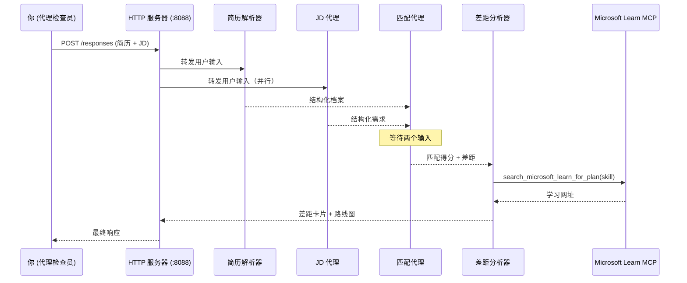
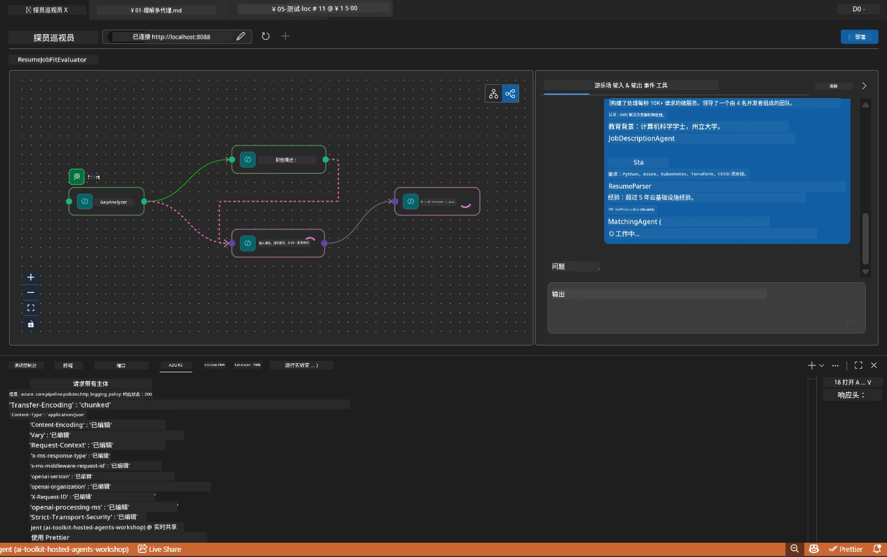

# 第5模块 - 本地测试（多代理）

在本模块中，您将在本地运行多代理工作流，用 Agent Inspector 测试，并在部署到 Foundry 之前验证所有四个代理和 MCP 工具是否正常工作。

### 本地测试运行期间会发生什么


---

## 第1步：启动代理服务器

### 选项A：使用 VS Code 任务（推荐）

1. 按 `Ctrl+Shift+P` → 输入 **Tasks: Run Task** → 选择 **Run Lab02 HTTP Server**。
2. 该任务启动服务器，debugpy 附加在端口 `5679`，代理端口为 `8088`。
3. 等待输出显示：

```
INFO:resume-job-fit:Starting Resume -> Job Fit Evaluator HTTP server...
INFO:resume-job-fit:Server running on http://localhost:8088
```

### 选项B：手动使用终端

```powershell
cd workshop\lab02-multi-agent\PersonalCareerCopilot
```

激活虚拟环境：

**PowerShell（Windows）：**
```powershell
.\.venv\Scripts\Activate.ps1
```

**macOS/Linux：**
```bash
source .venv/bin/activate
```

启动服务器：

```powershell
python -m debugpy --listen 127.0.0.1:5679 -m agentdev run main.py --verbose --port 8088
```

### 选项C：使用 F5（调试模式）

1. 按 `F5` 或转到 **Run and Debug**（`Ctrl+Shift+D`）。
2. 从下拉菜单中选择 **Lab02 - Multi-Agent** 启动配置。
3. 服务器启动，支持完整断点。

> **提示：** 调试模式允许您在 `search_microsoft_learn_for_plan()` 内设置断点以检查 MCP 响应，或在代理指令字符串中设置断点查看每个代理接收的内容。

---

## 第2步：打开 Agent Inspector

1. 按 `Ctrl+Shift+P` → 输入 **Foundry Toolkit: Open Agent Inspector**。
2. Agent Inspector 在浏览器标签页中打开，地址为 `http://localhost:5679`。
3. 您应看到代理界面，准备接受消息。

> **如果 Agent Inspector 未打开：** 确保服务器已完全启动（看到“Server running”日志）。如果端口5679被占用，请参见[第8模块 - 故障排除](08-troubleshooting.md)。

---

## 第3步：运行冒烟测试

按顺序运行以下三个测试。每个测试逐步覆盖更多工作流。

### 测试1：基础简历 + 职位描述

将以下内容粘贴到 Agent Inspector：

```
Resume:
Jane Doe
Senior Software Engineer with 5 years of experience in Python, Django, and AWS.
Built microservices handling 10K+ requests/second. Led a team of 4 developers.
Certifications: AWS Solutions Architect Associate.
Education: B.S. Computer Science, State University.

Job Description:
Senior Cloud Engineer at Contoso Ltd.
Required: Python, Azure, Kubernetes, Terraform, CI/CD pipelines.
Preferred: Go, monitoring (Prometheus/Grafana), cost optimization.
Experience: 5+ years in cloud infrastructure.
Certifications: Azure Solutions Architect Expert preferred.
```

**预期输出结构：**

响应应包含所有四个代理依次输出：

1. <strong>简历解析器输出</strong> - 按类别分组的结构化候选人技能档案
2. <strong>职位描述代理输出</strong> - 结构化要求，区分必需技能和优先技能
3. <strong>匹配代理输出</strong> - 适配得分（0-100）及细目，匹配技能、缺失技能、差距
4. <strong>差距分析器输出</strong> - 针对每个缺失技能的单独差距卡，每个包含 Microsoft Learn URL



### 测试1需验证内容

| 检查项 | 预期 | 通过？ |
|--------|-------|--------|
| 响应包含适配得分 | 0-100 之间的数字及细目 | |
| 匹配技能列出 | Python、CI/CD（部分匹配）等 | |
| 缺失技能列出 | Azure、Kubernetes、Terraform 等 | |
| 每个缺失技能对应差距卡 | 每项技能一张卡 | |
| 差距卡包含 Microsoft Learn URL | 真实的 `learn.microsoft.com` 链接 | |
| 响应没有错误消息 | 内容结构清晰 | |

### 测试2：验证 MCP 工具执行情况

运行测试1时，检查 <strong>服务器终端</strong> 里的 MCP 日志：

```
GET https://learn.microsoft.com/api/mcp → 405 (Method Not Allowed)
POST https://learn.microsoft.com/api/mcp → 200
DELETE https://learn.microsoft.com/api/mcp → 405 (Method Not Allowed)
```

| 日志条目 | 含义 | 预期？ |
|------------|----------|---------|
| `GET ... → 405` | MCP 客户端在初始化时用 GET 探测 | 是 - 正常 |
| `POST ... → 200` | 实际调用 Microsoft Learn MCP 服务器 | 是 - 真实调用 |
| `DELETE ... → 405` | MCP 客户端在清理时用 DELETE 探测 | 是 - 正常 |
| `POST ... → 4xx/5xx` | 工具调用失败 | 否 - 见[故障排除](08-troubleshooting.md) |

> **关键点：** `GET 405` 和 `DELETE 405` 是<strong>预期行为</strong>。只有 `POST` 调用返回非200状态码时才需担心。

### 测试3：边界情况 - 高匹配候选人

粘贴一个与职位描述高度匹配的简历，验证 GapAnalyzer 处理高匹配情况：

```
Resume:
Alex Chen
Senior Cloud Engineer with 7 years of experience.
Skills: Python, Azure (AKS, Functions, DevOps), Kubernetes, Terraform, CI/CD (GitHub Actions, Azure Pipelines), Go, Prometheus, Grafana, cost optimization.
Certifications: Azure Solutions Architect Expert, Azure DevOps Engineer Expert.
Led infrastructure migration to Azure for 3 enterprise clients.
Education: M.S. Computer Science, Tech University.

Job Description:
Senior Cloud Engineer at Contoso Ltd.
Required: Python, Azure, Kubernetes, Terraform, CI/CD pipelines.
Preferred: Go, monitoring (Prometheus/Grafana), cost optimization.
Experience: 5+ years in cloud infrastructure.
Certifications: Azure Solutions Architect Expert preferred.
```

**预期行为：**
- 适配得分应<strong>80+</strong>（大部分技能匹配）
- 差距卡应关注润色/面试准备，而非基础学习
- GapAnalyzer 指令中说明：“如果适配得分≥80，重点关注润色/面试准备”

---

## 第4步：验证输出完整性

测试完成后，确保输出符合以下标准：

### 输出结构检查表

| 部分 | 代理 | 是否存在？ |
|--------|-------|----------|
| 候选人档案 | 简历解析器 | |
| 技术技能（分组） | 简历解析器 | |
| 角色概述 | 职位描述代理 | |
| 必需与优先技能 | 职位描述代理 | |
| 适配得分及细目 | 匹配代理 | |
| 匹配 / 缺失 / 部分技能 | 匹配代理 | |
| 每个缺失技能的差距卡 | 差距分析器 | |
| 差距卡中的 Microsoft Learn URL | 差距分析器（MCP） | |
| 学习顺序（编号） | 差距分析器 | |
| 时间线摘要 | 差距分析器 | |

### 常见问题及解决方案

| 问题 | 原因 | 解决方案 |
|-------|---------|----------|
| 只有1张差距卡（其他被截断） | GapAnalyzer 指令缺失 CRITICAL 段落 | 向 `GAP_ANALYZER_INSTRUCTIONS` 添加 `CRITICAL:` 段落 - 见[第3模块](03-configure-agents.md) |
| 无 Microsoft Learn URL | MCP 端点不可达 | 检查互联网连接。确认 `.env` 中 `MICROSOFT_LEARN_MCP_ENDPOINT` 为 `https://learn.microsoft.com/api/mcp` |
| 响应为空 | 未设置 `PROJECT_ENDPOINT` 或 `MODEL_DEPLOYMENT_NAME` | 检查 `.env` 文件值。在终端运行 `echo $env:PROJECT_ENDPOINT` |
| 适配得分为0或缺失 | MatchingAgent 未接收到上游数据 | 确保 `create_workflow()` 中包含 `add_edge(resume_parser, matching_agent)` 和 `add_edge(jd_agent, matching_agent)` |
| 代理启动后立即退出 | 导入错误或缺少依赖 | 重新运行 `pip install -r requirements.txt`。检查终端堆栈信息 |
| `validate_configuration` 错误 | 环境变量缺失 | 创建 `.env` 文件，设置 `PROJECT_ENDPOINT=<your-endpoint>` 和 `MODEL_DEPLOYMENT_NAME=<your-model>` |

---

## 第5步：用自己的数据测试（可选）

尝试粘贴您自己的简历和真实职位描述。这有助于验证：

- 代理能处理不同简历格式（时间顺序、功能型、混合）
- JD 代理能处理不同的职位描述风格（项目符号、段落、结构化）
- MCP 工具能返回相关技能的资源
- 差距卡能针对您的具体背景个性化

> **隐私说明：** 本地测试时，您的数据仅留存在您的机器上，只发送到您的 Azure OpenAI 部署。工作坊基础设施不会记录或存储数据。如有需要，可以使用替代姓名（如“Jane Doe”代替真实姓名）。

---

### 检查点

- [ ] 服务器成功启动在端口 `8088`（日志显示“Server running”）
- [ ] Agent Inspector 打开并连接代理
- [ ] 测试1：完整响应，包含适配得分、匹配/缺失技能、差距卡及 Microsoft Learn URL
- [ ] 测试2：MCP 日志显示 `POST ... → 200`（工具调用成功）
- [ ] 测试3：高匹配候选人得分80+，提供润色/面试准备建议
- [ ] 所有差距卡都存在（每个缺失技能一张，无截断）
- [ ] 服务器终端无错误或堆栈信息

---

**上一步：** [04 - 编排模式](04-orchestration-patterns.md) · **下一步：** [06 - 部署到 Foundry →](06-deploy-to-foundry.md)

---

<!-- CO-OP TRANSLATOR DISCLAIMER START -->
**免责声明**：  
本文件使用 AI 翻译服务 [Co-op Translator](https://github.com/Azure/co-op-translator) 进行翻译。尽管我们努力确保准确性，但请注意自动翻译可能包含错误或不准确之处。原始文档的母语版本应被视为权威来源。对于关键信息，建议使用专业人工翻译。我们不对因使用本翻译而产生的任何误解或错误解释承担责任。
<!-- CO-OP TRANSLATOR DISCLAIMER END -->