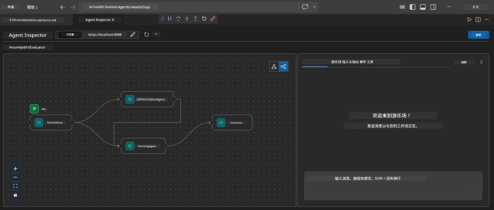
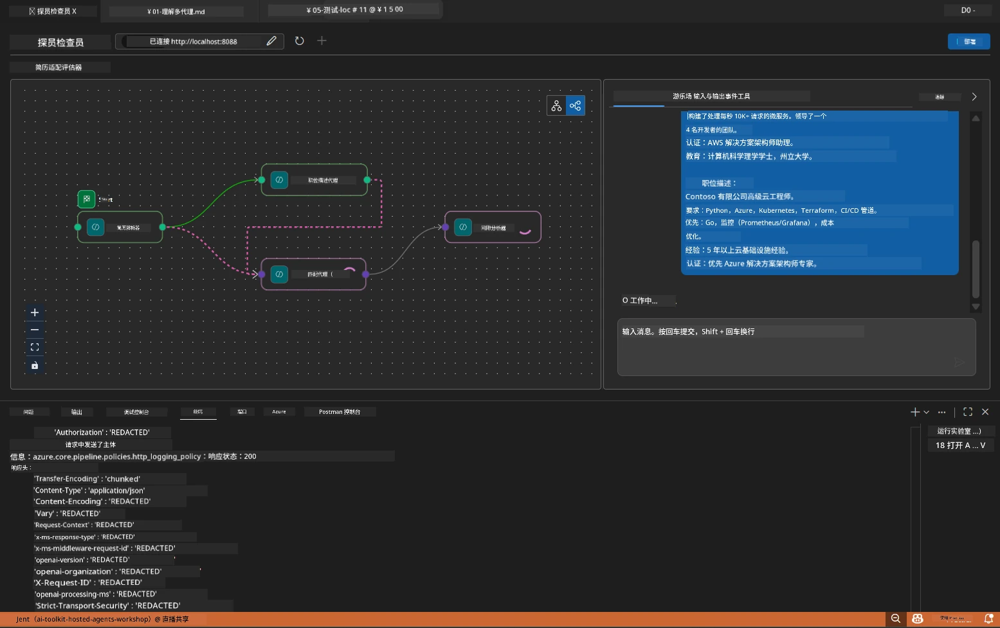
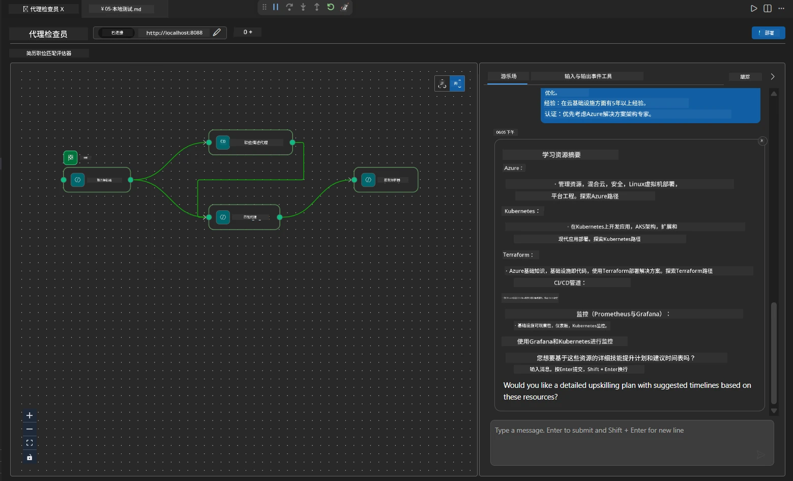

# 模块 5 - 本地测试

⏱️ 约15分钟

在本模块中，您将在本地运行多代理工作流，使用 Agent Inspector 进行测试，并在部署前验证所有四个代理和 MCP 工具是否工作正常。

---

## 步骤 1：启动代理服务器

### 选项 A：使用 VS Code 任务（推荐）

1. 打开 `workshop/lab02-multi-agent/PersonalCareerCopilot/` 作为您的 VS Code 文件夹。
2. 按下 `Ctrl+Shift+P` → 输入 **Tasks: Run Task** → 选择 **Run Agent HTTP Server**。
3. 该任务将在端口 `5679` 启动附带 debugpy 的服务器，在端口 `8088` 启动代理。
4. 等待输出显示：

```
INFO:resume-job-fit:Starting Resume -> Job Fit Evaluator HTTP server...
INFO:resume-job-fit:Server running on http://localhost:8088
```

### 选项 B：使用 F5（调试模式）

1. 按下 `F5` → 选择 **Debug Local Agent HTTP Server**。
2. 服务器启动，支持全部断点功能——便于检查 MCP 响应或代理输出。

---

## 步骤 2：打开 Agent Inspector

1. 按下 `Ctrl+Shift+P` → 输入 **Foundry Toolkit: Open Agent Inspector**。
2. Agent Inspector 作为 VS Code 面板连接到 `http://localhost:8088` 并打开。
3. 您应看到代理界面，准备接受消息。



> **如果 Agent Inspector 未打开：** 确保服务器已完全启动（看到“Server running”日志）。如果端口 5679 被占用，请参见 [模块 8 - 故障排除](08-troubleshooting.md)。

---

## 步骤 2b：（可选）打开工作流可视化工具

Foundry Toolkit 包含一个实时 <strong>工作流可视化器</strong>，显示代理在图形执行过程中的交互。这对多代理调试特别有用。

1. 按下 `Ctrl+Shift+P` → 输入 **Foundry Toolkit: Open Visualizer for Hosted Agents**。
2. 新的 VS Code 标签页打开，显示实时执行图。
3. 当您在 Agent Inspector 中发送消息时，可视化器自动更新——绿色节点表示已完成的代理，动画边缘显示它们之间的数据流动。

> **端口冲突：** 如果可视化器端口已被使用，请在 VS Code 设置 → <strong>扩展</strong> → **Microsoft Foundry 配置** → **托管代理：可视化器端口** 中更改。

---

## 步骤 3：运行冒烟测试

按顺序运行这三个测试。每个测试逐步覆盖更多工作流部分。

### 测试 1：基本简历 + 职位描述

将以下内容粘贴到 Agent Inspector：

```
Resume:
Jane Doe
Senior Software Engineer with 5 years of experience in Python, Django, and AWS.
Built microservices handling 10K+ requests/second. Led a team of 4 developers.
Certifications: AWS Solutions Architect Associate.
Education: B.S. Computer Science, State University.

Job Description:
Senior Cloud Engineer at Contoso Ltd.
Required: Python, Azure, Kubernetes, Terraform, CI/CD pipelines.
Preferred: Go, monitoring (Prometheus/Grafana), cost optimization.
Experience: 5+ years in cloud infrastructure.
Certifications: Azure Solutions Architect Expert preferred.
```

**预期输出结构：**

响应应包含所有四个代理的输出，按顺序排列：

1. <strong>简历解析器输出</strong> - 有两个标记部分：`[PARSED RESUME]`（带有分组技能的候选人档案）和 `[JOB DESCRIPTION PASS-THROUGH]`（逐字转发给 JD Agent 的职位描述文本）
2. **JD Agent 输出** - 结构化的需求，明确区分必需技能和优先技能
3. <strong>匹配代理输出</strong> - 适配评分（0-100）及细分，匹配技能，缺失技能，差距
4. <strong>差距分析器输出</strong> - 每个缺失技能的独立差距卡片，每张带有 Microsoft Learn 链接





### 测试 1 中需要验证的内容

| 检查点 | 预期 | 是否通过？ |
|-------|----------|-------|
| 响应包含适配评分 | 0-100 之间的数字及细分 | |
| 列出了匹配技能 | Python，CI/CD（部分），等 | |
| 列出了缺失技能 | Azure，Kubernetes，Terraform，等 | |
| 每个缺失技能都有差距卡片 | 每个技能一张卡片 | |
| Microsoft Learn URL 都存在 | 真实的 `learn.microsoft.com` 链接 | |
| 响应中无错误信息 | 结构清晰完整的输出 | |

### 测试 2：边界情况 - 高适配度候选人

粘贴一份与职位描述高度匹配的简历，以验证 GapAnalyzer 对高适配度场景的处理：

```
Resume:
Alex Chen
Senior Cloud Engineer with 7 years of experience.
Skills: Python, Azure (AKS, Functions, DevOps), Kubernetes, Terraform, CI/CD (GitHub Actions, Azure Pipelines), Go, Prometheus, Grafana, cost optimization.
Certifications: Azure Solutions Architect Expert, Azure DevOps Engineer Expert.
Led infrastructure migration to Azure for 3 enterprise clients.
Education: M.S. Computer Science, Tech University.

Job Description:
Senior Cloud Engineer at Contoso Ltd.
Required: Python, Azure, Kubernetes, Terraform, CI/CD pipelines.
Preferred: Go, monitoring (Prometheus/Grafana), cost optimization.
Experience: 5+ years in cloud infrastructure.
Certifications: Azure Solutions Architect Expert preferred.
```

**预期行为：**
- 适配评分应为 **80+**（大多数技能匹配）
- 差距卡片应侧重于润色/面试准备，而非基础学习
- GapAnalyzer 指令为：“若适配评分 >= 80，则重点关注润色/面试准备”

---

## 步骤 4：使用您自己的数据测试（可选）

试着粘贴您自己的简历和真实职位描述。这样可以验证：

- 代理是否能处理不同的简历格式（时间顺序型、功能型、混合型）
- JD Agent 是否能处理不同的职位描述风格（项目符号，段落，结构化）
- MCP 工具是否返回相关的资源
- 差距卡片是否针对您的具体背景个性化

> **隐私 - 路径A（Foundry 云）：** 简历和职位描述文本会发送到您的 Azure OpenAI 部署进行推理。工作坊基础设施不会登录或存储这些数据。若您愿意，请使用占位姓名（如“Jane Doe”）。
>
> **隐私 - 路径B（Foundry 本地）：** 所有四个代理推理完全在您的设备上运行。您的简历和职位描述文本<strong>绝不会离开您的机器</strong>。唯一的外部调用是 MCP 工具从 `https://learn.microsoft.com/api/mcp` 获取资源；该查询只包含技能名称，不含您的个人数据。

---

### 检查点

- [ ] 服务器成功启动于端口 `8088`（日志显示“Server running”）
- [ ] 打开 Agent Inspector 并连接代理
- [ ] 测试1：完整响应，含适配评分，匹配/缺失技能，差距卡片和 Microsoft Learn 链接
- [ ] 测试2：高适配度候选人获得 80+ 评分且推荐针对润色准备
- [ ] 所有差距卡片均存在（每缺失技能一张，无截断）
- [ ] 服务器终端无错误或堆栈跟踪

---

**上一步：** [04 - Orchestration Patterns](04-orchestration-patterns.md) · **下一步：** [06 - Deploy to Foundry →](06-deploy-to-foundry.md)

---

<!-- CO-OP TRANSLATOR DISCLAIMER START -->
**免责声明**：
本文件由 AI 翻译服务 [Co-op Translator](https://github.com/Azure/co-op-translator) 翻译完成。尽管我们力求准确，但请注意，自动翻译可能包含错误或不准确之处。原始语言版文件应视为权威来源。对于重要信息，建议使用专业人工翻译。我们对因使用本翻译而产生的任何误解或误释不承担责任。
<!-- CO-OP TRANSLATOR DISCLAIMER END -->