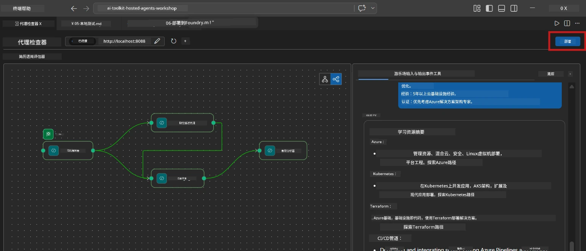
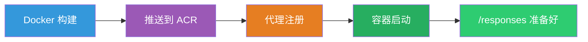
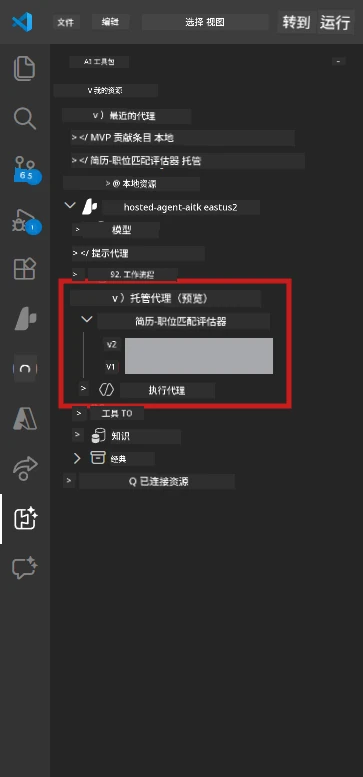

# 模块 6 - 部署到 Foundry Agent 服务

在本模块中，您将把本地测试的多代理工作流部署到 [Microsoft Foundry](https://learn.microsoft.com/azure/foundry/agents/concepts/hosted-agents) 作为 <strong>托管代理</strong>。部署过程构建一个 Docker 容器镜像，将其推送到 [Azure 容器注册表 (ACR)](https://learn.microsoft.com/azure/container-registry/container-registry-intro)，并在 [Foundry Agent 服务](https://learn.microsoft.com/azure/foundry/agents/how-to/publish-agent) 中创建一个托管代理版本。

> **与实验 01 的关键区别：** 部署过程相同。Foundry 将您的多代理工作流视为单个托管代理 —— 复杂性隐藏在容器内部，但部署门户相同，为 `/responses` 端点。

---

## 前置条件检查

部署前，请核对以下每项：

1. **代理通过本地冒烟测试：**
   - 您已完成[模块 5](05-test-locally.md)中的全部 3 个测试，且工作流生成了带有间隙卡片和 Microsoft Learn URL 的完整输出。

2. **您具有 [Azure AI 用户](https://learn.microsoft.com/azure/foundry/concepts/rbac-foundry) 角色：**
   - 在[实验 01，模块 2](../../lab01-single-agent/docs/02-create-foundry-project.md)中分配。验证：
   - [Azure 门户](https://portal.azure.com) → 您的 Foundry <strong>项目</strong>资源 → **访问控制 (IAM)** → <strong>角色分配</strong> → 确认您的账户已列有 **[Azure AI 用户](https://aka.ms/foundry-ext-project-role)**。

3. **您已在 VS Code 中登录 Azure：**
   - 检查 VS Code 左下角的账户图标，应能看到您的账户名。

4. **`agent.yaml` 中的值正确：**
   - 打开 `PersonalCareerCopilot/agent.yaml` 并验证：
     ```yaml
     environment_variables:
       - name: PROJECT_ENDPOINT
         value: ${PROJECT_ENDPOINT}
       - name: MODEL_DEPLOYMENT_NAME
         value: ${MODEL_DEPLOYMENT_NAME}
     ```
   - 这些必须与您的 `main.py` 读取的环境变量一致。

5. **`requirements.txt` 中的版本正确：**
   ```
   agent-framework-azure-ai==1.0.0rc3
   agent-framework-core==1.0.0rc3
   azure-ai-agentserver-agentframework==1.0.0b16
   azure-ai-agentserver-core==1.0.0b16
   debugpy
   agent-dev-cli --pre
   ```

---

## 第 1 步：开始部署

### 选项 A：通过 Agent Inspector 部署（推荐）

如果通过 F5 运行代理并打开 Agent Inspector：

1. 查看 Agent Inspector 面板的 <strong>右上角</strong>。
2. 点击 <strong>部署</strong> 按钮（云图标，带向上箭头 ↑）。
3. 部署向导打开。



### 选项 B：通过命令面板部署

1. 按 `Ctrl+Shift+P` 打开 <strong>命令面板</strong>。
2. 输入：**Microsoft Foundry: Deploy Hosted Agent** 并选择它。
3. 部署向导打开。

---

## 第 2 步：配置部署

### 2.1 选择目标项目

1. 下拉菜单显示您的 Foundry 项目。
2. 选择您在整个工作坊中使用的项目（例如，`workshop-agents`）。

### 2.2 选择容器代理文件

1. 系统会要求您选择代理入口点。
2. 导航到 `workshop/lab02-multi-agent/PersonalCareerCopilot/` ，选择 **`main.py`**。

### 2.3 配置资源

| 设置 | 建议值 | 说明 |
|---------|------------------|-------|
| **CPU** | `0.25` | 默认。多代理工作流不需要更多 CPU，因为模型调用是 I/O 绑定的 |
| <strong>内存</strong> | `0.5Gi` | 默认。如果添加大型数据处理工具，可增至 `1Gi` |

---

## 第 3 步：确认并部署

1. 向导显示部署摘要。
2. 审核后点击 <strong>确认并部署</strong>。
3. 在 VS Code 中监视进度。

### 部署过程中发生了什么

在 VS Code 的 <strong>输出</strong> 面板中观察（选择“Microsoft Foundry”下拉）：


1. **Docker 构建** - 根据您的 `Dockerfile` 构建容器：
   ```
   Step 1/6 : FROM python:3.14-slim
   Step 2/6 : WORKDIR /app
   ...
   Successfully built abc123def456
   ```

2. **Docker 推送** - 将镜像推送到 ACR（首次部署需 1-3 分钟）。

3. <strong>代理注册</strong> - Foundry 根据 `agent.yaml` 元数据创建托管代理。代理名称为 `resume-job-fit-evaluator`。

4. <strong>容器启动</strong> - 容器在 Foundry 托管基础设施中启动，使用系统托管身份。

> <strong>首次部署较慢</strong>（Docker 推送全部层）。后续部署重用缓存层，速度更快。

### 多代理特定说明

- **所有四个代理都在一个容器内。** Foundry 看到的是单个托管代理。WorkflowBuilder 图表在内部运行。
- **MCP 调用是出站的。** 容器需要访问互联网，连接到 `https://learn.microsoft.com/api/mcp`。Foundry 托管基础设施默认提供此访问。
- **[托管身份](https://learn.microsoft.com/python/api/overview/azure/identity-readme#managed-identity-support)。** 在托管环境中，`main.py` 里的 `get_credential()` 返回 `ManagedIdentityCredential()`（因为设置了 `MSI_ENDPOINT`）。这一切是自动的。

---

## 第 4 步：验证部署状态

1. 打开 **Microsoft Foundry** 侧边栏（点击活动栏上的 Foundry 图标）。
2. 展开您的项目下的 **托管代理（预览）**。
3. 找到 **resume-job-fit-evaluator**（或您代理的名称）。
4. 点击代理名称 → 展开版本（例如 `v1`）。
5. 点击版本 → 查看 <strong>容器详情</strong> → <strong>状态</strong>：



| 状态 | 含义 |
|--------|---------|
| **Started** / **Running** | 容器正在运行，代理已准备好 |
| **Pending** | 容器正在启动（等待 30-60 秒） |
| **Failed** | 容器启动失败（查看日志 - 见下） |

> <strong>多代理启动比单代理耗时更长</strong>，因为容器启动时创建 4 个代理实例。最多“Pending”两分钟是正常的。

---

## 常见部署错误及解决方案

### 错误 1：权限被拒绝 - `agents/write`

```
Error: lacks the required data action 
Microsoft.CognitiveServices/accounts/AIServices/agents/write
```

**解决：** 在 <strong>项目</strong> 级别分配 **[Azure AI 用户](https://learn.microsoft.com/azure/foundry/concepts/rbac-foundry)** 角色。详见[模块 8 - 故障排查](08-troubleshooting.md)的逐步说明。

### 错误 2：Docker 未运行

```
Error: Docker build failed / Cannot connect to Docker daemon
```

**解决：**
1. 启动 Docker Desktop。
2. 等待显示“Docker Desktop is running”。
3. 验证：`docker info`
4. **Windows:** 确保 Docker Desktop 设置中启用了 WSL 2 后端。
5. 重试。

### 错误 3：Docker 构建期间 pip 安装失败

```
Error: Could not find a version that satisfies the requirement agent-dev-cli
```

**解决：** `requirements.txt` 中的 `--pre` 标志在 Docker 中处理不同。确保您的 `requirements.txt` 包含：
```
agent-dev-cli --pre
```

如果 Docker 仍失败，创建 `pip.conf` 或通过构建参数传递 `--pre`。详见[模块 8](08-troubleshooting.md)。

### 错误 4：托管代理中 MCP 工具失败

如果 Gap Analyzer 部署后停止生成 Microsoft Learn URL：

**根本原因：** 网络策略可能阻止容器的出站 HTTPS。

**解决方案：**
1. 通常，Foundry 默认配置不会有此问题。
2. 若出现，检查 Foundry 项目的虚拟网络是否有 NSG 阻止出站 HTTPS。
3. MCP 工具有内置备用 URL，因此代理仍会生成输出（但没有实时 URL）。

---

### 检查点

- [ ] VS Code 中部署命令完成且无错误
- [ ] 代理显示在 Foundry 侧边栏的 **托管代理（预览）** 中
- [ ] 代理名称为 `resume-job-fit-evaluator`（或您选择的名称）
- [ ] 容器状态显示 **Started** 或 **Running**
- [ ] （若有错误）识别错误、应用修复并成功重新部署

---

**上一节：** [05 - 本地测试](05-test-locally.md) · **下一节：** [07 - 在游乐场验证 →](07-verify-in-playground.md)

---

<!-- CO-OP TRANSLATOR DISCLAIMER START -->
**免责声明**：
本文档使用人工智能翻译服务 [Co-op Translator](https://github.com/Azure/co-op-translator) 进行翻译。虽然我们力求准确，但请注意，自动翻译可能包含错误或不准确之处。原始文档的母语版本应视为权威来源。对于重要信息，建议采用专业人工翻译。对于因使用本翻译所引起的任何误解或误释，我们概不承担责任。
<!-- CO-OP TRANSLATOR DISCLAIMER END -->