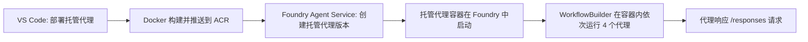
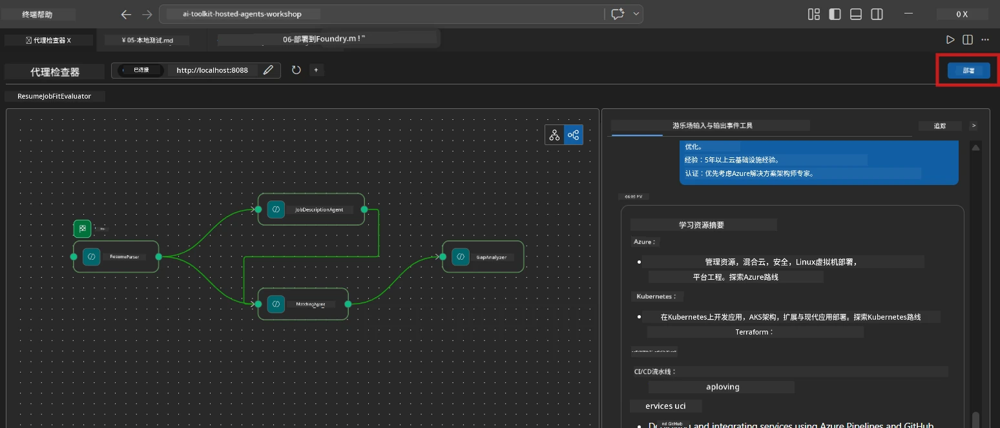
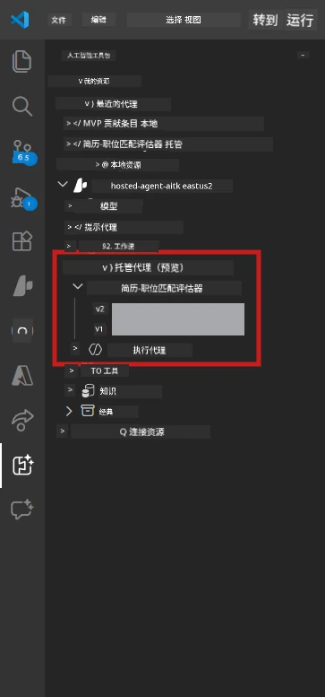

# 模块 6 - 部署到 Foundry Agent 服务

⏱️ ~10 分钟

在本模块中，您将把本地测试过的多代理工作流部署到 [Microsoft Foundry](https://learn.microsoft.com/azure/foundry/agents/concepts/hosted-agents) 作为 <strong>托管代理</strong>。部署过程会构建一个 Docker 容器镜像，将其推送到 [Azure 容器注册表 (ACR)](https://learn.microsoft.com/azure/container-registry/container-registry-intro)，并在 [Foundry Agent 服务](https://learn.microsoft.com/azure/foundry/agents/how-to/publish-agent) 中创建一个托管代理版本。

> **与实验01的关键区别：** 部署过程相同。Foundry 将您的多代理工作流视为单一托管代理——容器内部存在复杂性，但部署接口仍然是同一个 `/responses` 端点。

### 部署流程


```mermaid
flowchart LR
    A[VS Code: 部署托管代理] --> B[Docker 构建并推送到 ACR]
    B --> C[Foundry Agent Service: 创建托管代理版本]
    C --> D[托管代理容器在 Foundry 中启动]
    D --> E[WorkflowBuilder 在容器内依次运行 4 个代理]
    E --> F[代理响应 /responses 请求]
```

---

## 前提条件检查

部署前，请确认以下所有项目：

1. **代理通过本地冒烟测试：**
   - 您已完成 [模块 5](05-test-locally.md) 中的所有3个测试，并且工作流生成了带有缺口卡片和 Microsoft Learn URL 的完整输出。

2. **您拥有 [Foundry 用户](https://learn.microsoft.com/azure/foundry/concepts/rbac-foundry) 角色**（部署时，项目范围内至少需要 **Foundry 项目经理** 权限）：

   > **注意：** Foundry RBAC 角色最近进行了重命名 - **Foundry 用户**、**Foundry 所有者** 和 **Foundry 项目经理** 以前分别称为 Azure AI 用户、Azure AI 所有者 和 Azure AI 项目经理。角色 ID 和权限未变。

   - 在 [Azure 门户](https://portal.azure.com) → 您的 Foundry <strong>项目</strong> 资源 → **访问控制 (IAM)** → <strong>角色分配</strong> 中，确认您的账户列出了 **Foundry 用户**（或更高级别）。

3. **您已在 VS Code 中登录 Azure：**
   - 检查 VS Code 左下角的账户图标。应显示您的账户名称。

4. **`agent.yaml` 具有正确的值：**
   - 打开 `PersonalCareerCopilot/agent.yaml` 并验证：
     ```yaml
     environment_variables:
       - name: AZURE_AI_MODEL_DEPLOYMENT_NAME
         value: ${AZURE_AI_MODEL_DEPLOYMENT_NAME}
     ```
   - 此处不应列出 `FOUNDRY_PROJECT_ENDPOINT`，Foundry 会在运行时注入。只需声明 `AZURE_AI_MODEL_DEPLOYMENT_NAME`。

5. **`requirements.txt` 版本正确：**
   ```
   agent-framework-foundry
   agent-framework-foundry-hosting
   mcp<2,>=1.24.0
   debugpy
   ```

---

## 第 1 步：开始部署

### 选项 A：由 Agent Inspector 部署（推荐）

如果代理正在通过 F5 运行，并且 Agent Inspector 窗口已打开：

1. 查看 Agent Inspector 面板的 <strong>右上角</strong>。
2. 点击 <strong>部署</strong> 按钮（云图标带向上箭头 ↑）。
3. 部署向导弹出。



### 选项 B：通过命令面板部署

1. 按 `Ctrl+Shift+P` 打开 <strong>命令面板</strong>。
2. 输入：【Foundry Toolkit: Deploy Hosted Agent】并选择它。
3. 部署向导弹出。

---

## 第 2 步：配置部署

### 2.1 选择目标项目

1. 下拉框列出您的 Foundry 项目。
2. 选择您在整个工作坊中使用的项目（例如 `workshop-agents`）。

### 2.2 选择容器代理文件

1. 系统会要求您选择代理入口点。
2. 导航至 `workshop/lab02-multi-agent/PersonalCareerCopilot/` 并选择 **`main.py`**。

### 2.3 配置资源

| 设置 | 推荐值 | 备注 |
|---------|------------------|-------|
| <strong>部署方式</strong> | <strong>容器</strong>（推荐）或 <strong>代码</strong> | 容器构建 Docker 镜像；代码上传源码 ZIP（预览版） |
| <strong>容器注册表</strong> | **默认 ACR** | Foundry 会为您创建并管理 |
| **CPU** | `0.25` | 默认。多代理工作流无需更多 CPU，因为模型调用是 I/O 受限的 |
| <strong>内存</strong> | `0.5Gi` | 默认。如果添加大型数据处理工具可提升至 `1Gi` |

---

## 第 3 步：确认并部署

1. 向导会显示部署摘要。
2. 审核并点击 <strong>确认并部署</strong>。
3. 关注 VS Code 中的进度。

### 部署时发生了什么

观察 VS Code <strong>输出</strong> 面板（选择 “Microsoft Foundry” 下拉）：

1. **Docker 构建** - 根据您的 `Dockerfile` 构建容器
   ```
   Step 1/6 : FROM python:3.12-slim
   Step 2/6 : WORKDIR /app
   ...
   Successfully built abc123def456
   ```

2. **Docker 推送** - 将镜像推送至 ACR（首次部署耗时 1-3 分钟）。

3. <strong>代理注册</strong> - Foundry 使用 `agent.yaml` 元数据创建托管代理。代理名称为 `resume-job-fit-evaluator`。

4. <strong>容器启动</strong> - 容器在 Foundry 的托管基础设施中启动，使用系统管理标识。

> <strong>首次部署较慢</strong>（Docker 需推送所有层）。后续部署会复用缓存层，更加快速。

### 多代理特有说明

- **四个代理都在一个容器里。** Foundry 只可见一个托管代理。WorkflowBuilder 图表内部运行。
- **MCP 调用是外发的。** 容器需要访问互联网以连接 `https://learn.microsoft.com/api/mcp`。Foundry 的托管基础设施默认提供此访问权限。
- **[托管身份](https://learn.microsoft.com/azure/foundry/agents/concepts/agent-identity)。** Foundry 会在部署时自动为每个托管代理创建 **专用的 per-agent Entra 身份**。托管环境中的 `DefaultAzureCredential` 会自动解析为此代理身份，无需手动配置托管身份。

---

## 第 4 步：验证部署状态

1. 打开 **Microsoft Foundry** 侧边栏（单击活动栏中的 Foundry 图标）。
2. 展开您项目下的 **托管代理（预览）**。
3. 找到 **resume-job-fit-evaluator**（或您的代理名称）。
4. 点击代理名称 → 展开版本（例如 `v1`）。
5. 点击版本 → 查看 <strong>容器详情</strong> → <strong>状态</strong>：



| 状态 | 含义 |
|--------|---------|
| **active** | 代理正在运行，准备好接受请求 |
| **creating** | 容器正在启动中（请等待 30–60 秒） |
| **failed** | 容器启动失败（检查日志 - 见下） |

> **注意：** VS Code 侧边栏可能显示为 "运行中" 或 "已启动"，而底层 API 使用 `active`/`creating`。两者表示相同状态。

> <strong>多代理启动比单代理更慢</strong>，因为容器启动时创建4个代理实例。`creating` 状态持续 2 分钟以内属正常。

---

## 常见部署错误及修复

### 错误 1：权限被拒绝 - `agents/write`

```
Error: lacks the required data action 
Microsoft.CognitiveServices/accounts/AIServices/agents/write
```

**修复：** 在 <strong>项目</strong> 级别分配 **[Foundry 用户](https://learn.microsoft.com/azure/foundry/concepts/rbac-foundry)** 角色（此前为 **Azure AI 用户**）。详情请参考 [模块 8 - 故障排除](08-troubleshooting.md)。

### 错误 2：Docker 未运行

```
Error: Docker build failed / Cannot connect to Docker daemon
```

**修复步骤：**
1. 启动 Docker Desktop。
2. 等待提示 “Docker Desktop is running”。
3. 验证：运行 `docker info`
4. **Windows 用户：** 确保 Docker Desktop 设置中启用 WSL 2 后端。
5. 重试操作。

### 错误 3：pip 安装失败（构建 Docker 镜像时）

```
Error: Could not find a version that satisfies the requirement agent-framework-foundry
```

**修复：** 确认 `requirements.txt` 内容正确：
```
agent-framework-foundry
agent-framework-foundry-hosting
mcp<2,>=1.24.0
debugpy
```

若构建仍失败，可能是 Docker 网络屏蔽了 PyPI。请检查 `docker info` 中的代理设置。

### 错误 4：托管代理中 MCP 工具失败

如果 Gap Analyzer 在部署后停止生成 Microsoft Learn URL：

**根因：** 网络策略可能屏蔽了容器的出站 HTTPS。

**修复：**
1. 这通常不会发生在 Foundry 默认配置中。
2. 若发生，请检查 Foundry 项目虚拟网络是否有 NSG 阻挡出站 HTTPS。
3. MCP 工具内置备用 URL，代理仍会产生输出（但无实时 URL）。

---

### 检查点

- [ ] 在 VS Code 中无错误完成部署命令
- [ ] 代理显示在 Foundry 侧边栏的 **托管代理（预览）** 下
- [ ] 代理名称为 `resume-job-fit-evaluator`（或您选择的名称）
- [ ] 容器状态显示为 <strong>已启动</strong> 或 <strong>运行中</strong>
- [ ] （如果有错误）您已识别错误，应用修复，并成功重新部署

---

**上一章:** [05 - 本地测试](05-test-locally.md) · **下一章:** [07 - 在 Playground 验证 →](07-verify-in-playground.md)

---

<!-- CO-OP TRANSLATOR DISCLAIMER START -->
**免责声明**：
本文件由 AI 翻译服务 [Co-op Translator](https://github.com/Azure/co-op-translator) 翻译完成。尽管我们力求准确，但请注意，自动翻译可能包含错误或不准确之处。原始语言版文件应视为权威来源。对于重要信息，建议使用专业人工翻译。我们对因使用本翻译而产生的任何误解或误释不承担责任。
<!-- CO-OP TRANSLATOR DISCLAIMER END -->