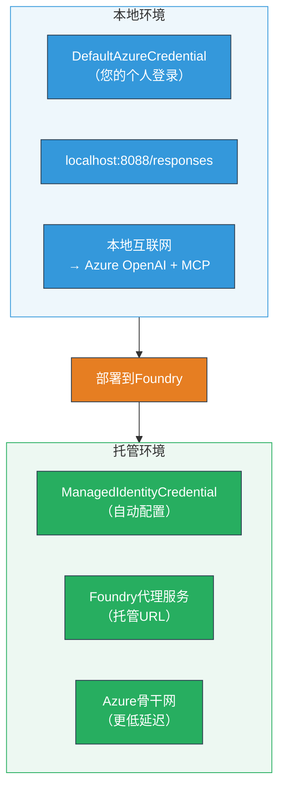

# 模块 7 - 在 Playground 中验证

在本模块中，您将在 **VS Code** 和 **[Foundry 门户](https://ai.azure.com)** 中测试已部署的多代理工作流，确认代理表现与本地测试一致。

---

## 为什么部署后还要验证？

您的多代理工作流在本地运行完美，为什么还要再测试？托管环境在几个方面存在差异：


| 差异 | 本地 | 托管 |
|-----------|-------|--------|
| <strong>身份</strong> | [`DefaultAzureCredential`](https://learn.microsoft.com/azure/developer/python/sdk/authentication/credential-chains#defaultazurecredential-overview)（您的个人登录） | [`ManagedIdentityCredential`](https://learn.microsoft.com/python/api/overview/azure/identity-readme#managed-identity-support)（自动配置） |
| <strong>端点</strong> | `http://localhost:8088/responses` | [Foundry 代理服务](https://learn.microsoft.com/azure/foundry/agents/concepts/hosted-agents)端点（托管 URL） |
| <strong>网络</strong> | 本地机器 → Azure OpenAI + MCP 出站 | Azure 骨干网（服务间延迟更低） |
| **MCP 连接** | 本地互联网 → `learn.microsoft.com/api/mcp` | 容器出站 → `learn.microsoft.com/api/mcp` |

如果有任何环境变量配置错误、RBAC 不同，或 MCP 出站被阻止，您会在这里发现。

---

## 选项 A：在 VS Code Playground 中测试（推荐先试）

[Foundry 扩展](https://marketplace.visualstudio.com/items?itemName=TeamsDevApp.vscode-ai-foundry)包含集成 Playground，允许您在不离开 VS Code 的情况下与已部署代理聊天。

### 第 1 步：导航到您的托管代理

1. 点击 VS Code <strong>活动栏</strong>（左侧栏）中的 **Microsoft Foundry** 图标打开 Foundry 面板。
2. 展开您连接的项目（例如 `workshop-agents`）。
3. 展开 **托管代理（预览）**。
4. 您应该能看到您的代理名称（例如 `resume-job-fit-evaluator`）。

### 第 2 步：选择一个版本

1. 点击代理名称展开其版本。
2. 点击您部署的版本（例如 `v1`）。
3. 打开一个显示容器详细信息的 <strong>详情面板</strong>。
4. 验证状态是否为 **Started** 或 **Running**。

### 第 3 步：打开 Playground

1. 在详情面板，点击 **Playground** 按钮（或右键点击版本 → **在 Playground 中打开**）。
2. 聊天界面将在 VS Code 标签页中打开。

### 第 4 步：运行冒烟测试

使用与 [模块 5](05-test-locally.md) 相同的 3 个测试。在 Playground 输入框中输入每条消息，按 <strong>发送</strong>（或 <strong>回车</strong>）。

#### 测试 1 - 完整简历 + JD（标准流程）

粘贴第 5 模块、测试 1 中的完整简历 + JD 提示（Jane Doe + Contoso Ltd 高级云工程师）。

**预期结果：**
- 适配度分数及详细分解（100 分制）
- 匹配技能部分
- 缺失技能部分
- **针对每个缺失技能出一张 Gap 卡片**，并附微软学习 URL
- 含时间轴的学习路线图

#### 测试 2 - 快速简短测试（最少输入）

```
RESUME: 3 years Python developer, knows Django and PostgreSQL, no cloud experience.

JOB: Cloud DevOps Engineer requiring AWS, Kubernetes, Terraform, CI/CD. 5 years needed.
```

**预期结果：**
- 较低的适配度分数（< 40）
- 诚实评估和分阶段学习路径
- 多张 Gap 卡片（AWS、Kubernetes、Terraform、CI/CD、经验差距）

#### 测试 3 - 高适配度候选人

```
RESUME:
10 years Azure Cloud Architect. AZ-305 certified. Expert in AKS, Terraform, Azure DevOps, 
Azure Functions, Helm, Prometheus, Grafana, Python, Go. Led platform team of 8.

JOB:
Senior Cloud Engineer. Required: AKS, Terraform, Azure DevOps, Python. Preferred: Helm, Go.
5+ years experience. AZ-305 preferred.
```

**预期结果：**
- 高适配度分数（≥ 80）
- 重点关注面试准备和润色
- 几乎无或无 Gap 卡片
- 短时间轴聚焦准备

### 第 5 步：与本地结果对比

打开您第 5 模块中保存本地响应的笔记或浏览器标签页。对每个测试：

- 响应结构是否<strong>相同</strong>（适配分数、Gap 卡片、路线图）？
- 是否遵循了<strong>相同的评分标准</strong>（100 分制分解）？
- Gap 卡片中是否仍包含<strong>微软学习 URL</strong>？
- 是否为<strong>每个缺失技能一张 Gap 卡</strong>（无截断）？

> <strong>细微措辞差异是正常的</strong> —— 模型有非确定性。关注结构、评分一致性和 MCP 工具的使用。

---

## 选项 B：在 Foundry 门户测试

[Foundry 门户](https://ai.azure.com) 提供基于 Web 的 playground，方便与团队成员或利益相关者共享。

### 第 1 步：打开 Foundry 门户

1. 打开浏览器，访问 [https://ai.azure.com](https://ai.azure.com)。
2. 使用您在整个工作坊中使用的相同 Azure 账户登录。

### 第 2 步：导航到您的项目

1. 在主页左侧栏找到 <strong>最近项目</strong>。
2. 点击您的项目名称（例如 `workshop-agents`）。
3. 如果未看到，点击 <strong>所有项目</strong> 并搜索。

### 第 3 步：找到已部署的代理

1. 项目左侧导航，点击 <strong>构建</strong> → <strong>代理</strong>（或找到 <strong>代理</strong> 部分）。
2. 您将看到代理列表。找到您的已部署代理（例如 `resume-job-fit-evaluator`）。
3. 点击代理名称打开详情页。

### 第 4 步：打开 Playground

1. 在代理详情页顶部工具栏。
2. 点击 **在 playground 中打开**（或 **尝试在 playground 中**）。
3. 聊天界面打开。

### 第 5 步：运行相同冒烟测试

重复 VS Code Playground 部分的所有 3 个测试。将每个响应与本地结果（第 5 模块）和 VS Code Playground 结果（选项 A）比较。

---

## 多代理特定验证

除了基本正确性，验证这些多代理特有行为：

### MCP 工具执行

| 检查项 | 如何验证 | 通过条件 |
|-------|---------------|----------------|
| MCP 调用成功 | Gap 卡片包含 `learn.microsoft.com` URL | 真实 URL，非回退提示 |
| 多次 MCP 调用 | 每个高/中优先级差距均有资源 | 不仅仅是第一个 Gap 卡 |
| MCP 回退机制 | 如果 URL 缺失，检查回退文本 | 代理仍生成 Gap 卡（有无 URL 均可） |

### 代理协调

| 检查项 | 如何验证 | 通过条件 |
|-------|---------------|----------------|
| 四个代理均运行 | 输出包含适配分数和 Gap 卡 | 分数来自 MatchingAgent，卡片来自 GapAnalyzer |
| 并行散发 | 响应时间合理（< 2 分钟） | 超过 3 分钟可能并行执行有问题 |
| 数据流完整性 | Gap 卡参考匹配报告中的技能 | 无幻觉技能（技能出现在 JD 里） |

---

## 验证评分表

使用此评分表评估您的多代理工作流托管表现：

| # | 评分标准 | 通过条件 | 是否通过？ |
|---|----------|---------------|-------|
| 1 | <strong>功能正确性</strong> | 代理响应简历 + JD 包含适配分数及差距分析 | |
| 2 | <strong>评分一致性</strong> | 适配分数使用 100 分等级及分解数学 | |
| 3 | **Gap 卡完整性** | 每个缺失技能一张卡（无截断或合并） | |
| 4 | **MCP 工具集成** | Gap 卡含真实微软学习 URL | |
| 5 | <strong>结构一致性</strong> | 输出结构托管与本地运行一致 | |
| 6 | <strong>响应时间</strong> | 托管代理完整评估响应时间在 2 分钟内 | |
| 7 | <strong>无错误</strong> | 无 HTTP 500 错误、超时或空响应 | |

> “通过”意味着所有 7 项评分标准在至少一个 playground（VS Code 或门户）中对所有 3 个冒烟测试都满足。

---

## Playground 问题故障排除

| 表现 | 可能原因 | 解决办法 |
|---------|-------------|-----|
| Playground 无法加载 | 容器状态非“Started” | 返回[模块 6](06-deploy-to-foundry.md)，确认部署状态；“Pending”时等待 |
| 代理返回空响应 | 模型部署名称不匹配 | 检查 `agent.yaml` → `environment_variables` → `MODEL_DEPLOYMENT_NAME` 是否匹配已部署模型 |
| 代理返回错误消息 | [RBAC](https://learn.microsoft.com/azure/foundry/concepts/rbac-foundry) 权限缺失 | 在项目范围分配 **[Azure AI User](https://aka.ms/foundry-ext-project-role)** |
| Gap 卡无微软学习 URL | MCP 出站被阻断或 MCP 服务器不可用 | 检查容器是否可访问 `learn.microsoft.com`。见[模块 8](08-troubleshooting.md) |
| 只有 1 张 Gap 卡（被截断） | GapAnalyzer 指令缺少 “CRITICAL” 区块 | 查看 [模块 3，第 2.4 步](03-configure-agents.md) |
| 适配分数与本地差异大 | 部署了不同模型或指令 | 比较 `agent.yaml` 环境变量与本地 `.env` 文件。如有需要重新部署 |
| 门户中提示“代理未找到” | 部署仍在传播或失败 | 等待 2 分钟并刷新；若仍缺失，从[模块 6](06-deploy-to-foundry.md)重新部署 |

---

### 检查点

- [ ] 在 VS Code Playground 测试代理 —— 所有 3 个冒烟测试通过
- [ ] 在 [Foundry 门户](https://ai.azure.com) Playground 测试代理 —— 所有 3 个冒烟测试通过
- [ ] 响应结构与本地测试保持一致（适配分数、Gap 卡、路线图）
- [ ] Gap 卡中包含微软学习 URL（托管环境中 MCP 工具工作正常）
- [ ] 每个缺失技能有一张 Gap 卡（无截断）
- [ ] 测试中无错误或超时
- [ ] 完成验证评分表（所有 7 项评分标准全部通过）

---

**上一步：** [06 - 部署到 Foundry](06-deploy-to-foundry.md) · **下一步：** [08 - 故障排除 →](08-troubleshooting.md)

---

<!-- CO-OP TRANSLATOR DISCLAIMER START -->
**免责声明**：  
本文件使用 AI 翻译服务 [Co-op Translator](https://github.com/Azure/co-op-translator) 进行翻译。尽管我们力求准确，但请注意自动翻译可能包含错误或不准确之处。原始语言版本的文件应被视为权威来源。对于重要信息，建议使用专业人工翻译。对于因使用本翻译而引起的任何误解或误释，我们概不负责。
<!-- CO-OP TRANSLATOR DISCLAIMER END -->