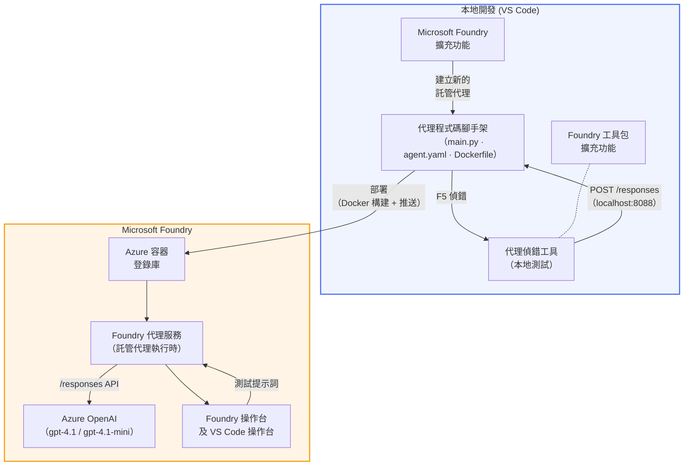

# Foundry Toolkit + Foundry Hosted Agents 工作坊

[](https://www.python.org/)
[](https://github.com/microsoft/agents)
[](https://learn.microsoft.com/azure/ai-foundry/agents/concepts/hosted-agents/)
[](https://ai.azure.com/)
[](https://learn.microsoft.com/azure/ai-services/openai/)
[](https://learn.microsoft.com/cli/azure/install-azure-cli)
[](https://learn.microsoft.com/azure/developer/azure-developer-cli/install-azd)
[](https://www.docker.com/)
[](https://marketplace.visualstudio.com/items?itemName=ms-windows-ai-studio.windows-ai-studio)
[](LICENSE)

使用 **Microsoft Foundry 擴充功能** 及 **Foundry Toolkit**，全程於 VS Code 內建立、測試和部署 AI 代理至 **Microsoft Foundry Agent Service** 作為 **Hosted Agents**。

> **Hosted Agents 目前處於預覽階段。** 支援地區有限，詳見 [region availability](https://learn.microsoft.com/azure/foundry/agents/concepts/hosted-agents#region-availability)。

> 每個實驗裡的 `agent/` 資料夾是由 Foundry 擴充功能 <strong>自動生成</strong> — 你只需客製化代碼、在本地測試並部署即可。

### 🌐 多語言支援

#### 透過 GitHub Action 支援（自動且永遠保持更新）

<!-- CO-OP TRANSLATOR LANGUAGES TABLE START -->
[阿拉伯文](../ar/README.md) | [孟加拉文](../bn/README.md) | [保加利亞文](../bg/README.md) | [緬甸語（緬甸）](../my/README.md) | [中文（簡體）](../zh-CN/README.md) | [中文（繁體，香港）](./README.md) | [中文（繁體，澳門）](../zh-MO/README.md) | [中文（繁體，台灣）](../zh-TW/README.md) | [克羅地亞語](../hr/README.md) | [捷克語](../cs/README.md) | [丹麥語](../da/README.md) | [荷蘭語](../nl/README.md) | [愛沙尼亞語](../et/README.md) | [芬蘭語](../fi/README.md) | [法語](../fr/README.md) | [德語](../de/README.md) | [希臘語](../el/README.md) | [希伯來語](../he/README.md) | [印地語](../hi/README.md) | [匈牙利語](../hu/README.md) | [印尼語](../id/README.md) | [意大利語](../it/README.md) | [日語](../ja/README.md) | [卡納達語](../kn/README.md) | [高棉語](../km/README.md) | [韓語](../ko/README.md) | [立陶宛語](../lt/README.md) | [馬來語](../ms/README.md) | [馬拉雅拉姆語](../ml/README.md) | [馬拉地語](../mr/README.md) | [尼泊爾語](../ne/README.md) | [奈及利亞皮欽語](../pcm/README.md) | [挪威語](../no/README.md) | [波斯語（法爾西語）](../fa/README.md) | [波蘭語](../pl/README.md) | [葡萄牙語（巴西）](../pt-BR/README.md) | [葡萄牙語（葡萄牙）](../pt-PT/README.md) | [旁遮普語（Gurmukhi）](../pa/README.md) | [羅馬尼亞語](../ro/README.md) | [俄語](../ru/README.md) | [塞爾維亞語（西里爾字母）](../sr/README.md) | [斯洛伐克語](../sk/README.md) | [斯洛文尼亞語](../sl/README.md) | [西班牙語](../es/README.md) | [斯瓦希里語](../sw/README.md) | [瑞典語](../sv/README.md) | [他加祿語（菲律賓語）](../tl/README.md) | [泰米爾語](../ta/README.md) | [泰盧固語](../te/README.md) | [泰語](../th/README.md) | [土耳其語](../tr/README.md) | [烏克蘭語](../uk/README.md) | [烏爾都語](../ur/README.md) | [越南語](../vi/README.md)

> **想本地複製？**
>
> 本倉庫含 50 多種語言翻譯，因此下載大小明顯增加。如想不帶翻譯內容複製，請使用稀疏檢出（sparse checkout）：
>
> **Bash / macOS / Linux:**
> ```bash
> git clone --filter=blob:none --sparse https://github.com/microsoft-foundry/Foundry_Toolkit_for_VSCode_Lab.git
> cd Foundry_Toolkit_for_VSCode_Lab
> git sparse-checkout set --no-cone '/*' '!translations' '!translated_images'
> ```
>
> **CMD（Windows）：**
> ```cmd
> git clone --filter=blob:none --sparse https://github.com/microsoft-foundry/Foundry_Toolkit_for_VSCode_Lab.git
> cd Foundry_Toolkit_for_VSCode_Lab
> git sparse-checkout set --no-cone "/*" "!translations" "!translated_images"
> ```
>
> 這樣你可以更快下載，且包含課程完成所需的一切內容。
<!-- CO-OP TRANSLATOR LANGUAGES TABLE END -->

---

## 架構


**流程：** Foundry 擴充功能產生代理 → 你自訂代碼與指示 → 用 Agent Inspector 本地測試 → 部署到 Foundry（Docker 映像推送至 ACR）→ 在 Playground 驗證。

---

## 你將會建立的內容

| 實驗 | 說明 | 狀態 |
|-----|-------------|--------|
| **實驗 01 - 單一代理** | 建立 **「像高層解說般」代理**，本地測試，並部署至 Foundry | ✅ 可用 |
| **實驗 02 - 多代理工作流程** | 建立 **「履歷 → 職位匹配評估員」** — 4 個代理合作評分履歷匹配度並產生學習路線圖 | ✅ 可用 |

---

## 認識 Executive Agent

本工作坊中，你會建立 **「像高層解說般」代理** — 一個將艱深技術術語轉為冷靜、適合董事會聽的摘要的 AI 代理。坦白說，C-suite 裡沒人想聽「v3.2 版引入的同步呼叫造成執行緒池耗盡」這種說法。

我建這代理是因為多次精心撰寫的事故調查後，對方回應：「所以…網站到底是不是掛了？」

### 如何運作

你給它一段技術更新，它回你一個高管摘要 — 三點說明，沒有行話，沒堆疊追蹤，沒有存在主義恐懼。只告訴你 <strong>發生了什麼事</strong>、<strong>業務影響</strong> 與 <strong>下一步</strong>。

### 看它實際操作

**你說：**
> 「API 延遲因 v3.2 版本引入的同步呼叫導致執行緒池耗盡而增加。」

**代理回覆：**

> **高管摘要：**
> - **發生了什麼事：** 最新發佈後系統變慢了。
> - **業務影響：** 部分用戶使用服務時延遲。
> - **下一步：** 已撤銷此變更，並準備修正後重新部署。

### 為什麼選這代理？

它是極簡單、單一目的的代理——非常適合完整學習托管代理工作流程，不必糾結複雜工具鏈。說句實話？每個工程團隊都能用上一個這樣的。

---

## 工作坊架構

```
📂 Foundry_Toolkit_for_VSCode_Lab/
├── 📄 README.md                      ← You are here
├── 📂 ExecutiveAgent/                ← Standalone hosted agent project
│   ├── agent.yaml
│   ├── Dockerfile
│   ├── main.py
│   └── requirements.txt
└── 📂 workshop/
    ├── 📂 lab01-single-agent/        ← Full lab: docs + agent code
    │   ├── README.md                 ← Hands-on lab instructions
    │   ├── 📂 docs/                  ← Step-by-step tutorial modules
    │   │   ├── 00-prerequisites.md
    │   │   ├── 01-install-foundry-toolkit.md
    │   │   ├── 02-create-foundry-project.md
    │   │   ├── 03-create-hosted-agent.md
    │   │   ├── 04-configure-and-code.md
    │   │   ├── 05-test-locally.md
    │   │   ├── 06-deploy-to-foundry.md
    │   │   ├── 07-verify-in-playground.md
    │   │   └── 08-troubleshooting.md
    │   └── 📂 agent/                 ← Reference solution (auto-scaffolded by Foundry extension)
    │       ├── agent.yaml
    │       ├── Dockerfile
    │       ├── main.py
    │       └── requirements.txt
    └── 📂 lab02-multi-agent/         ← Resume → Job Fit Evaluator
        ├── README.md                 ← Hands-on lab instructions (end-to-end)
        ├── 📂 docs/                  ← Step-by-step tutorial modules
        │   ├── 00-prerequisites.md
        │   ├── 01-understand-multi-agent.md
        │   ├── 02-scaffold-multi-agent.md
        │   ├── 03-configure-agents.md
        │   ├── 04-orchestration-patterns.md
        │   ├── 05-test-locally.md
        │   ├── 06-deploy-to-foundry.md
        │   ├── 07-verify-in-playground.md
        │   └── 08-troubleshooting.md
        └── 📂 PersonalCareerCopilot/ ← Reference solution (multi-agent workflow)
            ├── agent.yaml
            ├── Dockerfile
            ├── main.py
            └── requirements.txt
```

> **注意：** 每個實驗內的 `agent/` 資料夾是你從指令面板執行 `Microsoft Foundry: Create a New Hosted Agent` 時由 **Microsoft Foundry 擴充功能** 產生的。接著你再用代理指示、工具與設定去自訂檔案。實驗 01 將帶你從頭建立。

---

## 開始吧

### 1. 複製此倉庫

```bash
git clone https://github.com/microsoft-foundry/Foundry_Toolkit_for_VSCode_Lab.git
cd Foundry_Toolkit_for_VSCode_Lab
```

### 2. 設定 Python 虛擬環境

```bash
python -m venv venv
```

啟用它：

- **Windows（PowerShell）：**
  ```powershell
  .\venv\Scripts\Activate.ps1
  ```
- **macOS / Linux:**
  ```bash
  source venv/bin/activate
  ```

### 3. 安裝相依套件

```bash
pip install -r workshop/lab01-single-agent/agent/requirements.txt
```

### 4. 配置環境變數

複製代理資料夾內範例 `.env` 檔案，填入你的值：

```bash
cp workshop/lab01-single-agent/agent/.env.example workshop/lab01-single-agent/agent/.env
```

編輯 `workshop/lab01-single-agent/agent/.env`：

```env
AZURE_AI_PROJECT_ENDPOINT=https://<your-account>.services.ai.azure.com/api/projects/<your-project>
MODEL_DEPLOYMENT_NAME=<your-model-deployment-name>
```

### 5. 跟隨工作坊實驗

每個實驗都是自給自足，有自己的模組。從 **實驗 01** 學基礎開始，再進入 **實驗 02** 了解多代理工作流程。

#### 實驗 01 - 單一代理 ([完整說明](workshop/lab01-single-agent/README.md))

| # | 模組 | 連結 |
|---|--------|------|
| 1 | 閱讀前置需求 | [00-prerequisites.md](workshop/lab01-single-agent/docs/00-prerequisites.md) |
| 2 | 安裝 Foundry Toolkit 與 Foundry 擴充功能 | [01-install-foundry-toolkit.md](workshop/lab01-single-agent/docs/01-install-foundry-toolkit.md) |
| 3 | 建立 Foundry 專案 | [02-create-foundry-project.md](workshop/lab01-single-agent/docs/02-create-foundry-project.md) |
| 4 | 建立托管代理 | [03-create-hosted-agent.md](workshop/lab01-single-agent/docs/03-create-hosted-agent.md) |
| 5 | 設定指示與環境 | [04-configure-and-code.md](workshop/lab01-single-agent/docs/04-configure-and-code.md) |
| 6 | 本地測試 | [05-test-locally.md](workshop/lab01-single-agent/docs/05-test-locally.md) |
| 7 | 部署至 Foundry | [06-deploy-to-foundry.md](workshop/lab01-single-agent/docs/06-deploy-to-foundry.md) |
| 8 | 在 Playground 驗證 | [07-verify-in-playground.md](workshop/lab01-single-agent/docs/07-verify-in-playground.md) |
| 9 | 疑難排解 | [08-troubleshooting.md](workshop/lab01-single-agent/docs/08-troubleshooting.md) |

#### 實驗 02 - 多代理工作流程 ([完整說明](workshop/lab02-multi-agent/README.md))

| # | 模組 | 連結 |
|---|--------|------|
| 1 | 前置需求（實驗 02） | [00-prerequisites.md](workshop/lab02-multi-agent/docs/00-prerequisites.md) |
| 2 | 瞭解多代理架構 | [01-understand-multi-agent.md](workshop/lab02-multi-agent/docs/01-understand-multi-agent.md) |
| 3 | 建立多代理專案框架 | [02-scaffold-multi-agent.md](workshop/lab02-multi-agent/docs/02-scaffold-multi-agent.md) |
| 4 | 設定代理與環境 | [03-configure-agents.md](workshop/lab02-multi-agent/docs/03-configure-agents.md) |
| 5 | 編排模式 | [04-orchestration-patterns.md](workshop/lab02-multi-agent/docs/04-orchestration-patterns.md) |
| 6 | 本地測試（多代理） | [05-test-locally.md](workshop/lab02-multi-agent/docs/05-test-locally.md) |
| 7 | 部署到 Foundry | [06-deploy-to-foundry.md](workshop/lab02-multi-agent/docs/06-deploy-to-foundry.md) |
| 8 | 在 playground 驗證 | [07-verify-in-playground.md](workshop/lab02-multi-agent/docs/07-verify-in-playground.md) |
| 9 | 疑難排解（多代理） | [08-troubleshooting.md](workshop/lab02-multi-agent/docs/08-troubleshooting.md) |

---

## 維護者

<table>
<tr>
    <td align="center"><a href="https://github.com/ShivamGoyal03">
        <br />
        <sub><b>Shivam Goyal</b></sub>
    </a><br />
    </td>
</tr>
</table>

---

## 所需權限（快速參考）

| 場景 | 所需角色 |
|----------|---------------|
| 建立新的 Foundry 專案 | Foundry 資源上的 **Azure AI 所有者** |
| 部署到現有專案（新資源） | 訂閱上的 **Azure AI 所有者** + <strong>貢獻者</strong> |
| 部署到已完整配置的專案 | 帳戶上的 <strong>讀者</strong> + 專案上的 **Azure AI 使用者** |

> **重要：** Azure 的 `所有者` 和 `貢獻者` 角色僅包含<em>管理</em>權限，不包含<em>開發</em>（資料操作）權限。建立及部署代理需要 **Azure AI 使用者** 或 **Azure AI 所有者**。

---

## 參考資料

- [快速上手：部署您的第一個託管代理（VS Code）](https://learn.microsoft.com/azure/foundry/agents/quickstarts/quickstart-hosted-agent)
- [什麼是託管代理？](https://learn.microsoft.com/azure/foundry/agents/concepts/hosted-agents)
- [在 VS Code 中建立託管代理工作流程](https://learn.microsoft.com/azure/foundry/agents/how-to/vs-code-agents-workflow-pro-code)
- [部署託管代理](https://learn.microsoft.com/azure/foundry/agents/how-to/deploy-hosted-agent)
- [Microsoft Foundry 的 RBAC](https://learn.microsoft.com/azure/foundry/concepts/rbac-foundry)
- [架構審查代理範例](https://github.com/Azure-Samples/agent-architecture-review-sample) - 實際託管代理範例，包含 MCP 工具、Excalidraw 圖表，以及雙重部署

---

## 授權

[MIT](../../LICENSE)

---

<!-- CO-OP TRANSLATOR DISCLAIMER START -->
**免責聲明**：  
本文件由 AI 翻譯服務 [Co-op Translator](https://github.com/Azure/co-op-translator) 翻譯。雖然我們致力於準確，但請注意自動翻譯可能包含錯誤或不準確之處。文件的原始語言版本應視為權威來源。對於重要資訊，建議使用專業人工翻譯。我們不對因使用本翻譯而引起的任何誤解或誤釋負責。
<!-- CO-OP TRANSLATOR DISCLAIMER END -->