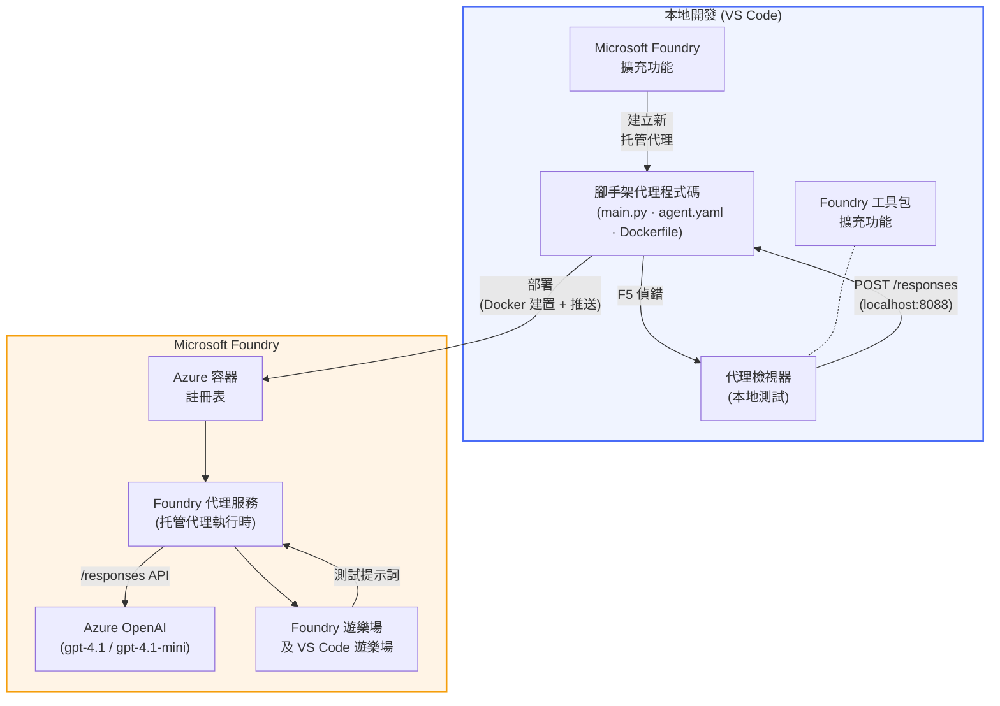

# Foundry Toolkit + Foundry Hosted Agents 工作坊

[](https://www.python.org/)
[](https://github.com/microsoft/agents)
[](https://learn.microsoft.com/azure/ai-foundry/agents/concepts/hosted-agents/)
[](https://ai.azure.com/)
[](https://learn.microsoft.com/azure/ai-services/openai/)
[](https://learn.microsoft.com/cli/azure/install-azure-cli)
[](https://learn.microsoft.com/azure/developer/azure-developer-cli/install-azd)
[](https://www.docker.com/)
[](https://marketplace.visualstudio.com/items?itemName=ms-windows-ai-studio.windows-ai-studio)
[](LICENSE)

使用 **Microsoft Foundry 擴充套件** 和 **Foundry Toolkit**，完全從 VS Code 建構、測試及部署 AI 代理至 **Microsoft Foundry Agent Service** 作為 **Hosted Agents（託管代理）**。

> **Hosted Agents 目前為預覽階段。** 支援地區有限 - 請參閱[地區可用性](https://learn.microsoft.com/azure/foundry/agents/concepts/hosted-agents#region-availability)。

> 每個實驗室內的 `agent/` 資料夾係由 Foundry 擴充套件<strong>自動生成</strong> — 然後你再自訂程式碼、在本機測試，並部署。

<!-- CO-OP TRANSLATOR LANGUAGES TABLE START -->
[Arabic](../ar/README.md) | [Bengali](../bn/README.md) | [Bulgarian](../bg/README.md) | [Burmese (Myanmar)](../my/README.md) | [Chinese (Simplified)](../zh-CN/README.md) | [Chinese (Traditional, Hong Kong)](./README.md) | [Chinese (Traditional, Macau)](../zh-MO/README.md) | [Chinese (Traditional, Taiwan)](../zh-TW/README.md) | [Croatian](../hr/README.md) | [Czech](../cs/README.md) | [Danish](../da/README.md) | [Dutch](../nl/README.md) | [Estonian](../et/README.md) | [Finnish](../fi/README.md) | [French](../fr/README.md) | [German](../de/README.md) | [Greek](../el/README.md) | [Hebrew](../he/README.md) | [Hindi](../hi/README.md) | [Hungarian](../hu/README.md) | [Indonesian](../id/README.md) | [Italian](../it/README.md) | [Japanese](../ja/README.md) | [Kannada](../kn/README.md) | [Khmer](../km/README.md) | [Korean](../ko/README.md) | [Lithuanian](../lt/README.md) | [Malay](../ms/README.md) | [Malayalam](../ml/README.md) | [Marathi](../mr/README.md) | [Nepali](../ne/README.md) | [Nigerian Pidgin](../pcm/README.md) | [Norwegian](../no/README.md) | [Persian (Farsi)](../fa/README.md) | [Polish](../pl/README.md) | [Portuguese (Brazil)](../pt-BR/README.md) | [Portuguese (Portugal)](../pt-PT/README.md) | [Punjabi (Gurmukhi)](../pa/README.md) | [Romanian](../ro/README.md) | [Russian](../ru/README.md) | [Serbian (Cyrillic)](../sr/README.md) | [Slovak](../sk/README.md) | [Slovenian](../sl/README.md) | [Spanish](../es/README.md) | [Swahili](../sw/README.md) | [Swedish](../sv/README.md) | [Tagalog (Filipino)](../tl/README.md) | [Tamil](../ta/README.md) | [Telugu](../te/README.md) | [Thai](../th/README.md) | [Turkish](../tr/README.md) | [Ukrainian](../uk/README.md) | [Urdu](../ur/README.md) | [Vietnamese](../vi/README.md)

> **想本機 Clone？**
>
> 此倉庫包含超過 50 種語言翻譯檔，會大幅增加下載大小。若想不含翻譯檔的 clone，請使用 sparce checkout：
>
> **Bash / macOS / Linux:**
> ```bash
> git clone --filter=blob:none --sparse https://github.com/microsoft-foundry/Foundry_Toolkit_for_VSCode_Lab.git
> cd Foundry_Toolkit_for_VSCode_Lab
> git sparse-checkout set --no-cone '/*' '!translations' '!translated_images'
> ```
>
> **CMD (Windows):**
> ```cmd
> git clone --filter=blob:none --sparse https://github.com/microsoft-foundry/Foundry_Toolkit_for_VSCode_Lab.git
> cd Foundry_Toolkit_for_VSCode_Lab
> git sparse-checkout set --no-cone "/*" "!translations" "!translated_images"
> ```
>
> 這樣讓你可以更快下載到完成課程所需的所有檔案。
<!-- CO-OP TRANSLATOR LANGUAGES TABLE END -->

---

## 架構


**流程:** Foundry 擴充套件生成代理結構 → 你自訂程式碼與指令 → 使用 Agent Inspector 本機測試 → 部署到 Foundry（Docker 映像推送至 ACR）→ 在 Playground 驗證。

---

## 你會打造什麼

| 實驗室 | 描述 | 狀態 |
|--------|--------|--------|
| **實驗室 01 - 單一代理** | 建立 **「像解釋給高管聽」代理**，本機測試並部署到 Foundry | ✅ 可用 |
| **實驗室 02 - 多代理工作流** | 建立 **「履歷 → 工作適配評估」** — 四個代理協作評分履歷符合度並產生學習路線圖 | ✅ 可用 |

---

## 認識高管代理

在此工作坊中，你將打造 **「像解釋給高管聽」代理** — 一個將複雜技術行話轉換成冷靜、適合董事會聽的摘要的 AI 代理。說實話，C-suite 聽不懂什麼「v3.2 版本引入同步呼叫導致執行緒池耗盡」這種專有名詞。

我建立此代理是因為太多次在事故檢討中，明明報告做得完美，回應卻是：「那… 網站到底是不是掛了？」

### 它怎麼運作

你給它一段技術更新。它回傳高管摘要 — 三個重點，無行話、無堆疊追蹤、無存在主義恐慌。只有<strong>發生了什麼</strong>、<strong>商業影響</strong>和<strong>下一步</strong>。

### 看它實際運作

**你說：**
>「API 延遲增加，原因是 v3.2 版本引入的同步呼叫導致執行緒池耗盡。」

**代理回覆：**

> **高管摘要：**
> - **發生了什麼：** 最新發行後系統變慢了。
> - **商業影響：** 部分用戶使用服務時遇到延遲。
> - **下一步：** 變更已回滾，正在準備修正後再部署。

### 為什麼選這個代理？

它是一個簡單明瞭、單一用途的代理 — 非常適合學習從頭到尾的託管代理工作流，避免被複雜工具鏈搞亂。說實話，每個工程團隊都該有這樣一個。

---

## 工作坊結構

```
📂 Foundry_Toolkit_for_VSCode_Lab/
├── 📄 README.md                      ← You are here
├── 📂 ExecutiveAgent/                ← Standalone hosted agent project
│   ├── agent.yaml
│   ├── Dockerfile
│   ├── main.py
│   └── requirements.txt
└── 📂 workshop/
    ├── 📂 lab01-single-agent/        ← Full lab: docs + agent code
    │   ├── README.md                 ← Hands-on lab instructions
    │   ├── 📂 docs/                  ← Step-by-step tutorial modules
    │   │   ├── 00-prerequisites.md
    │   │   ├── 01-install-foundry-toolkit.md
    │   │   ├── 02-create-foundry-project.md
    │   │   ├── 03-create-hosted-agent.md
    │   │   ├── 04-configure-and-code.md
    │   │   ├── 05-test-locally.md
    │   │   ├── 06-deploy-to-foundry.md
    │   │   ├── 07-verify-in-playground.md
    │   │   └── 08-troubleshooting.md
    │   └── 📂 agent/                 ← Reference solution (auto-scaffolded by Foundry extension)
    │       ├── agent.yaml
    │       ├── Dockerfile
    │       ├── main.py
    │       └── requirements.txt
    └── 📂 lab02-multi-agent/         ← Resume → Job Fit Evaluator
        ├── README.md                 ← Hands-on lab instructions (end-to-end)
        ├── 📂 docs/                  ← Step-by-step tutorial modules
        │   ├── 00-prerequisites.md
        │   ├── 01-understand-multi-agent.md
        │   ├── 02-scaffold-multi-agent.md
        │   ├── 03-configure-agents.md
        │   ├── 04-orchestration-patterns.md
        │   ├── 05-test-locally.md
        │   ├── 06-deploy-to-foundry.md
        │   ├── 07-verify-in-playground.md
        │   └── 08-troubleshooting.md
        └── 📂 PersonalCareerCopilot/ ← Reference solution (multi-agent workflow)
            ├── agent.yaml
            ├── Dockerfile
            ├── main.py
            └── requirements.txt
```

> **注意：** 每個實驗室中的 `agent/` 資料夾是當你從指令面板執行 `Microsoft Foundry: Create a New Hosted Agent` 時，由 **Microsoft Foundry 擴充套件** 生成。其檔案會再自訂代理指令、工具和設定。實驗室 01 將帶你從頭重建這個內容。

---

## 開始使用

### 1. Clone 儲存庫

```bash
git clone https://github.com/microsoft-foundry/Foundry_Toolkit_for_VSCode_Lab.git
cd Foundry_Toolkit_for_VSCode_Lab
```

### 2. 設定 Python 虛擬環境

```bash
python -m venv venv
```

啟用它：

- **Windows (PowerShell):**
  ```powershell
  .\venv\Scripts\Activate.ps1
  ```
- **macOS / Linux:**
  ```bash
  source venv/bin/activate
  ```

### 3. 安裝相依套件

```bash
pip install -r workshop/lab01-single-agent/agent/requirements.txt
```

### 4. 設定環境變數

複製代理資料夾內的範例 `.env` 檔，並填入你的值：

```bash
cp workshop/lab01-single-agent/agent/.env.example workshop/lab01-single-agent/agent/.env
```

編輯 `workshop/lab01-single-agent/agent/.env`：

```env
AZURE_AI_PROJECT_ENDPOINT=https://<your-account>.services.ai.azure.com/api/projects/<your-project>
MODEL_DEPLOYMENT_NAME=<your-model-deployment-name>
```

### 5. 跟著工作坊實驗室進行

每個實驗室是獨立模組。先從 **實驗室 01** 學習基礎，再進行 **實驗室 02** 學習多代理工作流程。

#### 實驗室 01 - 單一代理 ([完整指引](workshop/lab01-single-agent/README.md))

| # | 模組 | 連結 |
|---|--------|------|
| 1 | 閱讀前置需求 | [00-prerequisites.md](workshop/lab01-single-agent/docs/00-prerequisites.md) |
| 2 | 安裝 Foundry Toolkit 和 Foundry 擴充套件 | [01-install-foundry-toolkit.md](workshop/lab01-single-agent/docs/01-install-foundry-toolkit.md) |
| 3 | 建立 Foundry 專案 | [02-create-foundry-project.md](workshop/lab01-single-agent/docs/02-create-foundry-project.md) |
| 4 | 建立託管代理 | [03-create-hosted-agent.md](workshop/lab01-single-agent/docs/03-create-hosted-agent.md) |
| 5 | 配置指令和環境 | [04-configure-and-code.md](workshop/lab01-single-agent/docs/04-configure-and-code.md) |
| 6 | 本機測試 | [05-test-locally.md](workshop/lab01-single-agent/docs/05-test-locally.md) |
| 7 | 部署到 Foundry | [06-deploy-to-foundry.md](workshop/lab01-single-agent/docs/06-deploy-to-foundry.md) |
| 8 | 在 Playground 驗證 | [07-verify-in-playground.md](workshop/lab01-single-agent/docs/07-verify-in-playground.md) |
| 9 | 疑難排解 | [08-troubleshooting.md](workshop/lab01-single-agent/docs/08-troubleshooting.md) |

#### 實驗室 02 - 多代理工作流 ([完整指引](workshop/lab02-multi-agent/README.md))

| # | 模組 | 連結 |
|---|--------|------|
| 1 | 實驗室 02 前置需求 | [00-prerequisites.md](workshop/lab02-multi-agent/docs/00-prerequisites.md) |
| 2 | 了解多代理架構 | [01-understand-multi-agent.md](workshop/lab02-multi-agent/docs/01-understand-multi-agent.md) |
| 3 | 生成多代理專案骨架 | [02-scaffold-multi-agent.md](workshop/lab02-multi-agent/docs/02-scaffold-multi-agent.md) |
| 4 | 配置代理和環境 | [03-configure-agents.md](workshop/lab02-multi-agent/docs/03-configure-agents.md) |
| 5 | 協調模式 | [04-orchestration-patterns.md](workshop/lab02-multi-agent/docs/04-orchestration-patterns.md) |
| 6 | 本機測試（多代理） | [05-test-locally.md](workshop/lab02-multi-agent/docs/05-test-locally.md) |
| 7 | 部署到 Foundry | [06-deploy-to-foundry.md](workshop/lab02-multi-agent/docs/06-deploy-to-foundry.md) |
| 8 | 在 playground 驗證 | [07-verify-in-playground.md](workshop/lab02-multi-agent/docs/07-verify-in-playground.md) |
| 9 | 疑難排解 (多代理) | [08-troubleshooting.md](workshop/lab02-multi-agent/docs/08-troubleshooting.md) |

---

## 維護者

<table>
<tr>
    <td align="center"><a href="https://github.com/ShivamGoyal03">
        <br />
        <sub><b>Shivam Goyal</b></sub>
    </a><br />
    </td>
</tr>
</table>

---

## 所需權限（快速參考）

| 情境 | 所需角色 |
|----------|---------------|
| 建立新的 Foundry 專案 | Foundry 資源的<strong>Azure AI 所有者</strong> |
| 部署到既有專案（新增資源） | 訂閱的<strong>Azure AI 所有者</strong> + <strong>共同作業者</strong> |
| 部署到完整設定的專案 | 帳戶的<strong>讀者</strong> + 專案的<strong>Azure AI 使用者</strong> |

> **重要：** Azure 的 `Owner` 和 `Contributor` 角色僅包含<em>管理</em>權限，不包含<em>開發</em>（資料操作）權限。您需要 **Azure AI 使用者** 或 **Azure AI 所有者** 來建置和部署代理。

---

## 參考資料

- [快速入門：部署您的第一個託管代理 (VS Code)](https://learn.microsoft.com/azure/foundry/agents/quickstarts/quickstart-hosted-agent)
- [什麼是託管代理？](https://learn.microsoft.com/azure/foundry/agents/concepts/hosted-agents)
- [在 VS Code 中建立託管代理工作流程](https://learn.microsoft.com/azure/foundry/agents/how-to/vs-code-agents-workflow-pro-code)
- [部署託管代理](https://learn.microsoft.com/azure/foundry/agents/how-to/deploy-hosted-agent)
- [Microsoft Foundry 的 RBAC](https://learn.microsoft.com/azure/foundry/concepts/rbac-foundry)
- [架構審查代理範例](https://github.com/Azure-Samples/agent-architecture-review-sample) - 搭配 MCP 工具、Excalidraw 圖例和雙重部署的實務託管代理

---

## 授權

[MIT](../../LICENSE)

---

<!-- CO-OP TRANSLATOR DISCLAIMER START -->
**免責聲明**：  
本文件使用 AI 翻譯服務 [Co-op Translator](https://github.com/Azure/co-op-translator) 進行翻譯。雖然我們致力於確保準確性，但請注意自動翻譯可能包含錯誤或不準確之處。原始文件的母語版本應被視為權威來源。對於關鍵信息，建議聘請專業人工翻譯。本公司不對因使用本翻譯而引起的任何誤解或錯誤解讀承擔責任。
<!-- CO-OP TRANSLATOR DISCLAIMER END -->