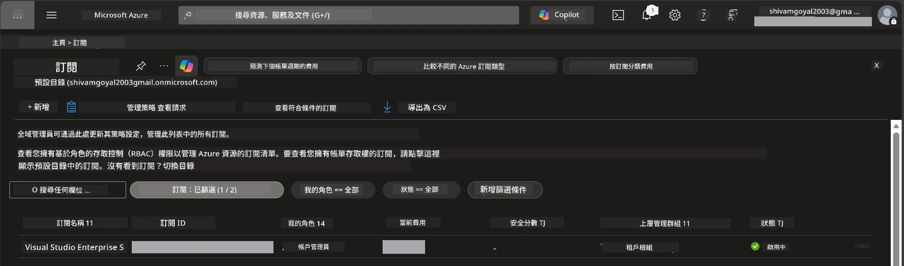

# Module 0 - 前置條件

開始工作坊之前，請確認你已準備好以下工具、存取權限及環境。請依序完成以下每個步驟，不要跳過。

---

## 1. Azure 帳戶與訂閱

### 1.1 建立或驗證你的 Azure 訂閱

1. 打開瀏覽器並前往 [https://azure.microsoft.com/free/](https://azure.microsoft.com/free/)。
2. 如果你還沒有 Azure 帳戶，點擊 **Start free** 並依照註冊流程完成。你需要一個 Microsoft 帳戶（或建立一個）以及信用卡作身份驗證。
3. 如果你已有帳戶，請至 [https://portal.azure.com](https://portal.azure.com) 登入。
4. 在入口網站左側導覽欄點擊 **Subscriptions** 分頁（或在頂部搜尋欄輸入「Subscriptions」搜尋）。
5. 確認你至少看到一個 **Active** 的訂閱。記下 **Subscription ID**，後續會用到。



### 1.2 了解所需的 RBAC 角色

[Hosted Agent](https://learn.microsoft.com/azure/foundry/agents/concepts/hosted-agents) 部署需要的 <strong>資料動作</strong> 權限，標準 Azure `Owner` 及 `Contributor` 角色 <strong>不包含</strong>。你需要以下其中一組 [角色組合](https://learn.microsoft.com/azure/foundry/concepts/rbac-foundry#built-in-roles):

| 情境 | 所需角色 | 分配位置 |
|----------|---------------|----------------------|
| 建立新的 Foundry 專案 | Foundry 資源上的 **Azure AI Owner** | Azure 入口網站中的 Foundry 資源 |
| 部署至現有專案（新增資源） | 訂閱上的 **Azure AI Owner** + **Contributor** | 訂閱 + Foundry 資源 |
| 部署至完整設定的專案 | 帳戶上的 **Reader** + 專案上的 **Azure AI User** | Azure 入口網站中的帳戶 + 專案 |

> **重點：** Azure `Owner` 與 `Contributor` 角色只涵蓋 <em>管理</em> 權限（ARM 操作）。你需要 [**Azure AI User**](https://learn.microsoft.com/azure/foundry/concepts/rbac-foundry#built-in-roles) （或更高）權限，才能執行像是 `agents/write` 這類 <em>資料動作</em>，用來建立和部署 agents。這些角色會在[Module 2](02-create-foundry-project.md)中分配。

---

## 2. 安裝本地工具

請安裝以下每個工具。安裝完成後，請用檢查指令確認其可正常運作。

### 2.1 Visual Studio Code

1. 造訪 [https://code.visualstudio.com/](https://code.visualstudio.com/)。
2. 下載適用於你的作業系統（Windows/macOS/Linux）的安裝程式。
3. 以預設設定執行安裝程式。
4. 開啟 VS Code，確認可成功啟動。

### 2.2 Python 3.10+

1. 造訪 [https://www.python.org/downloads/](https://www.python.org/downloads/)。
2. 下載 Python 3.10 或更新版本（建議使用 3.12+）。
3. **Windows:** 安裝時，第一個畫面勾選 **"Add Python to PATH"**。
4. 開啟終端機並驗證：

   ```powershell
   python --version
   ```

   預期輸出： `Python 3.10.x` 或更高版本。

### 2.3 Azure CLI

1. 造訪 [https://learn.microsoft.com/cli/azure/install-azure-cli](https://learn.microsoft.com/cli/azure/install-azure-cli)。
2. 根據你的作業系統跟隨安裝說明。
3. 驗證：

   ```powershell
   az --version
   ```

   預期： `azure-cli 2.80.0` 或更高版本。

4. 登入：

   ```powershell
   az login
   ```

### 2.4 Azure Developer CLI (azd)

1. 造訪 [https://learn.microsoft.com/azure/developer/azure-developer-cli/install-azd](https://learn.microsoft.com/azure/developer/azure-developer-cli/install-azd)。
2. 根據你的作業系統跟隨安裝說明。Windows 平台：

   ```powershell
   winget install microsoft.azd
   ```

3. 驗證：

   ```powershell
   azd version
   ```

   預期： `azd version 1.x.x` 或更高版本。

4. 登入：

   ```powershell
   azd auth login
   ```

### 2.5 Docker Desktop（選用）

如果你想在部署前於本地建置及測試容器映像，才需要 Docker。Foundry 擴充模組會在部署期間自動處理容器建置。

1. 造訪 [https://docs.docker.com/get-docker/](https://docs.docker.com/get-docker/)。
2. 下載並安裝適用於你的作業系統的 Docker Desktop。
3. **Windows:** 安裝時確定選擇 WSL 2 後端。
4. 開啟 Docker Desktop，等候系統托盤的圖示顯示 **"Docker Desktop is running"**。
5. 開啟終端機並驗證：

   ```powershell
   docker info
   ```

   此指令將列印 Docker 系統資訊且不應顯示錯誤。如果看到 `Cannot connect to the Docker daemon`，請再等幾秒，讓 Docker 完全啟動。

---

## 3. 安裝 VS Code 擴充套件

你需要安裝三個擴充套件。請在工作坊開始前安裝完成。

### 3.1 Microsoft Foundry for VS Code

1. 開啟 VS Code。
2. 按 `Ctrl+Shift+X` 開啟擴充套件面板。
3. 在搜尋框中輸入 **"Microsoft Foundry"**。
4. 找到 **Microsoft Foundry for Visual Studio Code**（發行者：Microsoft，ID：`TeamsDevApp.vscode-ai-foundry`）。
5. 點擊 **Install** 安裝。
6. 安裝完成後，你應該會在活動列（左側邊欄）看到 **Microsoft Foundry** 圖示。

### 3.2 Foundry Toolkit

1. 在擴充套件面板內（按 `Ctrl+Shift+X`），搜尋 **"Foundry Toolkit"**。
2. 找到 **Foundry Toolkit**（發行者：Microsoft，ID：`ms-windows-ai-studio.windows-ai-studio`）。
3. 點擊 **Install** 安裝。
4. 你會在活動列看到 **Foundry Toolkit** 圖示。

### 3.3 Python

1. 在擴充套件面板搜尋 **"Python"**。
2. 找到 **Python**（發行者：Microsoft，ID：`ms-python.python`）。
3. 點擊 **Install** 安裝。

---

## 4. 從 VS Code 登入 Azure

[Microsoft Agent Framework](https://learn.microsoft.com/agent-framework/overview/) 使用 [`DefaultAzureCredential`](https://learn.microsoft.com/azure/developer/python/sdk/authentication/credential-chains#defaultazurecredential-overview) 來進行認證。你需要在 VS Code 中登入 Azure。

### 4.1 使用 VS Code 登入

1. 查看 VS Code 左下角，點擊 <strong>帳戶</strong> 圖示（人物輪廓）。
2. 點選 **Sign in to use Microsoft Foundry**（或 **Sign in with Azure**）。
3. 會開啟瀏覽器視窗 - 使用擁有訂閱權限的 Azure 帳戶登入。
4. 回到 VS Code，左下角應顯示你的帳戶名稱。

### 4.2 (選用) 使用 Azure CLI 登入

如果你安裝了 Azure CLI 並偏好使用 CLI 認證：

```powershell
az login
```

這會開啟瀏覽器進行登入。登入後，設定正確的訂閱：

```powershell
az account set --subscription "<your-subscription-id>"
```

驗證：

```powershell
az account show --query "{name:name, id:id, state:state}" --output table
```

你應該會看到訂閱名稱、ID，以及狀態為 `Enabled`。

### 4.3 (替代) 服務主體認證

針對 CI/CD 或共用環境，請設定下列環境變數：

```powershell
$env:AZURE_TENANT_ID = "<your-tenant-id>"
$env:AZURE_CLIENT_ID = "<your-client-id>"
$env:AZURE_CLIENT_SECRET = "<your-client-secret>"
```

---

## 5. 預覽版限制

繼續之前，請注意目前限制：

- [**Hosted Agents**](https://learn.microsoft.com/azure/foundry/agents/concepts/hosted-agents) 目前為 <strong>公開預覽</strong>，不建議用於生產工作負載。
- <strong>支援的區域有限</strong> - 建立資源前先檢查 [區域可用性](https://learn.microsoft.com/azure/foundry/agents/concepts/hosted-agents#region-availability)。選擇不支援區域會導致部署失敗。
- `azure-ai-agentserver-agentframework` 套件為預發佈版本（`1.0.0b16`），API 可能會變動。
- 規模限制：Hosted agents 支援 0-5 個副本（包含 scale-to-zero）。

---

## 6. 預備檢查清單

逐一檢查下面項目。若任何步驟失敗，請回頭修正後再繼續。

- [ ] VS Code 可正常開啟無錯誤
- [ ] Python 3.10+ 已加入你的 PATH (`python --version` 顯示 `3.10.x` 或以上)
- [ ] Azure CLI 已安裝 (`az --version` 顯示 `2.80.0` 或以上)
- [ ] Azure Developer CLI 已安裝 (`azd version` 顯示版本資訊)
- [ ] Microsoft Foundry 擴充套件已安裝（活動列有圖示）
- [ ] Foundry Toolkit 擴充套件已安裝（活動列有圖示）
- [ ] Python 擴充套件已安裝
- [ ] 你已在 VS Code 中登入 Azure（左下帳戶圖示確認）
- [ ] `az account show` 回傳你的訂閱
- [ ] (選用) Docker Desktop 正在執行（`docker info` 回傳系統資訊且無錯誤）

### 檢查點

打開 VS Code 的活動列，確認你可以看到 **Foundry Toolkit** 及 **Microsoft Foundry** 側邊欄視圖。點擊每個圖示確認它們能正常載入且無錯誤。

---

**接下來：** [01 - Install Foundry Toolkit & Foundry Extension →](01-install-foundry-toolkit.md)

---

<!-- CO-OP TRANSLATOR DISCLAIMER START -->
**免責聲明**：
本文件使用 AI 翻譯服務 [Co-op Translator](https://github.com/Azure/co-op-translator) 進行翻譯。雖然我們力求準確，但請注意，自動翻譯可能包含錯誤或不準確之處。原始文件的母語版本應被視為權威來源。對於重要資訊，建議使用專業人工翻譯。對於因使用本翻譯而產生的任何誤解或誤譯，我們不承擔任何責任。
<!-- CO-OP TRANSLATOR DISCLAIMER END -->