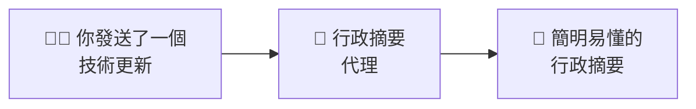

# 模組 0 - 簡介

⏱️ 約10 分鐘

> [!WARNING]
> **預覽與限制：** [Hosted Agents](https://learn.microsoft.com/azure/foundry/agents/concepts/hosted-agents) 目前正處於 <strong>公開預覽</strong> 階段，不建議用於生產工作負載。請注意以下事項：
> - <strong>支援的區域有限</strong> — 建立資源前請先檢查 [區域可用性](https://learn.microsoft.com/azure/foundry/agents/concepts/hosted-agents#region-availability)。若選擇不支援的區域，部署將失敗。
> - `azure-ai-agentserver-agentframework` 套件處於預發布版本 — API 可能在不同版本間變動。
> - 規模限制：hosted agents 支援 0–5 副本（包含縮放至零）。
> - 本工作坊中展示的部分功能可能會隨服務接近 GA 時改變。

## 你將打造什麼

在本工作坊中，你將建立一個 **「像給高管解釋」** 的智能代理 — 一個 hosted AI 代理，能將複雜技術更新改寫成簡潔明瞭的高管摘要。

```mermaid
flowchart LR
    A["🧑‍💻 你發送了一個\n技術更新"] --> B["🤖 行政摘要\n代理"]
    B --> C["📝 簡明易懂的\n行政摘要"]
```

**該代理使用了：**
- **Microsoft Agent Framework** — 負責代理邏輯與結構
- **Foundry Toolkit for VS Code** — 用於搭建腳手架、本地測試與部署
- **一個 AI 模型**（例如 `gpt-4.1-mini/gpt-5-mini`）— 用以生成摘要

完成本實驗後，你將擁有一個可運作的代理，能透過 Agent Inspector 在本地測試，且可選擇部署到雲端。

---

## 什麼是 hosted agents？

**hosted agent** 是一個在 Microsoft Foundry 作為託管服務運行的 AI 代理。不需自行管理基礎設施，只需將代理程式碼封裝在容器中，Foundry 即會負責縮放、託管並透過標準 HTTP 端點對外提供。

| 概念 | 意義 |
|---------|--------------|
| <strong>代理</strong> | 你的 Python 程式碼，接收用戶訊息，呼叫 AI 模型，並回傳結構化回應 |
| <strong>託管</strong> | Foundry 代為運行你的容器 — 無需虛擬機、無 Kubernetes、無需管理基礎設施 |
| <strong>回應協議</strong> | 標準 HTTP API (`POST /responses`)，任何用戶端皆可呼叫與代理互動 |
| **Agent Inspector** | 一個本地測試 UI（整合於 Foundry Toolkit 中），讓你在部署前跟代理對話 |

在本工作坊中，你將從無到有建置完整 hosted agent，或選擇只做本地測試。

---

## 選擇你的路徑

> ⚠️ **繼續前請先選擇一條路徑。** 你的選擇會決定要安裝的工具及所涵蓋的模組。若之後取得訂閱，可從路徑 B 轉向路徑 A。

<strong>🅰️ 路徑 A - Azure 雲端（需 Azure 訂閱）</strong>

| | 詳細資訊 |
|---|---|
| **適用對象？** | 你有有效的 Azure 訂閱且能建立 Foundry 資源 |
| <strong>模型</strong> | 透過 Foundry 使用 Azure OpenAI（例如 `gpt-4.1-mini/gpt-5-mini`） |
| <strong>涵蓋模組</strong> | 全部模組（00–07） |
| **雲端部署？** | ✅ 是 — 完整端對端部署 |

<strong>🅱️ 路徑 B - 本地 / 免費方案（無需 Azure 訂閱）</strong>

| | 詳細資訊 |
|---|---|
| **適用對象？** | MVP、學生或任何無法使用 Azure 的人 |
| <strong>模型</strong> | **Foundry Local**（免費，執行於本機） |
| <strong>涵蓋模組</strong> | 00–04 模組（跳過部署與雲端驗證） |
| **雲端部署？** | ❌ 否 — 僅透過 Agent Inspector 進行本地測試 |

---

## 所有路徑：必備工具

請安裝以下每一項工具。安裝後，透過執行檢查指令來確認其運作正常。

| # | 工具 | 版本 | 安裝 | 驗證（預期輸出） |
|---|------|---------|---------|---------------------------|
| 1 | **Visual Studio Code** | 最新版 | [code.visualstudio.com](https://code.visualstudio.com/) | 可正常開啟無錯誤 |
| 2 | **Python** | 3.12 或以上| [python.org/downloads](https://www.python.org/downloads/) | `python --version` $\rightarrow$ `Python 3.12.x` |
| 3 | **Foundry Toolkit for VS Code** | 最新版 | Extension ID: `ms-windows-ai-studio.windows-ai-studio` | Activity Bar 中顯示 Foundry 圖示 |
| 4 | **VS Code Python 擴充套件** | 最新版 | Extension ID: `ms-python.python` | 擴充套件面板中已安裝 |

> [!TIP]
> **安裝小技巧：**
> - **Python PATH（Windows）：** 安裝 Python 時務必於第一個畫面勾選 **「Add Python to PATH」**。若未勾選，終端機無法識別 `python` 指令。
> - **多版本 Python：** 若同時安裝 Python 3.10 與 3.12，請用 `python3.12 -m venv .venv` 來確保虛擬環境使用正確版本。
> - **Docker WSL 2（Windows）：** 安裝 Docker Desktop 時請選擇 **WSL 2 後端**。使用 Hyper-V 的 Docker 運行較慢且可能導致 Foundry 容器建置問題。
> - **Docker 無法啟動？** 啟動 Docker Desktop 後請稍等 30–60 秒。執行 `docker info`，若顯示「Cannot connect to the Docker daemon」表示 Docker 正在初始化中。
> - **VS Code 擴充無法載入？** 安裝完擴充套件後，請重新載入視窗：`Ctrl+Shift+P` → `Developer: Reload Window`。

> **Windows 使用者：** Python 安裝時請勾選 **「Add Python to PATH」**。

**下一步：** [01 - 設定 →](01-setup.md)

---

<!-- CO-OP TRANSLATOR DISCLAIMER START -->
**免責聲明**：
本文件由 AI 翻譯服務 [Co-op Translator](https://github.com/Azure/co-op-translator) 翻譯而成。雖然我們致力於確保準確性，但請注意，機器自動翻譯可能包含錯誤或不準確之處。原始文件的母語版本應被視為權威來源。對於重要資訊，建議進行專業人工翻譯。我們不對因使用本翻譯而產生的任何誤解或誤釋承擔責任。
<!-- CO-OP TRANSLATOR DISCLAIMER END -->