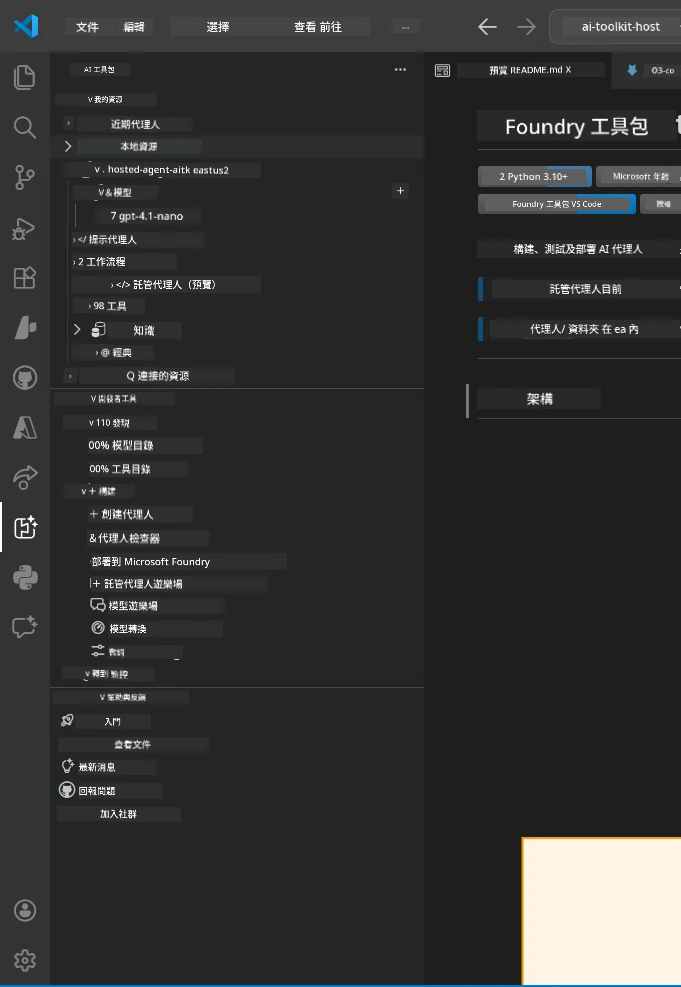
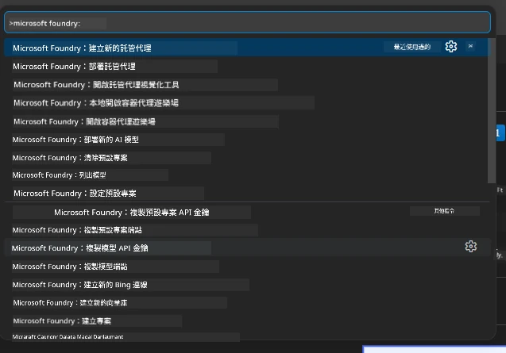

# Module 1 - 安裝 Foundry Toolkit 及 Foundry 擴充功能

本模組將引導您安裝並驗證本工作坊中兩個關鍵的 VS Code 擴充功能。如果您已在[模組 0](00-prerequisites.md)中安裝，請使用本模組確認它們是否運作正常。

---

## 第 1 步：安裝 Microsoft Foundry 擴充功能

**Microsoft Foundry for VS Code** 擴充功能是您建立 Foundry 專案、部署模型、快速生成托管代理程式碼以及直接從 VS Code 部署的主要工具。

1. 開啟 VS Code。
2. 按下 `Ctrl+Shift+X` 開啟 <strong>擴充功能</strong> 面板。
3. 在頂部搜尋框輸入：**Microsoft Foundry**
4. 找到標題為 **Microsoft Foundry for Visual Studio Code** 的結果。
   - 發行者：**Microsoft**
   - 擴充功能 ID：`TeamsDevApp.vscode-ai-foundry`
5. 按 **Install** 按鈕。
6. 等待安裝完成（您將看到一個小的進度指示器）。
7. 安裝完成後，查看 <strong>活動列</strong>（VS Code 左側垂直圖示列）。您應該會看到一個新的 **Microsoft Foundry** 圖標（看起來像鑽石/AI 圖示）。
8. 點擊 **Microsoft Foundry** 圖標打開其側邊欄視圖。您應該會看到以下區塊：
   - <strong>資源</strong>（或專案）
   - <strong>代理人</strong>
   - <strong>模型</strong>

> <strong>如果圖標沒有出現：</strong>嘗試重新載入 VS Code（`Ctrl+Shift+P` → 輸入 `Developer: Reload Window`）。

---

## 第 2 步：安裝 Foundry Toolkit 擴充功能

**Foundry Toolkit** 擴充功能提供了 [**Agent Inspector**](https://learn.microsoft.com/azure/foundry/agents/how-to/vs-code-agents-workflow-pro-code) —— 一個用來在本機測試與除錯代理人的視覺化介面 —— 還有 playground、模型管理及評估工具。

1. 在擴充功能面板（`Ctrl+Shift+X`）中清除搜尋框，輸入：**Foundry Toolkit**
2. 找到結果中的 **Foundry Toolkit**。
   - 發行者：**Microsoft**
   - 擴充功能 ID：`ms-windows-ai-studio.windows-ai-studio`
3. 點擊 **Install**。
4. 安裝完成後，**Foundry Toolkit** 圖標會顯示在活動列（看起來像機器人/閃耀圖示）。
5. 點擊 **Foundry Toolkit** 圖標打開其側邊欄視圖。您應看到 Foundry Toolkit 歡迎畫面，並有下列選項：
   - <strong>模型</strong>
   - **Playground**
   - <strong>代理人</strong>

---

## 第 3 步：驗證兩個擴充功能是否運作正常

### 3.1 驗證 Microsoft Foundry 擴充功能

1. 點擊活動列的 **Microsoft Foundry** 圖標。
2. 若您已登入 Azure（模組 0），應該能在 <strong>資源</strong> 看到您的專案列表。
3. 若系統提示登入，請點 **Sign in** 並完成認證流程。
4. 確認側邊欄能正常顯示且無錯誤。

### 3.2 驗證 Foundry Toolkit 擴充功能

1. 點擊活動列的 **Foundry Toolkit** 圖標。
2. 確認歡迎畫面或主面板順利載入且沒有錯誤。
3. 您暫時不需設定任何東西——在[模組 5](05-test-locally.md)將使用 Agent Inspector。

### 3.3 使用命令面板驗證

1. 按 `Ctrl+Shift+P` 開啟命令面板。
2. 輸入 **"Microsoft Foundry"**，您應看到類似以下的指令：
   - `Microsoft Foundry: Create a New Hosted Agent`
   - `Microsoft Foundry: Deploy Hosted Agent`
   - `Microsoft Foundry: Open Model Catalog`
3. 按 `Escape` 關閉命令面板。
4. 再次開啟命令面板並輸入 **"Foundry Toolkit"**，您應看到類似以下的指令：
   - `Foundry Toolkit: Open Agent Inspector`

> 如果看不到這些命令，表示擴充功能可能安裝不正確，請嘗試移除後重新安裝。

---

## 這些擴充功能在本工作坊的用途

| 擴充功能 | 功能描述 | 使用時機 |
|-----------|-------------|-------------------|
| **Microsoft Foundry for VS Code** | 建立 Foundry 專案、部署模型、**快速生成[托管代理](https://learn.microsoft.com/azure/foundry/agents/concepts/hosted-agents)**（自動產生 `agent.yaml`、`main.py`、`Dockerfile`、`requirements.txt`）、部署至 [Foundry 代理服務](https://learn.microsoft.com/azure/foundry/agents/overview) | 模組 2、3、6、7 |
| **Foundry Toolkit** | 提供本機測試除錯的 Agent Inspector、playground 介面、模型管理 | 模組 5、7 |

> **Foundry 擴充功能是本工作坊最重要的工具。** 它涵蓋整個生命週期：生成 → 設定 → 部署 → 驗證。Foundry Toolkit 則用於本機測試時的視覺化 Agent Inspector，做為輔助。

---

### 檢查點

- [ ] 活動列能看到 Microsoft Foundry 圖標
- [ ] 點擊後側邊欄能正常顯示且無錯誤
- [ ] 活動列能看到 Foundry Toolkit 圖標
- [ ] 點擊後側邊欄能正常顯示且無錯誤
- [ ] `Ctrl+Shift+P` → 輸入 "Microsoft Foundry" 可看到可用指令
- [ ] `Ctrl+Shift+P` → 輸入 "Foundry Toolkit" 可看到可用指令

---

**上一步：** [00 - 事前準備](00-prerequisites.md) · **下一步：** [02 - 建立 Foundry 專案 →](02-create-foundry-project.md)

---

<!-- CO-OP TRANSLATOR DISCLAIMER START -->
**免責聲明**：  
本文件已使用 AI 翻譯服務 [Co-op Translator](https://github.com/Azure/co-op-translator) 進行翻譯。儘管我們力求準確，但請注意自動翻譯可能包含錯誤或不準確之處。原始語言版本的文件應被視為權威來源。對於重要資訊，建議採用專業人工翻譯。我們不對因使用本翻譯而產生的任何誤解或誤譯承擔責任。
<!-- CO-OP TRANSLATOR DISCLAIMER END -->