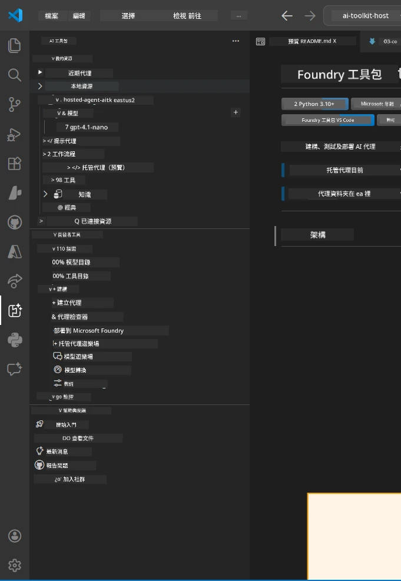
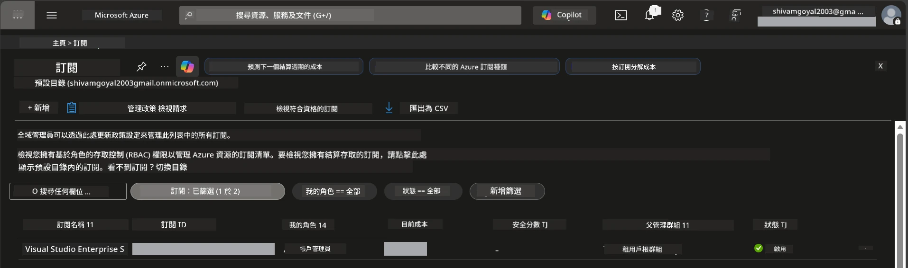
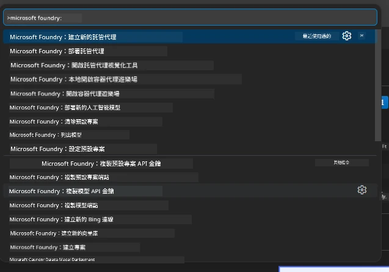
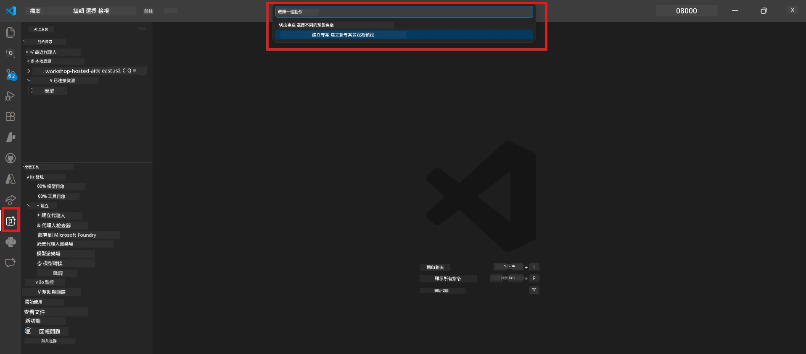
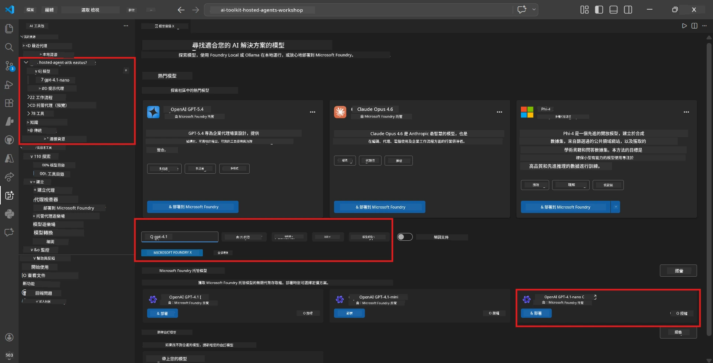
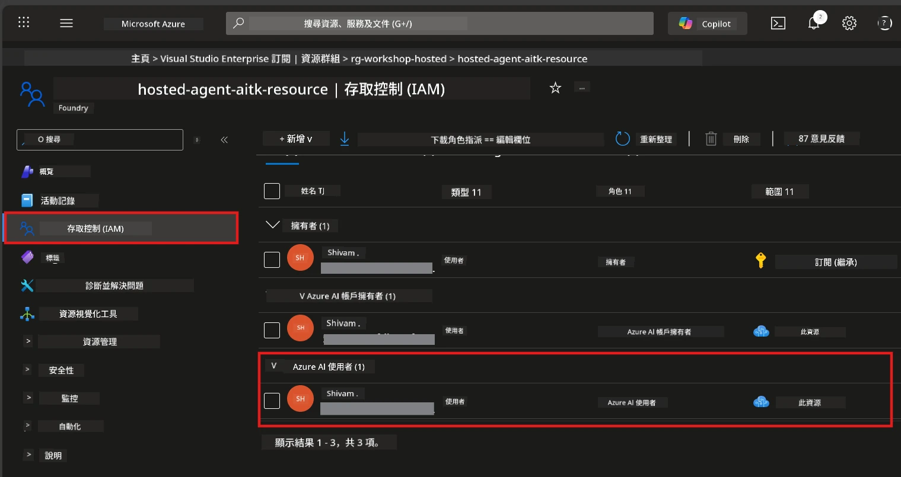

# 設定：擴充套件、專案與模型

⏱️ 約 15 分鐘

在本模組中，您會安裝並驗證 Foundry Toolkit 擴充套件，建立（或連接）Foundry 專案，並部署代理程式會使用的模型。

## 步驟 1：安裝 Foundry Toolkit

**Foundry Toolkit for VS Code** 是本工作坊的主要擴充套件。它提供專案建立、模型部署、代理程式腳手架、本地測試（Agent Inspector）和雲端部署—所有功能均在 VS Code 內完成。

1. 開啟 VS Code，然後按 `Ctrl+Shift+X` 開啟 <strong>擴充套件</strong> 面板。
2. 搜尋 **Foundry Toolkit**。
3. 安裝 **Foundry Toolkit for VS Code**（發行者：Microsoft，ID：`ms-windows-ai-studio.windows-ai-studio`）。
4. 安裝後，**Foundry Toolkit** 圖示會出現在活動列（左側邊欄）。

> *注意：舊版擴充套件中活動列可能會顯示 "AI TOOLKIT"。功能相同。*



## 步驟 2：根據您的存取權設定

> **選擇您的路徑：** 展開下面與您的設定相符的章節。您只需完成 <strong>一個</strong> 路徑。

<details>
<summary><strong>🅰️ 路徑 A - Azure 雲端（需 Azure 訂閱）</strong></summary>

### Azure CLI

1. 從 [learn.microsoft.com/cli/azure/install-azure-cli](https://learn.microsoft.com/cli/azure/install-azure-cli) 安裝。
2. 驗證：`az --version`（預期 2.80.0 以上）。
3. 登入：`az login`

### 驗證選項

[Microsoft Agent Framework](https://learn.microsoft.com/agent-framework/overview/) 使用 [`DefaultAzureCredential`](https://learn.microsoft.com/azure/developer/python/sdk/authentication/credential-chains#defaultazurecredential-overview)，會依序嘗試多種驗證方法。請選擇符合您環境的方法：

#### 選項 1：VS Code 帳戶（推薦用於工作坊）
1. 點選 VS Code 右下角的 <strong>帳戶</strong> 圖示（人形輪廓）。
2. 選擇 **使用 Microsoft Foundry 登入**（或 **使用 Azure 登入**）。
3. 會開啟瀏覽器—請使用有訂閱存取權的 Azure 帳戶登入。
4. 回到 VS Code，您應會在左下角看到您的帳戶名稱。

#### 選項 2：Azure CLI
```bash
az login
az account set --subscription "<your-subscription-id>"
```

#### 選項 3：服務主體（企業/CI）
對於受限環境或 CI/CD 流程，請在 `.env` 檔中設定以下環境變數：
```env
AZURE_TENANT_ID=<your-tenant-id>
AZURE_CLIENT_ID=<your-client-id>
AZURE_CLIENT_SECRET=<your-client-secret>
```

> **`DefaultAzureCredential` 的運作方式：** 它會先嘗試環境變數，接著是管理身份，再來是 VS Code 登入，最後是 Azure CLI，採用成功的第一種方法。詳見 [credential chain 文件](https://learn.microsoft.com/azure/developer/python/sdk/authentication/credential-chains#defaultazurecredential-overview)。

### Azure Developer CLI (azd)

1. 安裝：`winget install microsoft.azd`（Windows）或參考 [安裝文件](https://learn.microsoft.com/azure/developer/azure-developer-cli/install-azd)。
2. 驗證：`azd version`
3. 登入：`azd auth login`

### Docker Desktop（選用）

Docker 僅在您要本地建立容器時需要，Foundry 擴充套件在部署過程中會自動處理建立。

1. 從 [docs.docker.com/get-docker](https://docs.docker.com/get-docker/) 安裝。
2. 驗證：`docker info`

### Azure 訂閱與角色基礎存取控制 (RBAC)

1. 登入 [portal.azure.com](https://portal.azure.com)。
2. 導覽至 <strong>訂閱</strong>，確認至少有一個訂閱為 <strong>啟用中</strong>。
3. 記下您的 **訂閱 ID**—在模組 01 中會用到。



#### RBAC 情境表

[Hosted Agent](https://learn.microsoft.com/azure/foundry/agents/concepts/hosted-agents) 的部署需要標準 Azure `Owner` 與 `Contributor` 角色不包含的 <strong>資料操作</strong> 權限。請參考下表判定您需的角色：

| 情境 | 所需角色 | 指派位置 |
|----------|---------------|----------------------|
| 建立新 Foundry 專案 | 在 Foundry 資源上的 **Azure AI Owner** | Azure 入口網站中 Foundry 資源 |
| 部署到現有專案（新資源） | 訂閱上的 **Azure AI Owner** + **Contributor** | 訂閱 + Foundry 資源 |
| 部署到完全集成的專案 | 帳戶上的 **Reader** + 專案上的 **Azure AI User** | Azure 入口網站中的帳戶 + 專案 |
| 只本地測試（不部署） | 專案上的 **Azure AI User** | Azure 入口網站中的專案 |

> **重點：** Azure 的 `Owner` 與 `Contributor` 僅涵蓋 <em>管理</em> 權限 (ARM 操作)。您需要 [**Azure AI User**](https://learn.microsoft.com/azure/foundry/concepts/rbac-foundry#built-in-roles)（或更高）來操作創建和部署代理程式所需的 <em>資料操作</em>（例如 `agents/write`）。

## 連接或建立 Foundry 專案



1. 按 `Ctrl+Shift+P` → 輸入 **Foundry Toolkit: Create Project** → 選擇此命令。
2. 從下拉選單選擇您的 **Azure 訂閱**。
3. 選擇或建立一個 <strong>資源群組</strong>（例如：`rg-hosted-agents-workshop`）。
4. 選擇支援 Hosted Agents 的 <strong>區域</strong>：`East US`、`West US 2` 或 `Sweden Central`。詳見 [區域可用性](https://learn.microsoft.com/azure/foundry/agents/concepts/hosted-agents#region-availability)。
5. 輸入專案名稱（例如：`workshop-agents`）。
6. 等候 2–5 分鐘完成佈建。VS Code 會顯示進度通知。
7. 完成後，您的專案會出現在 **Foundry Toolkit** 側邊欄的 **MY RESOURCES** 項下。



## 部署模型並指派 RBAC

您的 Hosted Agent 需要 AI 模型來生成回應內容。

#### 模型選擇矩陣
根據需求，您可選擇不同階層的模型：

| 模型 | 適合用途 | 成本 | 備註 |
|-------|----------|------|-------|
| `gpt-4.1` | 高品質、細膩回應 | 較高 | 最佳效果，推薦用於最終測試 |
| `gpt-4.1-mini/gpt-5-mini` | 快速迭代、成本較低 | 較低 | 適合工作坊開發和快速測試 |
| `gpt-4.1-nano` | 輕量級任務 | 最低 | 成本最低，但回應較簡易 |

1. 按 `Ctrl+Shift+P` → **Foundry Toolkit: Open Model Catalog**（或在側邊欄 DEVELOPER TOOLS 下點選 **Model Catalog** → Discover）。
2. 在型錄中搜尋 **gpt-4.1**。
3. 找到 **OpenAI GPT-4.1-mini**（或品質更好的 `gpt-5-mini`）並點選 **Deploy**。



4. 在部署設定裡：
   - **部署名稱：** 保留預設或輸入自訂名稱。**請記住這個名稱。**
   - **目標：** 選擇 **Deploy to Foundry Toolkit** → 選擇您的專案。
5. 點選 **Deploy**，等待 1–3 分鐘。

> **建議：** 工作坊使用 `gpt-4.1-mini/gpt-5-mini` 最適合—速度快、成本合理且產生良好結果。

### 記錄您的值

部署完成後，請記下以下兩項數值（模組 03 時會用到）：

| 項目 | 找到位置 |
|-------|-----------------|
| <strong>專案端點</strong> | 在側邊欄按您的專案→詳細資訊頁面上會顯示 URL（例如 `https://<account>.services.ai.azure.com/api/projects/<project>`） |
| <strong>模型部署名稱</strong> | 展開專案 → **Models** → 您部署的模型旁的名稱（例如 `gpt-4.1-mini/gpt-5-mini`） |

### 指派 RBAC 角色

> ⚠️ **這是最常被遺漏的步驟。** 若無正確角色，模組 05 中部署將會失敗。

#### 我需要哪個角色？
根據您的情境，您需要以下角色組合：

| 情境 | 所需角色 | 指派位置 |
|----------|---------------|----------------------|
| 建立新 Foundry 專案 | 在 Foundry 資源上的 **Azure AI Owner** | Azure 入口網站中 Foundry 資源 |
| 部署到現有專案（新資源） | 訂閱上的 **Azure AI Owner** + **Contributor** | 訂閱 + Foundry 資源 |
| 部署到完全集成的專案 | 帳戶上的 **Reader** + 專案上的 **Azure AI User** | Azure 入口網站中的帳戶 + 專案 |

**重點：** Azure 的 `Owner` 和 `Contributor` 僅涵蓋 <em>管理</em> 權限。您需要 **Azure AI User**（或更高）來操作建立和部署代理程式所需的 <em>資料操作</em>（例如 `agents/write`）。

1. 開啟 [portal.azure.com](https://portal.azure.com)。
2. 搜尋您的 **Foundry 專案** 名稱 → 點選類型為 **"Foundry Toolkit project"** 的結果（非父帳戶）。
3. 左側選單點擊 **存取控制 (IAM)**。
4. 點擊 **+ 新增** → <strong>新增角色指派</strong>。
5. **角色索引標籤：** 搜尋 **Azure AI User**，選擇後點擊 <strong>下一步</strong>。
6. **成員索引標籤：** 選擇 **使用者、群組或服務主體** → 點擊 **+ 選擇成員** → 找到並選擇您自己 → 點擊 <strong>選擇</strong>。
7. 點擊 **審查 + 指派** → 再按一次 **審查 + 指派**。
8. **等待 1–2 分鐘** 讓權限生效。

> **為什麼需要此角色？** Azure 的 `Owner`/`Contributor` 僅授予管理權限。**Azure AI User** 角色授予建立和部署代理程式所需的 `agents/write` 資料操作。如需詳情請參見 [Foundry RBAC 文件](https://learn.microsoft.com/azure/foundry/concepts/rbac-foundry#built-in-roles)。



</details>

<details>
<summary><strong>🅱️ 路徑 B - 本地 / 免費層（不需 Azure 訂閱）</strong></summary>

### Foundry Local

Foundry Local 讓您在自己的機器上執行 AI 模型—不需要雲端帳戶。您可以透過 Foundry Toolkit 的模型目錄存取 Foundry Local 模型，如下：

1. 進入 Foundry Toolkit 擴充套件。
2. 在 Foundry Toolkit 導覽列中，前往 **Developer Tools** > 選擇 **Model Catalog**。
3. 在新視窗中，從導覽列選擇 **local**。
4. 向下捲動至 **Phi 4 Mini**，點擊 <strong>新增按鈕</strong>，會跳出一個提示表示模型正在下載中。
5. 模型下載完成後，即可進入下一步。

</details>

### ✅ 檢查點


- [ ] `Ctrl+Shift+P` → “Foundry Toolkit” 顯示可用指令
- [ ] 已安裝 Foundry Toolkit 擴充套件且側邊欄正常載入
- [ ] VS Code 能正常開啟並執行
- [ ] `python --version` 顯示 3.10 以上
- [ ] VS Code 活動列中可見 Foundry Toolkit 圖示
- [ ] **路徑 A：** `az login` 成功，訂閱為啟用中
- [ ] **路徑 B：** Foundry Local 正在執行中 (`foundry local status`)
- [ ] **路徑 A：** Foundry 專案出現在側邊欄，模型已部署，Azure AI User 角色已指派
- [ ] **路徑 B：** Foundry Local 執行且載入模型
- [ ] 您已記下 <strong>端點</strong> 和 <strong>模型部署名稱</strong>


**上一步：** [00 - 先決條件](00-prerequisites.md) · **下一步：** [02 - 建立 Hosted Agent →](02-create-hosted-agent.md)

---

<!-- CO-OP TRANSLATOR DISCLAIMER START -->
**免責聲明**：
本文件由 AI 翻譯服務 [Co-op Translator](https://github.com/Azure/co-op-translator) 翻譯而成。雖然我們致力於確保準確性，但請注意，機器自動翻譯可能包含錯誤或不準確之處。原始文件的母語版本應被視為權威來源。對於重要資訊，建議進行專業人工翻譯。我們不對因使用本翻譯而產生的任何誤解或誤釋承擔責任。
<!-- CO-OP TRANSLATOR DISCLAIMER END -->