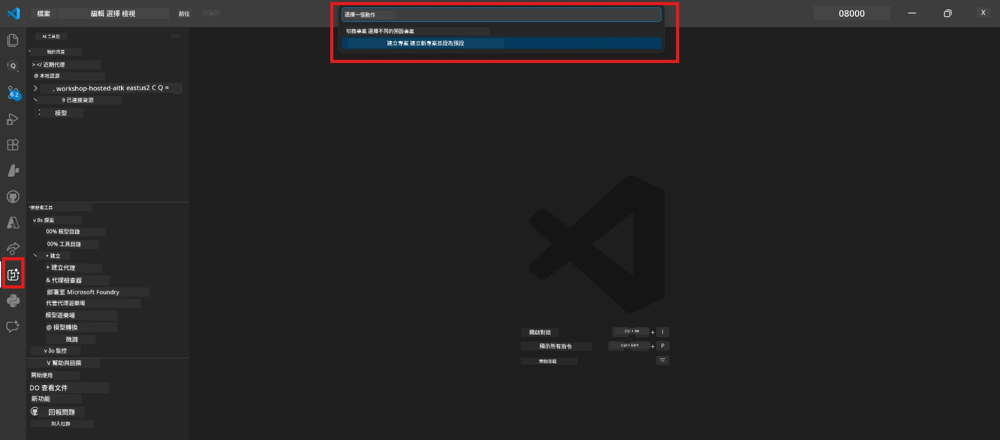
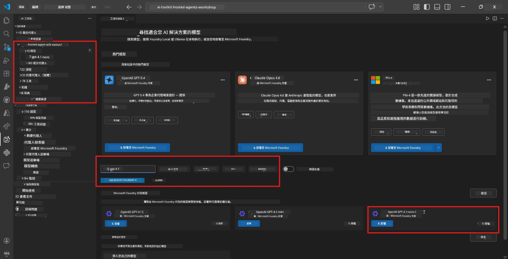
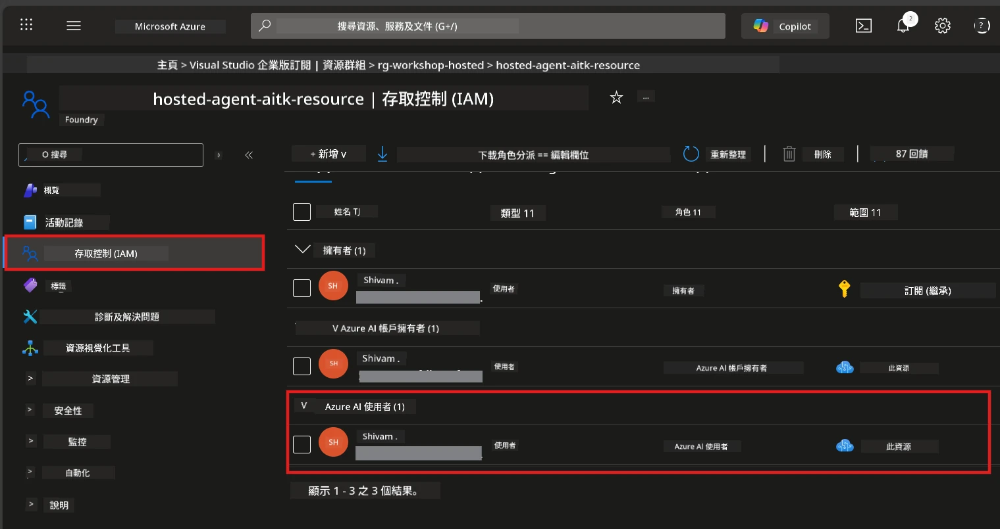

# Module 2 - 建立 Foundry 專案並部署模型

在本模組中，您將建立（或選擇）一個 Microsoft Foundry 專案並部署您的代理人將使用的模型。每個步驟都明確列出，請依序操作。

> 如果您已經有一個部署了模型的 Foundry 專案，請直接跳至 [Module 3](03-create-hosted-agent.md)。

---

## 步驟 1：從 VS Code 建立 Foundry 專案

您將使用 Microsoft Foundry 擴充功能在不離開 VS Code 的情況下建立專案。

1. 按下 `Ctrl+Shift+P` 打開 <strong>命令面板</strong>。
2. 輸入：**Microsoft Foundry: Create Project** 並選取它。
3. 會出現下拉選單 - 從列表中選擇您的 **Azure 訂閱**。
4. 系統會要求您選擇或建立一個 <strong>資源群組</strong>：
   - 建立新的：輸入名稱（例如 `rg-hosted-agents-workshop`）後按 Enter。
   - 使用現有的：從下拉選單中選擇。
5. 選擇一個 <strong>地區</strong>。**重要：** 請選擇支援主機代理的地區。檢查 [地區可用性](https://learn.microsoft.com/azure/foundry/agents/concepts/hosted-agents#region-availability) - 常用的是 `East US`、`West US 2` 或 `Sweden Central`。
6. 輸入 Foundry 專案的 <strong>名稱</strong>（例如 `workshop-agents`）。
7. 按 Enter 並等待配置完成。

> **配置需時 2-5 分鐘。** 您會在 VS Code 右下角看到進度通知。配置期間請勿關閉 VS Code。

8. 配置完成後，**Microsoft Foundry** 側邊欄會在 **Resources** 下顯示您的新專案。
9. 點擊專案名稱展開，確認它顯示如 **Models + endpoints** 與 **Agents** 等區段。



### 替代方法：透過 Foundry Portal 建立

如果您偏好使用瀏覽器：

1. 開啟 [https://ai.azure.com](https://ai.azure.com) 並登入。
2. 在首頁點選 **Create project**。
3. 輸入專案名稱，選擇訂閱、資源群組與地區。
4. 點選 **Create** 並等待配置完成。
5. 建立完成後，回到 VS Code - 專案應會出現在 Foundry 側邊欄，若未出現請重新整理（點擊重新整理圖示）。

---

## 步驟 2：部署模型

您的 [主機代理](https://learn.microsoft.com/azure/foundry/agents/concepts/hosted-agents) 需要一個 Azure OpenAI 模型來生成回應。您將現在開始[部署一個](https://learn.microsoft.com/azure/ai-foundry/openai/how-to/create-resource#deploy-a-model)。

1. 按下 `Ctrl+Shift+P` 打開 <strong>命令面板</strong>。
2. 輸入：**Microsoft Foundry: Open [Model Catalog](https://learn.microsoft.com/azure/ai-foundry/openai/concepts/models)** 並選取它。
3. VS Code 中會開啟模型目錄視窗。瀏覽或使用搜尋列尋找 **gpt-4.1**。
4. 點擊 **gpt-4.1** 模型卡（如果您想節省成本，可以選擇 `gpt-4.1-mini`）。
5. 點擊 **Deploy**。


6. 在部署配置中：
   - **Deployment name**：保持預設（例如 `gpt-4.1`）或自訂名稱。<strong>請記下此名稱</strong> - 模組 4 需要用到。
   - **Target**：選擇 **Deploy to Microsoft Foundry**，並選擇您剛建立的專案。
7. 點擊 **Deploy** 並等待部署完成（約 1-3 分鐘）。

### 選擇模型

| 模型 | 適合 | 成本 | 備註 |
|-------|----------|------|-------|
| `gpt-4.1` | 高品質、有深度的回應 | 較高 | 最佳效果，建議用於最終測試 |
| `gpt-4.1-mini` | 快速迭代，成本較低 | 較低 | 適合工作坊開發與快速測試 |
| `gpt-4.1-nano` | 輕量任務 | 最低 | 最節省成本，但回應較簡單 |

> **本工作坊建議：** 使用 `gpt-4.1-mini` 進行開發與測試。它快速、便宜，且練習效果良好。

### 驗證模型部署

1. 在 **Microsoft Foundry** 側邊欄展開您的專案。
2. 查看 **Models + endpoints**（或類似區段）。
3. 應該看到已部署的模型（例如 `gpt-4.1-mini`）且狀態為 **Succeeded** 或 **Active**。
4. 點擊模型部署查看詳細資料。
5. <strong>請記下</strong>下列兩個值 - 模組 4 需要：

   | 設定 | 查詢位置 | 範例值 |
   |---------|-----------------|---------------|
   | **Project endpoint** | 點擊 Foundry 側邊欄的專案名稱，在詳細資料頁面顯示的端點 URL。 | `https://<account>.services.ai.azure.com/api/projects/<project>` |
   | **Model deployment name** | 模型部署旁顯示的名稱。 | `gpt-4.1-mini` |

---

## 步驟 3：指派必要的 RBAC 角色

這是 <strong>最常被忽略的步驟</strong>。如果沒有正確的角色，模組 6 的部署將因權限錯誤而失敗。

### 3.1 指派 Azure AI User 角色給自己

1. 開啟瀏覽器並前往 [https://portal.azure.com](https://portal.azure.com)。
2. 在頂端搜尋列輸入您的 **Foundry 專案** 名稱，並在結果中點擊它。
   - **重要：** 請導向 <strong>專案</strong> 資源（類型為「Microsoft Foundry project」），而非父帳戶或中樞資源。
3. 在專案左側選單中點選 **Access control (IAM)**。
4. 點擊上方的 **+ Add** 按鈕 → 選擇 **Add role assignment**。
5. 在 **Role** 標籤頁搜尋並選取 [**Azure AI User**](https://learn.microsoft.com/azure/foundry/concepts/rbac-foundry#built-in-roles)，然後點擊 **Next**。
6. 在 **Members** 標籤頁：
   - 選擇 **User, group, or service principal**。
   - 點擊 **+ Select members**。
   - 搜尋您的名字或電子郵件，選擇自己後點擊 **Select**。
7. 點擊 **Review + assign** → 再次點擊 **Review + assign** 確認。



### 3.2（可選）指派 Azure AI Developer 角色

如果您需要在專案內建立其他資源或以程式方式管理部署：

1. 重複上述步驟，但第 5 步選擇 **Azure AI Developer**。
2. 請將此角色指派於 **Foundry 資源（帳戶）** 級別，而非僅限專案。

### 3.3 驗證您的角色指派

1. 在專案的 **Access control (IAM)** 頁面，點擊 **Role assignments** 標籤。
2. 搜尋您的名字。
3. 應至少看到專案範圍的 **Azure AI User** 角色。

> **此步驟的重要性：** [`Azure AI User`](https://learn.microsoft.com/azure/foundry/concepts/rbac-foundry#built-in-roles) 角色授予 `Microsoft.CognitiveServices/accounts/AIServices/agents/write` 資料操作權限。若沒有，部署時會看到以下錯誤：
>
> ```
> Error: lacks the required data action 
> Microsoft.CognitiveServices/accounts/AIServices/agents/write 
> to perform POST /api/projects/{projectName}/assistants operation.
> ```
>
> 詳情請參閱 [Module 8 - 疑難排解](08-troubleshooting.md)。

---

### 檢查點

- [ ] Foundry 專案已建立並顯示於 VS Code 的 Microsoft Foundry 側邊欄
- [ ] 至少有一個模型已部署（例如 `gpt-4.1-mini`）且狀態為 **Succeeded**
- [ ] 已記下 <strong>專案端點</strong> URL 和 <strong>模型部署名稱</strong>
- [ ] 於 <strong>專案</strong> 層級被指派了 **Azure AI User** 角色（可於 Azure Portal → IAM → Role assignments 確認）
- [ ] 專案所在地區為支援主機代理的 [支援區域](https://learn.microsoft.com/azure/foundry/agents/concepts/hosted-agents#region-availability)

---

**上一章：** [01 - 安裝 Foundry 工具組](01-install-foundry-toolkit.md) · **下一章：** [03 - 建立主機代理 →](03-create-hosted-agent.md)

---

<!-- CO-OP TRANSLATOR DISCLAIMER START -->
**免責聲明**：
本文檔是使用 AI 翻譯服務 [Co-op Translator](https://github.com/Azure/co-op-translator) 進行翻譯。雖然我們努力確保準確性，但請留意自動翻譯可能包含錯誤或不準確之處。原始文件的母語版本應被視為權威來源。對於重要資訊，建議採用專業人工翻譯。我們不對因使用此翻譯而產生的任何誤解或誤讀承擔責任。
<!-- CO-OP TRANSLATOR DISCLAIMER END -->