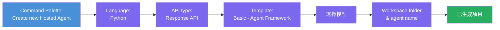
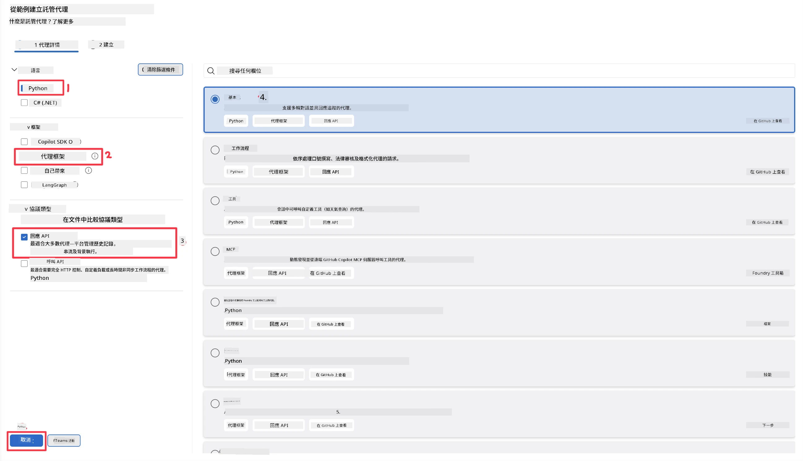
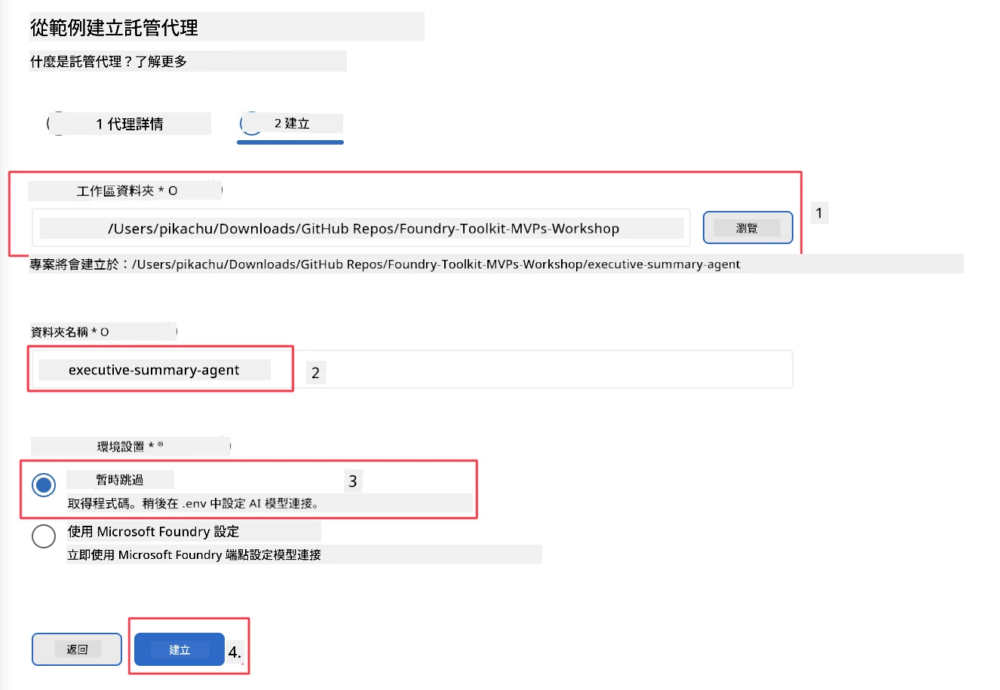

# 模組 2 - 建立新的託管代理

⏱️ 約 5 分鐘

在這個模組中，你將使用 Foundry Toolkit 來<strong>搭建一個託管代理專案的骨架</strong>。這個骨架會生成完整的專案結構－`agent.yaml`、`main.py`、`Dockerfile`、`requirements.txt`，以及 VS Code 除錯設定－讓你可以專注於自訂代理的行為。

> **關鍵概念：** 本實驗中的 `agent/` 資料夾是 Foundry Toolkit 生成範例，你不需要從零編寫這些檔案。

### 骨架精靈流程



---

## 第 1 步：開啟建立託管代理精靈

1. 按 `Ctrl+Shift+P` 叫出<strong>指令面板</strong>。
2. 輸入：**Foundry Toolkit: Create new Hosted Agent** 並選擇它。

> **替代方式：透過 Foundry Portal 建立**
> 如果你偏好瀏覽器，可以在 [https://ai.azure.com](https://ai.azure.com) 建立專案。專案建立完成後，返回 VS Code，使用 **Foundry Toolkit** 側邊欄連接該專案。

> **替代方式：** 點擊 Foundry Toolkit 側邊欄中 **Hosted Agents (Preview)** 旁的 **+** 圖示。

## 第 2 步：選擇設定



1. 在左側導覽/選項區域選擇：

| 選單 | 選擇 | 備註 |
|--------|-----------|-------|
| <strong>語言</strong> | Python | 也支援 C# |
| <strong>框架</strong> | Agent Framework | 使用 Agent Framework SDK 的簡易起點 |
| **API 類型** | Response API | `POST /responses` - 會話型，平台管理對話歷史 |
| <strong>範本</strong> | Basic | 使用 Agent Framework SDK 的簡單起點 |

2. 選擇完畢後，點擊 **Next**



3. 接著視窗中選擇：

| 選單 | 選擇 | 備註 |
|--------|-----------|-------|
| <strong>工作區資料夾</strong> | 選擇目標資料夾 | 例如：`/workspace/Foundry_Toolkit_for_VSCode_Lab/` 或此 repo 的子資料夾 |
| <strong>代理名稱</strong> | 輸入名稱 | 例如：`executive-summary-agent` |
| <strong>環境設定</strong> | 目前跳過設定 |  |

點擊 **create** 建立代理。會新建立一個以託管代理名稱命名的資料夾。

## 第 3 步：檢查生成的專案

搭建完成後，確認在 Explorer (`Ctrl+Shift+E`) 可見以下檔案：

```
📂 my-agent/
├── .env                ← Environment variables (placeholders)
├── .vscode/
│   ├── launch.json     ← Debug config (F5 → run + Agent Inspector)
│   └── tasks.json      ← VS Code task definitions
├── agent.yaml          ← Agent definition (kind: hosted)
├── Dockerfile          ← Container config for deployment
├── main.py             ← Agent entry point (your main code)
└── requirements.txt    ← Python dependencies
```

### 主要檔案說明

| 檔案 | 作用 |
|------|---------|
| `agent.yaml` | 宣告代理類型為 `kind: hosted`，配置環境變數，定義 `/responses` 協定 |
| `main.py` | 建立 `FoundryChatClient` → 用指令包裝成 `Agent` → 透過 `ResponsesHostServer` 在 8088 端口提供服務 |
| `Dockerfile` | 使用 `python:3.12-slim`，安裝相依套件，開放 8088 埠口，執行 `main.py` |
| `requirements.txt` | `agent-framework-foundry`、`agent-framework-foundry-hosting`、`mcp`、`debugpy` |

> **重要：** 請直接以該骨架代理資料夾本身 (`agent/` 資料夾) 在 VS Code 開啟，才能讓 `.vscode/launch.json` 與 `tasks.json` 在 F5 除錯時正常運作。

---

### ✅ 檢查點

- [ ] 骨架專案已建立且含所有預期檔案
- [ ] `agent.yaml` 顯示 `kind: hosted` 與 `protocol: responses`
- [ ] `main.py` 匯入 `Agent`、`FoundryChatClient`、`ResponsesHostServer`
- [ ] 代理資料夾已在 VS Code 作為工作區根目錄開啟

---

**上一篇：** [01 - 環境設定](01-setup.md) · **下一篇：** [03 - 配置與編碼 →](03-configure-and-code.md)

---

<!-- CO-OP TRANSLATOR DISCLAIMER START -->
**免責聲明**：
本文件由 AI 翻譯服務 [Co-op Translator](https://github.com/Azure/co-op-translator) 翻譯而成。雖然我們致力於確保準確性，但請注意，機器自動翻譯可能包含錯誤或不準確之處。原始文件的母語版本應被視為權威來源。對於重要資訊，建議進行專業人工翻譯。我們不對因使用本翻譯而產生的任何誤解或誤釋承擔責任。
<!-- CO-OP TRANSLATOR DISCLAIMER END -->