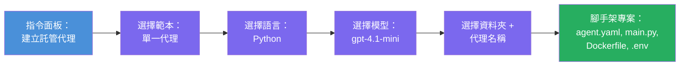

# Module 3 - 建立新的 Hosted Agent（由 Foundry 擴充功能自動生成腳手架）

在本單元中，您將使用 Microsoft Foundry 擴充功能來<strong>生成新的 [hosted agent](https://learn.microsoft.com/azure/foundry/agents/concepts/hosted-agents) 專案腳手架</strong>。該擴充功能會為您產生整個專案結構——包括 `agent.yaml`、`main.py`、`Dockerfile`、`requirements.txt`、一個 `.env` 檔案，以及 VS Code 除錯設定。腳手架生成後，您再根據您的 Agent 指令、工具和設定來客製化這些檔案。

> **關鍵概念：** 本實驗中的 `agent/` 資料夾是 Foundry 擴充功能當您執行該腳手架命令時產生的範例。您不需要從零撰寫這些檔案——擴充功能會創建，然後您修改它們。

### 腳手架嚮導流程


---

## 步驟 1：開啟建立 Hosted Agent 嚮導

1. 按下 `Ctrl+Shift+P` 開啟 <strong>命令選擇器</strong>。
2. 輸入：**Microsoft Foundry: Create a New Hosted Agent** 並選擇它。
3. Hosted agent 創建嚮導會開啟。

> **替代路徑：** 您也可以從 Microsoft Foundry 側邊欄 → 點擊 **Agents** 旁的 **+** 圖示，或右鍵選擇 **Create New Hosted Agent** 來進入此嚮導。

---

## 步驟 2：選擇您的範本

嚮導會要求您選擇一個範本，您會看到以下選項：

| 範本 | 說明 | 使用時機 |
|----------|-------------|-------------|
| **Single Agent** | 單一代理，擁有自己的模型、指令與可選工具 | 本工作坊（Lab 01） |
| **Multi-Agent Workflow** | 多個代理按序合作 | Lab 02 |

1. 選擇 **Single Agent**。
2. 按下 **Next**（或自動進行下一步）。

---

## 步驟 3：選擇程式語言

1. 選擇 **Python**（本工作坊推薦）。
2. 按下 **Next**。

> **也支援 C#**，如果您偏好 .NET，腳手架結構類似（使用 `Program.cs` 替代 `main.py`）。

---

## 步驟 4：選擇您的模型

1. 嚮導會顯示您 Foundry 專案中部署的模型（第 2 單元部署的）。
2. 選擇您部署的模型，例如 **gpt-4.1-mini**。
3. 按下 **Next**。

> 如果看不到模型，請回到[第 2 單元](02-create-foundry-project.md)先部署一個。

---

## 步驟 5：選擇資料夾位置與代理名稱

1. 會開啟檔案對話視窗——選擇將要建立專案的<strong>目標資料夾</strong>，對於本工作坊：
   - 如果從頭開始：可選任一資料夾（例如 `C:\Projects\my-agent`）
   - 如果在工作坊 Repo 內操作：請在 `workshop/lab01-single-agent/agent/` 下建立新子資料夾
2. 輸入此 Hosted Agent 的<strong>名稱</strong>（例如 `executive-summary-agent` 或 `my-first-agent`）。
3. 按下 **Create**（或按 Enter）。

---

## 步驟 6：等待腳手架生成完成

1. VS Code 會自動開啟一個<strong>新視窗</strong>，並載入腳手架專案。
2. 等待幾秒，直到專案完整載入。
3. 您應該在瀏覽器面板（`Ctrl+Shift+E`）看到以下檔案：

```
📂 my-first-agent/
├── .env                ← Environment variables (auto-generated with placeholders)
├── .vscode/
│   └── launch.json     ← Debug configuration (F5 to run + Agent Inspector)
├── agent.yaml          ← Agent definition (kind: hosted)
├── Dockerfile          ← Container configuration for deployment
├── main.py             ← Agent entry point (your main code file)
└── requirements.txt    ← Python dependencies
```

> **這與本實驗中 `agent/` 資料夾的結構相同。** Foundry 擴充功能會自動產生這些檔案，您不需手動建立。

> **工作坊提醒：** 此工作坊 Repo 中，`.vscode/` 資料夾位於<strong>工作區根目錄</strong>（不是各專案內）。裡面包含共享的 `launch.json` 和 `tasks.json`，有兩組除錯設定 - **"Lab01 - Single Agent"** 和 **"Lab02 - Multi-Agent"** - 各自指向對應 Lab 的工作目錄。按下 F5 時，請從下拉式選單選擇對應您正在操作的 Lab。

---

## 步驟 7：了解每個自動產生的檔案

花點時間檢查嚮導建立的每個檔案。理解它們對第 4 單元（客製化）很重要。

### 7.1 `agent.yaml` - Agent 定義檔

開啟 `agent.yaml`，內容看起來如下：

```yaml
# yaml-language-server: $schema=https://raw.githubusercontent.com/microsoft/AgentSchema/refs/heads/main/schemas/v1.0/ContainerAgent.yaml

kind: hosted
name: my-first-agent
description: >
  A hosted agent deployed to Microsoft Foundry Agent Service.
metadata:
  authors:
    - Microsoft
  tags:
    - Azure AI AgentServer
    - Microsoft Agent Framework
    - Hosted Agent
protocols:
  - protocol: responses
    version: v1
environment_variables:
  - name: AZURE_AI_PROJECT_ENDPOINT
    value: ${PROJECT_ENDPOINT}
  - name: AZURE_AI_MODEL_DEPLOYMENT_NAME
    value: ${MODEL_DEPLOYMENT_NAME}
dockerfile_path: Dockerfile
resources:
  cpu: '0.25'
  memory: 0.5Gi
```

**關鍵欄位：**

| 欄位 | 用途 |
|-------|---------|
| `kind: hosted` | 宣告這是 hosted agent（基於容器，部署到 [Foundry Agent Service](https://learn.microsoft.com/azure/foundry/agents/overview)） |
| `protocols: responses v1` | 代理會公開 OpenAI 相容的 `/responses` HTTP 端點 |
| `environment_variables` | 在部署時，將 `.env` 值對應至容器環境變數 |
| `dockerfile_path` | 指向用於構建容器映像檔的 Dockerfile |
| `resources` | 容器的 CPU 與記憶體配置（0.25 CPU，0.5Gi 記憶體） |

### 7.2 `main.py` - Agent 進入點

開啟 `main.py`。這是您的 Agent 邏輯所在的主要 Python 檔案。腳手架內容包括：

```python
from agent_framework.azure import AzureAIAgentClient
from azure.ai.agentserver.agentframework import from_agent_framework
from azure.identity.aio import DefaultAzureCredential
```

**主要引入：**

| 引入 | 用途 |
|--------|--------|
| `AzureAIAgentClient` | 連接您的 Foundry 專案並透過 `.as_agent()` 創建 Agents |
| [`DefaultAzureCredential`](https://learn.microsoft.com/azure/developer/python/sdk/authentication/credential-chains#defaultazurecredential-overview) | 處理身份驗證（Azure CLI、VS Code 登入、管理身分或服務主體） |
| `from_agent_framework` | 將 agent 包裝為公開 `/responses` 端點的 HTTP 伺服器 |

主要流程是：
1. 創建憑證 → 創建客戶端 → 呼叫 `.as_agent()` 取得 agent（非同步上下文管理器） → 包裝成伺服器 → 執行

### 7.3 `Dockerfile` - 容器映像建構檔

```dockerfile
FROM python:3.14-slim

WORKDIR /app

COPY ./ .

RUN pip install --upgrade pip && \
    if [ -f requirements.txt ]; then \
        pip install -r requirements.txt; \
    else \
        echo "No requirements.txt found" >&2; exit 1; \
    fi

EXPOSE 8088

CMD ["python", "main.py"]
```

**重點說明：**
- 使用 `python:3.14-slim` 作為基底映像。
- 將專案所有檔案複製到 `/app`。
- 更新 `pip`，安裝 `requirements.txt` 中的依賴，如該檔案缺失會直接失敗。
- **暴露 8088 埠口**——這是 hosted agent 所需埠口，請勿更動。
- 使用 `python main.py` 啟動 agent。

### 7.4 `requirements.txt` - 依賴套件列表

```
agent-framework-azure-ai==1.0.0rc3
agent-framework-core==1.0.0rc3
azure-ai-agentserver-agentframework==1.0.0b16
azure-ai-agentserver-core==1.0.0b16
debugpy
agent-dev-cli
```

| 套件 | 用途 |
|---------|---------|
| `agent-framework-azure-ai` | Microsoft Agent Framework 的 Azure AI 整合 |
| `agent-framework-core` | 建立 agent 所需核心執行環境（包含 `python-dotenv`） |
| `azure-ai-agentserver-agentframework` | Foundry Agent Service 用的 hosted agent 伺服器執行環境 |
| `azure-ai-agentserver-core` | 代理伺服器核心抽象 |
| `debugpy` | Python 除錯支援（允許 VS Code F5 除錯） |
| `agent-dev-cli` | 用於本地開發的 CLI（供除錯／執行設定使用） |

---

## 了解 agent 協定

Hosted agents 透過 **OpenAI Responses API** 協定通訊。當 agent 運行（本地或雲端）時，會公開單一 HTTP 端點：

```
POST http://localhost:8088/responses
Content-Type: application/json

{
  "input": "Your prompt here",
  "stream": false
}
```

Foundry Agent Service 會呼叫此端點以傳送使用者提示並接收 Agent 回應。這與 OpenAI API 使用相同協定，因此您的 agent 可與任何支援 OpenAI Responses 格式的客戶端相容。

---

### 檢查點

- [ ] 腳手架嚮導成功完成並開啟了一個<strong>新的 VS Code 視窗</strong>
- [ ] 可看到所有 5 個檔案：`agent.yaml`、`main.py`、`Dockerfile`、`requirements.txt`、`.env`
- [ ] `.vscode/launch.json` 檔案存在（允許 F5 除錯，本工作坊中該檔於工作區根目錄，含有實驗室專屬設定）
- [ ] 您已閱讀並理解每個檔案的用途
- [ ] 您了解埠號 `8088` 是必需的，且 `/responses` 端點就是所採用的協定

---

**上一章節：** [02 - 創建 Foundry 專案](02-create-foundry-project.md) · **下一章節：** [04 - 設定與編碼 →](04-configure-and-code.md)

---

<!-- CO-OP TRANSLATOR DISCLAIMER START -->
**免責聲明**：  
本文件係使用 AI 翻譯服務 [Co-op Translator](https://github.com/Azure/co-op-translator) 進行翻譯。雖然我們致力於確保準確性，但請注意自動翻譯可能包含錯誤或不準確之處。原始文件以其母語版本為權威來源。對於重要資料，建議採用專業人工翻譯。我們不對因使用本翻譯而產生的任何誤解或誤釋承擔責任。
<!-- CO-OP TRANSLATOR DISCLAIMER END -->