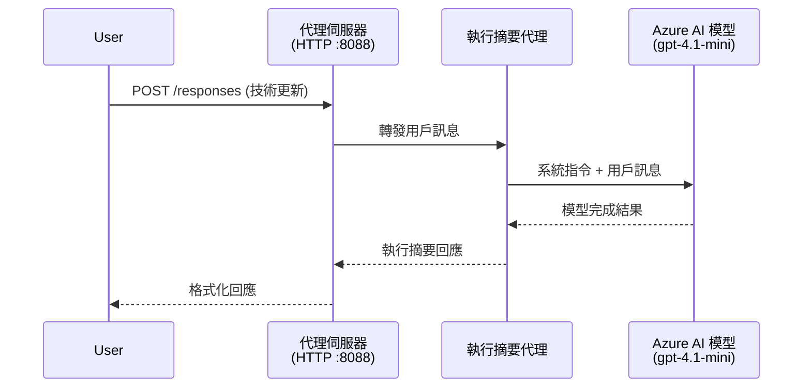
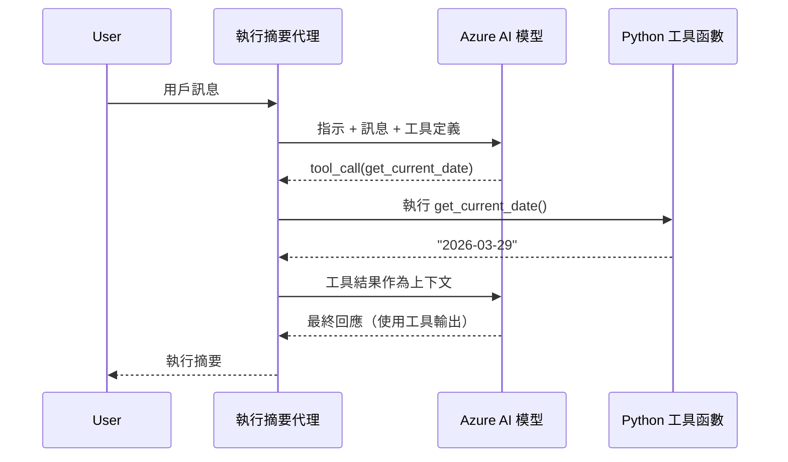

# Module 4 - 配置指示、環境及安裝依賴

在本模組中，你會自訂第三模組自動生成的代理文件。這是將通用腳手架轉變為<strong>你的</strong>代理的過程——通過編寫指示、設定環境變數、選擇性地新增工具及安裝依賴。

> **提醒：** Foundry 擴展已自動生成你的專案文件。現在你要修改它們。請參閱 [`agent/`](../../../../../workshop/lab01-single-agent/agent) 資料夾，了解完整可用的自訂代理實例。

---

## 各組件如何串接

### 請求生命週期（單一代理）


> **有工具時：** 若代理註冊了工具，模型可能回傳工具呼叫而非直接完成。框架會在本地執行該工具，將結果回傳給模型，模型接著產生最終回應。


---

## 第一步：配置環境變數

腳手架已建立一個帶有佔位值的 `.env` 檔案。你需要填入第二模組中的實際值。

1. 在你的腳手架專案中，打開 **`.env`** 檔案（位於專案根目錄）。
2. 用你的真實 Foundry 專案資訊取代佔位值：

   ```env
   PROJECT_ENDPOINT=https://<your-account>.services.ai.azure.com/api/projects/<your-project>
   MODEL_DEPLOYMENT_NAME=gpt-4.1-mini
   ```

3. 儲存檔案。

### 這些值從哪裡找

| 值 | 如何找到 |
|-------|---------|
| <strong>專案端點</strong> | 在 VS Code 中打開 **Microsoft Foundry** 側邊欄 → 點你的專案 → 詳細資訊視窗會顯示端點 URL，看起來像 `https://<account-name>.services.ai.azure.com/api/projects/<project-name>` |
| <strong>模型部署名稱</strong> | 在 Foundry 側邊欄展開你的專案 → 找到 **Models + endpoints** → 部署模型旁會列出名稱（例如 `gpt-4.1-mini`） |

> **安全性：** 請勿將 `.env` 檔案送到版本控制，該檔案預設已包含在 `.gitignore`。如果未包含，請手動新增：
> ```
> .env
> ```

### 環境變數的流向

映射鏈是：`.env` → `main.py`（透過 `os.getenv` 讀取）→ `agent.yaml`（部署時映射到容器環境變數）。

在 `main.py` 中，腳手架會這樣讀取這些值：

```python
PROJECT_ENDPOINT = os.getenv("AZURE_AI_PROJECT_ENDPOINT") or os.getenv("PROJECT_ENDPOINT")
MODEL_DEPLOYMENT_NAME = os.getenv("AZURE_AI_MODEL_DEPLOYMENT_NAME", os.getenv("MODEL_DEPLOYMENT_NAME", "gpt-4.1-mini"))
```

兩者 `AZURE_AI_PROJECT_ENDPOINT` 與 `PROJECT_ENDPOINT` 都接受（`agent.yaml` 使用的是 `AZURE_AI_*` 前綴）。

---

## 第二步：編寫代理指示

這是最重要的自訂步驟。指示定義你的代理個性、行為、輸出格式及安全限制。

1. 打開你專案中的 `main.py`。
2. 找到指示字串（腳手架包含預設／通用版本）。
3. 用詳細且結構化的指示取代它。

### 好的指示包含

| 元件 | 目的 | 範例 |
|-----------|---------|---------|
| <strong>角色</strong> | 代理的身分與職責 | "你是一個執行摘要代理" |
| <strong>目標對象</strong> | 回應的對象是誰 | "有有限技術背景的高階主管" |
| <strong>輸入定義</strong> | 處理何種提示詞 | "技術事件報告，營運更新" |
| <strong>輸出格式</strong> | 回應的嚴格結構 | "執行摘要: - 發生了什麼: ... - 商業影響: ... - 下一步: ..." |
| <strong>規則</strong> | 限制及拒絕條件 | "不得加入未提供的資訊" |
| <strong>安全性</strong> | 防止誤用和幻想 | "如果輸入不清楚，請要求澄清" |
| <strong>範例</strong> | 引導行為的輸入/輸出範例 | 提供 2-3 組不同輸入的示例 |

### 範例：執行摘要代理指示

以下是工作坊 [`agent/main.py`](../../../../../workshop/lab01-single-agent/agent/main.py) 中使用的指示：

```python
AGENT_INSTRUCTIONS = """You are an "Explain Like I'm an Executive" agent.

Purpose:
Your job is to translate complex technical or operational information into
clear, concise, and outcome-focused summaries that can be easily understood
by non-technical executives.

Audience:
Senior leaders with limited technical background who care about impact,
risk, and what happens next.

What you must do:
- Rephrase the input so it is understandable to a non-technical audience
- Prioritize clarity, brevity, and outcomes over technical accuracy
- Remove technical jargon, logs, metrics, stack traces, and deep root-cause details
- Translate technical causes into simple cause-and-effect statements
- Explicitly call out business impact
- Always include a clear next step or action
- Maintain a neutral, factual, and calm executive tone
- Do NOT add new facts or speculate beyond the input

Standard Output Structure (always use this wording):

Executive Summary:
- What happened: <plain-language description>
- Business impact: <clear, non-technical impact>
- Next step: <clear action or mitigation>

Rules:
- Keep responses under 100 words
- Do NOT add facts beyond the input
- If input is unclear, ask for clarification
"""
```

4. 用你自訂的指示取代 `main.py` 中的現有字串。
5. 儲存檔案。

---

## 第三步：（可選）新增自訂工具

托管代理可執行 **本地 Python 函式** 作為[工具](https://learn.microsoft.com/azure/foundry/agents/concepts/tool-catalog)。這是程式碼型托管代理對比純提示詞代理的重要優勢——你的代理可運行任意伺服器端邏輯。

### 3.1 定義工具函式

在 `main.py` 中新增工具函式：

```python
from agent_framework import tool

@tool
def get_current_date() -> str:
    """Returns the current date in YYYY-MM-DD format."""
    from datetime import date
    return str(date.today())
```

`@tool` 裝飾器會將普通 Python 函式轉為代理工具。文件字串將成為模型看到的工具描述。

### 3.2 將工具註冊到代理

使用 `.as_agent()` 上下文管理器建立代理時，在 `tools` 參數中傳入工具：

```python
async with AzureAIAgentClient(
    project_endpoint=PROJECT_ENDPOINT,
    model_deployment_name=MODEL_DEPLOYMENT_NAME,
    credential=credential,
).as_agent(
    name="my-agent",
    instructions=AGENT_INSTRUCTIONS,
    tools=[get_current_date],
) as agent:
    server = from_agent_framework(agent)
    await server.run_async()
```

### 3.3 工具呼叫如何運作

1. 使用者送出提示。
2. 模型決定是否需要工具（根據提示、指示與工具描述）。
3. 若需要，框架會在本地容器內呼叫你的 Python 函式。
4. 工具的回傳值會帶回模型作為上下文。
5. 模型生成最終回應。

> <strong>工具於伺服器端執行</strong> — 在你的容器內執行，而非使用者瀏覽器或模型內。這表示你可存取資料庫、API、檔案系統或任何 Python 函式庫。

---

## 第四步：建立並啟動虛擬環境

在安裝依賴前，先建立隔離的 Python 環境。

### 4.1 建立虛擬環境

在 VS Code 中打開終端機（`` Ctrl+` ``），並執行：

```powershell
python -m venv .venv
```

此操作會在專案目錄內建立 `.venv` 資料夾。

### 4.2 啟動虛擬環境

**PowerShell（Windows）：**

```powershell
.\.venv\Scripts\Activate.ps1
```

**命令提示字元（Windows）：**

```cmd
.venv\Scripts\activate.bat
```

**macOS/Linux（Bash）：**

```bash
source .venv/bin/activate
```

你應該會看到終端機提示字元前出現 `(.venv)`，代表虛擬環境已啟動。

### 4.3 安裝依賴包

虛擬環境啟動後，安裝所需套件：

```powershell
pip install -r requirements.txt
```

會安裝：

| 套件 | 用途 |
|---------|---------|
| `agent-framework-azure-ai==1.0.0rc3` | 用於 [Microsoft Agent Framework](https://learn.microsoft.com/agent-framework/overview/) 的 Azure AI 整合 |
| `agent-framework-core==1.0.0rc3` | 代理核心執行時（包含 `python-dotenv`） |
| `azure-ai-agentserver-agentframework==1.0.0b16` | [Foundry Agent Service](https://learn.microsoft.com/azure/foundry/agents/overview) 的托管代理伺服器執行時 |
| `azure-ai-agentserver-core==1.0.0b16` | 代理伺服器核心抽象 |
| `debugpy` | Python 除錯工具（啟用 VS Code 的 F5 除錯） |
| `agent-dev-cli` | 用於本地開發測試代理的 CLI |

### 4.4 驗證安裝

```powershell
pip list | Select-String "agent-framework|agentserver"
```

預期輸出：
```
agent-framework-azure-ai   1.0.0rc3
agent-framework-core       1.0.0rc3
azure-ai-agentserver-agentframework 1.0.0b16
azure-ai-agentserver-core  1.0.0b16
```

---

## 第五步：驗證身份驗證

代理使用 [`DefaultAzureCredential`](https://learn.microsoft.com/azure/developer/python/sdk/authentication/credential-chains#defaultazurecredential-overview)，會按以下順序嘗試多種身份驗證方法：

1. <strong>環境變數</strong> — `AZURE_CLIENT_ID`、`AZURE_TENANT_ID`、`AZURE_CLIENT_SECRET`（服務主體）
2. **Azure CLI** — 使用你的 `az login` 會話
3. **VS Code** — 使用你登入 VS Code 的帳戶
4. <strong>託管身份</strong> — 在 Azure 執行時使用（部署時）

### 5.1 本地開發驗證

以下任一方法應可用：

**選項 A：Azure CLI（推薦）**

```powershell
az account show --query "{name:name, id:id}" --output table
```

預期：顯示你的訂閱名稱及 ID。

**選項 B：VS Code 登入**

1. 查看 VS Code 左下角的 <strong>帳戶</strong> 圖示。
2. 若顯示你的帳戶名稱，代表已驗證。
3. 若沒有，點擊該圖示 → **登入以使用 Microsoft Foundry**。

**選項 C：服務主體（CI/CD 用）**

```powershell
$env:AZURE_TENANT_ID = "<your-tenant-id>"
$env:AZURE_CLIENT_ID = "<your-client-id>"
$env:AZURE_CLIENT_SECRET = "<your-client-secret>"
```

### 5.2 常見驗證問題

若登入多個 Azure 帳號，請確定選擇了正確的訂閱：

```powershell
az account set --subscription "<your-subscription-id>"
```

---

### 檢查點

- [ ] `.env` 檔案已填入有效的 `PROJECT_ENDPOINT` 與 `MODEL_DEPLOYMENT_NAME`（非佔位符）
- [ ] 在 `main.py` 已自訂代理指示——定義角色、目標對象、輸出格式、規則及安全限制
- [ ] （可選）自訂工具已定義並註冊
- [ ] 已建立並啟動虛擬環境（終端機提示顯示 `(.venv)`）
- [ ] 執行 `pip install -r requirements.txt` 成功，無錯誤
- [ ] 執行 `pip list | Select-String "azure-ai-agentserver"` 顯示套件已安裝
- [ ] 驗證有效——`az account show` 會顯示訂閱，或已登入 VS Code

---

**上一步：** [03 - 建立托管代理](03-create-hosted-agent.md) · **下一步：** [05 - 本地測試 →](05-test-locally.md)

---

<!-- CO-OP TRANSLATOR DISCLAIMER START -->
**免責聲明**：
本文件使用 AI 翻譯服務 [Co-op Translator](https://github.com/Azure/co-op-translator) 進行翻譯。雖然我們力求準確，但請注意自動翻譯可能包含錯誤或不準確之處。原文文件的母語版本應視為權威來源。對於重要資訊，建議使用專業人工翻譯。我們不對因使用本翻譯而產生的任何誤解或錯誤詮釋承擔責任。
<!-- CO-OP TRANSLATOR DISCLAIMER END -->