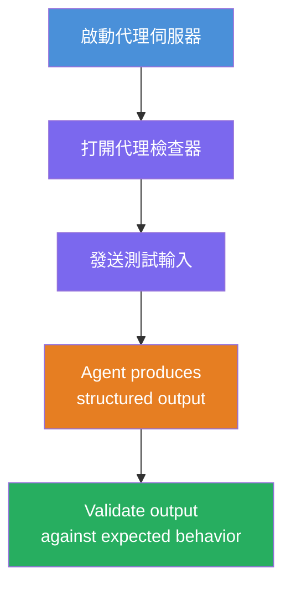
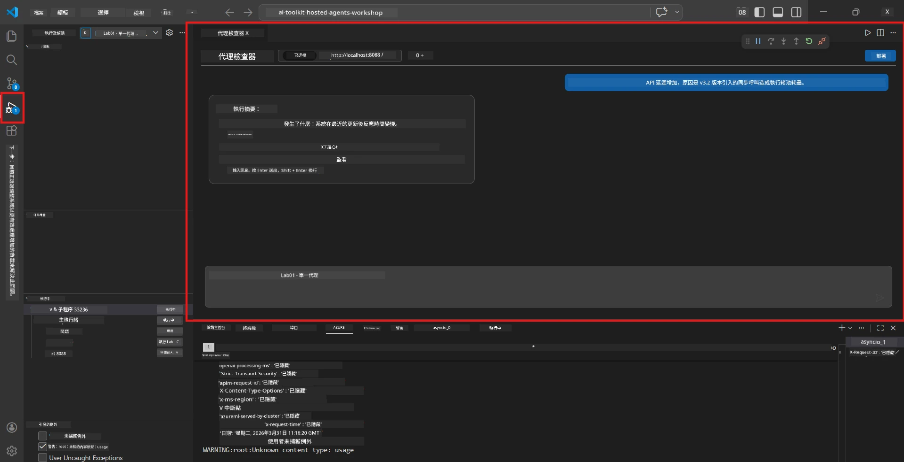
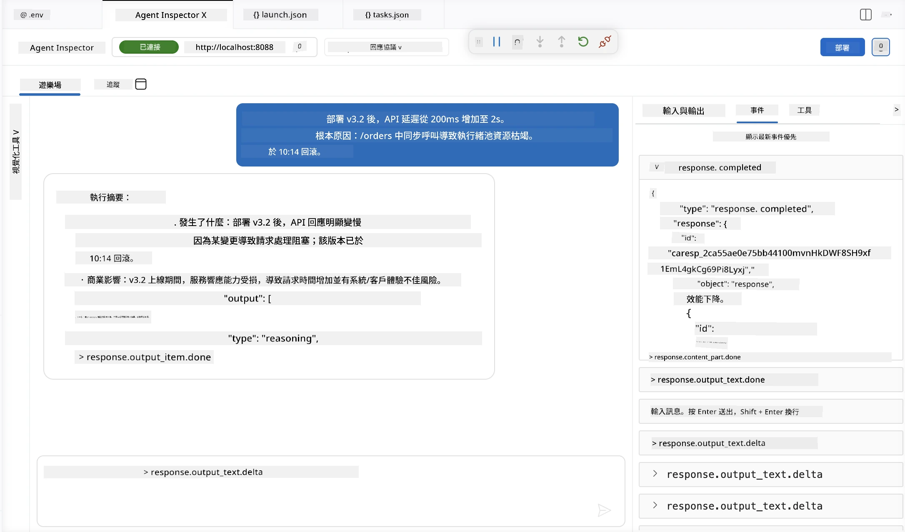

# 模組 4 - 本地測試

⏱️ 約 10 分鐘

在本模組中，您將在本地運行代理，並用<strong>順利流程功能測試</strong>來驗證其正常運作。您會使用 Agent Inspector（可視化介面）或直接透過 HTTP 呼叫，確認代理產生結構化且準確的回應。

### 本地測試流程



---

## 選項 1：按 F5 - 使用 Agent Inspector 偵錯（推薦）

### 啟動偵錯器

1. 直接在 VS Code 中打開 **executive-summary-agent/** 資料夾 (`檔案 → 開啟資料夾`)。
2. 開啟 <strong>執行與偵錯</strong> 面板 (`Ctrl+Shift+D`)。
3. 從下拉選單選擇 **Debug Local Agent Server**。
4. 按下 **F5**（或點擊 ▶ 開始偵錯）。

> ⚠️ **重要：選擇您的 Python 直譯器**
> 如果出現 "ModuleNotFoundError" 或偵錯器無法啟動，您必須告訴 VS Code 使用虛擬環境：
  > 1. 按 `Ctrl+Shift+P` $\rightarrow$ 輸入 **Python: Select Interpreter**。
  > 2. 選擇位於專案 `.venv` 資料夾中的直譯器（例如 Windows 上的 `.\.venv\Scripts\python.exe`）。
  > 3. 重新啟動偵錯工作階段。
> 如果仍有錯誤，請手動更新您的 `tasks.json` 檔案如下：
  > 1. 前往 `.vscode/tasks.json` 檔案
  > 2. 找到標有 `Run Agent/Workflow HTTP Server` 的指令
  > 3. 更新指令值為 `"value": "${workspaceFolder}/.venv/bin/python",`

### 會發生什麼事

1. HTTP 伺服器啟動於 `http://localhost:8088/responses`。
2. **Agent Inspector** 面板自動開啟——一個用於測試的視覺化聊天介面。
3. 在 `main.py` 中啟用中斷點。

請注意終端機顯示：
```
Starting executive summary hosted agent
Executive agent server running on http://localhost:8088
```

> **如果 Agent Inspector 沒有開啟：** 按 `Ctrl+Shift+P` → **Foundry Toolkit: Open Agent Inspector**。



> *截圖可能顯示較早版本擴充套件的 “AI TOOLKIT” 品牌標誌。*

---

## 選項 2：透過終端機測試（替代方案）

在一個終端機啟動代理，從另一個終端機發送請求：

```bash
# 終端機 1：啟動代理程式
cd executive-summary-agent/
source .venv/bin/activate
python main.py
```

```bash
# 終端 2：發送測試 (curl)
curl -sS -X POST http://localhost:8088/responses \
  -H "Content-Type: application/json" \
  -d '{"input": "The API latency increased due to thread pool exhaustion caused by sync calls in v3.2.", "stream": false}'
```

---

## 場景測試：順利流程功能驗證

執行下列<strong>全部三個</strong>場景。這些驗證您的代理對真實輸入產生正確且結構化的輸出。



### 場景 1：IT 事件 - API 延遲激增

**輸入：**
```
The API latency increased from 200ms to 2s after deploying v3.2.
Root cause: thread pool starvation from synchronous calls in /orders.
Rolled back at 10:14.
```

**預期行為：**
- ✅ 遵循「執行摘要」結構（發生了什麼／商業影響／下一步）
- ✅ 無技術術語（沒有「執行緒池」、沒有「/orders」、沒有「v3.2」）
- ✅ 明確說明商業影響（如使用者遇到延遲）
- ✅ 包含下一步（例如修正部署，持續監控）

---

### 場景 2：資料管線 - ETL 失敗

**輸入：**
```
The nightly ETL job failed because the upstream schema changed. APAC dashboards show missing data.
```

**預期行為：**
- ✅ 用通俗語言總結資料刷新失敗
- ✅ 提及 APAC 儀表板的影響
- ✅ 包含修復的下一步
- ✅ 不提及「ETL」、「結構」或其他技術術語

---

### 場景 3：安全 - 憑證外洩

**輸入：**
```
Static analysis flagged a hardcoded secret in the repository.
The secret may have been exposed in commit history.
```

**預期行為：**
- ✅ 以適合主管的語言描述憑證／安全問題
- ✅ 指出潛在風險（未授權存取）
- ✅ 說明修正措施（憑證輪替、稽核）
- ✅ 不包含「靜態分析」、「提交歷史」或「硬編碼」等術語

---

## 驗證標準

對每個場景，檢查：

| # | 標準 | 通過條件 |
|---|------|----------|
| 1 | <strong>結構</strong> | 回應採用「執行摘要」格式且包含全部三個點 |
| 2 | <strong>通俗語言</strong> | 無主管不懂的技術術語 |
| 3 | <strong>準確性</strong> | 摘要反映輸入內容，無虛構細節 |
| 4 | <strong>簡潔</strong> | 回應少於 100 字 |
| 5 | <strong>下一步</strong> | 明確說明行動或緩解措施 |

---

## 偵錯提示

| 問題 | 解決方法 |
|-----|---------|
| 代理未啟動 | 檢查 `.env` 參數，確認虛擬環境是否啟用，執行 `pip install -r requirements.txt` |
| 回應空白或通用 | 檢視 `main.py` 中說明，確保指定輸出格式 |
| 回應包含術語 | 強化「移除技術術語」規則 |
| Agent Inspector 沒開啟 | `Ctrl+Shift+P` → **Foundry Toolkit: Open Agent Inspector** |
| 終端機顯示模型錯誤 | 確認 `AZURE_AI_MODEL_DEPLOYMENT_NAME` 名稱是否完全一致（大小寫敏感） |

---

### ✅ 檢查點

- [ ] 代理本地啟動無錯誤
- [ ] Agent Inspector 開啟並顯示聊天介面（如果使用 F5）
- [ ] **場景 1**（IT 事件）- 結構化執行摘要，無術語
- [ ] **場景 2**（資料管線）- 相關摘要帶商業影響
- [ ] **場景 3**（安全警示）- 適當風險溝通
- [ ] 所有回應均符合定義的輸出結構

> <strong>請保存您的回應</strong>（複製或截圖）- 您會在第 06 模組中與雲端結果做比較。

---

**上一節：** [03 - Configure & Code](03-configure-and-code.md) · **下一節：** [05 - Deploy to Foundry →](05-deploy-to-foundry.md)

---

<!-- CO-OP TRANSLATOR DISCLAIMER START -->
**免責聲明**：
本文件由 AI 翻譯服務 [Co-op Translator](https://github.com/Azure/co-op-translator) 翻譯而成。雖然我們致力於確保準確性，但請注意，機器自動翻譯可能包含錯誤或不準確之處。原始文件的母語版本應被視為權威來源。對於重要資訊，建議進行專業人工翻譯。我們不對因使用本翻譯而產生的任何誤解或誤釋承擔責任。
<!-- CO-OP TRANSLATOR DISCLAIMER END -->