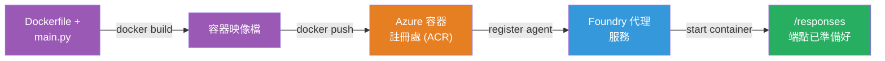
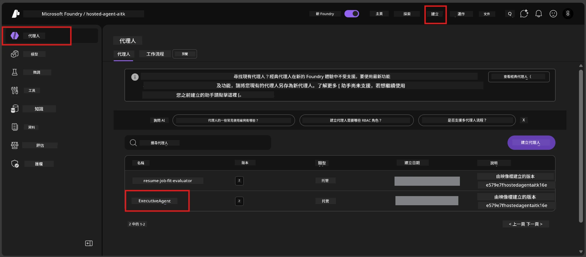

# Module 6 - 部署至 Foundry 代理服務

在本模組中，您將已在本機測試的代理部署到 Microsoft Foundry 作為 [**Hosted Agent**](https://learn.microsoft.com/azure/foundry/agents/concepts/hosted-agents)。部署過程會從您的專案建立 Docker 容器映像檔，並推送到 [Azure Container Registry (ACR)](https://learn.microsoft.com/azure/container-registry/container-registry-intro)，然後在 [Foundry Agent Service](https://learn.microsoft.com/azure/foundry/agents/overview) 中建立一個托管代理版本。

### 部署流程


---

## 先決條件檢查

部署前，請確認以下每項內容。跳過這些是最常見的部署失敗原因。

1. **代理通過本機初步測試（smoke tests）：**
   - 您已完成 [模組 5](05-test-locally.md) 中的所有 4 項測試，且代理回應正確。

2. **您具有 [Azure AI User](https://learn.microsoft.com/azure/foundry/concepts/rbac-foundry#built-in-roles) 角色：**
   - 此角色於 [模組 2，步驟 3](02-create-foundry-project.md) 指派。如果不確定，請立即驗證：
   - Azure 入口網站 → 您的 Foundry <strong>專案</strong> 資源 → **存取控制 (IAM)** → <strong>角色指派</strong> 標籤 → 搜尋您的名稱 → 確認列表中有 **Azure AI User**。

3. **您已在 VS Code 登入 Azure：**
   - 檢查 VS Code 左下角的帳戶圖示，應能看到您的帳戶名稱。

4. **（選擇性）Docker Desktop 運行中：**
   - 只有當 Foundry 擴充功能提示您進行本機建立時，才需要 Docker。大多數情況下，擴充功能會在部署期間自動處理容器建立。
   - 如果您已安裝 Docker，請確認其運作中：`docker info`

---

## 步驟 1：開始部署

您有兩種方式部署，結果相同。

### 選項 A：從代理檢查器部署（推薦）

如果您正在使用除錯器 (F5) 運行代理，且代理檢查器已開啟：

1. 查看代理檢查器面板的 <strong>右上角</strong>。
2. 點選 **Deploy** 按鈕（帶向上箭頭 ↑ 的雲端圖示）。
3. 部署精靈將開啟。

### 選項 B：從命令面板部署

1. 按 `Ctrl+Shift+P` 開啟 <strong>命令面板</strong>。
2. 輸入：**Microsoft Foundry: Deploy Hosted Agent** 然後選擇。
3. 部署精靈將開啟。

---

## 步驟 2：配置部署

部署精靈會引導您完成配置。請填寫每個提示：

### 2.1 選擇目標專案

1. 下拉選單顯示您的 Foundry 專案。
2. 選擇您在模組 2 建立的專案（例如 `workshop-agents`）。

### 2.2 選擇容器代理檔案

1. 系統會提示您選擇代理入口檔案。
2. 選擇 **`main.py`**（Python）— 這是精靈用來識別您的代理專案的檔案。

### 2.3 配置資源

| 設定 | 建議值 | 備註 |
|---------|------------------|-------|
| **CPU** | `0.25` | 預設，足夠用於工作坊。生產工作負載可增加 |
| <strong>記憶體</strong> | `0.5Gi` | 預設，足夠用於工作坊 |

這些與 `agent.yaml` 中的值相符。您可以接受預設值。

---

## 步驟 3：確認並部署

1. 精靈會顯示部署摘要，包含：
   - 目標專案名稱
   - 代理名稱（來自 `agent.yaml`）
   - 容器檔案與資源
2. 檢閱摘要後點擊 <strong>確認並部署</strong>（或 <strong>部署</strong>）。
3. 在 VS Code 觀察部署進度。

### 部署時發生的步驟（逐步說明）

部署為多步驟過程。請在 VS Code 的 <strong>輸出</strong> 面板（下拉選單選擇 "Microsoft Foundry"）觀察：

1. **Docker 建置** - VS Code 從您的 `Dockerfile` 建置 Docker 容器映像檔，您會看到 Docker 層消息：
   ```
   Step 1/6 : FROM python:<version>-slim
   Step 2/6 : WORKDIR /app
   ...
   Successfully built abc123def456
   ```

2. **Docker 推送** - 映像檔被推送到與您的 Foundry 專案關聯的 **Azure Container Registry (ACR)**。首次部署可能需 1-3 分鐘（基礎映像檔大小超過 100MB）。

3. <strong>代理註冊</strong> - Foundry 代理服務建立新的托管代理（如果代理已存在則建立新版本）。使用 `agent.yaml` 中的代理元資料。

4. <strong>容器啟動</strong> - 容器於 Foundry 管理的基礎架構啟動。平台會指派 [系統管理的身分](https://learn.microsoft.com/azure/foundry/agents/concepts/agent-identity) 並開放 `/responses` 端點。

> <strong>首次部署較慢</strong>（Docker 需推送所有層）。後續部署較快因 Docker 快取未更動層。

---

## 步驟 4：核實部署狀態

部署指令完成後：

1. 點擊活動列上的 Foundry 圖示，開啟 **Microsoft Foundry** 側邊欄。
2. 展開專案下的 **Hosted Agents (Preview)** 部分。
3. 您應看到代理名稱（如 `ExecutiveAgent` 或 `agent.yaml` 中的名稱）。
4. <strong>點擊代理名稱</strong> 以展開。
5. 您會看到一個或多個 <strong>版本</strong>（如 `v1`）。
6. 點擊版本查看 <strong>容器詳細資訊</strong>。
7. 檢查 <strong>狀態</strong> 欄位：

   | 狀態 | 意義 |
   |--------|---------|
   | **Started** 或 **Running** | 容器正在運行，代理已準備就緒 |
   | **Pending** | 容器正在啟動中（等待 30-60 秒） |
   | **Failed** | 容器啟動失敗（檢查日誌，見下方疑難排解） |



> **如果「Pending」超過 2 分鐘：** 可能正在拉取基礎映像。稍等片刻。如果持續 Pending，請檢查容器日誌。

---

## 常見部署錯誤及修正

### 錯誤 1：Permission denied - `agents/write`

```
Error: lacks the required data action 
Microsoft.CognitiveServices/accounts/AIServices/agents/write 
to perform POST /api/projects/{projectName}/assistants operation.
```

**根本原因：** 您在 <strong>專案</strong> 層級沒有 `Azure AI User` 角色。

**逐步修正：**

1. 開啟 [https://portal.azure.com](https://portal.azure.com)。
2. 在搜尋列輸入您的 Foundry <strong>專案</strong> 名稱並點擊。
   - **重要：** 確定您進入的是 <strong>專案</strong> 資源（類型為 "Microsoft Foundry project"），而非父層帳戶/中心資源。
3. 在左側導覽列點選 **存取控制 (IAM)**。
4. 點擊 **+ 新增** → <strong>新增角色指派</strong>。
5. 在 <strong>角色</strong> 標籤中搜尋 [**Azure AI User**](https://learn.microsoft.com/azure/foundry/concepts/rbac-foundry#built-in-roles) 並選擇，按 <strong>下一步</strong>。
6. 在 <strong>成員</strong> 標籤選擇 **使用者、群組或服務主體**。
7. 點選 **+ 選擇成員**，搜尋您的名稱/電子郵件，選取自己，按 <strong>選擇</strong>。
8. 點擊 **審閱 + 指派** → 再次 **審閱 + 指派**。
9. 等待 1-2 分鐘讓角色指派生效。
10. **重新從步驟 1 執行部署**。

> 角色必須在 <strong>專案</strong> 範圍，非僅帳戶範圍。這是部署失敗最常見原因。

### 錯誤 2：Docker 未啟動

```
Error: Docker build failed / Cannot connect to Docker daemon
```

**修正：**
1. 啟動 Docker Desktop（從開始選單或系統列找到它）。
2. 等候顯示「Docker Desktop is running」（30-60 秒）。
3. 驗證：終端機執行 `docker info`。
4. **Windows 專用：** 確認 Docker Desktop 設定→<strong>一般</strong>→啟用「使用 WSL 2 引擎」。
5. 重試部署。

### 錯誤 3：ACR 授權失敗 - `AcrPullUnauthorized`

```
Error: AcrPullUnauthorized
```

**根本原因：** Foundry 專案的管理身分沒有對容器註冊表的拉取權限。

**修正：**
1. 在 Azure 入口網站中，導覽到您的 **[容器註冊表](https://learn.microsoft.com/azure/container-registry/container-registry-intro)**（與 Foundry 專案在相同資源群組）。
2. 前往 **存取控制 (IAM)** → <strong>新增</strong> → <strong>新增角色指派</strong>。
3. 選取 **[AcrPull](https://learn.microsoft.com/azure/container-registry/container-registry-roles)** 角色。
4. 在成員中選擇 <strong>管理身分</strong> → 找到您的 Foundry 專案管理身分。
5. **審閱 + 指派**。

> 此設定通常由 Foundry 擴充功能自動完成，若出現此錯誤，可能表示自動設定失敗。

### 錯誤 4：容器平台不匹配（Apple Silicon）

若從 Apple Silicon Mac（M1/M2/M3）部署，容器必須建置為 `linux/amd64`：

```bash
docker build --platform linux/amd64 -t myagent:v1 .
```

> Foundry 擴充功能對大部分使用者自動處理此項。

---

### 檢查點

- [ ] 部署命令在 VS Code 中完成且無錯誤
- [ ] 代理出現在 Foundry 側邊欄的 **Hosted Agents (Preview)**
- [ ] 點擊代理 → 選擇版本 → 查看 <strong>容器詳細資訊</strong>
- [ ] 容器狀態顯示 **Started** 或 **Running**
- [ ] （若發生錯誤）您已辨識錯誤、套用修正並成功重新部署

---

**上一章節：** [05 - 本機測試](05-test-locally.md) · **下一章節：** [07 - 在 Playground 驗證 →](07-verify-in-playground.md)

---

<!-- CO-OP TRANSLATOR DISCLAIMER START -->
**免責聲明**：
本文件已使用 AI 翻譯服務 [Co-op Translator](https://github.com/Azure/co-op-translator) 進行翻譯。雖然我們力求準確，但請注意自動翻譯可能包含錯誤或不準確之處。原文文件應視為權威來源。對於重要資訊，建議尋求專業人工翻譯。我們不對因使用此翻譯而引起的任何誤解或誤釋負責。
<!-- CO-OP TRANSLATOR DISCLAIMER END -->