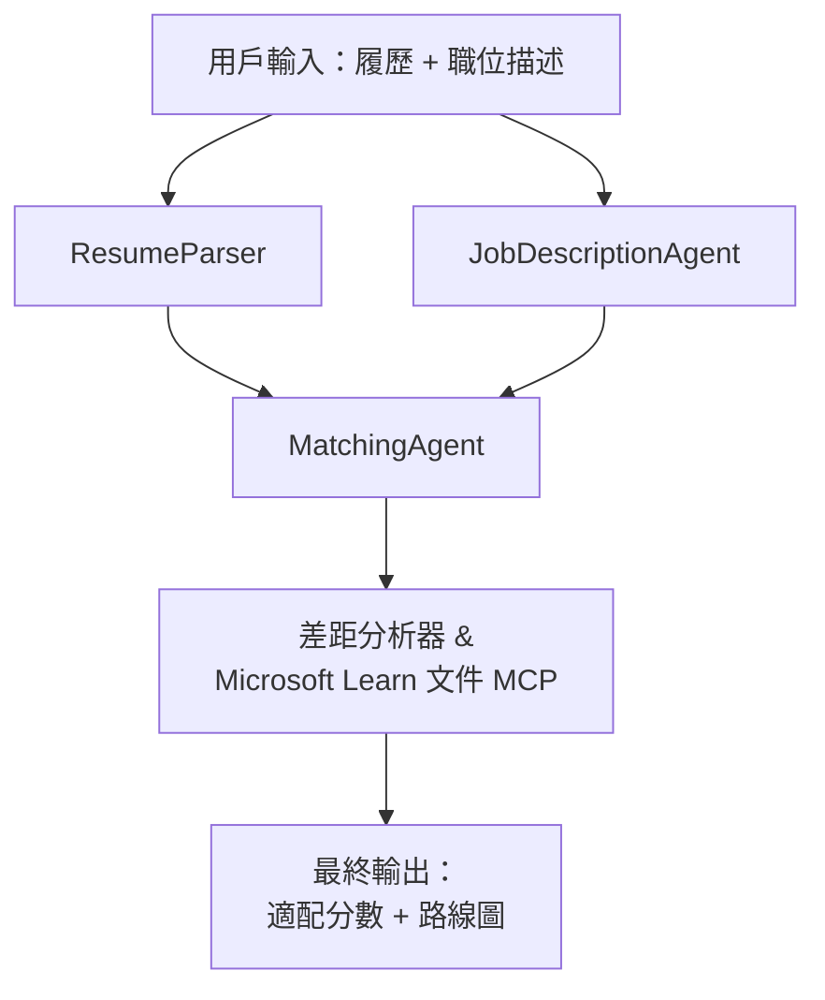

# PersonalCareerCopilot - 履歷 → 職位匹配評估器

一個多代理工作流程，評估履歷與職位描述匹配度，然後生成個人化學習路線圖以彌補差距。

---

## 代理

| 代理 | 角色 | 工具 |
|-------|------|-------|
| **ResumeParser** | 從履歷文本中提取結構化技能、經驗、證書 | - |
| **JobDescriptionAgent** | 從職位描述中提取必需/偏好技能、經驗、證書 | - |
| **MatchingAgent** | 比較個人資料與要求 → 匹配分數 (0-100) + 匹配/缺失技能 | - |
| **GapAnalyzer** | 使用 Microsoft Learn 資源建立個人化學習路線圖 | `search_microsoft_learn_for_plan` (MCP) |

## 工作流程


---

## 快速開始

### 1. 設定環境

```powershell
cd workshop\lab02-multi-agent\PersonalCareerCopilot
python -m venv .venv
.\.venv\Scripts\Activate.ps1          # Windows PowerShell
# source .venv/bin/activate            # macOS / Linux
pip install -r requirements.txt
```

### 2. 配置憑證

複製範例 env 檔，填寫你的 Foundry 專案詳情：

```powershell
cp .env.example .env
```

編輯 `.env`：

```env
PROJECT_ENDPOINT=https://<your-account>.services.ai.azure.com/api/projects/<your-project>
MODEL_DEPLOYMENT_NAME=gpt-4.1-mini
```

| 值 | 獲取位置 |
|-------|-----------------|
| `PROJECT_ENDPOINT` | Microsoft Foundry 側欄於 VS Code → 右鍵點擊你的專案 → <strong>複製專案端點</strong> |
| `MODEL_DEPLOYMENT_NAME` | Foundry 側欄 → 展開專案 → **模型 + 端點** → 部署名稱 |

### 3. 本地運行

```powershell
python -m debugpy --listen 127.0.0.1:5679 -m agentdev run main.py --verbose --port 8088
```

或使用 VS Code 任務：`Ctrl+Shift+P` → **任務：執行任務** → **執行 Lab02 HTTP 伺服器**。

### 4. 使用代理檢視器測試

打開代理檢視器：`Ctrl+Shift+P` → **Foundry 工具包：打開代理檢視器**。

粘貼此測試提示：

```
Resume:
Jane Doe
Senior Software Engineer with 5 years of experience in Python, Django, and AWS.
Built microservices handling 10K+ requests/second. Led a team of 4 developers.
Certifications: AWS Solutions Architect Associate.
Education: B.S. Computer Science, State University.

Job Description:
Senior Cloud Engineer at Contoso Ltd.
Required: Python, Azure, Kubernetes, Terraform, CI/CD pipelines.
Preferred: Go, monitoring (Prometheus/Grafana), cost optimization.
Experience: 5+ years in cloud infrastructure.
Certifications: Azure Solutions Architect Expert preferred.
```

**預期：** 一個匹配分數 (0-100)、匹配/缺失技能，以及帶有 Microsoft Learn 連結的個人化學習路線圖。

### 5. 部署到 Foundry

`Ctrl+Shift+P` → **Microsoft Foundry：部署託管代理** → 選擇你的專案 → 確認。

---

## 專案結構

```
PersonalCareerCopilot/
├── .env.example        ← Template for environment variables
├── .env                ← Your credentials (git-ignored)
├── agent.yaml          ← Hosted agent definition (name, resources, env vars)
├── Dockerfile          ← Container image for Foundry deployment
├── main.py             ← 4-agent workflow (instructions, MCP tool, WorkflowBuilder)
└── requirements.txt    ← Python dependencies
```

## 主要檔案

### `agent.yaml`

定義 Foundry 代理服務的託管代理：
- `kind: hosted` - 以託管容器運行
- `protocols: [responses v1]` - 暴露 `/responses` HTTP 端點
- `environment_variables` - `PROJECT_ENDPOINT` 和 `MODEL_DEPLOYMENT_NAME` 在部署時注入

### `main.py`

包含：
- <strong>代理指令</strong> - 四個 `*_INSTRUCTIONS` 常數，每個代理一個
- **MCP 工具** - `search_microsoft_learn_for_plan()` 通過 Streamable HTTP 調用 `https://learn.microsoft.com/api/mcp`
- <strong>代理創建</strong> - 使用 `AzureAIAgentClient.as_agent()` 的 `create_agents()` 上下文管理器
- <strong>工作流程圖</strong> - `create_workflow()` 使用 `WorkflowBuilder` 將代理以扇出/扇入/序列樣式連接
- <strong>伺服器啟動</strong> - 於 8088 端口調用 `from_agent_framework(agent).run_async()`

### `requirements.txt`

| 套件 | 版本 | 用途 |
|---------|---------|---------|
| `agent-framework-azure-ai` | `1.0.0rc3` | Microsoft Agent Framework 的 Azure AI 整合 |
| `agent-framework-core` | `1.0.0rc3` | 核心執行環境（含 WorkflowBuilder） |
| `azure-ai-agentserver-agentframework` | `1.0.0b16` | 託管代理伺服器執行環境 |
| `azure-ai-agentserver-core` | `1.0.0b16` | 核心代理伺服器抽象層 |
| `debugpy` | 最新版 | Python 偵錯（VS Code F5） |
| `agent-dev-cli` | `--pre` | 本地開發 CLI + 代理檢視器後端 |

---

## 疑難排解

| 問題 | 解決方式 |
|-------|---------|
| `RuntimeError: Missing required environment variable(s)` | 建立 `.env` 並加入 `PROJECT_ENDPOINT` 和 `MODEL_DEPLOYMENT_NAME` |
| `ModuleNotFoundError: No module named 'agent_framework'` | 啟用虛擬環境並執行 `pip install -r requirements.txt` |
| 輸出無 Microsoft Learn 連結 | 確認到 `https://learn.microsoft.com/api/mcp` 的網路連線 |
| 只有一張差距卡片（被截斷） | 確認 `GAP_ANALYZER_INSTRUCTIONS` 包含 `CRITICAL:` 區塊 |
| 8088 埠被佔用 | 停止其他伺服器：`netstat -ano \| findstr :8088` |

詳細疑難排解，請參考 [Module 8 - Troubleshooting](../docs/08-troubleshooting.md)。

---

**完整教程：** [Lab 02 文件](../docs/README.md) · **返回：** [Lab 02 README](../README.md) · [工作坊主頁](../../../README.md)

---

<!-- CO-OP TRANSLATOR DISCLAIMER START -->
**免責聲明**：  
此文件是使用 AI 翻譯服務 [Co-op Translator](https://github.com/Azure/co-op-translator) 進行翻譯。雖然我們盡力確保準確性，但請注意自動翻譯可能包含錯誤或不準確之處。原始文件的母語版本應視為權威來源。對於重要資訊，建議採用專業人工翻譯。我們對因使用此翻譯而引起之任何誤解或誤釋不承擔任何責任。
<!-- CO-OP TRANSLATOR DISCLAIMER END -->