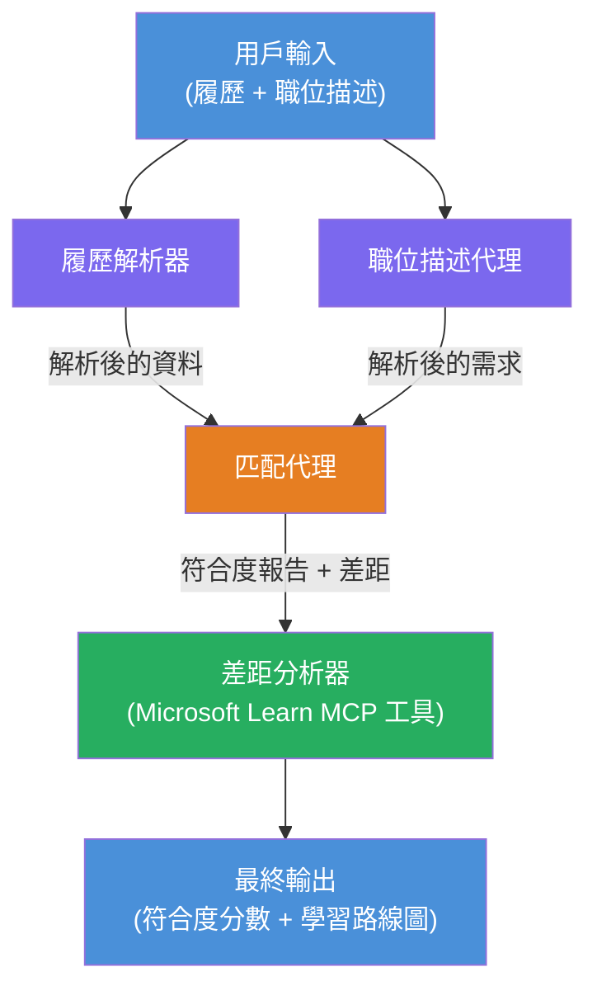

# Lab 02 - 多代理工作流程：履歷 → 職位匹配評估器

---

## 你將建構的內容

一個 **履歷 → 職位匹配評估器** - 一個多代理工作流程，由四個專門代理合作評估應徵者履歷與職位描述的匹配程度，然後生成個人化學習路線圖以補足差距。

### 代理

| 代理 | 角色 |
|-------|------|
| <strong>履歷解析器</strong> | 從履歷文字中提取結構化技能、經驗、認證 |
| <strong>職位描述代理</strong> | 從職位描述提取所需/偏好技能、經驗、認證 |
| <strong>匹配代理</strong> | 比較履歷與要求 → 匹配分數（0-100）＋匹配及缺失技能 |
| <strong>差距分析器</strong> | 建立帶有資源、時間表及快速專案的個人化學習路線圖 |

### 示範流程

上傳 **履歷 + 職位描述** → 取得 **匹配分數 + 缺失技能** → 接收 <strong>個人化學習路線圖</strong>。

### 工作流程架構

> 紫色 = 平行代理 | 橙色 = 聚合點 | 綠色 = 最終工具代理。詳見[模組 1 - 理解架構](docs/01-understand-multi-agent.md)與[模組 4 - 編排模式](docs/04-orchestration-patterns.md)的詳細圖解與資料流程。

### 涵蓋主題

- 使用 **WorkflowBuilder** 建立多代理工作流程
- 定義代理角色與編排流程（平行＋序列）
- 代理間通訊模式
- 使用代理檢視器進行本地測試
- 將多代理工作流程部署至 Foundry Agent Service

---

## 先決條件

請先完成 Lab 01：

- [Lab 01 - 單代理](../lab01-single-agent/README.md)

---

## 開始使用

完整設定說明、程式碼導覽與測試指令請參見：

- [Lab 2 文件 - 先決條件](docs/00-prerequisites.md)
- [Lab 2 文件 - 完整學習路徑](docs/README.md)
- [PersonalCareerCopilot 運行指南](PersonalCareerCopilot/README.md)

## 編排模式（代理替代方案）

Lab 2 包含預設的 **平行 → 聚合 → 規劃** 流程，且文件亦描述替代模式以展現更強的代理行為：

- **扇出/扇入加權共識**
- **最終路線圖前的審查者/評論者流程**
- <strong>條件路由器</strong>（根據匹配分數及缺失技能選擇路徑）

請參見 [docs/04-orchestration-patterns.md](docs/04-orchestration-patterns.md)。

---

**上一則：** [Lab 01 - 單代理](../lab01-single-agent/README.md) · **回到：** [工作坊首頁](../../README.md)

---

<!-- CO-OP TRANSLATOR DISCLAIMER START -->
**免責聲明**：  
本文件由 AI 翻譯服務 [Co-op Translator](https://github.com/Azure/co-op-translator) 進行翻譯。雖然我們致力於確保準確性，但請注意，自動翻譯可能包含錯誤或不準確之處。原始文件的母語版本應視為權威來源。如涉及重要資訊，建議採用專業人工翻譯。我們不對因使用本翻譯而引起的任何誤解或誤釋負責。
<!-- CO-OP TRANSLATOR DISCLAIMER END -->