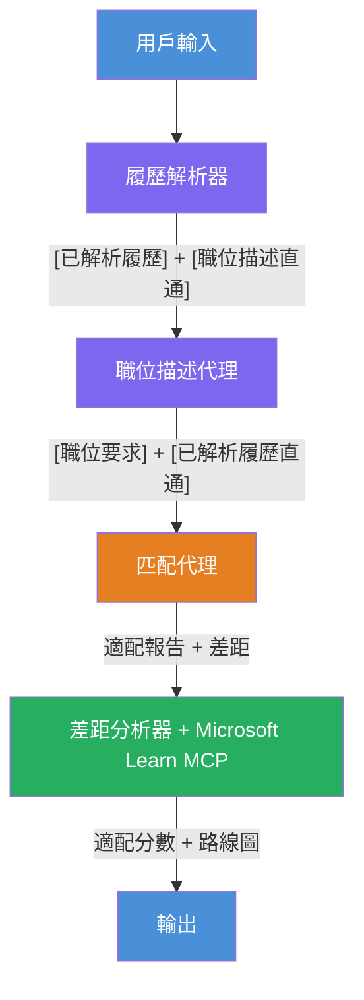

# 實驗 02 - 多代理工作流程：履歷 → 職缺匹配評估器

## 概覽

在這個動手實驗中，你將使用 VS Code 的 Foundry Toolkit 建立一個<strong>以工作流程為先的多代理應用程式</strong>，並將其部署到 Microsoft Foundry Agent Service。

**你將建立的內容：** 一個履歷 → 職缺匹配評估器，能解析履歷和職缺描述，評分匹配度，並利用 Microsoft Learn 資源產出個人化學習路線圖。

---

## 架構

```mermaid
flowchart TD
    A["用戶輸入"] --> B["履歷解析器"]
    B -->|"[已解析履歷] + [職位描述直通]"| C["職位描述代理"]
    C -->|"[職位要求] + [已解析履歷直通]"| D["匹配代理"]
    D -->|適配報告 + 差距| E["差距分析器 + Microsoft Learn MCP"]
    E -->|適配分數 + 路線圖| F["輸出"]

    style A fill:#4A90D9,color:#fff
    style B fill:#7B68EE,color:#fff
    style C fill:#7B68EE,color:#fff
    style D fill:#E67E22,color:#fff
    style E fill:#27AE60,color:#fff
    style F fill:#4A90D9,color:#fff
```

**運作方式：**
1. 使用者貼上履歷和職缺描述。
2. **ResumeParser** 解析履歷，並將職缺描述原文複製到 `[JOB DESCRIPTION PASS-THROUGH]` 區段。
3. **JD Agent** 從傳遞資料中擷取結構化需求，然後將 `[PARSED RESUME]` 轉發為 `[PARSED RESUME PASS-THROUGH]`。
4. **MatchingAgent** 比較 `[PARSED RESUME PASS-THROUGH]` 與 `[JD REQUIREMENTS]`，並產生匹配分數。
5. **GapAnalyzer** 將差距轉成實用路線圖，並透過 MCP 抓取真實的 Microsoft Learn 連結。

---

## 先決條件

請先完成實驗 01：

- [實驗 01 - 單代理](../lab01-single-agent/README.md)

---

## 第 1 部分：依序閱讀模組

查看完整學習路徑：

- [實驗 2 文件 - 先決條件](docs/00-prerequisites.md)
- [實驗 2 文件 - 完整學習路徑](docs/README.md)
- [PersonalCareerCopilot 使用指南](PersonalCareerCopilot/README.md)

---

## 第 2 部分：建立並測試工作流程

1. 使用 Foundry Toolkit 向導產生基於工作流程的專案架構。
2. 從 `PersonalCareerCopilot/main.py` 複製提示區塊和工作流程圖到你的工作區。
3. 使用 Agent Inspector 在本機執行，並驗證四個代理及 MCP 工具。
4. 本機測試通過後，將代理部署至 Foundry 託管。

---

## 編排模式

實驗 02 包含預設的<strong>扇出 → 扇入 → 依序</strong>流程，文件中也描述其他可供實驗的編排模式。

- **帶權重共識的扇出/扇入**
- **最終路線圖前的審查者/評論者通過**
- <strong>基於匹配分數和缺失技能條件的路由器</strong>

請參閱 [docs/04-orchestration-patterns.md](docs/04-orchestration-patterns.md)。

---

**前一章節：** [實驗 01 - 單代理](../lab01-single-agent/README.md) · **回到：** [工作坊首頁](../../README.md)

---

<!-- CO-OP TRANSLATOR DISCLAIMER START -->
**免責聲明**：
本文件由 AI 翻譯服務 [Co-op Translator](https://github.com/Azure/co-op-translator) 翻譯而成。雖然我們致力於確保準確性，但請注意，機器自動翻譯可能包含錯誤或不準確之處。原始文件的母語版本應被視為權威來源。對於重要資訊，建議進行專業人工翻譯。我們不對因使用本翻譯而產生的任何誤解或誤釋承擔責任。
<!-- CO-OP TRANSLATOR DISCLAIMER END -->