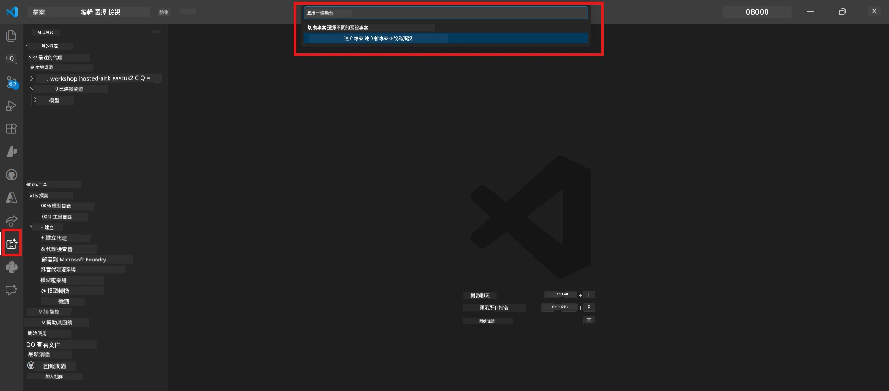

# Module 0 - 先決條件

在開始 Lab 02 之前，請確認您已完成以下事項。此實驗室直接建立在 Lab 01 之上，請勿跳過。

---

## 1. 完成 Lab 01

Lab 02 假設您已經：

- [x] 完成了 [Lab 01 - 單一代理](../../lab01-single-agent/README.md) 的全部 8 個模組
- [x] 成功部署一個單一代理到 Foundry Agent Service
- [x] 驗證該代理在本地代理檢查器（Agent Inspector）和 Foundry Playground 中均可正常工作

如果您尚未完成 Lab 01，請返回完成： [Lab 01 文件](../../lab01-single-agent/docs/00-prerequisites.md)

---

## 2. 驗證現有環境

Lab 01 中的所有工具應仍已安裝且運作正常。請執行以下快速檢查：

### 2.1 Azure CLI

```powershell
az account show --query "{name:name, id:id}" --output table
```

預期結果：顯示您的訂閱名稱與 ID。若失敗，請執行 [`az login`](https://learn.microsoft.com/cli/azure/authenticate-azure-cli-interactively)。

### 2.2 VS Code 擴充功能

1. 按下 `Ctrl+Shift+P` → 輸入 **"Microsoft Foundry"** → 確認您可看到指令（例如 `Microsoft Foundry: Create a New Hosted Agent`）。
2. 按下 `Ctrl+Shift+P` → 輸入 **"Foundry Toolkit"** → 確認您可看到指令（例如 `Foundry Toolkit: Open Agent Inspector`）。

### 2.3 Foundry 專案與模型

1. 點擊 VS Code 側邊欄中的 **Microsoft Foundry** 圖示。
2. 確認您的專案已列出（例如 `workshop-agents`）。
3. 展開專案 → 驗證是否有已部署的模型存在（例如 `gpt-4.1-mini`），狀態為 **Succeeded**。

> **若您的模型部署已過期：** 部分免費方案的部署會自動到期。請從 [模型目錄](https://learn.microsoft.com/azure/foundry/foundry-models/concepts/models-sold-directly-by-azure) 重新部署（`Ctrl+Shift+P` → **Microsoft Foundry: Open Model Catalog**）。



### 2.4 RBAC 角色

確認您在 Foundry 專案中擁有 **Azure AI User** 角色：

1. 進入 [Azure 入口網站](https://portal.azure.com) → 您的 Foundry <strong>專案</strong> 資源 → **存取控制 (IAM)** → **[角色指派](https://learn.microsoft.com/azure/foundry/concepts/rbac-foundry)** 頁籤。
2. 搜尋您的名稱 → 確認有列出 **[Azure AI User](https://aka.ms/foundry-ext-project-role)**。

---

## 3. 了解多代理概念（Lab 02 新增）

Lab 02 導入了 Lab 01 未涵蓋的新概念。請先閱讀以下內容再繼續：

### 3.1 什麼是多代理工作流程？

不是由單一代理處理所有事項，而是透過多個專門代理分工合作。每個代理有：

- 自己的 <strong>指令</strong>（系統提示）
- 自己的 <strong>角色</strong>（負責的任務）
- 選擇性的 <strong>工具</strong>（可呼叫的函式）

這些代理依靠一個定義數據流動向的 <strong>編排圖</strong> 進行通訊。

### 3.2 WorkflowBuilder

來自 `agent_framework` 的 [`WorkflowBuilder`](https://learn.microsoft.com/agent-framework/workflows/agents-in-workflows) 類別是將代理串接起來的 SDK 元件：

```python
from agent_framework import WorkflowBuilder

workflow = (
    WorkflowBuilder(
        name="MyWorkflow",
        start_executor=agent_a,
        output_executors=[agent_d],
    )
    .add_edge(agent_a, agent_b)
    .add_edge(agent_a, agent_c)
    .add_edge(agent_b, agent_d)
    .add_edge(agent_c, agent_d)
    .build()
)
```

- **`start_executor`** - 第一個接收使用者輸入的代理
- **`output_executors`** - 輸出成為最終回應的代理(s)
- **`add_edge(source, target)`** - 定義 `target` 會接收 `source` 的輸出

### 3.3 MCP（模型脈絡協議）工具

Lab 02 使用一個 MCP 工具，會呼叫 Microsoft Learn API 以取得學習資源。[MCP（Model Context Protocol）](https://modelcontextprotocol.io/introduction) 是一個連結 AI 模型與外部資料與工具的標準化協議。

| 術語 | 定義 |
|------|-----------|
| **MCP 伺服器** | 透過 [MCP 協議](https://learn.microsoft.com/azure/foundry/agents/how-to/tools/model-context-protocol) 來暴露工具/資源的服務 |
| **MCP 用戶端** | 連接 MCP 伺服器並呼叫其工具的代理代碼 |
| **[可串流 HTTP](https://learn.microsoft.com/agent-framework/agents/tools/hosted-mcp-tools)** | 與 MCP 伺服器通訊所使用的傳輸方法 |

### 3.4 Lab 02 與 Lab 01 的不同

| 特色 | Lab 01（單一代理） | Lab 02（多代理） |
|--------|----------------------|---------------------|
| 代理數量 | 1 | 4（專門角色） |
| 編排 | 無 | WorkflowBuilder（並行 + 順序） |
| 工具 | 選用的 `@tool` 函數 | MCP 工具（外部 API 呼叫） |
| 複雜度 | 單一提示 → 回應 | 履歷 + 工作描述 → 適合度評分 → 發展路線圖 |
| 上下文流程 | 直接傳遞 | 代理間交接 |

---

## 4. Lab 02 的工作坊程式碼結構

務必知道 Lab 02 檔案存放位置：

```
workshop/
└── lab02-multi-agent/
    ├── README.md                       ← Lab overview
    ├── docs/                           ← You are here
    │   ├── README.md                   ← Learning path index
    │   ├── 00-prerequisites.md         ← This file
    │   ├── 01-understand-multi-agent.md
    │   ├── ...
    │   └── 08-troubleshooting.md
    └── PersonalCareerCopilot/          ← The agent project
        ├── agent.yaml                  ← Agent definition
        ├── main.py                     ← 4-agent workflow code
        ├── Dockerfile                  ← Container configuration
        └── requirements.txt            ← Python dependencies
```

---

### 檢查點

- [ ] 完成 Lab 01（全部 8 個模組，代理已部署且驗證成功）
- [ ] `az account show` 能夠返回您的訂閱資訊
- [ ] 已安裝並能正常使用 Microsoft Foundry 和 Foundry Toolkit 擴充功能
- [ ] Foundry 專案中已有已部署模型（例如 `gpt-4.1-mini`）
- [ ] 您在專案中擁有 **Azure AI User** 角色
- [ ] 已閱讀以上多代理概念章節，了解 WorkflowBuilder、MCP 及代理編排

---

**接下來：** [01 - 了解多代理架構 →](01-understand-multi-agent.md)

---

<!-- CO-OP TRANSLATOR DISCLAIMER START -->
**免責聲明**：  
本文件係使用 AI 翻譯服務 [Co-op Translator](https://github.com/Azure/co-op-translator) 進行翻譯。雖然我們致力於提供準確翻譯，請注意自動翻譯可能包含錯誤或不準確之處。原始文件之母語版本應被視為權威來源。對於關鍵資訊，建議諮詢專業人工翻譯。對於因使用此翻譯而引起的任何誤解或曲解，我們概不負責。
<!-- CO-OP TRANSLATOR DISCLAIMER END -->