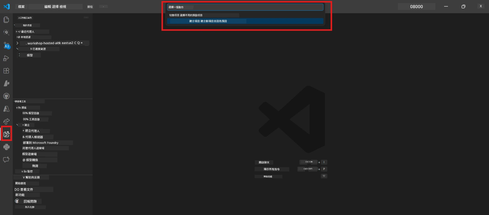

# 模組 0 - 介紹

⏱️ 約 10 分鐘

> [!WARNING]
> **預覽及限制：** [Hosted Agents](https://learn.microsoft.com/azure/foundry/agents/concepts/hosted-agents) 目前處於 <strong>公開預覽</strong> 階段－不建議用於生產工作負載。本工作坊展示的某些功能可能會隨著服務朝向正式發布而有所變更。

## 你將會建構什麼

在此實驗中，你將擴展實驗室 01 的單一代理技能，構建一個 <strong>多代理工作流程</strong>－履歷 → 工作匹配評估器。

你會貼上 <strong>履歷</strong> 及 <strong>工作描述</strong>。四個專門代理依序處理輸入，然後回傳：
- 一個匹配分數（0–100，含得分分解）
- 技能與證照差距清單
- 針對每個差距提供搭配實際 Microsoft Learn 連結的個人化學習路線圖

**此工作流程使用了：**
- **Microsoft Agent Framework** - 使用 `WorkflowBuilder` 進行序列化流程編排
- **Foundry Toolkit for VS Code** - 腳手架、在地測試、部署
- **AI 模型**（例如 `gpt-4.1-mini`）- 四個代理共用
- **Microsoft Learn MCP 伺服器** - 提供每項技能差距的實際學習資源連結

---

## 選擇你的路線

> ⚠️ **請繼續使用你在實驗室 01 中使用的相同路線。**

<details open>
<summary><strong>🅰️ 路線 A - Azure 雲端（需要 Azure 訂閱）</strong></summary>

| | 詳情 |
|---|---|
| <strong>適合對象</strong> | 你使用 Azure 訂閱完成了實驗室 01 |
| <strong>模型</strong> | 透過 Foundry 使用 Azure OpenAI（例如 `gpt-4.1-mini`） |
| <strong>涵蓋模組</strong> | 所有模組（00–09） |
| **是否部署到雲端？** | ✅ 是 - 完整端到端部署 |

</details>

<details open>
<summary><strong>🅱️ 路線 B - Foundry 本地端（無需 Azure 訂閱）</strong></summary>

| | 詳情 |
|---|---|
| <strong>適合對象</strong> | 你使用 Foundry 本地端完成了實驗室 01 |
| <strong>模型</strong> | Foundry 本地端（免費，在你的電腦上執行） |
| <strong>涵蓋模組</strong> | 00–05 模組（跳過 06–07 部署與雲端驗證） |
| **是否部署到雲端？** | ❌ 否 - 僅在地透過 Agent Inspector 測試 |

</details>

---

## 實驗室 01 檢查

實驗室 02 是直接建立在實驗室 01 上。請先完成實驗室 01 再從這裡開始。

還沒做實驗室 01？請從這開始：[Lab 01 - Introduction](../../lab01-single-agent/docs/00-prerequisites.md)

<details open>
<summary><strong>🅰️ 路線 A - Azure 雲端</strong></summary>

```powershell
az account show --query "{name:name, id:id}" --output table
```

如果失敗，請先執行 `az login`。然後在 VS Code 中確認：

1. 按 `Ctrl+Shift+P` → 輸入 **Foundry Toolkit** → 確認相關命令出現。
2. 點擊 **Foundry Toolkit** 圖示 → 你的專案和已部署模型顯示 **Succeeded**。



> **RBAC：** 你在實驗室 01 裡分配了 **Foundry User**。若需重新分配，請參考 [Lab 01, Module 1](../../lab01-single-agent/docs/01-setup.md#deploy-a-model--assign-rbac)。此角色之前名為 **Azure AI User**，權限相同。

</details>

<details open>
<summary><strong>🅱️ 路線 B - Foundry 本地端</strong></summary>

```powershell
Invoke-WebRequest -Uri "http://localhost:5273/v1/health" -UseBasicParsing | Select-Object StatusCode
```

預期結果：`StatusCode: 200`。若否，請從 Foundry Toolkit 側欄重新啟動 Foundry 本地端。

> 所有推論皆在你的機器上運行。唯一的外部呼叫是 MCP 工具至 `https://learn.microsoft.com/api/mcp`。

</details>

---

## 實驗室 02 有什麼新內容

| | 實驗室 01 | 實驗室 02 |
|--|--------|--------|
| 代理數量 | 1 | 4 （使用 WorkflowBuilder 串接） |
| 腳手架模板 | 基本 - Agent Framework | 工作流程 - Agent Framework |
| 新增套件 | - | `mcp` |
| 編排方式 | 單一對話代理 | 序列管線（WorkflowBuilder） |
| 新工具 | - | `search_microsoft_learn_for_plan`（MCP） |

---

**下一步：** [01 - 理解架構 →](01-understand-multi-agent.md)

---

<!-- CO-OP TRANSLATOR DISCLAIMER START -->
**免責聲明**：
本文件由 AI 翻譯服務 [Co-op Translator](https://github.com/Azure/co-op-translator) 翻譯而成。雖然我們致力於確保準確性，但請注意，機器自動翻譯可能包含錯誤或不準確之處。原始文件的母語版本應被視為權威來源。對於重要資訊，建議進行專業人工翻譯。我們不對因使用本翻譯而產生的任何誤解或誤釋承擔責任。
<!-- CO-OP TRANSLATOR DISCLAIMER END -->