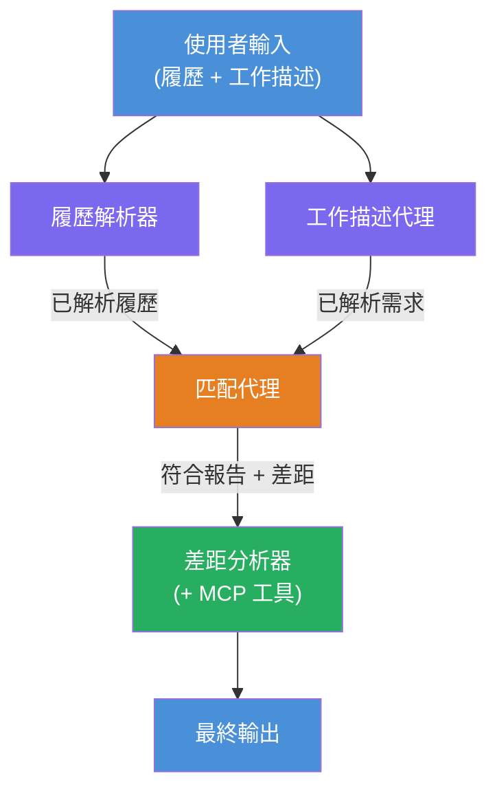
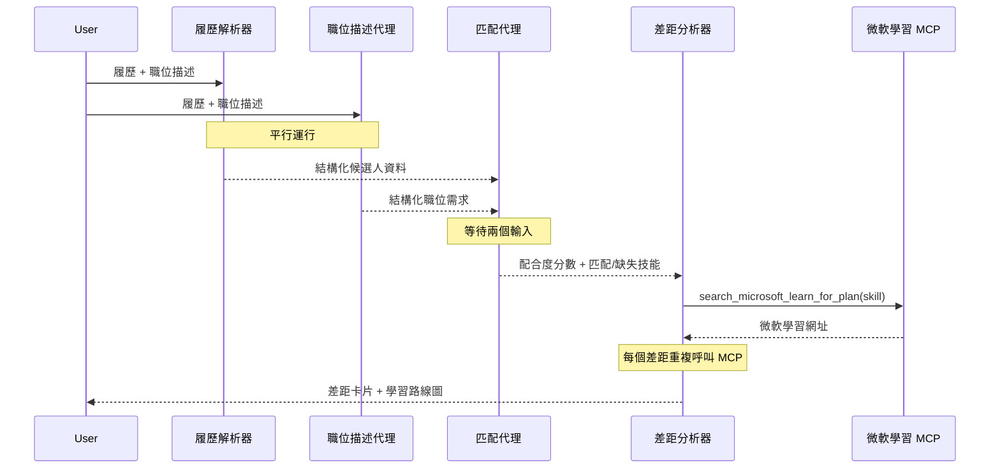
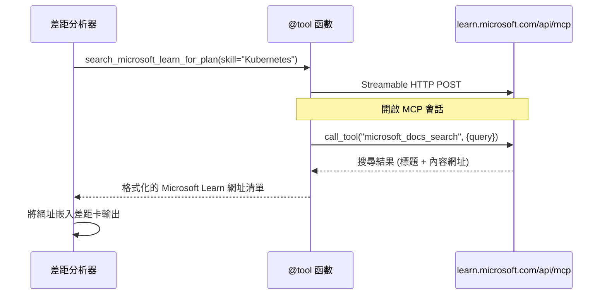

# Module 1 - 了解多代理架構

在本模組中，您將在撰寫任何程式碼之前學習 Resume → Job Fit Evaluator 的架構。了解編排圖、代理角色和資料流對於除錯和擴充[多代理工作流程](https://learn.microsoft.com/azure/architecture/ai-ml/idea/multiple-agent-workflow-automation)至關重要。

---

## 這解決的問題

將履歷與職缺描述相匹配涉及多個不同技能：

1. <strong>解析</strong> - 從非結構化文字（履歷）中提取結構化資料
2. <strong>分析</strong> - 從職缺描述中提取需求
3. <strong>比較</strong> - 評分兩者的匹配度
4. <strong>規劃</strong> - 建立學習路線圖以彌補差距

一個代理在同一提示中同時完成這四個任務常會產生：
- 不完整的提取（為了計算分數而匆忙進行解析）
- 浅層的評分（沒有基於證據的分解）
- 通用的路線圖（未針對具體差距量身定制）

透過將任務拆分成<strong>四個專門代理</strong>，每個代理專注於其任務並有專門的指示，在每個階段產生更高品質的輸出。

---

## 四個代理

每個代理都是透過 `AzureAIAgentClient.as_agent()` 創建完整的[Microsoft Foundry](https://learn.microsoft.com/azure/foundry/agents/concepts/hosted-agents)代理。它們共用相同模型部署，但擁有不同的指令及（可選）不同的工具。

| # | 代理名稱 | 角色 | 輸入 | 輸出 |
|---|----------|------|-------|--------|
| 1 | **ResumeParser** | 從履歷文字中提取結構化資料 | 原始履歷文字（來自用戶） | 候選人概況、技術技能、軟技能、證書、領域經驗、成就 |
| 2 | **JobDescriptionAgent** | 從職缺描述提取結構化需求 | 原始職缺描述文字（來自用戶，經 ResumeParser 轉發） | 職務概覽、必需技能、優先技能、經驗、證書、教育、職責 |
| 3 | **MatchingAgent** | 計算基於證據的匹配評分 | 來自 ResumeParser + JobDescriptionAgent 的輸出 | 匹配分數（0-100 與明細），匹配技能，缺少技能，差距 |
| 4 | **GapAnalyzer** | 建立個人化學習路線圖 | 來自 MatchingAgent 的輸出 | 差距卡（每個技能）、學習順序、時間表、微軟學習資源 |

---

## 編排圖

工作流程採用<strong>平行分派</strong>接著是<strong>序列聚合</strong>：


> **圖例：** 紫色 = 平行代理，橙色 = 聚合點，綠色 = 具工具的最終代理

### 資料如何流動


1. <strong>用戶發送</strong>包含履歷與職缺描述的訊息。
2. **ResumeParser** 接收完整用戶輸入，並提取結構化候選人概況。
3. **JobDescriptionAgent** 平行接收用戶輸入並提取結構化需求。
4. **MatchingAgent** 接收 **ResumeParser** 和 **JobDescriptionAgent** 兩者輸出（框架等待兩者皆完成後執行 MatchingAgent）。
5. **GapAnalyzer** 接收 MatchingAgent 的輸出，呼叫 **Microsoft Learn MCP 工具** 為每個差距取得實際學習資源。
6. <strong>最終輸出</strong> 是 GapAnalyzer 的回應，其中包含匹配分數、差距卡和完整學習路線圖。

### 為何平行分派很重要

ResumeParser 與 JobDescriptionAgent 是<strong>平行</strong>執行，因為彼此互不依賴。這樣可以：
- 降低總延遲（兩者同時執行，而非依序）
- 這是自然的拆分（解析履歷和解析職缺是獨立任務）
- 展示常見多代理模式：**分派 → 聚合 → 行動**

---

## WorkflowBuilder 在程式碼中的映射

以下是上面圖形如何映射到 `main.py` 中 [`WorkflowBuilder`](https://learn.microsoft.com/agent-framework/workflows/agents-in-workflows) API 調用：

```python
from agent_framework import WorkflowBuilder

workflow = (
    WorkflowBuilder(
        name="ResumeJobFitEvaluator",
        start_executor=resume_parser,       # 首個接收用戶輸入的代理
        output_executors=[gap_analyzer],     # 輸出結果會被傳回的最終代理
    )
    .add_edge(resume_parser, jd_agent)      # 履歷解析器 → 職位描述代理
    .add_edge(resume_parser, matching_agent) # 履歷解析器 → 匹配代理
    .add_edge(jd_agent, matching_agent)      # 職位描述代理 → 匹配代理
    .add_edge(matching_agent, gap_analyzer)  # 匹配代理 → 差距分析器
    .build()
)
```

**理解邊的含義：**

| 邊 | 含義 |
|------|--------------|
| `resume_parser → jd_agent` | JD Agent 接收 ResumeParser 的輸出 |
| `resume_parser → matching_agent` | MatchingAgent 接收 ResumeParser 的輸出 |
| `jd_agent → matching_agent` | MatchingAgent 也接收 JD Agent 的輸出（等待兩者完成） |
| `matching_agent → gap_analyzer` | GapAnalyzer 接收 MatchingAgent 的輸出 |

因 MatchingAgent 有<strong>兩條輸入邊</strong>（`resume_parser` 和 `jd_agent`），框架會等待兩者皆完成後才執行 MatchingAgent。

---

## MCP 工具

GapAnalyzer 代理使用一個工具：`search_microsoft_learn_for_plan`。這是一個<strong>[MCP 工具](https://learn.microsoft.com/agent-framework/agents/tools/hosted-mcp-tools)</strong>，呼叫 Microsoft Learn API 以獲取策劃學習資源。

### 工作流程

```python
@tool
async def search_microsoft_learn_for_plan(
    skill: str, role: str = "", max_results: int = 5
) -> str:
    """Search Microsoft Learn MCP and return curated official links."""
    # 透過可串流的 HTTP 連接至 https://learn.microsoft.com/api/mcp
    # 在 MCP 伺服器上調用 'microsoft_docs_search' 工具
    # 返回格式化的 Microsoft Learn 網址列表
```

### MCP 呼叫流程


1. GapAnalyzer 判斷需要某技能（例如 "Kubernetes"）的學習資源
2. 框架呼叫 `search_microsoft_learn_for_plan(skill="Kubernetes")`
3. 此函數開啟到 `https://learn.microsoft.com/api/mcp` 的[可串流 HTTP](https://learn.microsoft.com/agent-framework/agents/tools/hosted-mcp-tools)連線
4. 它在 [MCP 伺服器](https://learn.microsoft.com/azure/foundry/agents/how-to/tools/model-context-protocol)呼叫 `microsoft_docs_search` 工具
5. MCP 伺服器回傳搜尋結果（標題 + URL）
6. 函數整理結果並以字串形式返回
7. GapAnalyzer 在差距卡輸出中使用回傳的 URL

### 預期 MCP 日誌

工具運行時，您會看到如下一些日誌：

```
GET https://learn.microsoft.com/api/mcp → 405 (Method Not Allowed)
POST https://learn.microsoft.com/api/mcp → 200
DELETE https://learn.microsoft.com/api/mcp → 405 (Method Not Allowed)
```

**這些是正常的。** MCP 用戶端在初始化期間用 GET 和 DELETE 探測 - 返回 405 是預期行為。正式工具呼叫使用 POST 且返回 200。只有在 POST 呼叫失敗時才需擔心。

---

## 代理創建範例

每個代理都是使用**[`AzureAIAgentClient.as_agent()`](https://learn.microsoft.com/python/api/overview/azure/ai-agents-readme) 非同步上下文管理器**創建。這是 Foundry SDK 創建代理、自動清理的範例：

```python
async with (
    get_credential() as credential,
    AzureAIAgentClient(
        project_endpoint=PROJECT_ENDPOINT,
        model_deployment_name=MODEL_DEPLOYMENT_NAME,
        credential=credential,
    ).as_agent(
        name="ResumeParser",
        instructions=RESUME_PARSER_INSTRUCTIONS,
    ) as resume_parser,
    # ... 為每個代理重複 ...
):
    # 所有4個代理都存在於此
    workflow = create_workflow(resume_parser, jd_agent, matching_agent, gap_analyzer)
```

**重點：**
- 每個代理都有自己的 `AzureAIAgentClient` 實例（SDK 需代理名限於該用戶端範圍）
- 所有代理共用相同的 `credential`、`PROJECT_ENDPOINT` 和 `MODEL_DEPLOYMENT_NAME`
- `async with` 區塊確保伺服器關閉時所有代理被清理
- GapAnalyzer 額外接收 `tools=[search_microsoft_learn_for_plan]`

---

## 伺服器啟動

在創建代理並建立工作流程後，伺服器啟動：

```python
from azure.ai.agentserver.agentframework import from_agent_framework

agent = create_workflow(resume_parser, jd_agent, matching_agent, gap_analyzer)
await from_agent_framework(agent).run_async()
```

`from_agent_framework()` 將工作流程包裝為 HTTP 伺服器，暴露 `/responses` 端點於 8088 端口。此模式與 Lab 01 相同，只是「代理」變成整個 [工作流程圖](https://learn.microsoft.com/agent-framework/workflows/as-agents)。

---

### 檢查點

- [ ] 您了解 4 代理架構及各代理角色
- [ ] 您能追蹤資料流：用戶 → ResumeParser →（平行）JD Agent + MatchingAgent → GapAnalyzer → 輸出
- [ ] 您了解為何 MatchingAgent 等待 ResumeParser 和 JD Agent（兩個輸入邊）
- [ ] 您了解 MCP 工具：它的用途，如何呼叫，以及 GET 405 日誌是正常的
- [ ] 您了解 `AzureAIAgentClient.as_agent()` 模式，以及為何每個代理有自己的用戶端實例
- [ ] 您能閱讀 `WorkflowBuilder` 程式碼並對應視覺圖

---

**上一章節：** [00 - 先決條件](00-prerequisites.md) · **下一章節：** [02 - 搭建多代理專案 →](02-scaffold-multi-agent.md)

---

<!-- CO-OP TRANSLATOR DISCLAIMER START -->
**免責聲明**：  
本文件乃使用 AI 翻譯服務 [Co-op Translator](https://github.com/Azure/co-op-translator) 進行翻譯。雖然我們致力於準確性，但請注意，自動翻譯可能包含錯誤或不準確之處。原文文件的母語版本應被視為具有權威性的資料來源。對於重要資料，建議使用專業人工翻譯。對於因使用本翻譯所引致的任何誤解或曲解，我們概不負責。
<!-- CO-OP TRANSLATOR DISCLAIMER END -->