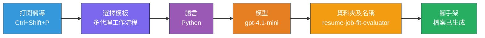
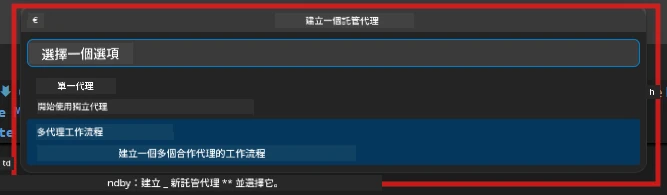

# Module 2 - 搭建多智能體專案骨架

在本模組中，您將使用 [Microsoft Foundry 擴充功能](https://marketplace.visualstudio.com/items?itemName=TeamsDevApp.vscode-ai-foundry)來<strong>搭建多智能體工作流程專案的骨架</strong>。該擴充功能會產生整個專案結構——`agent.yaml`、`main.py`、`Dockerfile`、`requirements.txt`、`.env` 和偵錯設定。您會在模組 3 和 4 中自訂這些檔案。

> **注意：** 本實驗的 `PersonalCareerCopilot/` 資料夾是完整且可正常運作的自訂多智能體專案範例。您可以選擇搭建全新專案（建議用於學習），或直接研究現有程式碼。

---

## 步驟 1：開啟「建立託管代理」精靈


1. 按下 `Ctrl+Shift+P` 以開啟 <strong>指令面板</strong>。
2. 輸入：**Microsoft Foundry: Create a New Hosted Agent** 並選擇它。
3. 「建立託管代理」精靈開啟。

> **替代方案：** 點選活動列上的 **Microsoft Foundry** 圖示 → 在 **Agents** 旁按下 **+** 圖示 → 選擇 **Create New Hosted Agent**。

---

## 步驟 2：選擇多智能體工作流程範本

精靈會請您選擇一個範本：

| 範本 | 描述 | 適用時機 |
|----------|-------------|-------------|
| 單一代理 | 一個代理，帶有指令與可選工具 | 實驗 01 |
| <strong>多智能體工作流程</strong> | 多個代理透過 WorkflowBuilder 協同作業 | **本實驗（實驗 02）** |

1. 選擇 <strong>多智能體工作流程</strong>。
2. 點選 <strong>下一步</strong>。



---

## 步驟 3：選擇程式語言

1. 選擇 **Python**。
2. 點選 <strong>下一步</strong>。

---

## 步驟 4：選擇您的模型

1. 精靈會顯示 Foundry 專案中部署的模型。
2. 選擇您在實驗 01 中使用的同一模型（例如 **gpt-4.1-mini**）。
3. 點選 <strong>下一步</strong>。

> **提示：** [`gpt-4.1-mini`](https://learn.microsoft.com/azure/foundry/foundry-models/concepts/models-sold-directly-by-azure#gpt-41-series) 推薦用於開發，速度快、成本低且適合多智能體工作流程。如果您需要更高品質輸出，做最後正式部署時可切換到 `gpt-4.1`。

---

## 步驟 5：選擇資料夾位置與代理名稱

1. 會開啟檔案對話視窗，選擇目標資料夾：
   - 如果跟著工作坊專案練習：導航至 `workshop/lab02-multi-agent/`，並建立新子資料夾
   - 如果全新開始：可任意選擇資料夾
2. 輸入託管代理的<strong>名稱</strong>（例如 `resume-job-fit-evaluator`）。
3. 點擊 <strong>建立</strong>。

---

## 步驟 6：等待骨架搭建完成

1. VS Code 會開啟新視窗（或更新目前視窗），並載入骨架專案。
2. 您應該會看到此檔案結構：

```
resume-job-fit-evaluator/
├── .env                ← Environment variables (placeholders)
├── .vscode/
│   └── launch.json     ← Debug configuration
├── agent.yaml          ← Agent definition (kind: hosted)
├── Dockerfile          ← Container configuration
├── main.py             ← Multi-agent workflow code (scaffold)
└── requirements.txt    ← Python dependencies
```

> **工作坊備註：** 在工作坊的程式庫中，`.vscode/` 資料夾位於<strong>工作區根目錄</strong>，包含共用的 `launch.json` 與 `tasks.json`。實驗 01 與實驗 02 的偵錯設定皆已包含。按下 F5 時，從下拉式選單選擇 **"Lab02 - Multi-Agent"**。

---

## 步驟 7：了解骨架檔案（多智能體特定）

多智能體骨架與單智能體骨架有以下主要差異：

### 7.1 `agent.yaml` - 代理定義

```yaml
kind: hosted
name: resume-job-fit-evaluator
description: >
  A multi-agent workflow that evaluates resume-to-job fit.
metadata:
  authors:
    - Microsoft
  tags:
    - Multi-Agent Workflow
    - Resume Evaluator
protocols:
  - protocol: responses
    version: v1
environment_variables:
  - name: PROJECT_ENDPOINT
    value: ${PROJECT_ENDPOINT}
  - name: MODEL_DEPLOYMENT_NAME
    value: ${MODEL_DEPLOYMENT_NAME}
```

**與實驗 01 的主要差異：** `environment_variables` 區段可能包含 MCP 端點或其他工具設定的額外變數。`name` 與 `description` 反映了多智能體的使用情境。

### 7.2 `main.py` - 多智能體工作流程程式碼

骨架包含：
- <strong>多個代理指令字串</strong>（每個代理都有一個常數）
- **多個 [`AzureAIAgentClient.as_agent()`](https://learn.microsoft.com/python/api/overview/azure/ai-agents-readme) 內容管理器**（每個代理一個）
- **[`WorkflowBuilder`](https://learn.microsoft.com/agent-framework/workflows/agents-in-workflows)** 來串聯各代理
- **`from_agent_framework()`** 以 HTTP 端點服務方式部署工作流程

```python
from agent_framework import WorkflowBuilder, tool
from agent_framework.azure import AzureAIAgentClient
from azure.ai.agentserver.agentframework import from_agent_framework
```

額外匯入的 [`WorkflowBuilder`](https://learn.microsoft.com/agent-framework/workflows/agents-in-workflows) 是本實驗與實驗 01 的新差異。

### 7.3 `requirements.txt` - 其他相依套件

多智能體專案使用與實驗 01 相同的基礎套件，與任何 MCP 相關套件：

```
agent-framework-azure-ai==1.0.0rc3
agent-framework-core==1.0.0rc3
azure-ai-agentserver-agentframework==1.0.0b16
azure-ai-agentserver-core==1.0.0b16
debugpy
agent-dev-cli --pre
```

> **重要版本說明：** `agent-dev-cli` 套件需要在 `requirements.txt` 使用 `--pre` 參數，才能安裝最新預覽版本。這是為了確保 Agent Inspector 能與 `agent-framework-core==1.0.0rc3` 相容。版本詳情請見 [模組 8 - 疑難排解](08-troubleshooting.md)。

| 套件 | 版本 | 用途 |
|---------|---------|---------|
| [`agent-framework-azure-ai`](https://learn.microsoft.com/agent-framework/overview/) | `1.0.0rc3` | 為 [Microsoft Agent Framework](https://github.com/microsoft/agent-framework) 提供 Azure AI 整合 |
| [`agent-framework-core`](https://learn.microsoft.com/agent-framework/overview/) | `1.0.0rc3` | 核心執行環境（包含 WorkflowBuilder） |
| `azure-ai-agentserver-agentframework` | `1.0.0b16` | 託管代理伺服器執行環境 |
| `azure-ai-agentserver-core` | `1.0.0b16` | 代理伺服器核心抽象層 |
| `debugpy` | 最新版 | Python 偵錯工具（VS Code F5） |
| `agent-dev-cli` | `--pre` | 本機開發 CLI 及 Agent Inspector 後端 |

### 7.4 `Dockerfile` - 與實驗 01 相同

Dockerfile 與實驗 01 相同——複製檔案、安裝 `requirements.txt` 內的相依、開放 8088 埠，並執行 `python main.py`。

```dockerfile
FROM python:3.14-slim
WORKDIR /app
COPY ./ .
RUN pip install --upgrade pip && \
    if [ -f requirements.txt ]; then \
        pip install -r requirements.txt; \
    else \
      echo "No requirements.txt found" >&2; exit 1; \
    fi
EXPOSE 8088
CMD ["python", "main.py"]
```

---

### 檢查點

- [ ] 完成骨架精靈 → 見到新專案結構
- [ ] 能看到所有檔案：`agent.yaml`、`main.py`、`Dockerfile`、`requirements.txt`、`.env`
- [ ] `main.py` 有匯入 `WorkflowBuilder` （確定選擇多智能體範本）
- [ ] `requirements.txt` 同時包含 `agent-framework-core` 與 `agent-framework-azure-ai`
- [ ] 了解多智能體骨架與單智能體骨架差異（多個代理、WorkflowBuilder、MCP 工具）

---

**上一篇：** [01 - 了解多智能體架構](01-understand-multi-agent.md) · **下一篇：** [03 - 設定代理與環境 →](03-configure-agents.md)

---

<!-- CO-OP TRANSLATOR DISCLAIMER START -->
**免責聲明**：
此文件乃使用 AI 翻譯服務 [Co-op Translator](https://github.com/Azure/co-op-translator) 進行翻譯。雖然我們力求準確，但請注意自動翻譯可能包含錯誤或不準確之處。原始文件的母語版本應被視為權威來源。對於關鍵資訊，建議採用專業人工翻譯。本公司不對因使用此翻譯而產生的任何誤解或誤釋負責。
<!-- CO-OP TRANSLATOR DISCLAIMER END -->