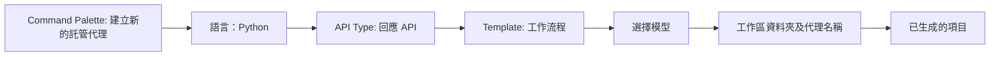
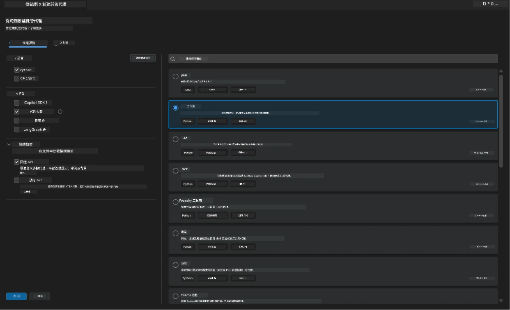
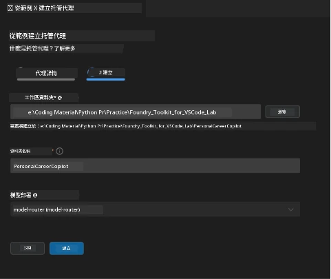

# 模組 2 - 搭建多代理項目骨架

⏱️ 約 5 分鐘

在本模組中，您將使用 [Foundry Toolkit for VS Code](https://aka.ms/foundrytk) <strong>搭建多代理項目骨架</strong>。精靈會生成 `agent.yaml`、`main.py`、`Dockerfile`、`requirements.txt`、`.env` 和 VS Code 調試配置 —— 讓您可以專注於在模組 3 中接線四代理工作流。

> **核心概念：** 搭建的骨架是一個帶有一個代理的可運行存根。您會在模組 3 中用 `WorkflowBuilder` 圖替換佔位符邏輯。您無需從頭編寫樣板代碼。

> **參考實現：** [`PersonalCareerCopilot/`](../../../../../workshop/lab02-multi-agent/PersonalCareerCopilot) 是一個完整的工作示例。在實踐中可以用來與您的工作進行比較。

### 搭建精靈流程


```mermaid
flowchart LR
    A[Command Palette: 建立新的託管代理] --> B[語言：Python]
    B --> C[API Type: 回應 API]
    C --> D[Template: 工作流程]
    D --> E[選擇模型]
    E --> F[工作區資料夾及代理名稱]
    F --> G[已生成的項目]
```

---

## 步驟 1：打開創建托管代理精靈

1. 按 `Ctrl+Shift+P` 打開 <strong>命令面板</strong>。
2. 輸入：**Foundry Toolkit: Create a New Hosted Agent** 並選擇它。
3. 精靈會在 <strong>代理詳情</strong> 標籤頁中打開。

> **替代方法：** 點擊活動欄中的 **Foundry Toolkit** 圖標 → 點擊 **Hosted Agents** 旁的 **+** 圖標 → **Create New Hosted Agent**。

---

## 步驟 2：選擇設置



1. 在左側導航/選項區域選擇以下項目：

| 菜單 | 選擇 | 備註 |
|--------|-----------|-------|
| <strong>語言</strong> | Python | 也支持 C# (.NET) |
| <strong>框架</strong> | Agent Framework | 提供 `Agent`、`AgentExecutor`、`WorkflowBuilder` |
| **API 類型** | Response API | `POST /responses` - 平台管理歷史記錄，支持流式傳輸 |
| <strong>範本</strong> | **Workflows** | 按順序通過多個代理處理請求 |

2. 選擇完成後，點擊 <strong>下一步</strong>



3. 在下一個視窗中，選擇以下項目：

| 菜單 | 選擇 | 備註 |
|--------|-----------|-------|
| <strong>工作區資料夾</strong> | 瀏覽到目標資料夾 | 例如本倉庫中的 `workshop/lab02-multi-agent/` |
| <strong>代理名稱</strong> | `PersonalCareerCopilot` | 這將成為專案資料夾名稱 |
| <strong>模型部署</strong> | 選擇您的已部署模型 | 例如第 01 課的 `gpt-4.1-mini` |

4. 點擊 <strong>創建</strong> 以搭建項目骨架。VS Code 生成文件並打開資料夾。

> **提示：** [`gpt-4.1-mini`](https://learn.microsoft.com/azure/foundry/foundry-models/concepts/models-sold-directly-by-azure#gpt-41-series) 在多代理開發中平衡了速度和質量。

---

## 步驟 3：檢查生成的項目

搭建完成後，請在檔案總管 (`Ctrl+Shift+E`) 中確認看到以下文件：

```
📂 <your-agent-name>/
├── .azdignore          ← Files excluded from Azure Developer CLI deployments
├── .dockerignore       ← Files excluded from Docker builds
├── .env                ← Environment variables (placeholders - fill in Module 3)
├── .vscode/
│   ├── launch.json     ← Debug config (F5 → run + Agent Inspector)
│   └── tasks.json      ← VS Code task definitions
├── agent.yaml          ← Agent definition (kind: hosted, protocol: responses)
├── Dockerfile          ← Container config for deployment
├── main.py             ← Stub agent entry point (replace with WorkflowBuilder in Module 3)
└── requirements.txt    ← Python dependencies
```

> **重要：** 請直接在 VS Code 中打開該搭建資料夾，以便 `.vscode/launch.json` 和 `tasks.json` 正確套用，實現 F5 調試。

### 關鍵文件說明

| 文件 | 目的 |
|------|---------|
| `agent.yaml` | 聲明 `kind: hosted`，映射環境變數，定義 `/responses` 協議 |
| `main.py` | 存根：一個 `FoundryChatClient` → `Agent` → `ResponsesHostServer`。模組 3 會用 4 個代理 + `WorkflowBuilder` 替換它 |
| `Dockerfile` | 使用 `python:3.12-slim`，安裝 `requirements.txt`，開放 8088 端口，運行 `python main.py` |
| `requirements.txt` | 包含 `agent-framework-foundry`、`agent-framework-foundry-hosting`、`mcp<2,>=1.24.0`、`debugpy` |

> **參考：** 請參見 [`PersonalCareerCopilot/agent.yaml`](../../../../../workshop/lab02-multi-agent/PersonalCareerCopilot/agent.yaml) 和 [`PersonalCareerCopilot/requirements.txt`](../../../../../workshop/lab02-multi-agent/PersonalCareerCopilot/requirements.txt) 了解完整生成內容。

---

### ✅ 檢查點

- [ ] 完成搭建精靈 - 新專案資料夾在檔案總管可見
- [ ] 所有預期文件存在：`agent.yaml`、`main.py`、`Dockerfile`、`requirements.txt`、`.env`
- [ ] `agent.yaml` 顯示 `kind: hosted` 和 `protocol: responses`
- [ ] `main.py` 匯入了 `Agent`、`FoundryChatClient`、`ResponsesHostServer`
- [ ] 搭建後的資料夾作為 VS Code 工作區根目錄打開
- [ ] 理解 `main.py` 是存根 - `WorkflowBuilder` 會在模組 3 中添加

---

**前一節：** [01 - 了解多代理架構](01-understand-multi-agent.md) · **下一節：** [03 - 配置代理和環境 →](03-configure-agents.md)

---

<!-- CO-OP TRANSLATOR DISCLAIMER START -->
**免責聲明**：
本文件由 AI 翻譯服務 [Co-op Translator](https://github.com/Azure/co-op-translator) 翻譯而成。雖然我們致力於確保準確性，但請注意，機器自動翻譯可能包含錯誤或不準確之處。原始文件的母語版本應被視為權威來源。對於重要資訊，建議進行專業人工翻譯。我們不對因使用本翻譯而產生的任何誤解或誤釋承擔責任。
<!-- CO-OP TRANSLATOR DISCLAIMER END -->