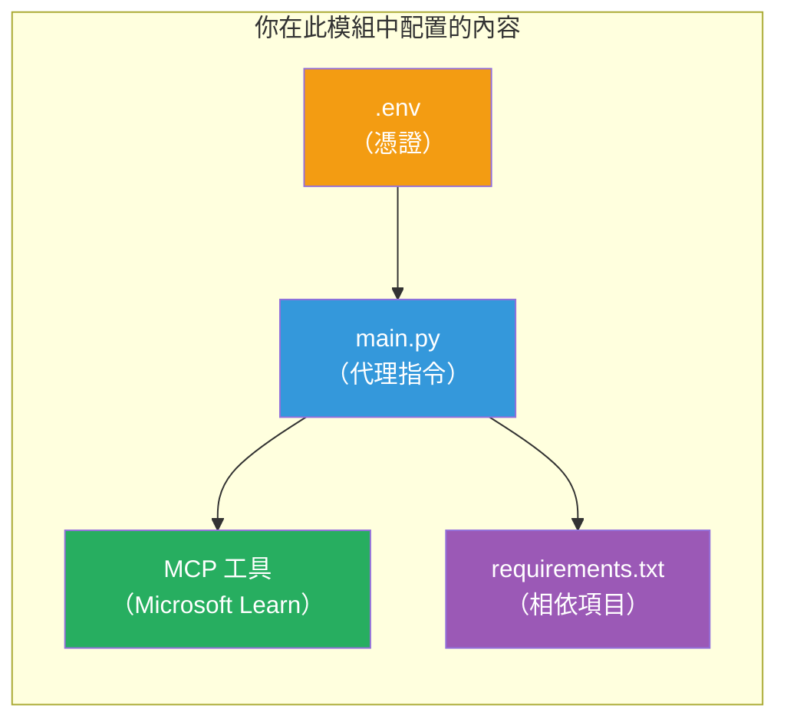

# Module 3 - 配置代理、MCP 工具及環境

在本模組中，您將自訂腳手架的多代理專案。您將為所有四個代理撰寫指令，設定 Microsoft Learn 的 MCP 工具，配置環境變量，並安裝相依套件。


> <strong>參考：</strong>完整可用的程式碼在 [`PersonalCareerCopilot/main.py`](../../../../../workshop/lab02-multi-agent/PersonalCareerCopilot/main.py)。可用作建立您自己程式的參考。

---

## 步驟 1：設定環境變量

1. 開啟專案根目錄中的 **`.env`** 檔案。
2. 填寫您的 Foundry 專案詳情：

   ```env
   PROJECT_ENDPOINT=https://<your-account>.services.ai.azure.com/api/projects/<your-project>
   MODEL_DEPLOYMENT_NAME=gpt-4.1-mini
   ```

3. 儲存檔案。

### 這些值在哪裡找

| 值 | 尋找方法 |
|-------|---------------|
| <strong>專案端點</strong> | Microsoft Foundry 側邊欄 → 點擊您的專案 → 詳細檢視中的端點 URL |
| <strong>模型部署名稱</strong> | Foundry 側邊欄 → 展開專案 → **Models + endpoints** → 部署模型旁的名稱 |

> <strong>安全提醒：</strong>切勿將 `.env` 提交至版本控制。如尚未加入，請新增至 `.gitignore`。

### 環境變量對應關係

多代理的 `main.py` 會讀取標準及工作坊專用的環境變量名稱：

```python
PROJECT_ENDPOINT = os.getenv("AZURE_AI_PROJECT_ENDPOINT") or os.getenv("PROJECT_ENDPOINT")
MODEL_DEPLOYMENT_NAME = os.getenv(
    "AZURE_AI_MODEL_DEPLOYMENT_NAME",
    os.getenv("MODEL_DEPLOYMENT_NAME", "gpt-4.1-mini"),
)
MICROSOFT_LEARN_MCP_ENDPOINT = os.getenv(
    "MICROSOFT_LEARN_MCP_ENDPOINT", "https://learn.microsoft.com/api/mcp"
)
```

MCP 端點有合理的預設值——除非您需要覆寫，否則不必在 `.env` 中設定。

---

## 步驟 2：撰寫代理指令

這是最關鍵的步驟。每個代理都需要精心設計的指令，定義其角色、輸出格式及規則。開啟 `main.py`，建立（或修改）指令常數。

### 2.1 履歷解析代理

```python
RESUME_PARSER_INSTRUCTIONS = """\
You are the Resume Parser.
Extract resume text into a compact, structured profile for downstream matching.

Output exactly these sections:
1) Candidate Profile
2) Technical Skills (grouped categories)
3) Soft Skills
4) Certifications & Awards
5) Domain Experience
6) Notable Achievements

Rules:
- Use only explicit or strongly implied evidence.
- Do not invent skills, titles, or experience.
- Keep concise bullets; no long paragraphs.
- If input is not a resume, return a short warning and request resume text.
"""
```

**為何要這些段落？** MatchingAgent 需要結構化資料來進行評分。一致的段落可以讓跨代理交接更可靠。

### 2.2 工作描述代理

```python
JOB_DESCRIPTION_INSTRUCTIONS = """\
You are the Job Description Analyst.
Extract a structured requirement profile from a JD.

Output exactly these sections:
1) Role Overview
2) Required Skills
3) Preferred Skills
4) Experience Required
5) Certifications Required
6) Education
7) Domain / Industry
8) Key Responsibilities

Rules:
- Keep required vs preferred clearly separated.
- Only use what the JD states; do not invent hidden requirements.
- Flag vague requirements briefly.
- If input is not a JD, return a short warning and request JD text.
"""
```

**為何分開必需和偏好？** MatchingAgent 對二者賦予不同權重（必備技能 = 40 分，偏好技能 = 10 分）。

### 2.3 匹配代理

```python
MATCHING_AGENT_INSTRUCTIONS = """\
You are the Matching Agent.
Compare parsed resume output vs JD output and produce an evidence-based fit report.

Scoring (100 total):
- Required Skills 40
- Experience 25
- Certifications 15
- Preferred Skills 10
- Domain Alignment 10

Output exactly these sections:
1) Fit Score (with breakdown math)
2) Matched Skills
3) Missing Skills
4) Partially Matched
5) Experience Alignment
6) Certification Gaps
7) Overall Assessment

Rules:
- Be objective and evidence-only.
- Keep partial vs missing separate.
- Keep Missing Skills precise; it feeds roadmap planning.
"""
```

**為何明確評分？** 可重現的評分讓比較執行結果和偵錯更為容易。100 分制對終端使用者而言易於理解。

### 2.4 差距分析代理

```python
GAP_ANALYZER_INSTRUCTIONS = """\
You are the Gap Analyzer and Roadmap Planner.
Create a practical upskilling plan from the matching report.

Microsoft Learn MCP usage (required):
- For EVERY High and Medium priority gap, call tool `search_microsoft_learn_for_plan`.
- Use returned Learn links in Suggested Resources.
- Prefer Microsoft Learn for free resources.

CRITICAL: You MUST produce a SEPARATE detailed gap card for EVERY skill listed in
the Missing Skills and Certification Gaps sections of the matching report. Do NOT
skip or combine gaps. Do NOT summarize multiple gaps into one card.

Output format:
1) Personalized Learning Roadmap for [Role Title]
2) One DETAILED card per gap (produce ALL cards, not just the first):
   - Skill
   - Priority (High/Medium/Low)
   - Current Level
   - Target Level
   - Suggested Resources (include Learn URL from tool results)
   - Estimated Time
   - Quick Win Project
3) Recommended Learning Order (numbered list)
4) Timeline Summary (week-by-week)
5) Motivational Note

Rules:
- Produce every gap card before writing the summary sections.
- Keep it specific, realistic, and actionable.
- Tailor to candidate's existing stack.
- If fit >= 80, focus on polish/interview readiness.
- If fit < 40, be honest and provide a staged path.
"""
```

**為何強調「CRITICAL」？** 若沒有明確指示產生所有差距卡，模型容易僅生成 1-2 張卡片，並將其餘摘要化。「CRITICAL」區塊可避免這種截斷。

---

## 步驟 3：定義 MCP 工具

GapAnalyzer 使用呼叫 [Microsoft Learn MCP 伺服器](https://learn.microsoft.com/azure/foundry/agents/how-to/tools/model-context-protocol) 的工具。將此加入 `main.py`：

```python
import json
from agent_framework import tool
from mcp.client.session import ClientSession
from mcp.client.streamable_http import streamable_http_client

@tool
async def search_microsoft_learn_for_plan(
    skill: str, role: str = "", max_results: int = 5
) -> str:
    """Search Microsoft Learn MCP and return curated official links for roadmap planning."""
    query = " ".join(part for part in [skill, role, "learning path module"] if part).strip()
    query = query or "job skills learning path"

    try:
        async with streamable_http_client(MICROSOFT_LEARN_MCP_ENDPOINT) as (
            read_stream, write_stream, _,
        ):
            async with ClientSession(read_stream, write_stream) as session:
                await session.initialize()
                result = await session.call_tool(
                    "microsoft_docs_search", {"query": query}
                )

        if not result.content:
            return (
                "No results returned from Microsoft Learn MCP. "
                "Fallback: https://learn.microsoft.com/training/support/catalog-api"
            )

        payload_text = getattr(result.content[0], "text", "")
        data = json.loads(payload_text) if payload_text else {}
        items = data.get("results", [])[:max(1, min(max_results, 10))]

        if not items:
            return f"No direct Microsoft Learn results found for '{skill}'."

        lines = [f"Microsoft Learn resources for '{skill}':"]
        for i, item in enumerate(items, start=1):
            title = item.get("title") or item.get("url") or "Microsoft Learn Resource"
            url = item.get("url") or item.get("link") or ""
            lines.append(f"{i}. {title} - {url}".rstrip(" -"))
        return "\n".join(lines)
    except Exception as ex:
        return (
            f"Microsoft Learn MCP lookup unavailable. Reason: {ex}. "
            "Fallbacks: https://learn.microsoft.com/api/mcp"
        )
```

### 工具運作流程

| 步驟 | 發生的事 |
|------|-------------|
| 1 | GapAnalyzer 判斷需要某技能資源（例如「Kubernetes」） |
| 2 | Framework 呼叫 `search_microsoft_learn_for_plan(skill="Kubernetes")` |
| 3 | 函式開啟 [Streamable HTTP](https://learn.microsoft.com/agent-framework/agents/tools/hosted-mcp-tools) 連接至 `https://learn.microsoft.com/api/mcp` |
| 4 | 呼叫 [MCP 伺服器](https://learn.microsoft.com/azure/foundry/agents/how-to/tools/model-context-protocol) 上的 `microsoft_docs_search` |
| 5 | MCP 伺服器回傳搜尋結果（標題 + URL） |
| 6 | 函式將結果格式化成編號列表 |
| 7 | GapAnalyzer 將 URL 納入差距卡中 |

### MCP 相依套件

MCP 用戶端套件隨 [`agent-framework-core`](https://learn.microsoft.com/agent-framework/overview/) 順帶安裝。您<strong>無須</strong>另行新增至 `requirements.txt`。若出現匯入錯誤，請確認：

```powershell
pip list | Select-String "mcp"
```

預期：已安裝 `mcp` 套件（版本 1.x 或以上）。

---

## 步驟 4：接線代理與工作流程

### 4.1 使用上下文管理器建立代理

```python
from contextlib import asynccontextmanager

@asynccontextmanager
async def create_agents():
    async with (
        get_credential() as credential,
        AzureAIAgentClient(
            project_endpoint=PROJECT_ENDPOINT,
            model_deployment_name=MODEL_DEPLOYMENT_NAME,
            credential=credential,
        ).as_agent(
            name="ResumeParser",
            instructions=RESUME_PARSER_INSTRUCTIONS,
        ) as resume_parser,
        AzureAIAgentClient(
            project_endpoint=PROJECT_ENDPOINT,
            model_deployment_name=MODEL_DEPLOYMENT_NAME,
            credential=credential,
        ).as_agent(
            name="JobDescriptionAgent",
            instructions=JOB_DESCRIPTION_INSTRUCTIONS,
        ) as jd_agent,
        AzureAIAgentClient(
            project_endpoint=PROJECT_ENDPOINT,
            model_deployment_name=MODEL_DEPLOYMENT_NAME,
            credential=credential,
        ).as_agent(
            name="MatchingAgent",
            instructions=MATCHING_AGENT_INSTRUCTIONS,
        ) as matching_agent,
        AzureAIAgentClient(
            project_endpoint=PROJECT_ENDPOINT,
            model_deployment_name=MODEL_DEPLOYMENT_NAME,
            credential=credential,
        ).as_agent(
            name="GapAnalyzer",
            instructions=GAP_ANALYZER_INSTRUCTIONS,
            tools=[search_microsoft_learn_for_plan],
        ) as gap_analyzer,
    ):
        yield resume_parser, jd_agent, matching_agent, gap_analyzer
```

**重點：**
- 每個代理都有自己的 `AzureAIAgentClient` 實例
- 只有 GapAnalyzer 透過 `tools=[search_microsoft_learn_for_plan]` 注入工具
- `get_credential()` 在 Azure 中回傳 [`ManagedIdentityCredential`](https://learn.microsoft.com/python/api/overview/azure/identity-readme#managed-identity-support)，在本機則為 [`DefaultAzureCredential`](https://learn.microsoft.com/azure/developer/python/sdk/authentication/credential-chains#defaultazurecredential-overview)

### 4.2 建立工作流程圖

```python
def create_workflow(resume_parser, jd_agent, matching_agent, gap_analyzer):
    workflow = (
        WorkflowBuilder(
            name="ResumeJobFitEvaluator",
            start_executor=resume_parser,
            output_executors=[gap_analyzer],
        )
        .add_edge(resume_parser, jd_agent)
        .add_edge(resume_parser, matching_agent)
        .add_edge(jd_agent, matching_agent)
        .add_edge(matching_agent, gap_analyzer)
        .build()
    )
    return workflow.as_agent()
```

> 請參閱 [Workflows as Agents](https://learn.microsoft.com/agent-framework/workflows/as-agents) 了解 `.as_agent()` 模式。

### 4.3 啟動伺服器

```python
async def main() -> None:
    validate_configuration()
    async with create_agents() as (resume_parser, jd_agent, matching_agent, gap_analyzer):
        agent = create_workflow(resume_parser, jd_agent, matching_agent, gap_analyzer)
        from azure.ai.agentserver.agentframework import from_agent_framework
        await from_agent_framework(agent).run_async()

if __name__ == "__main__":
    asyncio.run(main())
```

---

## 步驟 5：建立並啟用虛擬環境

### 5.1 建立環境

```powershell
cd workshop\lab02-multi-agent\PersonalCareerCopilot
python -m venv .venv
```

### 5.2 啟用環境

**PowerShell (Windows)：**
```powershell
.\.venv\Scripts\Activate.ps1
```

**macOS/Linux：**
```bash
source .venv/bin/activate
```

### 5.3 安裝依賴套件

```powershell
pip install -r requirements.txt
```

> **注意：**`requirements.txt` 中的 `agent-dev-cli --pre` 行確保安裝最新預覽版本。這是相容於 `agent-framework-core==1.0.0rc3` 的必要條件。

### 5.4 驗證安裝

```powershell
pip list | Select-String "agent-framework|agentserver|agent-dev"
```

預期輸出：
```
agent-dev-cli                  0.0.1b260316
agent-framework-azure-ai       1.0.0rc3
agent-framework-core            1.0.0rc3
azure-ai-agentserver-agentframework 1.0.0b16
azure-ai-agentserver-core      1.0.0b16
```

> **若 `agent-dev-cli` 顯示較舊版本**（例如 `0.0.1b260119`），Agent Inspector 將以 403/404 錯誤失敗。請升級：`pip install agent-dev-cli --pre --upgrade`

---

## 步驟 6：驗證身份驗證

執行 Lab 01 的相同認證檢查：

```powershell
az account show --query "{name:name, id:id}" --output table
```

若失敗，請執行 [`az login`](https://learn.microsoft.com/cli/azure/authenticate-azure-cli-interactively)。

多代理工作流程中，四個代理共用同一認證。如其中一個驗證成功，其他也會成功。

---

### 檢查點

- [ ] `.env` 具有有效的 `PROJECT_ENDPOINT` 和 `MODEL_DEPLOYMENT_NAME`
- [ ] 四個代理指令常數均已在 `main.py` 定義（ResumeParser、JD Agent、MatchingAgent、GapAnalyzer）
- [ ] `search_microsoft_learn_for_plan` MCP 工具已定義並註冊於 GapAnalyzer
- [ ] `create_agents()` 建立 4 個代理，各有獨立的 `AzureAIAgentClient` 實例
- [ ] `create_workflow()` 使用 `WorkflowBuilder` 建立正確的工作流程圖
- [ ] 虛擬環境已建立並啟用（顯示 `(.venv)`）
- [ ] `pip install -r requirements.txt` 無錯誤完成
- [ ] `pip list` 顯示所有預期套件及正確版本（rc3 / b16）
- [ ] `az account show` 回傳您的訂閱

---

**前一章：** [02 - Scaffold Multi-Agent Project](02-scaffold-multi-agent.md) · **下一章：** [04 - Orchestration Patterns →](04-orchestration-patterns.md)

---

<!-- CO-OP TRANSLATOR DISCLAIMER START -->
**免責聲明**：  
本文件使用人工智能翻譯服務 [Co-op Translator](https://github.com/Azure/co-op-translator) 進行翻譯。雖然我們致力於確保準確性，但請注意自動翻譯可能包含錯誤或不準確之處。原始文件的母語版本應被視為權威來源。對於關鍵資訊，建議採用專業人工翻譯。我們不對因使用本翻譯而產生的任何誤解或誤釋承擔責任。
<!-- CO-OP TRANSLATOR DISCLAIMER END -->