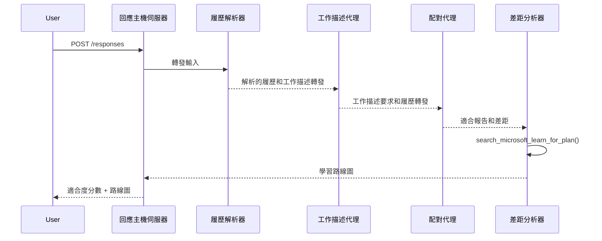

# 模組 3 - 配置指令、環境與安裝依賴

⏱️ 大約 15 分鐘

在本模組中，您將把腳手架模板改造成 <strong>您自己的</strong> 多代理工作流程 — 透過設定環境變數、撰寫代理指令、加入 MCP 工具、連接工作流程圖，並安裝依賴套件。

> **參考：** 完整運作的程式碼在 [`PersonalCareerCopilot/main.py`](../../../../../workshop/lab02-multi-agent/PersonalCareerCopilot/main.py)。在建立您自己的工作流程圖與提示區塊時，請參考它。

---

## 四個代理如何協同運作


```mermaid
sequenceDiagram
    participant User
    participant Server as 回應主機伺服器
    participant RP as 履歷解析器
    participant JD as 工作描述代理
    participant MA as 配對代理
    participant GA as 差距分析器

    User->>Server: POST /responses
    Server->>RP: 轉發輸入
    RP-->>JD: 解析的履歷和工作描述轉發
    JD-->>MA: 工作描述要求和履歷轉發
    MA-->>GA: 適合報告和差距
    GA->>GA: search_microsoft_learn_for_plan()
    GA-->>Server: 學習路線圖
    Server-->>User: 適合度分數 + 路線圖
```

---

## 步驟 1：設定環境變數

1. 開啟專案根目錄中的 **`.env`** 檔案（由腳手架嚮導建立）。
2. 將佔位符取代為來自實驗室 01 的實際值。

<details open>
<summary><strong>🅰️ 路徑 A - Foundry 訂閱</strong></summary>

```env
FOUNDRY_PROJECT_ENDPOINT=https://<your-account>.services.ai.azure.com/api/projects/<your-project>
AZURE_AI_MODEL_DEPLOYMENT_NAME=gpt-4.1-mini
```

> **值在哪裡找：** 請參考 [實驗室 01，模組 1](../../lab01-single-agent/docs/01-setup.md#deploy-a-model--assign-rbac)。

</details>

<details open>
<summary><strong>🅱️ 路徑 B - Foundry 本地端</strong></summary>

```env
FOUNDRY_PROJECT_ENDPOINT=http://localhost:5273/v1
AZURE_AI_MODEL_DEPLOYMENT_NAME=phi-4-mini
```

> 所有推論均在您的機器上執行 — 數據不會離開您的裝置。執行 `foundry model list` 確認確切的模型別名。唯一的外發請求是 MCP 工具呼叫 `https://learn.microsoft.com/api/mcp`。

> **值在哪裡找：** 請參考 [實驗室 01，模組 1 — 本地端路徑](../../lab01-single-agent/docs/01-setup.md#step-2-set-up-based-on-your-access)。

</details>

> **安全性：** 絕對不要將 `.env` 提交到版本控制，該檔案應已加入 `.gitignore`。

---

## 步驟 2：撰寫代理指令

指令定義每個代理的角色、輸出格式與規則。打開 `main.py` 並定義（或替換）四個指令常數 — 完整字串在 [`PersonalCareerCopilot/main.py`](../../../../../workshop/lab02-multi-agent/PersonalCareerCopilot/main.py) 中。

### 2.1 `RESUME_PARSER_INSTRUCTIONS`
將履歷解析成結構化的候選人簡介，<strong>並且</strong> 原樣複製職務說明到 `[JOB DESCRIPTION PASS-THROUGH]`，兩個標記區段必須出現在輸出中。

> **為什麼要轉傳？** 使用 `context_mode="last_agent"` 時，ResumeParser 是 <strong>唯一</strong> 能看到原始使用者訊息的代理。如果不將職務說明傳遞下去，下游代理就看不到它。

### 2.2 `JOB_DESCRIPTION_INSTRUCTIONS`
從 ResumeParser 的輸出讀取 `[PARSED RESUME]` 與 `[JOB DESCRIPTION PASS-THROUGH]`。輸出 `[JD REQUIREMENTS]`（結構化需求）和 `[PARSED RESUME PASS-THROUGH]`（逐字複製履歷給 MatchingAgent）。

### 2.3 `MATCHING_AGENT_INSTRUCTIONS`
讀取 `[JD REQUIREMENTS]` 與 `[PARSED RESUME PASS-THROUGH]`。產生一份帶有分數（0–100）及細項計算、符合的技能、缺失技能和經驗匹配度的報告。

### 2.4 `GAP_ANALYZER_INSTRUCTIONS`
讀取匹配報告。對於 <strong>每項</strong> 缺失技能，呼叫 `search_microsoft_learn_for_plan` 拿取 Microsoft Learn 資源。為每項技能產出詳細缺口卡，並包含每週學習路線圖。

---

## 步驟 3：加入 MCP 工具

GapAnalyzer 會呼叫 [Microsoft Learn MCP 伺服器](https://learn.microsoft.com/azure/foundry/agents/how-to/tools/model-context-protocol) 以取得每項技能缺口的真實學習資源。完整的 `search_microsoft_learn_for_plan` 函式在 [`PersonalCareerCopilot/main.py`](../../../../../workshop/lab02-multi-agent/PersonalCareerCopilot/main.py)。

在建立代理時，於 GapAnalyzer 上註冊該工具：

```python
gap_analyzer = Agent(
    client=client,
    instructions=GAP_ANALYZER_INSTRUCTIONS,
    name="GapAnalyzer",
    tools=[search_microsoft_learn_for_plan],
)
```

> 參見 [`PersonalCareerCopilot/main.py`](../../../../../workshop/lab02-multi-agent/PersonalCareerCopilot/main.py) 中，完整的 `WorkflowBuilder` 圖表與 `FoundryChatClient`、`AgentExecutor` 和所有 `add_edge()` 呼叫。

---

## 步驟 4：建立虛擬環境與安裝依賴

> ⚠️ **請勿跳過此步驟。** 若沒安裝依賴，F5 偵錯將無法運作。

### 4.1 建立虛擬環境

```powershell
python -m venv .venv
```

### 4.2 啟動虛擬環境

| 作業系統 | 指令 |
|----|---------|
| **Windows (PowerShell)** | `.\.venv\Scripts\Activate.ps1` |
| **Windows (CMD)** | `.venv\Scripts\activate.bat` |
| **macOS / Linux** | `source .venv/bin/activate` |

您應該會在終端機提示符中看到 `(.venv)`。

### 4.3 安裝依賴套件

```powershell
pip install -r requirements.txt
```

### 4.4 驗證

```powershell
pip list | Select-String "agent-framework|mcp|debugpy"
```

預期：清單中應有 `agent-framework-foundry`、`agent-framework-foundry-hosting`、`mcp` 和 `debugpy`。

---

## 步驟 5：驗證認證

<details open>
<summary><strong>🅰️ 路徑 A - Azure 憑證</strong></summary>

```powershell
az account show --query "{name:name, id:id}" --output table
```

如果失敗，請執行 [`az login`](https://learn.microsoft.com/cli/azure/authenticate-azure-cli-interactively)。

四個代理共用一個 `FoundryChatClient` 和一個 `DefaultAzureCredential`。只要一個通過認證，其他也會通過。

</details>

<details open>
<summary><strong>🅱️ 路徑 B - Foundry 本地端</strong></summary>

本地端測試不需認證。

</details>

---

### ✅ 檢查點

> 請 <strong>勿</strong> 繼續進入模組 04，除非：**(1)** 提示符可見 `(.venv)` 且 **(2)** `pip install -r requirements.txt` 成功完成。

- [ ] `.env` 擁有有效的端點與模型部署名稱（非佔位符）
- [ ] `main.py` 中定義所有 4 個代理指令常數（ResumeParser、JD Agent、MatchingAgent、GapAnalyzer）
- [ ] `search_microsoft_learn_for_plan` MCP 工具已定義且註冊於 GapAnalyzer
- [ ] 在 `main()` 創建了 `FoundryChatClient` + 4 個 `Agent` + 4 個 `AgentExecutor` 物件
- [ ] `WorkflowBuilder` 正確建構序列圖並進行所有 3 次 `add_edge()` 呼叫
- [ ] 已建立虛擬環境並啟用（提示符看得到 `(.venv)`）
- [ ] `pip install -r requirements.txt` 無錯誤完成
- [ ] **路徑A：** `az account show` 成功或 VS Code 帳戶圖示顯示已登入帳戶

---

**前一章節：** [02 - 搭建多代理專案](02-scaffold-multi-agent.md) · **下一章節：** [04 - 編排模式 →](04-orchestration-patterns.md)

---

<!-- CO-OP TRANSLATOR DISCLAIMER START -->
**免責聲明**：
本文件由 AI 翻譯服務 [Co-op Translator](https://github.com/Azure/co-op-translator) 翻譯而成。雖然我們致力於確保準確性，但請注意，機器自動翻譯可能包含錯誤或不準確之處。原始文件的母語版本應被視為權威來源。對於重要資訊，建議進行專業人工翻譯。我們不對因使用本翻譯而產生的任何誤解或誤釋承擔責任。
<!-- CO-OP TRANSLATOR DISCLAIMER END -->