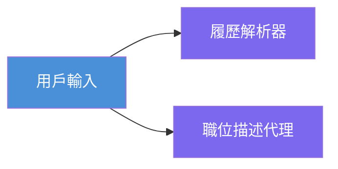
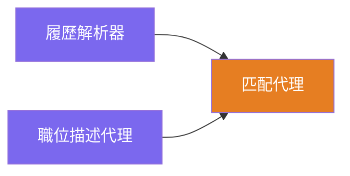
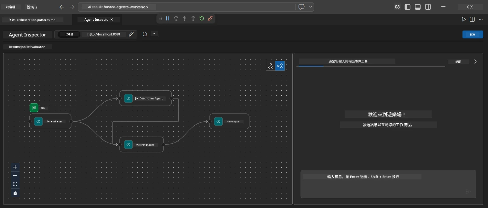
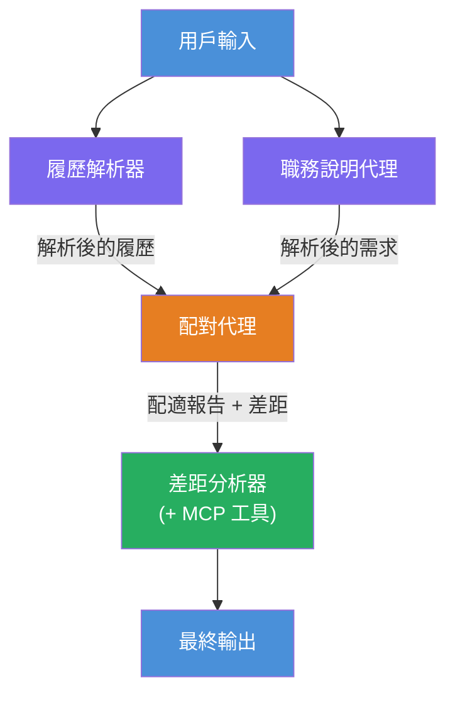
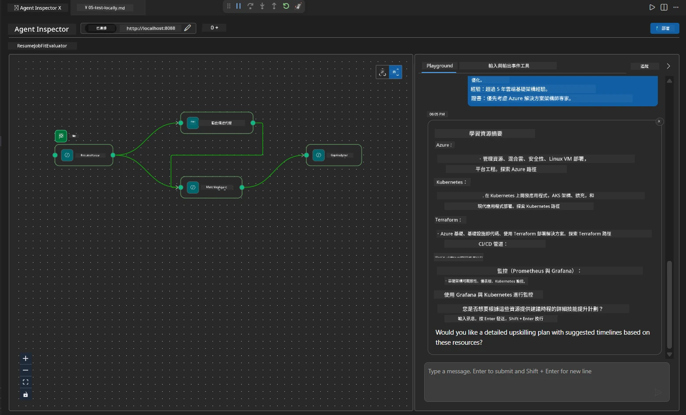

# Module 4 - 編排模式

在本模組中，您將探討簡歷職位適配評估器中使用的編排模式，並學習如何讀取、修改及擴展工作流程圖。理解這些模式對於除錯資料流程問題以及構建您自己的[多代理工作流程](https://learn.microsoft.com/agent-framework/workflows/)至關重要。

---

## 模式 1：扇出（平行分支）

工作流程中的第一個模式是<strong>扇出</strong>——單一輸入同時發送到多個代理。


在程式碼中，這是因為 `resume_parser` 是 `start_executor` — 它首先接收使用者訊息。然後，由於 `jd_agent` 和 `matching_agent` 都有來自 `resume_parser` 的邊，框架會將 `resume_parser` 的輸出路由到這兩個代理：

```python
.add_edge(resume_parser, jd_agent)         # ResumeParser 輸出 → JD Agent
.add_edge(resume_parser, matching_agent)   # ResumeParser 輸出 → MatchingAgent
```

**為什麼這樣可行：** ResumeParser 和 JD Agent 處理同一輸入的不同方面。平行執行可比依序執行降低整體延遲。

### 何時使用扇出

| 用例 | 範例 |
|----------|---------|
| 獨立子任務 | 解析簡歷 vs. 解析職務描述 |
| 冗餘 / 投票 | 兩個代理分析相同資料，第三個選擇最佳答案 |
| 多格式輸出 | 一個代理生成文字，另一個生成結構化 JSON |

---

## 模式 2：扇入（聚合）

第二個模式是<strong>扇入</strong>——多個代理輸出被收集並發送到單一下游代理。


在程式碼中：

```python
.add_edge(resume_parser, matching_agent)   # 履歷解析器輸出 → 配對代理
.add_edge(jd_agent, matching_agent)        # 職務說明代理輸出 → 配對代理
```

**關鍵行為：** 當一個代理有<strong>兩條或以上的輸入邊</strong>時，框架會自動等待<strong>所有</strong>上游代理完成後才運行下游代理。MatchingAgent 直到 ResumeParser 和 JD Agent 都完成才啟動。

### MatchingAgent 收到的內容

框架會串接所有上游代理的輸出。MatchingAgent 的輸入看起來像：

```
[ResumeParser output]
---
Candidate Profile:
  Name: Jane Doe
  Technical Skills: Python, Azure, Kubernetes, ...
  ...

[JobDescriptionAgent output]
---
Role Overview: Senior Cloud Engineer
Required Skills: Python, Azure, Terraform, ...
...
```

> **注意：** 確切的串接格式取決於框架版本。代理指令應撰寫得能處理結構化及非結構化的上游輸出。



---

## 模式 3：序列鏈結

第三個模式是<strong>序列串接</strong>——一個代理的輸出直接傳送給下一個代理。


在程式碼中：

```python
.add_edge(matching_agent, gap_analyzer)    # MatchingAgent 輸出 → GapAnalyzer
```

這是最簡單的模式。GapAnalyzer 收到 MatchingAgent 的適配分數、匹配/缺少技能及差距。接著它針對每個差距呼叫 [MCP 工具](https://learn.microsoft.com/azure/foundry/agents/how-to/tools/model-context-protocol) 取得 Microsoft Learn 資源。

---

## 完整流程圖

結合上述三個模式形成完整工作流程：


### 執行時程

```mermaid
gantt
    title 代理執行時間表
    dateFormat X
    axisFormat %s

    section 並行
    Resume Parser       :rp, 0, 3
    JD Agent            :jd, 0, 2

    section 串行
    Matching Agent      :ma, 3, 5
    Gap Analyzer        :ga, 5, 9
```


> 總的牆鐘時間約為 `max(ResumeParser, JD Agent) + MatchingAgent + GapAnalyzer`。GapAnalyzer 通常最慢，因為它會針對每個差距進行多次 MCP 工具呼叫。

---

## 讀取 WorkflowBuilder 程式碼

以下是 `main.py` 中完整的 `create_workflow()` 函數，並加以註解：

```python
def create_workflow(resume_parser, jd_agent, matching_agent, gap_analyzer):
    workflow = (
        WorkflowBuilder(
            name="ResumeJobFitEvaluator",

            # 第一個接收用戶輸入的代理
            start_executor=resume_parser,

            # 輸出成為最終回應的代理
            output_executors=[gap_analyzer],
        )
        # 分流：ResumeParser 的輸出同時發送到 JD Agent 和 MatchingAgent
        .add_edge(resume_parser, jd_agent)
        .add_edge(resume_parser, matching_agent)

        # 匯流：MatchingAgent 等待 ResumeParser 和 JD Agent 的結果
        .add_edge(jd_agent, matching_agent)

        # 串行：MatchingAgent 的輸出作為 GapAnalyzer 的輸入
        .add_edge(matching_agent, gap_analyzer)

        .build()
    )
    return workflow.as_agent()
```

### 邊緣摘要表

| # | 邊 | 模式 | 效果 |
|---|------|---------|--------|
| 1 | `resume_parser → jd_agent` | 扇出 | JD Agent 接收 ResumeParser 的輸出（及原始使用者輸入） |
| 2 | `resume_parser → matching_agent` | 扇出 | MatchingAgent 接收 ResumeParser 的輸出 |
| 3 | `jd_agent → matching_agent` | 扇入 | MatchingAgent 也接收 JD Agent 的輸出（等待兩者） |
| 4 | `matching_agent → gap_analyzer` | 序列 | GapAnalyzer 接收適配報告 + 差距列表 |

---

## 修改流程圖

### 新增代理

要新增第五個代理（例如根據差距分析生成面試問題的 **InterviewPrepAgent**）：

```python
# 1. 定義指令
INTERVIEW_PREP_INSTRUCTIONS = """\
You are the Interview Prep Agent.
Given a gap analysis and fit report, generate 10 targeted interview questions
the candidate should prepare for.
"""

# 2. 創建代理（在 async with 區塊內）
AzureAIAgentClient(
    project_endpoint=PROJECT_ENDPOINT,
    model_deployment_name=MODEL_DEPLOYMENT_NAME,
    credential=credential,
).as_agent(
    name="InterviewPrepAgent",
    instructions=INTERVIEW_PREP_INSTRUCTIONS,
) as interview_prep,

# 3. 在 create_workflow() 中添加邊緣
.add_edge(matching_agent, interview_prep)   # 收到擬合報告
.add_edge(gap_analyzer, interview_prep)     # 亦收到差距卡片

# 4. 更新 output_executors
output_executors=[interview_prep],  # 現在是最終代理
```

### 變更執行順序

若要讓 JD Agent 在 ResumeParser <strong>之後</strong>執行（序列而非平行）：

```python
# 移除：.add_edge(resume_parser, jd_agent)  ← 已經存在，保留它
# 透過不讓 jd_agent 直接接收用戶輸入來移除隱式平行
# start_executor 先發送給 resume_parser，而 jd_agent 僅透過邊接收
# resume_parser 的輸出。這使它們變成順序執行。
```

> **重要：** `start_executor` 是唯一接收原始使用者輸入的代理。其他代理只接收上游邊緣的輸出。若想讓代理同時接收原始輸入，必須有來自 `start_executor` 的邊。

---

## 常見流程錯誤

| 錯誤 | 症狀 | 修正 |
|---------|---------|-----|
| 缺少通往 `output_executors` 的邊 | 代理執行，但輸出為空 | 確保從 `start_executor` 有路徑至 `output_executors` 中的每個代理 |
| 環狀依賴 | 無限迴圈或逾時 | 確認沒有代理反饋到上游代理 |
| `output_executors` 中代理無輸入邊 | 輸出為空 | 新增至少一條 `add_edge(source, that_agent)` |
| 多個 `output_executors` 無扇入 | 輸出只包含其中一個代理的回應 | 使用單一輸出代理進行聚合，或接受多個輸出 |
| 缺少 `start_executor` | 建構時出現 `ValueError` | 在 `WorkflowBuilder()` 中始終指定 `start_executor` |

---

## 除錯流程圖

### 使用 Agent Inspector

1. 在本機啟動代理（F5 或終端機 - 見[模組 5](05-test-locally.md)）。
2. 開啟 Agent Inspector（`Ctrl+Shift+P` → **Foundry Toolkit: Open Agent Inspector**）。
3. 傳送測試訊息。
4. 在 Inspector 的回應面板查看<strong>串流輸出</strong> - 它依序顯示每個代理的貢獻。



### 使用日誌記錄

在 `main.py` 增加日誌以追蹤資料流程：

```python
import logging
logger = logging.getLogger("resume-job-fit")

# 喺 create_workflow() 入面，喺建立完成之後：
logger.info("Workflow graph built with edges: RP→JD, RP→MA, JD→MA, MA→GA")
```

伺服器日誌會顯示代理執行順序及 MCP 工具呼叫：

```
INFO:resume-job-fit:Starting Resume -> Job Fit Evaluator HTTP server...
INFO:resume-job-fit:Server running on http://localhost:8088
INFO:agent_framework:Executing agent: ResumeParser
INFO:agent_framework:Executing agent: JobDescriptionAgent
INFO:agent_framework:Waiting for upstream agents: ResumeParser, JobDescriptionAgent
INFO:agent_framework:Executing agent: MatchingAgent
INFO:agent_framework:Executing agent: GapAnalyzer
INFO:agent_framework:Tool call: search_microsoft_learn_for_plan(skill="Kubernetes")
POST https://learn.microsoft.com/api/mcp → 200
INFO:agent_framework:Tool call: search_microsoft_learn_for_plan(skill="Terraform")
POST https://learn.microsoft.com/api/mcp → 200
```

---

### 檢查點

- [ ] 您能辨識工作流程中的三種編排模式：扇出、扇入和序列鏈結
- [ ] 您了解多入邊代理會等待所有上游代理完成
- [ ] 您可以閱讀 `WorkflowBuilder` 程式碼並將每個 `add_edge()` 呼叫映射到視覺圖中
- [ ] 您了解執行時程：先平行代理，接著聚合，再來序列執行
- [ ] 您知道如何在流程圖中新增代理（定義指令、建立代理、加入邊緣、更新輸出）
- [ ] 您可以識別常見流程錯誤及其症狀

---

**上一章節：** [03 - 設定代理與環境](03-configure-agents.md) · **下一章節：** [05 - 本機測試 →](05-test-locally.md)

---

<!-- CO-OP TRANSLATOR DISCLAIMER START -->
**免責聲明**：  
本文件是使用 AI 翻譯服務 [Co-op Translator](https://github.com/Azure/co-op-translator) 進行翻譯的。雖然我們致力於確保準確性，但自動翻譯可能包含錯誤或不準確之處。原始語言的文件應被視為權威來源。對於重要資訊，建議採用專業人工翻譯。我們不對因使用本翻譯而引起的任何誤解或誤釋負責。
<!-- CO-OP TRANSLATOR DISCLAIMER END -->