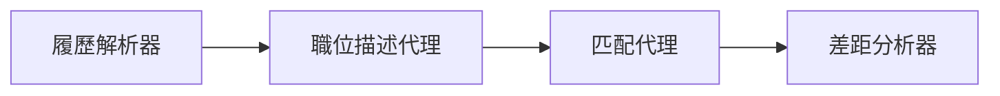
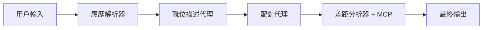

# 模組 4 - 編排模式

⏱️ 約 10 分鐘

在本模組中，您將探索在履歷職缺適配評估器中使用的編排模式，並學習如何閱讀、修改及擴充工作流程圖。了解這些模式對除錯資料流問題及構建您自己的[多代理工作流程](https://learn.microsoft.com/agent-framework/workflows/)至關重要。

---

## 模式 1：順序鏈

工作流程中的基本模式是 <strong>順序鏈</strong> — 每個代理的輸出直接傳遞到下一個代理。


```mermaid
flowchart LR
    RP[履歷解析器] --> JD[職位描述代理]
    JD --> MA[匹配代理]
    MA --> GA[差距分析器]
```

在程式碼中，每次呼叫 `add_edge()` 都建立了鏈中的一個步驟：

```python
.add_edge(resume_executor, jd_executor)       # ResumeParser 輸出 → JD Agent
.add_edge(jd_executor, matching_executor)     # JD Agent 輸出 → MatchingAgent
.add_edge(matching_executor, gap_executor)    # MatchingAgent 輸出 → GapAnalyzer
```

> **為什麼是順序鏈，而不是放射狀彙集？** `WorkflowBuilder` 對傳入邊使用 **OR 語義**：下游執行器只要有 <strong>任意</strong> 一個前置節點完成就觸發。如果 `matching_executor` 有兩條傳入邊（分別來自 `resume_executor` 和 `jd_executor`），它會觸發兩次—一次是 ResumeParser 結束時，一次是 JD Agent 結束時—導致 GapAnalyzer 也運行兩次，輸出也會重複出現。順序管線完全避免了此問題。

## 模式 2：內容轉接

因為 `context_mode="last_agent"` 意味著每個執行器只能看見其<strong>直接前任的輸出</strong>，順序鏈中的代理必須明確向前傳遞下游代理所需的任何資料。

在這個工作流程中：
- **ResumeParser** 將 JD 原文複製到 `[JOB DESCRIPTION PASS-THROUGH]` 中（讓 JD Agent 能找到它）。
- **JD Agent** 將 `[PARSED RESUME]` 原文複製到 `[PARSED RESUME PASS-THROUGH]` 中（讓 MatchingAgent 可以比較兩個資料檔案）。

```
ResumeParser output
└─ [PARSED RESUME]               ← extracted by JD Agent
└─ [JOB DESCRIPTION PASS-THROUGH] ← extracted by JD Agent

JD Agent output
└─ [JD REQUIREMENTS]             ← extracted by MatchingAgent
└─ [PARSED RESUME PASS-THROUGH]  ← extracted by MatchingAgent
```

每個轉接階段必須<strong>逐字複製</strong>—摘要或轉述會破壞依賴該內容的下游代理。

---

## 完整圖形

結合順序鏈與內容轉接模式即可產生完整工作流程：


```mermaid
flowchart LR
    U[用戶輸入] --> RP[履歷解析器]
    RP --> JD[職位描述代理]
    JD --> MA[配對代理]
    MA --> GA[差距分析器 + MCP]
    GA --> O[最終輸出]
```

代理檢視器在代理本地運行時會顯示相同的圖形結構。請參考[模組 5 - 本地測試](05-test-locally.md)瞭解截圖。

---

## 閱讀 WorkflowBuilder 程式碼

完整的 `create_workflow()` 函數位於 [`PersonalCareerCopilot/main.py`](../../../../../workshop/lab02-multi-agent/PersonalCareerCopilot/main.py) 中。三次 `add_edge()` 呼叫組成順序管線：

| # | 邊 | 功能 |
|---|------|--------|
| 1 | `resume_executor → jd_executor` | JD Agent 接收 `[PARSED RESUME]` + `[JOB DESCRIPTION PASS-THROUGH]` |
| 2 | `jd_executor → matching_executor` | MatchingAgent 接收 `[JD REQUIREMENTS]` + `[PARSED RESUME PASS-THROUGH]` |
| 3 | `matching_executor → gap_executor` | GapAnalyzer 接收適配報告 + 差距清單 |

---

## 修改圖形

### 新增代理

若要新增第五個代理（例如 GapAnalyzer 之後的 **InterviewPrepAgent**）：

1. 定義 `INTERVIEW_PREP_INSTRUCTIONS` 常數。
2. 建立 `Agent` 與 `AgentExecutor` 物件（和現有四個模式相同）。
3. 在 `WorkflowBuilder` 裡加上 `.add_edge(gap_executor, interview_exec)`。
4. 更新 `output_executors=[interview_exec]`。

> **重要：** `start_executor` 是唯一接收原始使用者輸入的代理。其他代理皆接收其上游邊的輸出。

---

## 常見圖形錯誤

| 錯誤 | 症狀 | 解決方法 |
|---------|---------|-----|
| 缺少通往 `output_executors` 的邊 | 代理運行但輸出為空 | 確保從 `start_executor` 到所有 `output_executors` 的代理都有路徑 |
| 迴圈依賴 | 無限迴圈或逾時 | 確認沒有代理反饋到上游代理 |
| `output_executors` 中代理沒有傳入邊 | 輸出為空 | 至少新增一條 `add_edge(source, 該代理)` |
| 多個 `output_executors` 無彙集 | 輸出只包含一個代理的回應 | 使用單一輸出代理進行匯總，或接受多重輸出 |
| 缺少 `start_executor` | 建構時出現 `ValueError` | 在 `WorkflowBuilder()` 中務必指定 `start_executor` |

---

## 除錯圖形

### 使用代理檢視器

1. 使用 F5 在本地啟動代理。
2. 開啟代理檢視器（`Ctrl+Shift+P` → **Foundry Toolkit: Open Agent Inspector**）。
3. 傳送測試訊息。
4. 在檢視器的回應面板中，尋找<strong>串流輸出</strong> — 它會依序顯示每個代理的貢獻。


### 使用日誌紀錄

對 `main.py` 加入日誌，追蹤資料流：

```python
import logging
logger = logging.getLogger("resume-job-fit")

# 在 main() 中，建立工作流程之後：
logger.info("Workflow graph built with edges: RP→JD, JD→MA, MA→GA")
```

伺服器日誌會顯示代理執行順序與 MCP 工具呼叫：

```
INFO:agent_framework:Executing agent: ResumeParser
INFO:agent_framework:Executing agent: JobDescriptionAgent
INFO:agent_framework:Executing agent: MatchingAgent
INFO:agent_framework:Executing agent: GapAnalyzer
INFO:agent_framework:Tool call: search_microsoft_learn_for_plan(skill="Kubernetes")
POST https://learn.microsoft.com/api/mcp → 200
INFO:agent_framework:Tool call: search_microsoft_learn_for_plan(skill="Terraform")
POST https://learn.microsoft.com/api/mcp → 200
```

---

### 檢查點

- [ ] 您可以辨識工作流程中的兩種編排模式：順序鏈與內容轉接
- [ ] 您了解為何 `context_mode="last_agent"` 需要代理間明確的資料中繼
- [ ] 您可以閱讀 `WorkflowBuilder` 程式碼並將每個 `add_edge()` 呼叫對應至視覺化圖形
- [ ] 您知道如何在管線末端新增代理
- [ ] 您可以辨識常見的圖形錯誤及其症狀

---

**上一節：** [03 - 配置代理及環境](03-configure-agents.md) · **下一節：** [05 - 本地測試 →](05-test-locally.md)

---

<!-- CO-OP TRANSLATOR DISCLAIMER START -->
**免責聲明**：
本文件由 AI 翻譯服務 [Co-op Translator](https://github.com/Azure/co-op-translator) 翻譯而成。雖然我們致力於確保準確性，但請注意，機器自動翻譯可能包含錯誤或不準確之處。原始文件的母語版本應被視為權威來源。對於重要資訊，建議進行專業人工翻譯。我們不對因使用本翻譯而產生的任何誤解或誤釋承擔責任。
<!-- CO-OP TRANSLATOR DISCLAIMER END -->