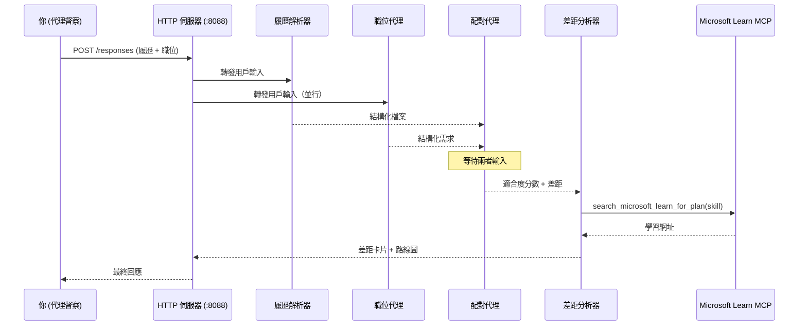
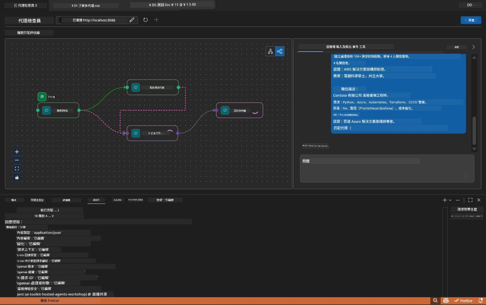

# Module 5 - 本地測試（多代理）

在此模組中，您將在本地運行多代理工作流程，使用 Agent Inspector 測試，並驗證所有四個代理和 MCP 工具在部署到 Foundry 之前均正常運作。

### 本地測試運行期間會發生什麼


---

## 第一步：啟動代理伺服器

### 選項 A：使用 VS Code 任務（推薦）

1. 按 `Ctrl+Shift+P` → 輸入 **Tasks: Run Task** → 選擇 **Run Lab02 HTTP Server**。
2. 任務會以 debugpy 附加在端口 `5679` 上啟動伺服器，代理則在端口 `8088`。
3. 等待輸出顯示：

```
INFO:resume-job-fit:Starting Resume -> Job Fit Evaluator HTTP server...
INFO:resume-job-fit:Server running on http://localhost:8088
```

### 選項 B：手動使用終端機

```powershell
cd workshop\lab02-multi-agent\PersonalCareerCopilot
```

啟用虛擬環境：

**PowerShell（Windows）：**
```powershell
.\.venv\Scripts\Activate.ps1
```

**macOS/Linux：**
```bash
source .venv/bin/activate
```

啟動伺服器：

```powershell
python -m debugpy --listen 127.0.0.1:5679 -m agentdev run main.py --verbose --port 8088
```

### 選項 C：使用 F5（除錯模式）

1. 按 `F5` 或進入 **Run and Debug**（`Ctrl+Shift+D`）。
2. 從下拉選單中選擇 **Lab02 - Multi-Agent** 啟動設定。
3. 伺服器啟動並可全功能斷點調試。

> **提示：** 除錯模式讓您可在 `search_microsoft_learn_for_plan()` 內設置斷點，以檢查 MCP 回應，或在代理指令字串中設斷點，查看每個代理接收了什麼。

---

## 第二步：開啟 Agent Inspector

1. 按 `Ctrl+Shift+P` → 輸入 **Foundry Toolkit: Open Agent Inspector**。
2. Agent Inspector 會在瀏覽器標籤頁開啟，位址為 `http://localhost:5679`。
3. 您應該會看到代理介面準備接受訊息。

> **如果 Agent Inspector 無法開啟：** 確認伺服器已完全啟動（您看到「Server running」的日誌）。如果端口 5679 被佔用，請參閱 [Module 8 - 故障排除](08-troubleshooting.md)。

---

## 第三步：執行冒煙測試

依序執行這三個測試。每個測試都會漸進驗證工作流程的更多部分。

### 測試 1：基本履歷 + 職務描述

將以下內容貼到 Agent Inspector：

```
Resume:
Jane Doe
Senior Software Engineer with 5 years of experience in Python, Django, and AWS.
Built microservices handling 10K+ requests/second. Led a team of 4 developers.
Certifications: AWS Solutions Architect Associate.
Education: B.S. Computer Science, State University.

Job Description:
Senior Cloud Engineer at Contoso Ltd.
Required: Python, Azure, Kubernetes, Terraform, CI/CD pipelines.
Preferred: Go, monitoring (Prometheus/Grafana), cost optimization.
Experience: 5+ years in cloud infrastructure.
Certifications: Azure Solutions Architect Expert preferred.
```

**預期輸出結構：**

回應應包含四個代理依序輸出的結果：

1. <strong>履歷解析器輸出</strong> - 結構化候選人檔案，技能按類別分組
2. **JD 代理輸出** - 結構化需求，區分必要技能與優先技能
3. <strong>匹配代理輸出</strong> - 適配分數（0-100），含細項分解、符合技能、缺失技能、差距
4. <strong>差距分析器輸出</strong> - 每個缺失技能的獨立差距卡片，含 Microsoft Learn 網址



### 測試 1 中要驗證的內容

| 檢查項目 | 預期 | 通過？ |
|-------|----------|-------|
| 回應包含適配分數 | 0-100 之間的數字並含分解細項 | |
| 符合的技能列出 | Python、CI/CD（部分）、等等 | |
| 缺失的技能列出 | Azure、Kubernetes、Terraform、等等 | |
| 每個缺失技能有差距卡片 | 每項技能一張卡片 | |
| Microsoft Learn 網址存在 | 真實 `learn.microsoft.com` 連結 | |
| 回應無錯誤訊息 | 輸出乾淨結構化 | |

### 測試 2：驗證 MCP 工具執行

執行測試 1 時，檢查 <strong>伺服器終端機</strong> 中的 MCP 日誌：

```
GET https://learn.microsoft.com/api/mcp → 405 (Method Not Allowed)
POST https://learn.microsoft.com/api/mcp → 200
DELETE https://learn.microsoft.com/api/mcp → 405 (Method Not Allowed)
```

| 日誌項目 | 含意 | 預期？ |
|-----------|---------|-----------|
| `GET ... → 405` | MCP 用戶端初始化時以 GET 探測 | 是 - 正常 |
| `POST ... → 200` | 真正向 Microsoft Learn MCP 伺服器呼叫工具 | 是 - 真正呼叫 |
| `DELETE ... → 405` | MCP 用戶端清理時以 DELETE 探測 | 是 - 正常 |
| `POST ... → 4xx/5xx` | 工具呼叫失敗 | 否 - 請參閱 [故障排除](08-troubleshooting.md) |

> **重點：** `GET 405` 與 `DELETE 405` 行為屬於<strong>預期</strong>。只有當 `POST` 呼叫回應非 200 狀態碼時才需擔心。

### 測試 3：邊界案例 - 高適配度的候選人

貼上與職務描述高度匹配的履歷，以驗證 GapAnalyzer 如何處理高適配情況：

```
Resume:
Alex Chen
Senior Cloud Engineer with 7 years of experience.
Skills: Python, Azure (AKS, Functions, DevOps), Kubernetes, Terraform, CI/CD (GitHub Actions, Azure Pipelines), Go, Prometheus, Grafana, cost optimization.
Certifications: Azure Solutions Architect Expert, Azure DevOps Engineer Expert.
Led infrastructure migration to Azure for 3 enterprise clients.
Education: M.S. Computer Science, Tech University.

Job Description:
Senior Cloud Engineer at Contoso Ltd.
Required: Python, Azure, Kubernetes, Terraform, CI/CD pipelines.
Preferred: Go, monitoring (Prometheus/Grafana), cost optimization.
Experience: 5+ years in cloud infrastructure.
Certifications: Azure Solutions Architect Expert preferred.
```

**預期行為：**
- 適配分數應為 **80 以上**（大多數技能匹配）
- 差距卡片應聚焦於潤飾／面試準備，而非基礎學習
- GapAnalyzer 指令中寫明：「如果適配分數 >= 80，聚焦於潤飾／面試準備」

---

## 第四步：驗證輸出完整性

執行測試後，驗證輸出符合以下標準：

### 輸出結構檢查表

| 區段 | 代理 | 是否存在？ |
|---------|-------|----------|
| 候選人檔案 | 履歷解析器 | |
| 技術技能（分組） | 履歷解析器 | |
| 角色概述 | JD 代理 | |
| 必要技能 vs. 優先技能 | JD 代理 | |
| 適配分數含細項分解 | 匹配代理 | |
| 符合／缺失／部分技能 | 匹配代理 | |
| 每個缺失技能有差距卡片 | 差距分析器 | |
| 差距卡片含 Microsoft Learn 網址 | 差距分析器（MCP） | |
| 學習順序（編號） | 差距分析器 | |
| 時程概要 | 差距分析器 | |

### 此階段常見問題

| 問題 | 原因 | 解決方法 |
|-------|-------|-----|
| 只有 1 張差距卡片（其餘被截斷） | GapAnalyzer 指令缺少 CRITICAL 區塊 | 新增 `CRITICAL:` 段落至 `GAP_ANALYZER_INSTRUCTIONS` - 請參閱 [Module 3](03-configure-agents.md) |
| 無 Microsoft Learn 網址 | MCP 端點無法連線 | 檢查網路連線。確認 `.env` 中的 `MICROSOFT_LEARN_MCP_ENDPOINT` 為 `https://learn.microsoft.com/api/mcp` |
| 回應為空 | 未設定 `PROJECT_ENDPOINT` 或 `MODEL_DEPLOYMENT_NAME` | 檢查 `.env` 檔案數值。在終端機運行 `echo $env:PROJECT_ENDPOINT` |
| 適配分數為 0 或缺失 | MatchingAgent 未收到上游資料 | 確認 `create_workflow()` 中含有 `add_edge(resume_parser, matching_agent)` 與 `add_edge(jd_agent, matching_agent)` |
| 代理啟動後立即退出 | 匯入錯誤或缺少依賴 | 再次運行 `pip install -r requirements.txt`。檢查終端機堆疊追蹤 |
| `validate_configuration` 錯誤 | 缺少環境變數 | 建立 `.env` 並設定 `PROJECT_ENDPOINT=<你的端點>` 與 `MODEL_DEPLOYMENT_NAME=<你的模型>` |

---

## 第五步：用自己的資料測試（可選）

嘗試貼上您自己的履歷及真實職務描述。這有助於驗證：

- 代理能處理不同履歷格式（時間序列型、功能型、混合型）
- JD 代理可處理不同 JD 樣式（條列、段落、結構化）
- MCP 工具能回傳針對實際技能的相關資源
- 差距卡片依您特定背景顯示個人化內容

> **隱私提示：** 本地測試時，您的資料留在本機，僅發送到您的 Azure OpenAI 部署，不會被工作坊基礎結構記錄或儲存。若您願意，可以使用替代名稱（例如用「Jane Doe」代替真實姓名）。

---

### 檢查點

- [ ] 伺服器已成功啟動於端口 `8088`（日誌顯示「Server running」）
- [ ] Agent Inspector 已開啟並連接代理
- [ ] 測試 1：完整回應，含適配分數、符合與缺失技能、差距卡片及 Microsoft Learn 網址
- [ ] 測試 2：MCP 日誌出現 `POST ... → 200`（工具呼叫成功）
- [ ] 測試 3：高適配度候選人得分達 80+，並有潤飾導向建議
- [ ] 所有差距卡片齊全（每個缺失技能一張，無截斷）
- [ ] 伺服器終端機無錯誤或堆疊追蹤

---

**上一節：** [04 - 協同設計模式](04-orchestration-patterns.md) · **下一節：** [06 - 部署到 Foundry →](06-deploy-to-foundry.md)

---

<!-- CO-OP TRANSLATOR DISCLAIMER START -->
**免責聲明**：  
本文件使用 AI 翻譯服務 [Co-op Translator](https://github.com/Azure/co-op-translator) 進行翻譯。雖然我們致力於準確性，但請注意自動翻譯可能包含錯誤或不準確之處。原始文件以其母語版本為權威來源。對於關鍵資訊，建議採用專業人工翻譯。我們不對因使用本翻譯而引起的任何誤解或誤釋負責。
<!-- CO-OP TRANSLATOR DISCLAIMER END -->