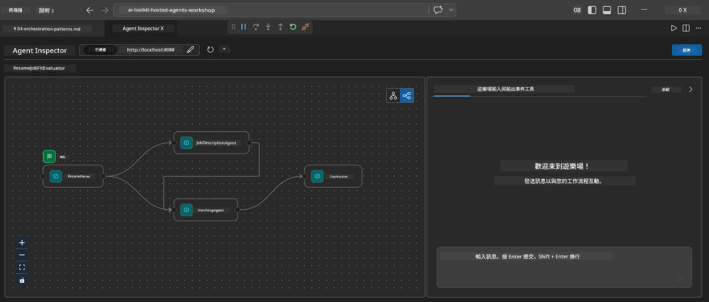
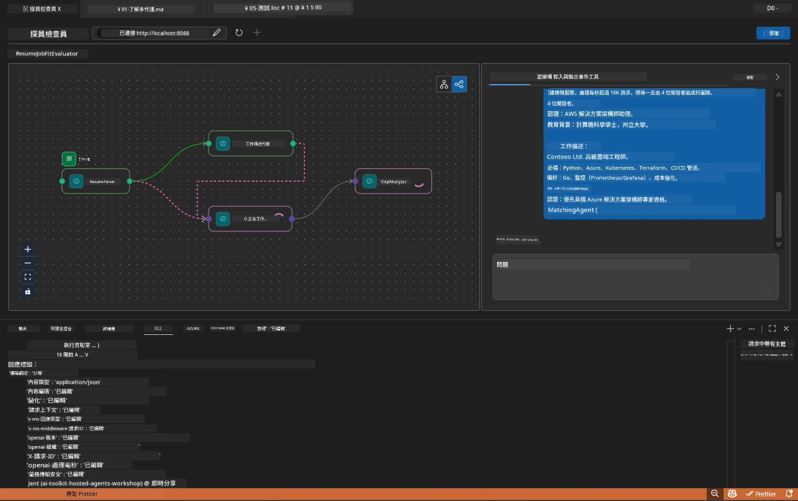
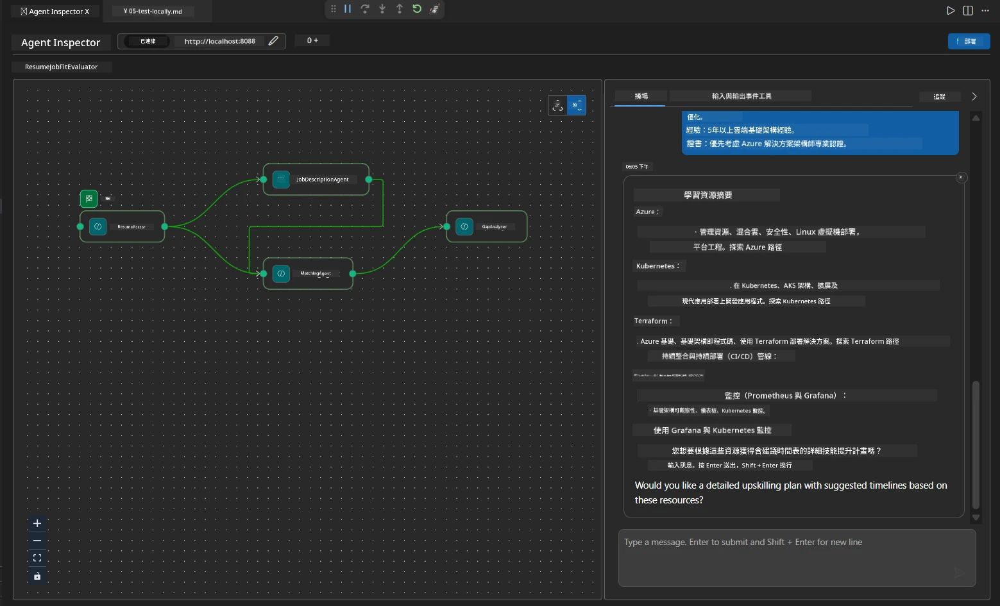

# 模組 5 - 本地測試

⏱️ 約 15 分鐘

在本模組中，你將在本地運行多代理工作流程，使用 Agent Inspector 測試，並確認所有四個代理及 MCP 工具在部署前皆能正常運作。

---

## 步驟 1：啟動代理伺服器

### 選項 A：使用 VS Code 任務（建議）

1. 將 `workshop/lab02-multi-agent/PersonalCareerCopilot/` 設為你的 VS Code 資料夾。
2. 按 `Ctrl+Shift+P` → 輸入 **Tasks: Run Task** → 選擇 **Run Agent HTTP Server**。
3. 任務將啟動服務器，並附加 debugpy，端口為`5679`，代理端口為 `8088`。
4. 等待輸出顯示：

```
INFO:resume-job-fit:Starting Resume -> Job Fit Evaluator HTTP server...
INFO:resume-job-fit:Server running on http://localhost:8088
```

### 選項 B：使用 F5（除錯模式）

1. 按 `F5` → 選擇 **Debug Local Agent HTTP Server**。
2. 服務器以完整斷點支援啟動，非常適合檢查 MCP 回應或代理輸出。

---

## 步驟 2：開啟 Agent Inspector

1. 按 `Ctrl+Shift+P` → 輸入 **Foundry Toolkit: Open Agent Inspector**。
2. Agent Inspector 將作為 VS Code 面板開啟並連接到 `http://localhost:8088`。
3. 你應該會看到代理介面已準備好接收訊息。



> **如果 Agent Inspector 無法開啟：** 請確保伺服器已完全啟動（你看到「Server running」日誌）。若端口 5679 被佔用，請參考[模組 8 - 疑難排解](08-troubleshooting.md)。

---

## 步驟 2b：（選用）開啟工作流程視覺化工具

Foundry Toolkit 包含即時 <strong>工作流程視覺化工具</strong>，可顯示代理間互動的圖形執行情況。這對多代理除錯特別有用。

1. 按 `Ctrl+Shift+P` → 輸入 **Foundry Toolkit: Open Visualizer for Hosted Agents**。
2. 將開啟一個新的 VS Code 分頁，顯示即時執行圖形。
3. 當你在 Agent Inspector 傳送訊息時，視覺化工具會自動更新 - 綠色節點代表已完成的代理，動畫邊顯示資料流動。

> **端口衝突：** 若視覺化工具端口已被使用，請至 VS Code 設定 → <strong>擴充功能</strong> → **Microsoft Foundry Configuration** → **Hosted Agents: Visualizer Port** 更改。

---

## 步驟 3：執行冒煙測試

按順序執行以下三個測試。每個測試會漸進檢查工作流程的不同部分。

### 測試 1：基本履歷 + 職務說明

將以下內容貼到 Agent Inspector：

```
Resume:
Jane Doe
Senior Software Engineer with 5 years of experience in Python, Django, and AWS.
Built microservices handling 10K+ requests/second. Led a team of 4 developers.
Certifications: AWS Solutions Architect Associate.
Education: B.S. Computer Science, State University.

Job Description:
Senior Cloud Engineer at Contoso Ltd.
Required: Python, Azure, Kubernetes, Terraform, CI/CD pipelines.
Preferred: Go, monitoring (Prometheus/Grafana), cost optimization.
Experience: 5+ years in cloud infrastructure.
Certifications: Azure Solutions Architect Expert preferred.
```

**預期輸出結構：**

回應應按順序包含所有四個代理的輸出：

1. <strong>履歷解析器輸出</strong> - 兩個標記區段：`[PARSED RESUME]`（含群組技能的候選人資料）與 `[JOB DESCRIPTION PASS-THROUGH]`（原文職務說明文字，供職務代理使用）
2. <strong>職務代理輸出</strong> - 結構化需求，區分必需與優先技能
3. <strong>匹配代理輸出</strong> - 適配分數（0-100）及細項分析、匹配技能、缺失技能、缺口
4. <strong>缺口分析器輸出</strong> - 每個缺失技能的個別缺口卡片，附帶 Microsoft Learn 連結





### 測試 1 要驗證的項目

| 檢查項目 | 預期結果 | 通過？ |
|-------|----------|-------|
| 回應包含適配分數 | 介於 0-100 的數字且有細項分析 | |
| 有列出匹配技能 | Python、CI/CD（部分匹配）等 | |
| 有列出缺失技能 | Azure、Kubernetes、Terraform 等 | |
| 每個缺失技能有缺口卡片 | 每項技能一張卡 | |
| 附有 Microsoft Learn 連結 | 真實的 `learn.microsoft.com` 連結 | |
| 回應中無錯誤訊息 | 清晰結構化輸出 | |

### 測試 2：邊界情況 - 高適配候選人

貼上一份與職務說明高度匹配的履歷，以驗證 GapAnalyzer 在高適配情況下的表現：

```
Resume:
Alex Chen
Senior Cloud Engineer with 7 years of experience.
Skills: Python, Azure (AKS, Functions, DevOps), Kubernetes, Terraform, CI/CD (GitHub Actions, Azure Pipelines), Go, Prometheus, Grafana, cost optimization.
Certifications: Azure Solutions Architect Expert, Azure DevOps Engineer Expert.
Led infrastructure migration to Azure for 3 enterprise clients.
Education: M.S. Computer Science, Tech University.

Job Description:
Senior Cloud Engineer at Contoso Ltd.
Required: Python, Azure, Kubernetes, Terraform, CI/CD pipelines.
Preferred: Go, monitoring (Prometheus/Grafana), cost optimization.
Experience: 5+ years in cloud infrastructure.
Certifications: Azure Solutions Architect Expert preferred.
```

**預期行為：**
- 適配分數應該為 **80+**（多數技能匹配）
- 缺口卡片應著重於修飾/面試準備，而非基礎學習
- GapAnalyzer 指示為：「若適配分數 >= 80，著重於修飾/面試準備」

---

## 步驟 4：用你自己的數據測試（選用）

嘗試貼上你自己的履歷和真實職務說明。這有助於驗證：

- 代理能處理不同履歷格式（時間序、功能式、混合式）
- 職務代理能處理不同職務說明風格（項目符號、段落、結構化）
- MCP 工具能提供真實技能的相關資源
- 缺口卡片將依你特定背景個人化

> **隱私 - 方案 A（Foundry 雲端）：** 履歷與職務說明文字會送至你的 Azure OpenAI 部署做推理。工作坊架構不會記錄或儲存。若有需要，可用假名（如「Jane Doe」）。
>
> **隱私 - 方案 B（Foundry 本地）：** 四個代理的推理完全在你的裝置上運行。你的履歷和職務說明文字<strong>不會離開你的機器</strong>。唯一的外部呼叫是 MCP 工具從 `https://learn.microsoft.com/api/mcp` 取得資源，該查詢僅包含技能名稱，無個人資料。

---

### 重要檢查點

- [ ] 伺服器已成功啟動於端口 `8088`（日誌顯示「Server running」）
- [ ] Agent Inspector 已開啟並成功連接代理
- [ ] 測試 1：完整回應，包括適配分數、匹配/缺失技能、缺口卡片與 Microsoft Learn 連結
- [ ] 測試 2：高適配候選人取得 80+ 分，且建議以修飾為主
- [ ] 所有缺口卡片均顯示（每個缺失技能一張，無截斷）
- [ ] 伺服器終端無錯誤或堆疊追蹤

---

**上一篇：** [04 - 協調模式](04-orchestration-patterns.md) · **下一篇：** [06 - 部署至 Foundry →](06-deploy-to-foundry.md)

---

<!-- CO-OP TRANSLATOR DISCLAIMER START -->
**免責聲明**：
本文件由 AI 翻譯服務 [Co-op Translator](https://github.com/Azure/co-op-translator) 翻譯而成。雖然我們致力於確保準確性，但請注意，機器自動翻譯可能包含錯誤或不準確之處。原始文件的母語版本應被視為權威來源。對於重要資訊，建議進行專業人工翻譯。我們不對因使用本翻譯而產生的任何誤解或誤釋承擔責任。
<!-- CO-OP TRANSLATOR DISCLAIMER END -->