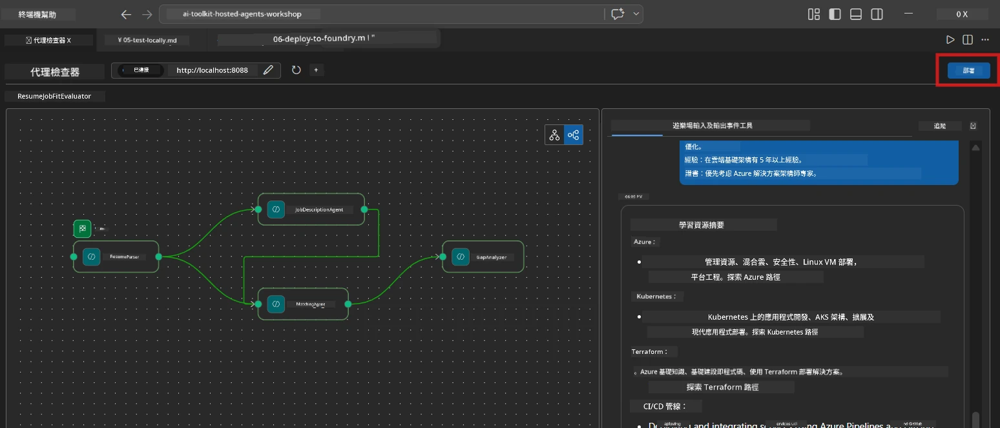
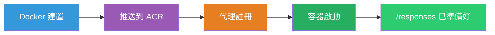
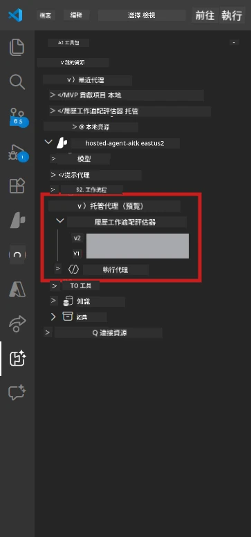

# Module 6 - 部署到 Foundry 代理服務

在本模組中，您將把在本地測試過的多代理工作流程部署到 [Microsoft Foundry](https://learn.microsoft.com/azure/foundry/agents/concepts/hosted-agents) 作為<strong>托管代理(Hosted Agent)</strong>。部署過程會建立一個 Docker 容器映像，將其推送到 [Azure 容器註冊表 (ACR)](https://learn.microsoft.com/azure/container-registry/container-registry-intro)，並在 [Foundry 代理服務](https://learn.microsoft.com/azure/foundry/agents/how-to/publish-agent) 中創建托管代理版本。

> **與實驗室 01 的主要區別：** 部署流程相同。Foundry 將您的多代理工作流程視為一個單一的托管代理——複雜性在容器內，但部署的接口仍是相同的 `/responses` 端點。

---

## 先決條件檢查

在部署前，請確認以下每一項：

1. **代理通過本地初步測試：**
   - 您已完成 [模組 5](05-test-locally.md) 中的所有 3 項測試，且工作流程產生完整輸出，包含差距卡與 Microsoft Learn URL。

2. **您擁有 [Azure AI User](https://learn.microsoft.com/azure/foundry/concepts/rbac-foundry) 角色：**
   - 已在 [實驗室 01，第 2 模組](../../lab01-single-agent/docs/02-create-foundry-project.md) 分配。驗證方法：
   - [Azure 入口網站](https://portal.azure.com) → 您的 Foundry <strong>專案</strong> 資源 → **存取控制 (IAM)** → <strong>角色指派</strong> → 確認您的帳戶列有 **[Azure AI User](https://aka.ms/foundry-ext-project-role)**。

3. **您已在 VS Code 中登入 Azure：**
   - 查看 VS Code 左下角的帳戶圖示，應顯示您的帳戶名稱。

4. **`agent.yaml` 有正確值：**
   - 打開 `PersonalCareerCopilot/agent.yaml` 並確認：
     ```yaml
     environment_variables:
       - name: PROJECT_ENDPOINT
         value: ${PROJECT_ENDPOINT}
       - name: MODEL_DEPLOYMENT_NAME
         value: ${MODEL_DEPLOYMENT_NAME}
     ```
   - 這些必須與 `main.py` 讀取的環境變數相符。

5. **`requirements.txt` 有正確版本：**
   ```
   agent-framework-azure-ai==1.0.0rc3
   agent-framework-core==1.0.0rc3
   azure-ai-agentserver-agentframework==1.0.0b16
   azure-ai-agentserver-core==1.0.0b16
   debugpy
   agent-dev-cli --pre
   ```

---

## 第一步：開始部署

### 選項A：從代理檢視器部署（推薦）

如果代理是透過 F5 運行且代理檢視器已開啟：

1. 查看代理檢視器面板的<strong>右上角</strong>。
2. 點擊 **Deploy** 按鈕（帶有向上箭頭↑的雲端圖示）。
3. 部署精靈視窗會打開。



### 選項B：從命令面板部署

1. 按 `Ctrl+Shift+P` 打開 <strong>命令面板</strong>。
2. 輸入：**Microsoft Foundry: Deploy Hosted Agent** 並選擇它。
3. 部署精靈視窗會打開。

---

## 第二步：配置部署

### 2.1 選擇目標專案

1. 下拉選單顯示您的 Foundry 專案。
2. 選擇研討會中使用的專案 (例如 `workshop-agents`)。

### 2.2 選擇容器代理程式檔案

1. 系統會要求您選擇代理入口點。
2. 導航至 `workshop/lab02-multi-agent/PersonalCareerCopilot/`，選擇 **`main.py`**。

### 2.3 配置資源

| 設定 | 建議值 | 備註 |
|---------|------------------|-------|
| **CPU** | `0.25` | 預設。多代理工作流程不需更多 CPU，因模型調用主要為 I/O 執行 |
| <strong>記憶體</strong> | `0.5Gi` | 預設。若加入大型資料處理工具，可以提升到 `1Gi` |

---

## 第三步：確認並部署

1. 精靈顯示部署摘要。
2. 確認後點擊 **Confirm and Deploy**。
3. 在 VS Code 觀察部署進展。

### 部署期間發生什麼事

在 VS Code 的 <strong>輸出</strong> 面板（選擇 "Microsoft Foundry" 下拉選單）監看：


1. **Docker 建置** - 使用您的 `Dockerfile` 建置容器：
   ```
   Step 1/6 : FROM python:3.14-slim
   Step 2/6 : WORKDIR /app
   ...
   Successfully built abc123def456
   ```

2. **Docker 推送** - 將映像推送至 ACR（第一次部署約 1-3 分鐘）。

3. <strong>代理註冊</strong> - Foundry 使用 `agent.yaml` 元資料創建一個托管代理。代理名稱為 `resume-job-fit-evaluator`。

4. <strong>容器啟動</strong> - 容器於 Foundry 管理基礎架構中啟動，且具有系統管理身份。

> <strong>首次部署較慢</strong>（Docker 推送所有層次）。後續部署可重用快取加速。

### 多代理專屬注意事項

- **所有四個代理都在一個容器內。** Foundry 僅視為一個托管代理。WorkflowBuilder 圖表在內部運行。
- **MCP 呼叫會對外。** 容器需要網際網路訪問 `https://learn.microsoft.com/api/mcp`。Foundry 管理基礎架構默認允許。
- **[受管身份](https://learn.microsoft.com/python/api/overview/azure/identity-readme#managed-identity-support)。** 在托管環境中，`main.py` 的 `get_credential()` 返回 `ManagedIdentityCredential()`（因為設置了 `MSI_ENDPOINT`）。此為自動行為。

---

## 第四步：驗證部署狀態

1. 開啟 **Microsoft Foundry** 側邊欄（點擊活動欄的 Foundry 圖示）。
2. 展開您專案下的 **Hosted Agents (Preview)**。
3. 找到 **resume-job-fit-evaluator**（或您的代理名稱）。
4. 點擊代理名稱 → 展開版本列表（如 `v1`）。
5. 點擊版本 → 檢查 **Container Details** → **Status**：



| 狀態 | 含義 |
|--------|---------|
| **Started** / **Running** | 容器正在運行，代理已就緒 |
| **Pending** | 容器啟動中（請等待 30-60 秒） |
| **Failed** | 容器啟動失敗（查看日誌 - 參見下方） |

> <strong>多代理啟動所需時間較長</strong>，因為容器啟動時會建立 4 個代理實例。"Pending" 狀態持續 2 分鐘內屬正常。

---

## 常見部署錯誤與修復

### 錯誤 1：權限不足 - `agents/write`

```
Error: lacks the required data action 
Microsoft.CognitiveServices/accounts/AIServices/agents/write
```

**修復方式：** 在<strong>專案</strong>層級分配 **[Azure AI User](https://learn.microsoft.com/azure/foundry/concepts/rbac-foundry)** 角色。詳細步驟請參考 [模組 8 - 疑難排解](08-troubleshooting.md)。

### 錯誤 2：Docker 未運行

```
Error: Docker build failed / Cannot connect to Docker daemon
```

**修復方式：**
1. 啟動 Docker Desktop。
2. 等待顯示「Docker Desktop is running」。
3. 驗證：執行 `docker info`
4. **Windows：** 確保在 Docker Desktop 設定中啟用 WSL 2 後端。
5. 再次嘗試。

### 錯誤 3：Docker 建置期間 pip install 失敗

```
Error: Could not find a version that satisfies the requirement agent-dev-cli
```

**修復方式：** `requirements.txt` 中的 `--pre` 標誌於 Docker 中處理不同。確認您 `requirements.txt` 包含：
```
agent-dev-cli --pre
```

如果 Docker 仍失敗，建立 `pip.conf` 或在建置參數中傳入 `--pre`。詳情見 [模組 8](08-troubleshooting.md)。

### 錯誤 4：MCP 工具在托管代理中故障

如果部署後 Gap Analyzer 不再產生 Microsoft Learn URL：

**根本原因：** 網路政策可能阻擋容器的出站 HTTPS。

**修復方式：**
1. Foundry 預設設定通常不會有此問題。
2. 若發生，請檢查 Foundry 專案虛擬網路是否有 NSG 阻擋出站 HTTPS。
3. MCP 工具內建備援 URL，代理仍會產生輸出（但無即時 URL）。

---

### 檢查點

- [ ] VS Code 中部署命令成功完成無錯誤
- [ ] 代理已顯示在 Foundry 側邊欄的 **Hosted Agents (Preview)** 下
- [ ] 代理名稱為 `resume-job-fit-evaluator`（或您選擇的名稱）
- [ ] 容器狀態顯示為 **Started** 或 **Running**
- [ ] （若有錯誤）您已辨識錯誤、套用修正並成功重新部署

---

**上一節：** [05 - 本地測試](05-test-locally.md) · **下一節：** [07 - 在 Playground 驗證 →](07-verify-in-playground.md)

---

<!-- CO-OP TRANSLATOR DISCLAIMER START -->
**免責聲明**：
本文件由 AI 翻譯服務 [Co-op Translator](https://github.com/Azure/co-op-translator) 所翻譯。雖然我們致力於準確性，但請注意，自動翻譯可能包含錯誤或不準確之處。原始文件的母語版本應被視為權威來源。對於重要資訊，建議尋求專業人工翻譯。我們不對因使用此翻譯而產生的任何誤解或誤釋負責。
<!-- CO-OP TRANSLATOR DISCLAIMER END -->