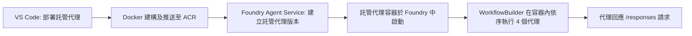
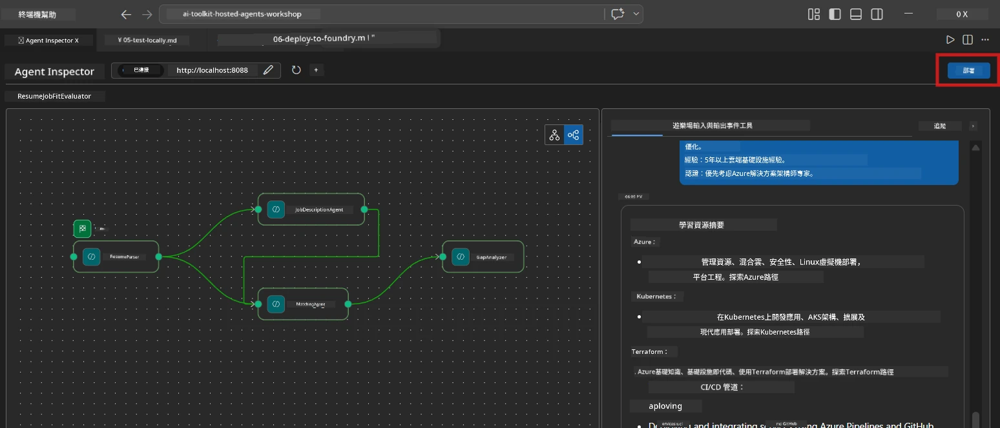

# 模組 6 - 部署到 Foundry Agent 服務

⏱️ 約 10 分鐘

在本模組中，您將本地測試過的多代理工作流程部署到 [Microsoft Foundry](https://learn.microsoft.com/azure/foundry/agents/concepts/hosted-agents) 作為 <strong>託管代理</strong>。部署流程會構建 Docker 容器映像，將其推送至 [Azure Container Registry (ACR)](https://learn.microsoft.com/azure/container-registry/container-registry-intro)，並在 [Foundry Agent Service](https://learn.microsoft.com/azure/foundry/agents/how-to/publish-agent) 中建立一個託管代理版本。

> **與練習 01 主要差異：** 部署流程相同。Foundry 將您的多代理工作流程視為單一託管代理 — 複雜性在容器內部，但部署介面都是相同的 `/responses` 端點。

### 部署流程


```mermaid
flowchart LR
    A[VS Code: 部署託管代理] --> B[Docker 建構及推送至 ACR]
    B --> C[Foundry Agent Service: 建立託管代理版本]
    C --> D[託管代理容器於 Foundry 中啟動]
    D --> E[WorkflowBuilder 在容器內依序執行 4 個代理]
    E --> F[代理回應 /responses 請求]
```

---

## 先決條件檢查

部署前，請確認以下條件：

1. **代理通過本地煙霧測試：**
   - 您已完成 [模組 5](05-test-locally.md) 中所有 3 項測試，且工作流程產出完整的輸出，包含缺口卡和 Microsoft Learn URL。

2. **您有 [Foundry User](https://learn.microsoft.com/azure/foundry/concepts/rbac-foundry) 角色**（部署至少須有專案範圍的 **Foundry Project Manager** 權限）：

   > **注意：** Foundry RBAC 角色近期重新命名 - **Foundry User**、**Foundry Owner** 和 **Foundry Project Manager** 之前分別稱為 Azure AI User、Azure AI Owner 和 Azure AI Project Manager。角色 ID 與權限未變。

   - 在 [Azure Portal](https://portal.azure.com) → 你的 Foundry <strong>專案</strong>資源 → **存取控制 (IAM)** → <strong>角色指派</strong> → 確認帳號有列出 **Foundry User**（或更高權限）。

3. **您已在 VS Code 登入 Azure：**
   - 查看 VS Code 左下角的帳戶圖示，應可見您的帳戶名稱。

4. **`agent.yaml` 設定正確：**
   - 開啟 `PersonalCareerCopilot/agent.yaml` 並確認：
     ```yaml
     environment_variables:
       - name: AZURE_AI_MODEL_DEPLOYMENT_NAME
         value: ${AZURE_AI_MODEL_DEPLOYMENT_NAME}
     ```
   - 這裡不會列出 `FOUNDRY_PROJECT_ENDPOINT` — Foundry 會於執行時注入。只需宣告 `AZURE_AI_MODEL_DEPLOYMENT_NAME`。

5. **`requirements.txt` 版本正確：**
   ```
   agent-framework-foundry
   agent-framework-foundry-hosting
   mcp<2,>=1.24.0
   debugpy
   ```

---

## 步驟 1：開始部署

### 選項 A：從 Agent Inspector 部署（推薦）

若代理正在透過 F5 執行且 Agent Inspector 已開啟：

1. 觀察 Agent Inspector 面板的 <strong>右上角</strong>。
2. 點擊 **Deploy** 按鈕（雲端圖示並有箭頭 ↑）。
3. 部署精靈將開啟。



### 選項 B：從命令面板部署

1. 按 `Ctrl+Shift+P` 開啟 <strong>命令面板</strong>。
2. 輸入：**Foundry Toolkit: Deploy Hosted Agent** 並選擇它。
3. 部署精靈開啟。

---

## 步驟 2：設定部署

### 2.1 選擇目標專案

1. 下拉選單顯示您的 Foundry 專案。
2. 選擇您本次工作坊使用的專案（例如 `workshop-agents`）。

### 2.2 選擇容器代理檔案

1. 系統會要求您選擇代理的進入點。
2. 導覽至 `workshop/lab02-multi-agent/PersonalCareerCopilot/` 並選擇 **`main.py`**。

### 2.3 配置資源

| 設定項目 | 推薦值 | 備註 |
|---------|--------|-------|
| <strong>部署方式</strong> | <strong>容器</strong>（推薦）或 <strong>程式碼</strong> | 容器會建立 Docker 映像；程式碼會上傳 ZIP 檔案（預覽中） |
| <strong>容器註冊表</strong> | **預設 ACR** | Foundry 會為您建立並管理 |
| **CPU** | `0.25` | 預設。多代理工作流程因模型呼叫屬於 I/O 綁定，不需更多 CPU |
| <strong>記憶體</strong> | `0.5Gi` | 預設。若加入大型資料處理工具可調至 `1Gi` |

---

## 步驟 3：確認並部署

1. 精靈會顯示部署摘要。
2. 檢視後點擊 <strong>確認並部署</strong>。
3. 在 VS Code 中觀看進度。

### 部署期間發生什麼事

注意 VS Code <strong>輸出</strong> 面板（選擇「Microsoft Foundry」下拉選單）：

1. **Docker 建置** — 根據您的 `Dockerfile` 建立容器映像
   ```
   Step 1/6 : FROM python:3.12-slim
   Step 2/6 : WORKDIR /app
   ...
   Successfully built abc123def456
   ```

2. **Docker 推送** — 將映像推送至 ACR（首次部署約 1-3 分鐘）。

3. <strong>代理註冊</strong> — Foundry 根據 `agent.yaml` 的元資料建立託管代理。代理名稱為 `resume-job-fit-evaluator`。

4. <strong>容器啟動</strong> — 容器在 Foundry 管理的基礎架構中啟動，並使用系統管理的識別。

> <strong>首次部署較慢</strong>（Docker 會推送所有映像層）。後續部署會重用快取層，速度較快。

### 多代理特別說明

- **所有四個代理皆在同一容器內。** Foundry 看到的是單一託管代理。WorkflowBuilder 圖形會內部運作。
- **MCP 呼叫是向外發出。** 容器需要網路連接以存取 `https://learn.microsoft.com/api/mcp`。Foundry 管理的基礎架構預設提供此功能。
- **[管理識別](https://learn.microsoft.com/azure/foundry/agents/concepts/agent-identity)。** Foundry 部署時會自動為每個託管代理建立 **專屬的 Entra 管理解別**。在託管環境中，`DefaultAzureCredential` 自動解析為此代理身份，無需手動配置管理識別。

---

## 步驟 4：驗證部署狀態

1. 開啟 **Microsoft Foundry** 側邊欄（點擊工作列的 Foundry 圖示）。
2. 展開專案下的 **Hosted Agents (Preview)**。
3. 找到 **resume-job-fit-evaluator**（或您自訂的代理名稱）。
4. 點擊代理名稱 → 展開版本（例如 `v1`）。
5. 點選版本 → 查看 <strong>容器詳情</strong> → <strong>狀態</strong>：


| 狀態 | 意義 |
|--------|---------|
| **active** | 代理正在運行並準備接受請求 |
| **creating** | 容器正在啟動（請等待 30–60 秒） |
| **failed** | 容器啟動失敗（檢查日誌 - 詳見下方） |

> **注意：** VS Code 側邊欄可能顯示「運行中」或「已啟動」等標籤，而底層 API 狀態使用 `active`/`creating`。兩者表示相同狀態。

> <strong>多代理啟動時間較久</strong>，因為容器啟動時會建立 4 個代理實例。`creating` 狀態持續約 2 分鐘屬正常。

---

## 常見部署錯誤及修正

### 錯誤 1：權限被拒 - `agents/write`

```
Error: lacks the required data action 
Microsoft.CognitiveServices/accounts/AIServices/agents/write
```

**修正方法：** 在 <strong>專案</strong>層級指派 **[Foundry User](https://learn.microsoft.com/azure/foundry/concepts/rbac-foundry)** 角色（前稱 **Azure AI User**）。請參考 [模組 8 - 疑難排解](08-troubleshooting.md) 取得詳細步驟。

### 錯誤 2：Docker 未啟動

```
Error: Docker build failed / Cannot connect to Docker daemon
```

**修正方法：**
1. 啟動 Docker Desktop。
2. 等待「Docker Desktop 正在運行」。
3. 確認指令：`docker info`
4. **Windows：** 確認 Docker Desktop 設定中已啟用 WSL 2 後端。
5. 重試部署。

### 錯誤 3：pip 安裝在 Docker 建置中失敗

```
Error: Could not find a version that satisfies the requirement agent-framework-foundry
```

**修正方法：** 確認 `requirements.txt` 符合：
```
agent-framework-foundry
agent-framework-foundry-hosting
mcp<2,>=1.24.0
debugpy
```

若仍建置失敗，可能 Docker 網路阻擋 PyPI。查看 `docker info` 是否有代理設定。

### 錯誤 4：MCP 工具在託管代理失效

若 Gap Analyzer 在部署後停止產生 Microsoft Learn URL：

**根本原因：** 容器的網路政策可能阻擋了對外 HTTPS。

**解決方法：**
1. Foundry 預設配置通常不會有此問題。
2. 若發生，檢查 Foundry 專案的虛擬網路是否有 NSG 阻擋對外 HTTPS。
3. MCP 工具有內建備援 URL，代理仍會產出結果（但無即時 URL）。

---

### 檢查點

- [ ] 在 VS Code 中部署命令完成且無錯誤
- [ ] Foundry 側邊欄的 **Hosted Agents (Preview)** 下出現代理
- [ ] 代理名稱為 `resume-job-fit-evaluator`（或您選擇的名稱）
- [ ] 容器狀態顯示 <strong>已啟動</strong> 或 <strong>運行中</strong>
- [ ]（若有錯誤）您已識別錯誤、採取解決措施並成功重新部署

---

**上一章節：** [05 - 本地測試](05-test-locally.md) · **下一章節：** [07 - 在 Playground 驗證 →](07-verify-in-playground.md)

---

<!-- CO-OP TRANSLATOR DISCLAIMER START -->
**免責聲明**：
本文件由 AI 翻譯服務 [Co-op Translator](https://github.com/Azure/co-op-translator) 翻譯而成。雖然我們致力於確保準確性，但請注意，機器自動翻譯可能包含錯誤或不準確之處。原始文件的母語版本應被視為權威來源。對於重要資訊，建議進行專業人工翻譯。我們不對因使用本翻譯而產生的任何誤解或誤釋承擔責任。
<!-- CO-OP TRANSLATOR DISCLAIMER END -->