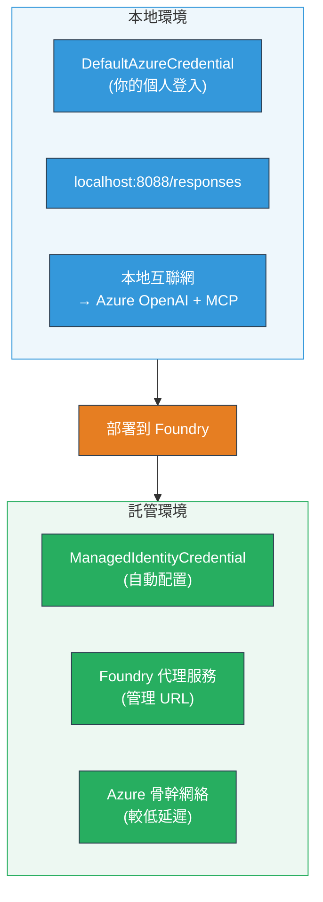

# Module 7 - 在 Playground 驗證

在本模組中，您將測試在 **VS Code** 以及 **[Foundry Portal](https://ai.azure.com)** 中部署的多代理工作流，確保代理的行為與本機測試一致。

---

## 為什麼要在部署後驗證？

您的多代理工作流在本機運行完美，為什麼還要再次測試？因為托管環境有以下幾點差異：


| 差異 | 本機 | 托管 |
|-----------|-------|--------|
| <strong>身分</strong> | [`DefaultAzureCredential`](https://learn.microsoft.com/azure/developer/python/sdk/authentication/credential-chains#defaultazurecredential-overview)（您的個人登入） | [`ManagedIdentityCredential`](https://learn.microsoft.com/python/api/overview/azure/identity-readme#managed-identity-support)（自動配置） |
| <strong>端點</strong> | `http://localhost:8088/responses` | [Foundry Agent Service](https://learn.microsoft.com/azure/foundry/agents/concepts/hosted-agents) 端點（管理 URL） |
| <strong>網路</strong> | 本機 → Azure OpenAI + MCP 出站 | Azure 主幹網路（服務間延遲較低） |
| **MCP 連線** | 本機網際網路 → `learn.microsoft.com/api/mcp` | 容器出站 → `learn.microsoft.com/api/mcp` |

若有任何環境變數配置錯誤、RBAC 權限不同或 MCP 出站被阻止，您將會在此階段發現。

---

## 選項 A：在 VS Code Playground 測試（建議先用此法）

[Foundry 擴充功能](https://marketplace.visualstudio.com/items?itemName=TeamsDevApp.vscode-ai-foundry) 包含一個整合的 Playground，讓您無需離開 VS Code 就能與部署的代理對話。

### 步驟 1：找到您的托管代理

1. 點擊 VS Code <strong>活動欄</strong>（左側邊欄）的 **Microsoft Foundry** 圖示，打開 Foundry 面板。
2. 展開您所連接的專案 (例如：`workshop-agents`)。
3. 展開 **Hosted Agents (Preview)**。
4. 您應該會看到您的代理名稱（例如：`resume-job-fit-evaluator`）。

### 步驟 2：選擇版本

1. 點擊代理名稱展開其版本。
2. 點擊您部署的版本（例如：`v1`）。
3. 將會打開 <strong>詳細面板</strong>，顯示容器細節。
4. 確認狀態為 **Started** 或 **Running**。

### 步驟 3：打開 Playground

1. 在詳細面板中，點擊 **Playground** 按鈕（或右鍵版本 → **Open in Playground**）。
2. 會開啟一個 VS Code 分頁中的聊天介面。

### 步驟 4：執行您的冒煙測試

使用來自 [Module 5](05-test-locally.md) 的相同三個測試。將每則訊息輸入 Playground 的輸入框並按 **Send**（或 **Enter**）。

#### 測試 1 - 完整履歷 + JD（標準流程）

貼上 Module 5 中測試 1（Jane Doe + Contoso Ltd 高級雲端工程師）的完整履歷 + JD 提示。

**預期：**
- 配合分數及其細項計算（100 分制）
- 配合技能段落
- 缺少技能段落
- <strong>每項缺失技能一張差距卡</strong>，附有 Microsoft Learn 網址
- 含時間表的學習路線圖

#### 測試 2 - 快速短測（最少輸入）

```
RESUME: 3 years Python developer, knows Django and PostgreSQL, no cloud experience.

JOB: Cloud DevOps Engineer requiring AWS, Kubernetes, Terraform, CI/CD. 5 years needed.
```

**預期：**
- 較低配合分數（< 40）
- 具誠實評估的分階段學習路徑
- 多張差距卡（AWS、Kubernetes、Terraform、CI/CD、經驗差距）

#### 測試 3 - 高配合候選人

```
RESUME:
10 years Azure Cloud Architect. AZ-305 certified. Expert in AKS, Terraform, Azure DevOps, 
Azure Functions, Helm, Prometheus, Grafana, Python, Go. Led platform team of 8.

JOB:
Senior Cloud Engineer. Required: AKS, Terraform, Azure DevOps, Python. Preferred: Helm, Go.
5+ years experience. AZ-305 preferred.
```

**預期：**
- 高配合分數（≥ 80）
- 重點在面試準備與提昇技巧
- 少量或無差距卡
- 專注於準備的短時間路線圖

### 步驟 5：與本機結果比較

打開您在 Module 5 中保存的本機回應筆記或瀏覽器分頁。對每個測試：

- 回應是否具有<strong>相同架構</strong>（配合分數、差距卡、路線圖）？
- 是否遵循<strong>相同的評分標準</strong>（100 分等級分解）？
- 差距卡中是否仍包含<strong>Microsoft Learn 網址</strong>？
- 是否<strong>每項缺失技能都有一張差距卡</strong>（未被截斷）？

> <strong>少許文字差異屬正常</strong> — 模型具有非確定性。請側重結構、評分一致性和 MCP 工具使用狀況。

---

## 選項 B：在 Foundry Portal 測試

[Foundry Portal](https://ai.azure.com) 提供網頁版的 Playground，方便與隊友或利害關係人分享。

### 步驟 1：打開 Foundry Portal

1. 打開瀏覽器，導航至 [https://ai.azure.com](https://ai.azure.com)。
2. 使用您在工作坊全程使用的相同 Azure 帳戶登入。

### 步驟 2：定位您的專案

1. 在首頁，查看左側邊欄的 **Recent projects**。
2. 點擊您的專案名稱（例如：`workshop-agents`）。
3. 若看不到，點 **All projects** 並搜尋。

### 步驟 3：尋找您部署的代理

1. 在專案左側導航中點擊 **Build** → **Agents**（或找到 **Agents** 區塊）。
2. 您應該會看到代理清單，找到您部署的代理（例如：`resume-job-fit-evaluator`）。
3. 點擊代理名稱以開啟詳細頁面。

### 步驟 4：打開 Playground

1. 在代理詳細頁的頂部工具列。
2. 點擊 **Open in playground**（或 **Try in playground**）。
3. 會開啟聊天介面。

### 步驟 5：執行相同的冒煙測試

重複上述 VS Code Playground 節中的所有 3 個測試。將每個回應與本機結果（Module 5）及 VS Code Playground 結果（選項 A）做比較。

---

## 多代理特定驗證

除了基本正確性外，請驗證以下多代理專屬行為：

### MCP 工具執行

| 檢查 | 如何驗證 | 通過條件 |
|-------|---------------|----------------|
| MCP 呼叫成功 | 差距卡包含 `learn.microsoft.com` 網址 | 為真實網址，非備用訊息 |
| 多次 MCP 呼叫 | 每項高/中優先差距皆有資源 | 不只第一張差距卡 |
| MCP 備援功能正常 | 若網址缺失，檢查是否有備援文字 | 代理仍產生差距卡（無論有無網址） |

### 代理協調

| 檢查 | 如何驗證 | 通過條件 |
|-------|---------------|----------------|
| 四個代理皆執行 | 輸出包含配合分數及差距卡 | 分數來自 MatchingAgent，差距卡來自 GapAnalyzer |
| 並行分散執行 | 回應時間合理（< 2 分鐘） | 若超過 3 分鐘，可能並行執行未生效 |
| 資料流完整性 | 差距卡參考來自配對報告的技能 | 不包含履歷中未出現的幻覺技能 |

---

## 驗證評分標準

依此標準評估您的多代理工作流在托管環境的行為：

| # | 評估項目 | 通過條件 | 通過？ |
|---|----------|---------------|-------|
| 1 | <strong>功能正確性</strong> | 代理對履歷 + JD 回應配合分數與差距分析 | |
| 2 | <strong>評分一致性</strong> | 配合分數運用 100 分制並具細項計算 | |
| 3 | <strong>差距卡完整性</strong> | 每缺失技能一張差距卡（無截斷或合併） | |
| 4 | **MCP 工具整合** | 差距卡含真實 Microsoft Learn 網址 | |
| 5 | <strong>結構一致性</strong> | 輸出結構與本機及托管一致 | |
| 6 | <strong>回應時間</strong> | 托管代理整體評估在 2 分鐘內完成 | |
| 7 | <strong>無錯誤</strong> | 無 HTTP 500 錯誤、逾時或空回應 | |

> 「通過」表示 3 個冒煙測試在至少一個 Playground（VS Code 或門戶）中滿足所有 7 項。

---

## Playground 問題排解

| 症狀 | 可能原因 | 解決方案 |
|---------|-------------|-----|
| Playground 無法載入 | 容器狀態非「Started」 | 返回 [Module 6](06-deploy-to-foundry.md)，確認部署狀態。如為「Pending」請稍候 |
| 代理回應空白 | 模型部署名稱不匹配 | 檢查 `agent.yaml` → `environment_variables` → `MODEL_DEPLOYMENT_NAME` 是否與您部署的模型一致 |
| 代理回應錯誤訊息 | 缺少 [RBAC](https://learn.microsoft.com/azure/foundry/concepts/rbac-foundry) 權限 | 在專案範圍指派 **[Azure AI User](https://aka.ms/foundry-ext-project-role)** |
| 差距卡無 Microsoft Learn 網址 | MCP 出站被阻擋或 MCP 伺服器不可用 | 檢查容器是否能抵達 `learn.microsoft.com`。參見 [Module 8](08-troubleshooting.md) |
| 只有 1 張差距卡（被截斷） | GapAnalyzer 指令缺少「CRITICAL」區塊 | 複查 [Module 3, Step 2.4](03-configure-agents.md) |
| 配合分數與本機極度不符 | 使用不同模型或指令被部署 | 比較 `agent.yaml` 環境變數與本機 `.env`。有需要就重部署 |
| 門戶顯示「Agent not found」 | 部署尚在傳播或失敗 | 等待 2 分鐘後重新整理。仍未出現則從 [Module 6](06-deploy-to-foundry.md) 重新部署 |

---

### 檢查點

- [ ] 已在 VS Code Playground 測試代理 - 3 個冒煙測試全過
- [ ] 已在 [Foundry Portal](https://ai.azure.com) Playground 測試代理 - 3 個冒煙測試全過
- [ ] 回應結構與本機測試相符（配合分數、差距卡、路線圖）
- [ ] 差距卡含 Microsoft Learn 網址（MCP 工具有於托管環境正常運作）
- [ ] 每項缺失技能對應一張差距卡（無截斷）
- [ ] 測試過程無錯誤或逾時
- [ ] 完成驗證評分標準（全部 7 項通過）

---

**上一篇：** [06 - Deploy to Foundry](06-deploy-to-foundry.md) · **下一篇：** [08 - Troubleshooting →](08-troubleshooting.md)

---

<!-- CO-OP TRANSLATOR DISCLAIMER START -->
**免責聲明**：  
本文件使用 AI 翻譯服務 [Co-op Translator](https://github.com/Azure/co-op-translator) 進行翻譯。雖然我們致力於準確性，但請注意自動翻譯可能包含錯誤或不準確之處。原始文件的本地語言版本應視為權威來源。對於重要資訊，建議採用專業人工翻譯。對於因使用本翻譯而引起的任何誤解或誤釋，我們不承擔任何責任。
<!-- CO-OP TRANSLATOR DISCLAIMER END -->