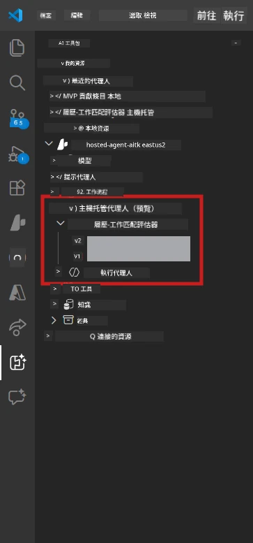

# 模組 7 - 在 Playground 驗證

⏱️ 約 10 分鐘

在此模組中，您將在 VS Code 和 Foundry Portal 中測試已部署的多代理工作流程，確認代理的行為與本地測試相同。

---

## 為什麼部署後還要再次測試？

托管環境與本地環境在幾個重要方面有所不同：

| | 本地 | 托管 |
|--|-------|--------|
| <strong>身份識別</strong> | 您的個人登入 (`DefaultAzureCredential`) | 每個代理專用的 Entra 身份（在部署時自動配置） |
| <strong>端點</strong> | `http://localhost:8088/responses` | Foundry 代理服務管理的 URL |
| <strong>網絡</strong> | 您的機器 → Azure OpenAI + MCP | Azure 骨幹網（延遲更低） |

配置錯誤的環境變數、RBAC 問題或阻止 MCP 外發調用，會首先在這裡顯現出來。

---

## 選項 A：在 VS Code Playground 測試（建議優先）

### 第 1 步：導航到您的托管代理

1. 點擊活動欄中的 **Foundry Toolkit** 圖示。
2. 展開您的專案 → **Hosted Agents (Preview)** → 找到您的代理。



### 第 2 步：選擇版本

1. 點擊代理以展開其版本列表。
2. 點擊 `v1` → 確認狀態為 **active**（側邊欄可能顯示 "Running" 或 "Started" — 兩者皆表示準備就緒狀態）。

### 第 3 步：打開 Playground

1. 點擊 **Playground**（或右鍵點擊版本 → **Open in Playground**）。
2. 聊天視窗會在 VS Code 標籤頁中打開。

### 第 4 步：執行冒煙測試

使用從 [模組 5](05-test-locally.md) 的相同 3 項測試。在 Playground 輸入框中輸入每個訊息並按 <strong>送出</strong>（或 **Enter**）。

#### 測試 1 - 完整履歷 + JD（標準流程）

貼上模組 5 中測試 1 的完整履歷 + JD 提示（Jane Doe + Contoso Ltd 的高級雲端工程師）。

**預期結果：**
- 合適度分數及分段數學計算（100 分制）
- 匹配技能區段
- 缺少技能區段
- <strong>每個缺失技能一張差距卡</strong>，附帶 Microsoft Learn 網址
- 含學習路線圖與時間表

#### 測試 2 - 快速簡短測試（最少輸入）

```
RESUME: 3 years Python developer, knows Django and PostgreSQL, no cloud experience.

JOB: Cloud DevOps Engineer requiring AWS, Kubernetes, Terraform, CI/CD. 5 years needed.
```

**預期結果：**
- 較低合適度分數（< 40）
- 誠實評估與分階段學習路徑
- 多張差距卡（AWS、Kubernetes、Terraform、CI/CD、經驗差距）

#### 測試 3 - 高合適度候選人

```
RESUME:
10 years Azure Cloud Architect. AZ-305 certified. Expert in AKS, Terraform, Azure DevOps, 
Azure Functions, Helm, Prometheus, Grafana, Python, Go. Led platform team of 8.

JOB:
Senior Cloud Engineer. Required: AKS, Terraform, Azure DevOps, Python. Preferred: Helm, Go.
5+ years experience. AZ-305 preferred.
```

**預期結果：**
- 高合適度分數（≥ 80）
- 以面試準備與打磨為重點
- 幾乎沒有差距卡
- 短時間軸專注於準備

### 第 5 步：與本地結果比較

打開您在模組 5 中保存的本地響應的筆記或瀏覽器標籤頁。對每個測試：

- 響應是否有 <strong>相同結構</strong>（合適度分數、差距卡、路線圖）？
- 是否遵循 <strong>相同評分標準</strong>（100 分制細分）？
- 差距卡裡是否仍包含 **Microsoft Learn 網址**？
- 是否 <strong>每個缺失技能一張差距卡</strong>（未被截斷）？

> <strong>小幅用詞差異屬正常</strong> — 模型非確定性。請著重結構、評分一致性與 MCP 工具使用。

---

## 選項 B：在 Foundry Portal 測試

[Foundry Portal](https://ai.azure.com) 提供基於網頁的 Playground，非常適合與團隊或持份者分享。

### 第 1 步：打開 Foundry Portal

1. 開啟瀏覽器並前往 [https://ai.azure.com](https://ai.azure.com)。
2. 使用本工作坊中一直使用的同一個 Azure 帳號登入。

### 第 2 步：導航至您的專案

1. 在主頁左側邊欄查找 **Recent projects**。
2. 點擊您的專案名稱（如 `workshop-agents`）。
3. 若看不到，點擊 **All projects** 並搜尋該專案。

### 第 3 步：尋找已部署代理

1. 在專案左側導航中點擊 **Build** → **Agents**（或尋找 **Agents** 區域）。
2. 您應該會看到代理列表。找到您的已部署代理（如 `resume-job-fit-evaluator`）。
3. 點擊代理名稱以開啟詳細頁面。

### 第 4 步：打開 Playground

1. 在代理詳細頁面頂部工具欄中查看。
2. 點擊 **Open in playground**（或 **Try in playground**）。
3. 聊天介面會打開。

### 第 5 步：執行相同冒煙測試

重複以上 VS Code Playground 部分的全部 3 項測試。將每個響應與本地結果（模組 5）及 VS Code Playground 結果（選項 A）比較。

---

## 多代理特定驗證

除了基本正確性外，還需驗證以下多代理特定行為：

### MCP 工具執行

| 檢查項目 | 驗證方式 | 通過條件 |
|-------|---------------|----------------|
| MCP 調用成功 | 差距卡包含 `learn.microsoft.com` 網址 | 具有真實網址，而非備用訊息 |
| 多次 MCP 調用 | 每個高/中優先差距都有資源 | 不只是第一張差距卡 |
| MCP 備用機制正常 | 網址缺失時檢查備用文字 | 代理仍產生差距卡（有無網址皆可） |

### 代理協調

| 檢查項目 | 驗證方式 | 通過條件 |
|-------|---------------|----------------|
| 4 個代理均已執行 | 輸出包含合適度分數與差距卡 | 分數由 MatchingAgent 負責，卡片出自 GapAnalyzer |
| 依序執行 | 回應時間合理（< 2 分鐘） | 超過 3 分鐘，請查看終端日志是否有錯誤 |
| 資料流完整性 | 差距卡參照匹配報告中的技能 | 無未出現在 JD 的幻覺技能 |

---

## 驗證標準表

使用此標準評價您的多代理工作流程托管行為：

| # | 標準 | 通過條件 | 通過？ |
|---|----------|---------------|-------|
| 1 | <strong>功能正確性</strong> | 代理對履歷與 JD 回應合適度分數與差距分析 | |
| 2 | <strong>評分一致性</strong> | 合適度分數使用 100 分制及分段計算 | |
| 3 | <strong>差距卡完整性</strong> | 每缺失技能一張差距卡（未截斷或合併） | |
| 4 | **MCP 工具整合** | 差距卡含真實 Microsoft Learn 網址 | |
| 5 | <strong>結構一致性</strong> | 本地與托管輸出結構相符 | |
| 6 | <strong>回應時間</strong> | 托管代理全評估於 2 分鐘內回應 | |
| 7 | <strong>無錯誤</strong> | 無 HTTP 500 錯誤、逾時或空白回應 | |

> 「通過」表示在至少一個 Playground（VS Code 或 Portal）中，全部 3 項冒煙測試均符合所有 7 項標準。

---

## Playground 問題排解

| 症狀 | 可能原因 | 解決方式 |
|---------|-------------|-----|
| Playground 不載入 | 容器非 `active` 狀態 | 回到[模組 6](06-deploy-to-foundry.md)，確認部署狀態，若為 `creating` 請耐心等待 |
| 代理回應空白 | 模型部署名稱不符 | 檢查 `agent.yaml` → `environment_variables` → `AZURE_AI_MODEL_DEPLOYMENT_NAME` 是否與您已部署模型相符 |
| 代理回傳錯誤訊息 | 欠缺 [RBAC](https://learn.microsoft.com/azure/foundry/concepts/rbac-foundry) 權限 | 在專案範圍指派 **[Foundry User](https://aka.ms/foundry-ext-project-role)**（先前為 Azure AI User） |
| 差距卡無 Microsoft Learn 網址 | MCP 外發被阻擋或 MCP 伺服器不可用 | 檢查容器是否能連接到 `learn.microsoft.com`，詳見[模組 8](08-troubleshooting.md) |
| 只有 1 張差距卡（被截斷） | GapAnalyzer 指示缺少 "CRITICAL" 區塊 | 請檢視[模組 3，第 2 標步驟 4](03-configure-agents.md) |
| 合適度分數與本地差異甚大 | 部署了不同模型或指示 | 比對 `agent.yaml` 環境變數與本地 `.env`，如有需要重新部署 |
| Portal 顯示「找不到代理」 | 部署尚在傳播或失敗 | 等待 2 分鐘並重新整理，若仍缺失，從[模組 6](06-deploy-to-foundry.md) 重新部署 |

---

### 檢查點

- [ ] 在 VS Code Playground 測試代理 - 全部 3 個冒煙測試通過
- [ ] 在 [Foundry Portal](https://ai.azure.com) Playground 測試代理 - 全部 3 個冒煙測試通過
- [ ] 響應結構與本地測試一致（合適度分數、差距卡、路線圖）
- [ ] 差距卡中包含 Microsoft Learn 網址（MCP 工具在托管環境中運作正常）
- [ ] 每缺失技能有一張差距卡（無截斷）
- [ ] 測試過程無錯誤或逾時
- [ ] 完成驗證標準表（7 項標準全部通過）

---

**上一節：** [06 - 部署到 Foundry](06-deploy-to-foundry.md) · **下一節：** [08 - 疑難排解 →](08-troubleshooting.md)

---

<!-- CO-OP TRANSLATOR DISCLAIMER START -->
**免責聲明**：
本文件由 AI 翻譯服務 [Co-op Translator](https://github.com/Azure/co-op-translator) 翻譯而成。雖然我們致力於確保準確性，但請注意，機器自動翻譯可能包含錯誤或不準確之處。原始文件的母語版本應被視為權威來源。對於重要資訊，建議進行專業人工翻譯。我們不對因使用本翻譯而產生的任何誤解或誤釋承擔責任。
<!-- CO-OP TRANSLATOR DISCLAIMER END -->