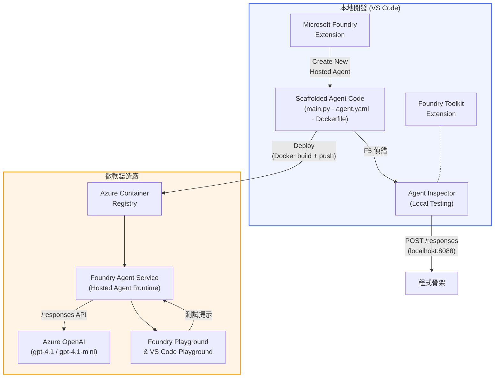

# Foundry 工具包 + Foundry 托管代理研討會

[](https://www.python.org/)
[](https://github.com/microsoft/agents)
[](https://learn.microsoft.com/azure/foundry/agents/concepts/hosted-agents)
[](https://ai.azure.com/)
[](https://learn.microsoft.com/azure/ai-services/openai/)
[](https://learn.microsoft.com/cli/azure/install-azure-cli)
[](https://learn.microsoft.com/azure/developer/azure-developer-cli/install-azd)
[](https://www.docker.com/)
[](https://marketplace.visualstudio.com/items?itemName=ms-windows-ai-studio.windows-ai-studio)
[](LICENSE)

從 VS Code 全程使用 **Microsoft Foundry 擴充功能** 與 **Foundry 工具包**，構建、測試並部署 AI 代理至 **Microsoft Foundry 代理服務** 作為 <strong>托管代理</strong>。

> **托管代理目前仍為預覽版。** 支援的區域有限 - 請參閱 [區域可用性](https://learn.microsoft.com/azure/foundry/agents/concepts/hosted-agents#region-availability)。

> 每個實驗室中的 `agent/` 資料夾是由 Foundry 擴充功能 <strong>自動產生</strong> 的 - 您之後可自訂程式碼、進行本地測試並部署。

### 🌐 多語言支援

#### 透過 GitHub Action 支援（自動且持續更新）

<!-- CO-OP TRANSLATOR LANGUAGES TABLE START -->
[阿拉伯文](../ar/README.md) | [孟加拉文](../bn/README.md) | [保加利亞文](../bg/README.md) | [緬甸語](../my/README.md) | [中文（簡體）](../zh-CN/README.md) | [中文（繁體，香港）](../zh-HK/README.md) | [中文（繁體，澳門）](./README.md) | [中文（繁體，臺灣）](../zh-TW/README.md) | [克羅地亞文](../hr/README.md) | [捷克文](../cs/README.md) | [丹麥文](../da/README.md) | [荷蘭文](../nl/README.md) | [愛沙尼亞文](../et/README.md) | [芬蘭文](../fi/README.md) | [法文](../fr/README.md) | [德文](../de/README.md) | [希臘文](../el/README.md) | [希伯來文](../he/README.md) | [印地文](../hi/README.md) | [匈牙利文](../hu/README.md) | [印度尼西亞文](../id/README.md) | [意大利文](../it/README.md) | [日文](../ja/README.md) | [坎納達文](../kn/README.md) | [高棉文](../km/README.md) | [韓文](../ko/README.md) | [立陶宛文](../lt/README.md) | [馬來文](../ms/README.md) | [馬拉雅拉姆文](../ml/README.md) | [馬拉地文](../mr/README.md) | [尼泊爾文](../ne/README.md) | [奈及利亞皮欽語](../pcm/README.md) | [挪威文](../no/README.md) | [波斯文（法爾西語）](../fa/README.md) | [波蘭文](../pl/README.md) | [巴西葡萄牙文](../pt-BR/README.md) | [葡萄牙文（葡萄牙）](../pt-PT/README.md) | [旁遮普文（古魯穆奇文）](../pa/README.md) | [羅馬尼亞文](../ro/README.md) | [俄文](../ru/README.md) | [塞爾維亞文（西里爾字母）](../sr/README.md) | [斯洛伐克文](../sk/README.md) | [斯洛文尼亞文](../sl/README.md) | [西班牙文](../es/README.md) | [斯瓦希里文](../sw/README.md) | [瑞典文](../sv/README.md) | [他加祿文（菲律賓語）](../tl/README.md) | [泰米爾文](../ta/README.md) | [泰盧固文](../te/README.md) | [泰文](../th/README.md) | [土耳其文](../tr/README.md) | [烏克蘭文](../uk/README.md) | [烏爾都語](../ur/README.md) | [越南文](../vi/README.md)

> **傾向本機複製？**
>
> 此倉庫包含超過 50 種語言的翻譯，會大幅增加下載大小。若欲不含翻譯檔案的複製，請使用稀疏檢出：
>
> **Bash / macOS / Linux：**
> ```bash
> git clone --filter=blob:none --sparse https://github.com/microsoft-foundry/Foundry_Toolkit_for_VSCode_Lab.git
> cd Foundry_Toolkit_for_VSCode_Lab
> git sparse-checkout set --no-cone '/*' '!translations' '!translated_images'
> ```
>
> **CMD（Windows）：**
> ```cmd
> git clone --filter=blob:none --sparse https://github.com/microsoft-foundry/Foundry_Toolkit_for_VSCode_Lab.git
> cd Foundry_Toolkit_for_VSCode_Lab
> git sparse-checkout set --no-cone "/*" "!translations" "!translated_images"
> ```
>
> 這樣下載速度會更快，且包含完成課程所需的所有內容。
<!-- CO-OP TRANSLATOR LANGUAGES TABLE END -->

---

## 架構



**流程：** Foundry 擴充功能產生代理骨架 → 你客製程式碼與指令 → 使用代理檢視器本地測試 → 部署至 Foundry（Docker 映像推送至 ACR）→ 在 Playground 驗證。

---

## 你將打造的內容

| 實驗室 | 說明 | 狀態 |
|-----|-------------|--------|
| **實驗室 01 - 單一代理** | 打造 **“像對高層解釋”代理**，本地測試後部署至 Foundry | ✅ 可用 |
| **實驗室 02 - 多代理工作流程** | 打造 **“履歷 → 工作匹配評估者”** - 四個代理協作評分履歷匹配度並產生學習計畫 | ✅ 可用 |

---

## 認識高層代理

在這個研討會中，你將打造 **“像對高層解釋”代理** — 一個把複雜技術術語轉換成平靜、適合董事會的摘要的 AI 代理。說實話，沒有人願意聽到「由於 v3.2 版本引入的同步呼叫導致的線程池耗盡」。

我打造這個代理是因為太多次我精心撰寫的事故回顧，得到的回應是：「所以…網站到底有沒有掛？」

### 運作方式

你給它技術更新，它回你一份高層摘要 - 三點重點，沒有術語、沒有錯誤堆疊、沒有負面情緒。只有 <strong>發生了什麼</strong>、<strong>業務影響</strong> 以及 <strong>下一步</strong>。

### 現場示範

**你說：**
> 「API 延遲增加，是因為 v3.2 版本引入的同步呼叫，造成線程池耗盡。」

**代理回覆：**

> **高層摘要：**
> - **發生了什麼：** 最新發布後，系統變慢了。
> - **業務影響：** 部分用戶在使用服務時遇到延遲。
> - **下一步：** 已回滾更動，正在準備修復，待重新部署。

### 選擇這個代理的理由

它是個簡單、不複雜的單一用途代理—非常適合全方位學習托管代理工作流程，不會被複雜的工具鏈拖累。說實話，每個工程團隊都應該擁有一個這樣的代理。

---

## 研討會結構

```
📂 Foundry_Toolkit_for_VSCode_Lab/
├── 📄 README.md                      ← You are here
└── 📂 workshop/
    ├── 📂 lab01-single-agent/        ← Full lab: docs + agent code
    │   ├── README.md                 ← Hands-on lab instructions
    │   ├── 📂 docs/                  ← Step-by-step tutorial modules
    │   │   ├── 00-prerequisites.md
    │   │   ├── 01-setup.md
    │   │   ├── 02-create-hosted-agent.md
    │   │   ├── 03-configure-and-code.md
    │   │   ├── 04-test-locally.md
    │   │   ├── 05-deploy-to-foundry.md
    │   │   ├── 06-verify-in-playground.md
    │   │   ├── 07-summary.md
    │   │   └── 08-troubleshooting.md
    │   └── 📂 agent/                 ← Reference solution (auto-scaffolded by Foundry extension)
    │       ├── agent.yaml
    │       ├── Dockerfile
    │       ├── main.py
    │       └── requirements.txt
    └── 📂 lab02-multi-agent/         ← Resume → Job Fit Evaluator
        ├── README.md                 ← Hands-on lab instructions (end-to-end)
        ├── 📂 docs/                  ← Step-by-step tutorial modules
        │   ├── 00-prerequisites.md
        │   ├── 01-understand-multi-agent.md
        │   ├── 02-scaffold-multi-agent.md
        │   ├── 03-configure-agents.md
        │   ├── 04-orchestration-patterns.md
        │   ├── 05-test-locally.md
        │   ├── 06-deploy-to-foundry.md
        │   ├── 07-verify-in-playground.md
        │   └── 08-troubleshooting.md
        └── 📂 PersonalCareerCopilot/ ← Reference solution (multi-agent workflow)
            ├── agent.yaml
            ├── Dockerfile
            ├── main.py
            └── requirements.txt
```

> **注意：** 各實驗室中的 `agent/` 資料夾是你從命令面板執行 `Microsoft Foundry: Create a New Hosted Agent` 時，由 **Microsoft Foundry 擴充功能** 生成的。之後依據你的代理指令、工具和設定自訂檔案。實驗室 01 會指導你從零開始重建。

---

## 開始

### 1. 複製倉庫

```bash
git clone https://github.com/microsoft-foundry/Foundry_Toolkit_for_VSCode_Lab.git
cd Foundry_Toolkit_for_VSCode_Lab
```

### 2. 建立 Python 虛擬環境

```bash
python -m venv venv
```

啟用虛擬環境：

- **Windows (PowerShell)：**
  ```powershell
  .\venv\Scripts\Activate.ps1
  ```
- **macOS / Linux：**
  ```bash
  source venv/bin/activate
  ```

### 3. 安裝相依套件

```bash
pip install -r workshop/lab01-single-agent/agent/requirements.txt
```

### 4. 設定環境變數

複製代理資料夾中的範例 `.env` 檔案，並填入你的值：

```bash
cp workshop/lab01-single-agent/agent/.env.example workshop/lab01-single-agent/agent/.env
```

編輯 `workshop/lab01-single-agent/agent/.env`：

```env
AZURE_AI_PROJECT_ENDPOINT=https://<your-account>.services.ai.azure.com/api/projects/<your-project>
AZURE_AI_MODEL_DEPLOYMENT_NAME=<your-model-deployment-name>
```

### 5. 依序進行研討會各實驗室

每個實驗室自成一體，擁有自己的模組。從 **實驗室 01** 學習基礎，之後進入 **實驗室 02** 探索多代理工作流程。

#### 實驗室 01 - 單一代理 ([完整說明](workshop/lab01-single-agent/README.md))

| # | 模組 | 連結 |
|---|------|------|
| 1 | 閱讀前置需求 | [00-prerequisites.md](workshop/lab01-single-agent/docs/00-prerequisites.md) |
| 2 | 安裝 Foundry 工具包與 Foundry 擴充功能 | [01-setup.md](workshop/lab01-single-agent/docs/01-setup.md) |
| 3 | 建立 Foundry 專案 | [01-setup.md](workshop/lab01-single-agent/docs/01-setup.md) |
| 4 | 建立托管代理 | [02-create-hosted-agent.md](workshop/lab01-single-agent/docs/02-create-hosted-agent.md) |
| 5 | 設定指令與環境 | [03-configure-and-code.md](workshop/lab01-single-agent/docs/03-configure-and-code.md) |
| 6 | 本地測試 | [04-test-locally.md](workshop/lab01-single-agent/docs/04-test-locally.md) |
| 7 | 部署至 Foundry | [05-deploy-to-foundry.md](workshop/lab01-single-agent/docs/05-deploy-to-foundry.md) |
| 8 | 在 playground 驗證 | [06-verify-in-playground.md](workshop/lab01-single-agent/docs/06-verify-in-playground.md) |
| 9 | 疑難排解 | [08-troubleshooting.md](workshop/lab01-single-agent/docs/08-troubleshooting.md) |

#### 實驗室 02 - 多代理工作流程 ([完整說明](workshop/lab02-multi-agent/README.md))

| # | 模組 | 連結 |
|---|------|------|
| 1 | 前置需求（實驗室 02） | [00-prerequisites.md](workshop/lab02-multi-agent/docs/00-prerequisites.md) |
| 2 | 了解多代理架構 | [01-understand-multi-agent.md](workshop/lab02-multi-agent/docs/01-understand-multi-agent.md) |
| 3 | 搭建多代理專案 | [02-scaffold-multi-agent.md](workshop/lab02-multi-agent/docs/02-scaffold-multi-agent.md) |
| 4 | 設定代理與環境 | [03-configure-agents.md](workshop/lab02-multi-agent/docs/03-configure-agents.md) |
| 5 | 協調模式 | [04-orchestration-patterns.md](workshop/lab02-multi-agent/docs/04-orchestration-patterns.md) |
| 6 | 本地測試（多代理） | [05-test-locally.md](workshop/lab02-multi-agent/docs/05-test-locally.md) |

| 7 | 部署至 Foundry | [06-deploy-to-foundry.md](workshop/lab02-multi-agent/docs/06-deploy-to-foundry.md) |
| 8 | 在 playground 驗證 | [07-verify-in-playground.md](workshop/lab02-multi-agent/docs/07-verify-in-playground.md) |
| 9 | 疑難排解 (多代理) | [08-troubleshooting.md](workshop/lab02-multi-agent/docs/08-troubleshooting.md) |

---

## 負責維護者

<table>
<tr>
    <td align="center"><a href="https://github.com/ShivamGoyal03">
        <br />
        <sub><b>Shivam Goyal</b></sub>
    </a><br />
    </td>
</tr>
</table>

---

## 必要權限 (快速參考)

| 情境 | 所需角色 |
|----------|---------------|
| 建立新的 Foundry 專案 | Foundry 資源上的 **Azure AI 擁有者** |
| 部署到現有專案（新資源） | 訂閱上的 **Azure AI 擁有者** + <strong>貢獻者</strong> |
| 部署到已完全配置的專案 | 帳戶上的 <strong>讀者</strong> + 專案上的 **Azure AI 使用者** |

> **重要：** Azure `擁有者` 和 `貢獻者` 角色只包括<em>管理</em>權限，不包括<em>開發</em>（資料操作）權限。您需要 **Azure AI 使用者** 或 **Azure AI 擁有者** 來建立和部署代理程式。

---

## 參考資料

- [快速入門：部署您的首個託管代理 (VS Code)](https://learn.microsoft.com/azure/foundry/agents/quickstarts/quickstart-hosted-agent)
- [什麼是託管代理？](https://learn.microsoft.com/azure/foundry/agents/concepts/hosted-agents)
- [在 VS Code 中建立託管代理工作流程](https://learn.microsoft.com/azure/foundry/agents/how-to/vs-code-agents-workflow-pro-code)
- [部署託管代理](https://learn.microsoft.com/azure/foundry/agents/how-to/deploy-hosted-agent)
- [Microsoft Foundry 的 RBAC](https://learn.microsoft.com/azure/foundry/concepts/rbac-foundry)
- [架構審查代理範例](https://github.com/Azure-Samples/agent-architecture-review-sample) - 使用 MCP 工具、Excalidraw 圖表及雙部署的實際託管代理

---


## 授權條款

[MIT](../../LICENSE)

---

<!-- CO-OP TRANSLATOR DISCLAIMER START -->
**免責聲明**：
本文件使用 AI 翻譯服務 [Co-op Translator](https://github.com/Azure/co-op-translator) 進行翻譯。雖然我們力求準確，但請注意，自動翻譯可能包含錯誤或不準確之處。原始文件的母語版本應被視為權威來源。對於重要資訊，建議尋求專業人工翻譯。我們不對因使用本翻譯而引起的任何誤解或曲解承擔責任。
<!-- CO-OP TRANSLATOR DISCLAIMER END -->