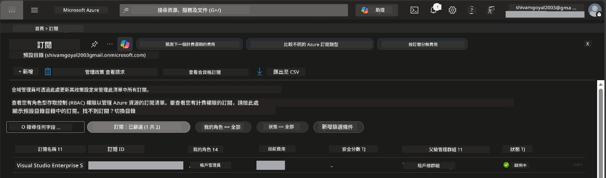

# Module 0 - 先決條件

在開始工作坊前，請確認您已準備好以下工具、存取權限與環境。請逐步完成以下所有步驟，切勿跳過。

---

## 1. Azure 帳戶與訂閱

### 1.1 建立或確認您的 Azure 訂閱

1. 開啟瀏覽器並前往 [https://azure.microsoft.com/free/](https://azure.microsoft.com/free/)。
2. 如果您還沒有 Azure 帳戶，點擊 **Start free** 並依照註冊流程進行。您將需要一個 Microsoft 帳戶（或建立一個）以及一張信用卡以驗證身份。
3. 如果您已有帳戶，請登入 [https://portal.azure.com](https://portal.azure.com)。
4. 在入口網站中，點選左側導覽列的 **Subscriptions** 面板（或在頂部搜尋欄輸入「Subscriptions」）。
5. 確認您至少有一個 **Active** 訂閱。如有，請記下 **Subscription ID** — 之後會用到。



### 1.2 了解所需的 RBAC 角色

[Hosted Agent](https://learn.microsoft.com/azure/foundry/agents/concepts/hosted-agents) 部署需要的 **data action** 權限是標準 Azure `Owner` 和 `Contributor` 角色所 <strong>不</strong> 包含的。您將需要以下任一 [角色組合](https://learn.microsoft.com/azure/foundry/concepts/rbac-foundry#built-in-roles)：

| 情境 | 所需角色 | 指派位置 |
|----------|---------------|----------------------|
| 建立新的 Foundry 專案 | Foundry 資源上的 **Azure AI Owner** | Azure 入口網站中的 Foundry 資源 |
| 部署到現有專案（新增資源） | 訂閱上的 **Azure AI Owner** + **Contributor** | 訂閱 + Foundry 資源 |
| 部署到已完全設定的專案 | 帳戶上的 **Reader** + 專案上的 **Azure AI User** | Azure 入口網站中的帳戶 + 專案 |

> **重點：** Azure 的 `Owner` 和 `Contributor` 角色只涵蓋 <em>管理</em> 權限（ARM 操作）。您需要具備 [**Azure AI User**](https://learn.microsoft.com/azure/foundry/concepts/rbac-foundry#built-in-roles)（或更高）才能執行像是 `agents/write` 類型的 *data actions*，以建立與部署代理程式。您將在 [Module 2](02-create-foundry-project.md) 中指派這些角色。

---

## 2. 安裝本機工具

請安裝以下每個工具。安裝完成後，透過執行檢查指令確認功能正常。

### 2.1 Visual Studio Code

1. 前往 [https://code.visualstudio.com/](https://code.visualstudio.com/)。
2. 下載適合您作業系統（Windows/macOS/Linux）的安裝程式。
3. 使用預設設定執行安裝程式。
4. 開啟 VS Code，確認能成功啟動。

### 2.2 Python 3.10+

1. 前往 [https://www.python.org/downloads/](https://www.python.org/downloads/)。
2. 下載 Python 3.10 或更新版本（建議 3.12+）。
3. **Windows：** 安裝時第一個畫面勾選 **"Add Python to PATH"**。
4. 開啟終端機並確認：

   ```powershell
   python --version
   ```

   預期輸出：`Python 3.10.x` 或更高版本。

### 2.3 Azure CLI

1. 前往 [https://learn.microsoft.com/cli/azure/install-azure-cli](https://learn.microsoft.com/cli/azure/install-azure-cli)。
2. 按照您的作業系統指示安裝。
3. 確認版本：

   ```powershell
   az --version
   ```

   預期為：`azure-cli 2.80.0` 或以上。

4. 登入：

   ```powershell
   az login
   ```

### 2.4 Azure Developer CLI (azd)

1. 前往 [https://learn.microsoft.com/azure/developer/azure-developer-cli/install-azd](https://learn.microsoft.com/azure/developer/azure-developer-cli/install-azd)。
2. 按照您的作業系統指示安裝。Windows 系統：

   ```powershell
   winget install microsoft.azd
   ```

3. 確認：

   ```powershell
   azd version
   ```

   預期為：`azd version 1.x.x` 或以上。

4. 登入：

   ```powershell
   azd auth login
   ```

### 2.5 Docker Desktop（選用）

如果您想在部署前於本機建置及測試容器映像檔，才需要 Docker。Foundry 擴充套件會自動在部署時處理容器建置。

1. 前往 [https://docs.docker.com/get-docker/](https://docs.docker.com/get-docker/)。
2. 下載並安裝適用於您作業系統的 Docker Desktop。
3. **Windows：** 安裝時確保選擇 WSL 2 後端。
4. 啟動 Docker Desktop，待系統列圖示顯示 **"Docker Desktop is running"**。
5. 開啟終端機並確認：

   ```powershell
   docker info
   ```

   這會印出 Docker 系統資訊且不會出錯。若看到 `Cannot connect to the Docker daemon`，請多等幾秒，待 Docker 完全啟動。

---

## 3. 安裝 VS Code 擴充套件

您需要三個擴充套件。請在工作坊開始前安裝完成。

### 3.1 Microsoft Foundry for VS Code

1. 開啟 VS Code。
2. 按 `Ctrl+Shift+X` 開啟擴充套件面板。
3. 在搜尋框輸入 **"Microsoft Foundry"**。
4. 找到 **Microsoft Foundry for Visual Studio Code**（發行者：Microsoft，ID：`TeamsDevApp.vscode-ai-foundry`）。
5. 點擊 **Install**。
6. 安裝完後，您應該會在活動欄（左側邊欄）看到 **Microsoft Foundry** 圖示。

### 3.2 Foundry Toolkit

1. 在擴充套件面板（`Ctrl+Shift+X`）搜尋 **"Foundry Toolkit"**。
2. 找到 **Foundry Toolkit**（發行者：Microsoft，ID：`ms-windows-ai-studio.windows-ai-studio`）。
3. 點擊 **Install**。
4. 您會在活動欄看到 **Foundry Toolkit** 圖示。

### 3.3 Python

1. 在擴充套件面板搜尋 **"Python"**。
2. 找到 **Python**（發行者：Microsoft，ID：`ms-python.python`）。
3. 點擊 **Install**。

---

## 4. 在 VS Code 中登入 Azure

[Microsoft Agent Framework](https://learn.microsoft.com/agent-framework/overview/) 使用 [`DefaultAzureCredential`](https://learn.microsoft.com/azure/developer/python/sdk/authentication/credential-chains#defaultazurecredential-overview) 進行驗證。您需要在 VS Code 中登入 Azure。

### 4.1 透過 VS Code 登入

1. 查看 VS Code 左下角並點擊 **Accounts** 圖示（人形輪廓）。
2. 點擊 **Sign in to use Microsoft Foundry**（或 **Sign in with Azure**）。
3. 將開啟瀏覽器視窗—請使用有存取訂閱權限的 Azure 帳戶登入。
4. 返回 VS Code，您應該會在左下角看到帳戶名稱。

### 4.2（選用）透過 Azure CLI 登入

如果您已安裝 Azure CLI 且偏好使用 CLI 驗證：

```powershell
az login
```

此操作會開啟瀏覽器以登入。登入完成後，設定正確的訂閱：

```powershell
az account set --subscription "<your-subscription-id>"
```

確認：

```powershell
az account show --query "{name:name, id:id, state:state}" --output table
```

您應該會看到訂閱名稱、ID 及狀態為 `Enabled`。

### 4.3 （替代）服務主體驗證

對於 CI/CD 或共用環境，請改設定以下環境變數：

```powershell
$env:AZURE_TENANT_ID = "<your-tenant-id>"
$env:AZURE_CLIENT_ID = "<your-client-id>"
$env:AZURE_CLIENT_SECRET = "<your-client-secret>"
```

---

## 5. 預覽限制

在進行下一步前，請瞭解目前的限制：

- [**Hosted Agents**](https://learn.microsoft.com/azure/foundry/agents/concepts/hosted-agents) 目前為 <strong>公開預覽</strong>，不建議用於正式生產工作負載。
- <strong>支援區域有限</strong>—請先查看 [地區可用性](https://learn.microsoft.com/azure/foundry/agents/concepts/hosted-agents#region-availability) 再建立資源。如選擇不支援的區域，部署將會失敗。
- `azure-ai-agentserver-agentframework` 套件為預發佈版本（`1.0.0b16`）—API 可能會改變。
- 規模限制：hosted agents 支援 0-5 個副本（包含縮放至零）。

---

## 6. 預先檢查列表

請逐項執行下列檢查。若有任何步驟失敗，請回頭修正後再繼續。

- [ ] VS Code 能正常開啟且無錯誤
- [ ] Python 3.10+ 已在您的 PATH 中 (`python --version` 顯示 `3.10.x` 或更高版本)
- [ ] 已安裝 Azure CLI (`az --version` 版本為 `2.80.0` 或更高)
- [ ] 已安裝 Azure Developer CLI (`azd version` 顯示版本資訊)
- [ ] 已安裝 Microsoft Foundry 擴充套件（可見圖示於活動欄）
- [ ] 已安裝 Foundry Toolkit 擴充套件（可見圖示於活動欄）
- [ ] 已安裝 Python 擴充套件
- [ ] 您已在 VS Code 中登入 Azure（檢查左下角帳戶圖示）
- [ ] `az account show` 可顯示您的訂閱
- [ ] （選用）Docker Desktop 正在執行中（`docker info` 顯示系統資訊且無錯誤）

### 檢查點

打開 VS Code 活動欄，確認您能看到 **Foundry Toolkit** 與 **Microsoft Foundry** 的側邊欄視圖。點選每個視圖，確認能正常載入且無錯誤。

---

**下一步：** [01 - 安裝 Foundry Toolkit 與 Foundry 擴充套件 →](01-install-foundry-toolkit.md)

---

<!-- CO-OP TRANSLATOR DISCLAIMER START -->
**免責聲明**：  
本文件乃使用 AI 翻譯服務 [Co-op Translator](https://github.com/Azure/co-op-translator) 所翻譯。雖我們努力確保準確性，但請注意，自動翻譯可能包含錯誤或不準確之處。原始文件的母語版本應被視為權威來源。對於重要資訊，建議採用專業人工翻譯。本公司對因使用本翻譯所引致之任何誤解或誤釋概不負責。
<!-- CO-OP TRANSLATOR DISCLAIMER END -->