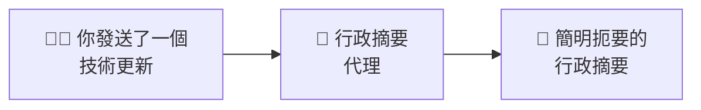

# 第0單元 - 簡介

⏱️ 約10分鐘

> [!WARNING]
> **預覽版及限制:** [託管代理](https://learn.microsoft.com/azure/foundry/agents/concepts/hosted-agents) 目前處於 <strong>公開預覽</strong> 階段 — 不建議用於生產工作負載。請留意以下事項：
> - <strong>支援區域有限</strong> — 請在建立資源前查看 [區域可用性](https://learn.microsoft.com/azure/foundry/agents/concepts/hosted-agents#region-availability)。若選擇不受支援的區域，部署將會失敗。
> - `azure-ai-agentserver-agentframework` 套件為預發布版 — API 版本間可能有所變動。
> - 擴展限制：託管代理支援0–5個副本（包含擴展至零副本）。
> - 本工作坊中展示的部分功能可能會隨服務邁向正式版而變更。

## 你將會打造什麼

在此工作坊裡，你將建立一個 **「以執行長角度解釋」** 代理 — 一個託管的AI代理，能將複雜技術更新轉寫為簡明扼要的執行長摘要。

```mermaid
flowchart LR
    A["🧑‍💻 你發送了一個\n技術更新"] --> B["🤖 行政摘要\n代理"]
    B --> C["📝 簡明扼要的\n行政摘要"]
```

**該代理使用：**
- **Microsoft Agent Framework** — 代理邏輯及結構
- **Foundry Toolkit for VS Code** — 用於生成骨架、在地測試及部署
- **AI模型**（例如 `gpt-4.1-mini/gpt-5-mini`）— 用於生成摘要

完成本實驗後，你將擁有一個可透過代理檢視器進行本地測試，並可選擇部署至雲端的可運作代理。

---

## 什麼是託管代理？

<strong>託管代理</strong> 是一種在 Microsoft Foundry 上作為管理服務執行的 AI 代理。你無須管理自己的基礎設施，而是將代理程式碼封裝在容器中，由 Foundry 代為處理擴展、託管及透過標準 HTTP 端點暴露服務。

| 概念 | 意涵 |
|---------|--------------|
| <strong>代理</strong> | 你的 Python 程式碼，接收使用者訊息、呼叫 AI 模型並回傳結構化回應 |
| <strong>託管</strong> | Foundry 為你執行容器 — 無需虛擬機、Kubernetes 或管理基礎設施 |
| <strong>回應協定</strong> | 標準 HTTP API (`POST /responses`)，允許任何用戶端呼叫與代理互動 |
| <strong>代理檢視器</strong> | 本地測試介面（內建於 Foundry Toolkit），讓你在部署前即可與代理對話 |

本工作坊讓你從無到有建立完整的託管代理，若需要也可選擇只進行本地測試。

---

## 選擇你的路徑

> ⚠️ **請先選擇一條路徑後再繼續。** 你的選擇決定要安裝哪些工具以及適用的模組。如你取得訂閱，可稍後由 B 路徑切換至 A 路徑。

<strong>🅰️ 路徑A - Azure 雲端（需要 Azure 訂閱）</strong>

| | 詳情 |
|---|---|
| **適合誰？** | 你有有效的 Azure 訂閱並能建立 Foundry 資源 |
| <strong>模型</strong> | 透過 Foundry 使用 Azure OpenAI（如 `gpt-4.1-mini/gpt-5-mini`） |
| <strong>涵蓋模組</strong> | 全部模組（00–07） |
| **部署至雲端？** | ✅ 是 — 完整端對端部署 |

<strong>🅱️ 路徑B - 本地／免費方案（無需 Azure 訂閱）</strong>

| | 詳情 |
|---|---|
| **適合誰？** | MVP、學生或任何沒有 Azure 服務權限者 |
| <strong>模型</strong> | **Foundry 本地執行**（免費，在本機運行） |
| <strong>涵蓋模組</strong> | 模組00–04（跳過部署與雲端驗證） |
| **部署至雲端？** | ❌ 否 — 僅可透過代理檢視器本地測試 |

---

## 所有路徑：所需工具

安裝以下每項工具。安裝完畢後，執行驗證指令確認工具正常運作。

| # | 工具 | 版本 | 安裝 | 驗證（預期輸出） |
|---|------|---------|---------|---------------------------|
| 1 | **Visual Studio Code** | 最新版 | [code.visualstudio.com](https://code.visualstudio.com/) | 可正常啟動，無錯誤 |
| 2 | **Python** | 3.12 或以上| [python.org/downloads](https://www.python.org/downloads/) | `python --version` $\rightarrow$ `Python 3.12.x` |
| 3 | **Foundry Toolkit for VS Code** | 最新版 | 套件ID：`ms-windows-ai-studio.windows-ai-studio` | 活動欄上顯示 Foundry 圖示 |
| 4 | **VS Code 的 Python 擴充套件** | 最新版 | 套件ID：`ms-python.python` | 已於擴充功能面板中安裝 |

> [!TIP]
> **安裝專家小撇步：**
> - **Python 環境變數（Windows）：** 安裝首個畫面務必勾選 **「將 Python 加入 PATH」**。若缺少此步驟，終端機無法識別 `python` 指令。
> - **多版本 Python：** 如果同時裝有 Python 3.10 與 3.12，使用 `python3.12 -m venv .venv` 指令以確保虛擬環境使用正確版本。
> - **Docker WSL 2（Windows）：** 安裝 Docker Desktop 時，請確保選擇 **WSL 2 後端**。使用 Hyper-V 的 Docker 速度較慢，且可能引發 Foundry 容器建置問題。
> - **Docker 無法啟動？** 打開 Docker Desktop 後請耐心等待30–60秒。執行 `docker info`，若出現「無法連接至 Docker daemon」字樣，表示 Docker 尚在初始化中。
> - **VS Code 擴充套件無法載入？** 安裝擴充套件後，請重新載入視窗：`Ctrl+Shift+P` → 輸入 `Developer: Reload Window`。

> **Windows 使用者：** 安裝 Python 時請勾選 **「將 Python 加入 PATH」**。

**下一步：** [01 - 設置 →](01-setup.md)

---

<!-- CO-OP TRANSLATOR DISCLAIMER START -->
**免責聲明**：
本文件使用 AI 翻譯服務 [Co-op Translator](https://github.com/Azure/co-op-translator) 進行翻譯。雖然我們力求準確，但請注意，自動翻譯可能包含錯誤或不準確之處。原始文件的母語版本應被視為權威來源。對於重要資訊，建議尋求專業人工翻譯。我們不對因使用本翻譯而引起的任何誤解或曲解承擔責任。
<!-- CO-OP TRANSLATOR DISCLAIMER END -->