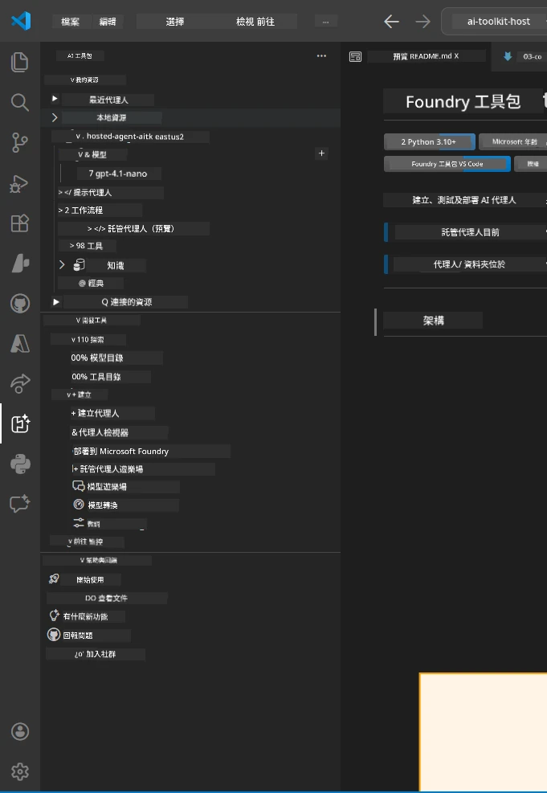
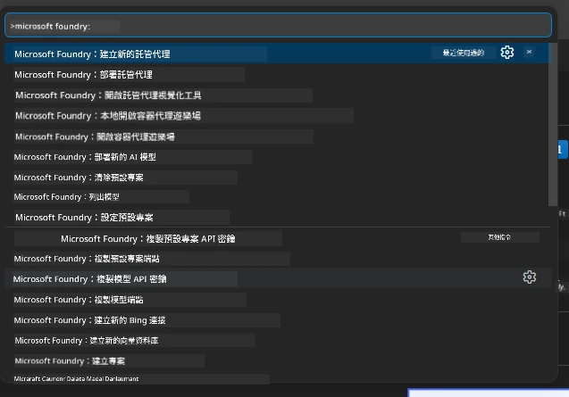

# Module 1 - 安裝 Foundry 工具包及 Foundry 擴充功能

本模組將引導你安裝及驗證本工作坊中的兩個主要 VS Code 擴充功能。如果你已經在[Module 0](00-prerequisites.md)中安裝過，請使用本模組驗證它們是否正常運作。

---

## 第 1 步：安裝 Microsoft Foundry 擴充功能

**Microsoft Foundry for VS Code** 擴充功能是你建立 Foundry 專案、部署模型、搭建託管代理以及從 VS Code 直接部署的主要工具。

1. 開啟 VS Code。
2. 按下 `Ctrl+Shift+X` 開啟 <strong>擴充功能</strong> 面板。
3. 在頂部的搜尋框中輸入：**Microsoft Foundry**
4. 找到標題為 **Microsoft Foundry for Visual Studio Code** 的結果。
   - 發行者：**Microsoft**
   - 擴充 ID：`TeamsDevApp.vscode-ai-foundry`
5. 點選 <strong>安裝</strong> 按鈕。
6. 等待安裝完成（你會看到一個小的進度指示器）。
7. 安裝完成後，查看 <strong>活動列</strong>（位於 VS Code 左側的垂直圖示列）。你應該會看到一個新的 **Microsoft Foundry** 圖示（看起來像鑽石/AI 圖標）。
8. 點選 **Microsoft Foundry** 圖示以打開其側邊欄視圖。你應該會看到以下分區：
   - <strong>資源</strong>（或專案）
   - <strong>代理</strong>
   - <strong>模型</strong>

> **如果圖示沒有出現：** 嘗試重新載入 VS Code（`Ctrl+Shift+P` → `Developer: Reload Window`）。

---

## 第 2 步：安裝 Foundry Toolkit 擴充功能

**Foundry Toolkit** 擴充功能提供[<strong>代理檢視器</strong>](https://learn.microsoft.com/azure/foundry/agents/how-to/vs-code-agents-workflow-pro-code) — 一個用於在本地測試和除錯代理的視覺介面 — 以及遊樂場、模型管理和評估工具。

1. 在擴充功能面板（`Ctrl+Shift+X`）中，清除搜尋框並輸入：**Foundry Toolkit**
2. 找到結果中的 **Foundry Toolkit**。
   - 發行者：**Microsoft**
   - 擴充 ID：`ms-windows-ai-studio.windows-ai-studio`
3. 點選 <strong>安裝</strong>。
4. 安裝完成後，**Foundry Toolkit** 圖示會出現在活動列（看起來像機械人/閃耀圖案的圖示）。
5. 點選 **Foundry Toolkit** 圖示打開側邊欄視圖。你應該會看到 Foundry Toolkit 的歡迎畫面，包含以下選項：
   - <strong>模型</strong>
   - <strong>遊樂場</strong>
   - <strong>代理</strong>

---

## 第 3 步：驗證兩個擴充功能是否正常運作

### 3.1 驗證 Microsoft Foundry 擴充功能

1. 點選活動列中的 **Microsoft Foundry** 圖示。
2. 如果你已登入 Azure（來自 Module 0），你應該會看到在 <strong>資源</strong> 下列出的專案。
3. 如果系統提示登入，點選 <strong>登入</strong> 並依照認證流程操作。
4. 確認你能看到側邊欄且沒有錯誤。

### 3.2 驗證 Foundry Toolkit 擴充功能

1. 點選活動列中的 **Foundry Toolkit** 圖示。
2. 確認歡迎頁面或主面板正常載入且沒有錯誤。
3. 目前不需要進行任何設定 — 我們會在[Module 5](05-test-locally.md)使用代理檢視器。

### 3.3 使用命令面板驗證

1. 按下 `Ctrl+Shift+P` 開啟命令面板。
2. 輸入 **"Microsoft Foundry"** — 你應該會看到類似以下命令：
   - `Microsoft Foundry: Create a New Hosted Agent`
   - `Microsoft Foundry: Deploy Hosted Agent`
   - `Microsoft Foundry: Open Model Catalog`
3. 按 `Escape` 關閉命令面板。
4. 再次開啟命令面板並輸入 **"Foundry Toolkit"** — 你應該會看到類似以下命令：
   - `Foundry Toolkit: Open Agent Inspector`

> 如果未看到這些命令，可能是擴充功能未正確安裝。嘗試解除安裝後重新安裝。

---

## 這些擴充功能在本工作坊中的用途

| 擴充功能 | 功能說明 | 使用時機 |
|-----------|-------------|-------------------|
| **Microsoft Foundry for VS Code** | 建立 Foundry 專案、部署模型、**搭建[託管代理](https://learn.microsoft.com/azure/foundry/agents/concepts/hosted-agents)**（自動生成 `agent.yaml`、`main.py`、`Dockerfile`、`requirements.txt`），部署至[Foundry 代理服務](https://learn.microsoft.com/azure/foundry/agents/overview) | Modules 2, 3, 6, 7 |
| **Foundry Toolkit** | 代理檢視器用於本地測試/除錯、遊樂場 UI、模型管理 | Modules 5, 7 |

> **Foundry 擴充功能是本工作坊中最關鍵的工具。** 它負責端到端生命週期：搭建 → 配置 → 部署 → 驗證。Foundry Toolkit 補充其提供本地測試的視覺代理檢視器。

---

### 檢查點

- [ ] 活動列中可見 Microsoft Foundry 圖示
- [ ] 點擊該圖示可成功開啟側邊欄且無錯誤
- [ ] 活動列中可見 Foundry Toolkit 圖示
- [ ] 點擊該圖示可成功開啟側邊欄且無錯誤
- [ ] `Ctrl+Shift+P` → 輸入 "Microsoft Foundry" 顯示可用命令
- [ ] `Ctrl+Shift+P` → 輸入 "Foundry Toolkit" 顯示可用命令

---

**前一章節：** [00 - 前置條件](00-prerequisites.md) · **下一章節：** [02 - 建立 Foundry 專案 →](02-create-foundry-project.md)

---

<!-- CO-OP TRANSLATOR DISCLAIMER START -->
**免責聲明**：  
本文件經由 AI 翻譯服務 [Co-op Translator](https://github.com/Azure/co-op-translator) 進行翻譯。雖然我們致力於提供準確的翻譯，但請注意，自動翻譯可能包含錯誤或不準確之處。原文檔的母語版本應被視為權威資料來源。對於重要資訊，建議採用專業人工翻譯。我們不對因使用此翻譯所引起的任何誤解或誤譯承擔責任。
<!-- CO-OP TRANSLATOR DISCLAIMER END -->