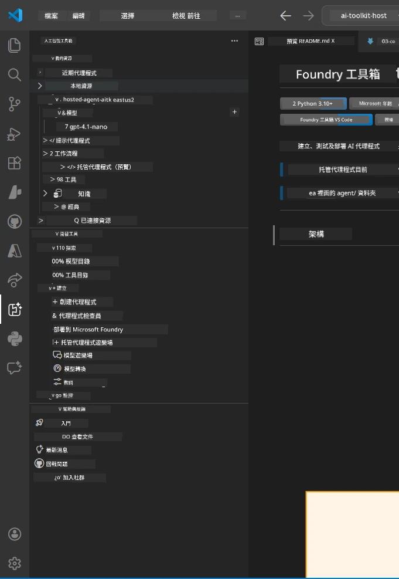
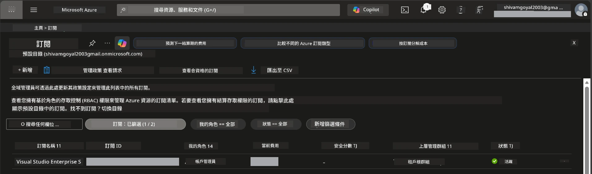
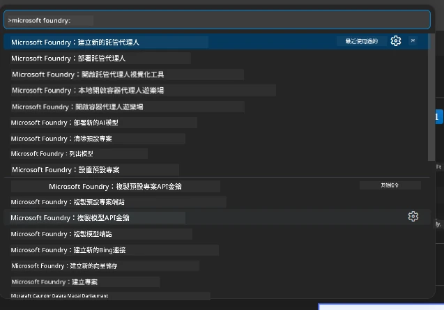
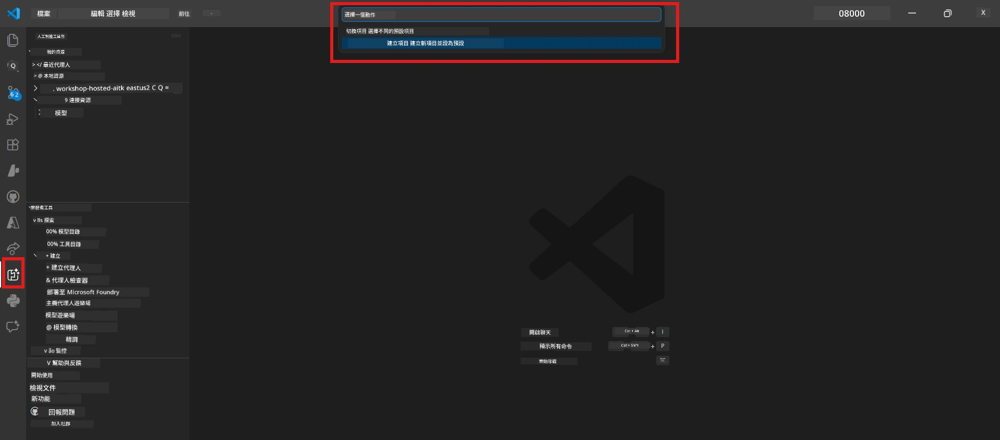
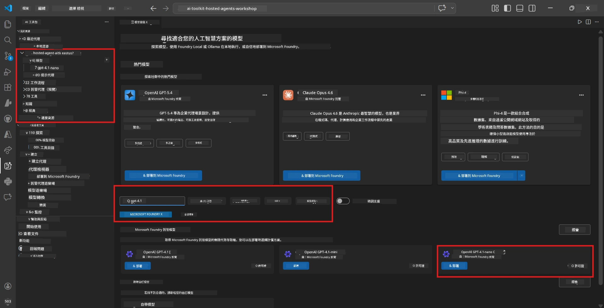
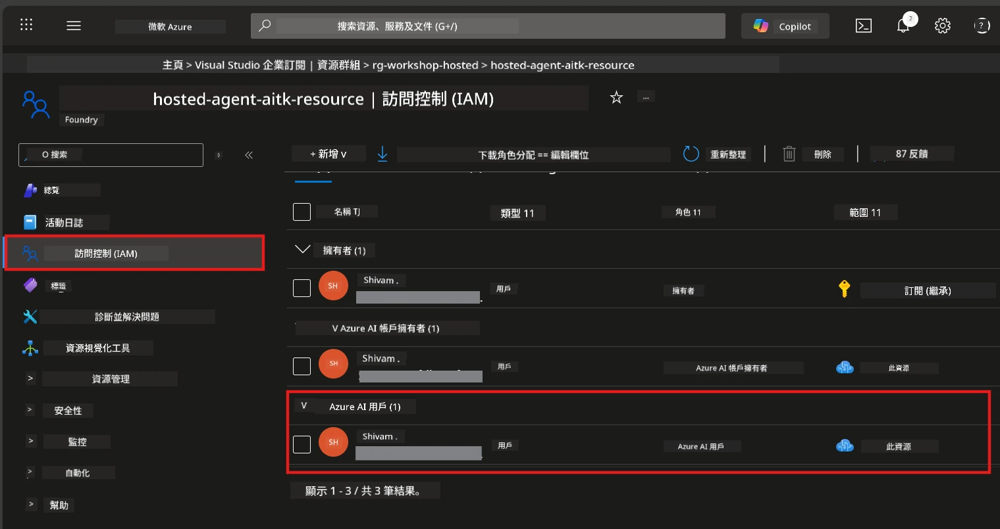

# 設置：擴充功能、專案與模型

⏱️ 約15分鐘

在此模組中，您將安裝並驗證 Foundry Toolkit 擴充功能，建立（或連接到）Foundry 專案，並部署您的代理將使用的模型。

## 步驟 1：安裝 Foundry Toolkit

**Foundry Toolkit for VS Code** 是本工作坊的主要擴充功能。它提供專案建立、模型部署、代理架構、區域測試（Agent Inspector）以及雲端部署——全部在 VS Code 裡完成。

1. 開啟 VS Code，然後按 `Ctrl+Shift+X` 開啟 **Extensions** 面板。
2. 搜尋 **Foundry Toolkit**。
3. 安裝 **Foundry Toolkit for VS Code**（發行者：Microsoft，ID：`ms-windows-ai-studio.windows-ai-studio`）。
4. 安裝完成後，**Foundry Toolkit** 圖示會出現在活動列（左側邊欄）。

> *注意：活動列在較舊的擴充版本中可能顯示為「AI TOOLKIT」。功能相同。*



## 步驟 2：根據您的權限設定

> **請選擇您的路徑：** 展開符合您設定的下面章節。您只需完成 <strong>其中一條</strong> 路徑。

<details>
<summary><strong>🅰️ 路徑 A - Azure 雲端（需 Azure 訂閱）</strong></summary>

### Azure CLI

1. 從 [learn.microsoft.com/cli/azure/install-azure-cli](https://learn.microsoft.com/cli/azure/install-azure-cli) 安裝。
2. 驗證：`az --version`（預期版本 2.80.0+）。
3. 登入：`az login`

### 認證選項

[Microsoft Agent Framework](https://learn.microsoft.com/agent-framework/overview/) 使用 [`DefaultAzureCredential`](https://learn.microsoft.com/azure/developer/python/sdk/authentication/credential-chains#defaultazurecredential-overview)，依序嘗試多種認證方法。請選擇適合您環境的方法：

#### 選項 1：VS Code 帳號（工作坊推薦）
1. 點選 VS Code 左下角的 **Accounts** 圖示（人像剪影）。
2. 選擇 **Sign in to use Microsoft Foundry**（或 **Sign in with Azure**）。
3. 會開啟瀏覽器 —— 使用有存取訂閱權限的 Azure 帳號登入。
4. 回到 VS Code，您應該會在左下角看到您的帳號名稱。

#### 選項 2：Azure CLI
```bash
az login
az account set --subscription "<your-subscription-id>"
```

#### 選項 3：服務主體（企業/CI）
對於嚴格控管的環境或 CI/CD 管線，在您的 `.env` 檔案中設定這些環境變數：
```env
AZURE_TENANT_ID=<your-tenant-id>
AZURE_CLIENT_ID=<your-client-id>
AZURE_CLIENT_SECRET=<your-client-secret>
```

> **`DefaultAzureCredential` 運作方式：** 它會先嘗試環境變數，接著是管理身分識別，再來是 VS Code 登入，最後是 Azure CLI，並使用第一個成功的認證。請參閱[認證鏈文件](https://learn.microsoft.com/azure/developer/python/sdk/authentication/credential-chains#defaultazurecredential-overview)。

### Azure Developer CLI (azd)

1. 安裝：`winget install microsoft.azd`（Windows）或參閱[安裝文件](https://learn.microsoft.com/azure/developer/azure-developer-cli/install-azd)。
2. 驗證：`azd version`
3. 登入：`azd auth login`

### Docker Desktop（可選）

Docker 僅在您想在本機構建容器時需要。Foundry 擴充會在部署時自動處理建置。

1. 由 [docs.docker.com/get-docker](https://docs.docker.com/get-docker/) 安裝。
2. 驗證：`docker info`

### Azure 訂閱與 RBAC

1. 登入 [portal.azure.com](https://portal.azure.com)。
2. 導航至 **Subscriptions**，確認至少一個訂閱為 **Active**。
3. 記錄您的 **Subscription ID** —— 您在模組 01 中會需要使用。



#### RBAC 場景表

[Hosted Agent](https://learn.microsoft.com/azure/foundry/agents/concepts/hosted-agents) 部署需要包含 <strong>資料操作</strong> 權限，但標準的 Azure `Owner` 和 `Contributor` 角色<strong>不包含</strong>此類權限。請使用下表判斷您需要的角色：

| 場景 | 所需角色 | 指定位置 |
|----------|---------------|----------------------|
| 建立新的 Foundry 專案 | Foundry 資源上的 **Azure AI Owner** | Azure 入口網站中的 Foundry 資源 |
| 部署到現有專案（新資源） | 訂閱上的 **Azure AI Owner** + **Contributor** | 訂閱 + Foundry 資源 |
| 部署到完全配置的專案 | 帳戶上的 **Reader** + 專案上的 **Azure AI User** | Azure 入口網站中的帳戶 + 專案 |
| 只在本地測試（不部署） | 專案上的 **Azure AI User** | Azure 入口網站中的專案 |

> **要點：** Azure 的 `Owner` 和 `Contributor` 角色僅包含 <em>管理</em> 權限（ARM 操作）。您需要 [**Azure AI User**](https://learn.microsoft.com/azure/foundry/concepts/rbac-foundry#built-in-roles)（或更高權限）以取得 `agents/write` 等 <em>資料操作</em> 權限，這是建立和部署代理所需。

## 連接或建立 Foundry 專案



1. 按 `Ctrl+Shift+P` → 輸入 **Foundry Toolkit: Create Project** → 選擇它。
2. 從下拉選單選擇您的 **Azure 訂閱**。
3. 選擇或建立一個 <strong>資源群組</strong>（例如：`rg-hosted-agents-workshop`）。
4. 選擇支援托管代理的 <strong>區域</strong>：`East US`、`West US 2` 或 `Sweden Central`。參見[區域可用性](https://learn.microsoft.com/azure/foundry/agents/concepts/hosted-agents#region-availability)。
5. 輸入專案名稱（例如：`workshop-agents`）。
6. 等待 2–5 分鐘進行配置。VS Code 中會出現進度通知。
7. 完成後，您的專案會在 **Foundry Toolkit** 側邊欄的 **MY RESOURCES** 下顯示。



## 部署模型與指派 RBAC

您的托管代理需要一個 AI 模型來生成回應。

#### 模型選擇矩陣
根據您的需求，可以選擇不同層級的模型：

| 模型 | 適用範圍 | 成本 | 備註 |
|-------|----------|------|-------|
| `gpt-4.1` | 高品質、細緻回應 | 較高 | 最佳效果，建議用於最終測試 |
| `gpt-4.1-mini/gpt-5-mini` | 快速迭代、成本較低 | 較低 | 適合工作坊開發和快速測試 |
| `gpt-4.1-nano` | 輕量任務 | 最低 | 最省成本，但回應較簡單 |

1. 按 `Ctrl+Shift+P` → 選擇 **Foundry Toolkit: Open Model Catalog**（或在側邊欄的 DEVELOPER TOOLS 下點擊 **Model Catalog** → Discover）。
2. 在目錄中搜尋 **gpt-4.1**。
3. 找到 **OpenAI GPT-4.1-mini**（或品質較佳的 `gpt-5-mini`），點擊 **Deploy**。



4. 在部署設定中：
   - **部署名稱：** 保留預設或輸入自訂名稱。**請記住此名稱。**
   - **目標：** 選擇 **Deploy to Foundry Toolkit** → 選擇您的專案。
5. 點擊 **Deploy** 並等待 1–3 分鐘。

> **建議：** 工作坊使用 `gpt-4.1-mini/gpt-5-mini` —— 快速、經濟，且產出良好。

### 記錄您的數值

部署完成後，請記下以下兩個數值（模組 03 會用到）：

| 數值 | 取得位置 |
|-------|-----------------|
| <strong>專案端點</strong> | 在側邊欄點選您的專案 → 詳細視圖顯示 URL（例如 `https://<account>.services.ai.azure.com/api/projects/<project>`） |
| <strong>模型部署名稱</strong> | 展開專案 → **Models** → 部署模型旁的名稱（例如 `gpt-4.1-mini/gpt-5-mini`） |

### 指派 RBAC 角色

> ⚠️ **此為最常被遺漏的步驟。** 沒有正確角色，模組 05 的部署將會失敗。

#### 我需要哪個角色？
根據您的場景，需要以下角色組合：

| 場景 | 所需角色 | 指定位置 |
|----------|---------------|----------------------|
| 建立新的 Foundry 專案 | Foundry 資源上的 **Azure AI Owner** | Azure 入口網站中的 Foundry 資源 |
| 部署到現有專案（新資源） | 訂閱上的 **Azure AI Owner** + **Contributor** | 訂閱 + Foundry 資源 |
| 部署到完全配置的專案 | 帳戶上的 **Reader** + 專案上的 **Azure AI User** | Azure 入口網站中的帳戶 + 專案 |

**要點：** Azure 的 `Owner` 和 `Contributor` 角色僅包含 <em>管理</em> 權限。您需要 **Azure AI User**（或更高）以取得建立與部署代理所需的 `agents/write` <em>資料操作</em> 權限。

1. 開啟 [portal.azure.com](https://portal.azure.com)。
2. 搜尋您的 **Foundry 專案** 名稱 → 點擊列為 **"Foundry Toolkit project"** 類型的結果（非父帳戶）。
3. 在左側導航點擊 **Access control (IAM)**。
4. 點擊 **+ 新增** → <strong>新增角色指派</strong>。
5. <strong>角色</strong> 標籤：搜尋 **Azure AI User**，選擇它，點擊 <strong>下一步</strong>。
6. <strong>成員</strong> 標籤：選擇 **使用者、群組或服務主體** → 點擊 **+ 選取成員** → 找到並選擇您自己 → 點擊 <strong>選取</strong>。
7. 點擊 **檢閱 + 指派** → 再次點擊 **檢閱 + 指派**。
8. **等待 1–2 分鐘** 以完成權限傳播。

> **為什麼選此角色？** Azure 的 `Owner`/`Contributor` 只授予管理權限。**Azure AI User** 角色授予建立及部署代理所需的 `agents/write` 資料操作。詳見[Foundry RBAC 文件](https://learn.microsoft.com/azure/foundry/concepts/rbac-foundry#built-in-roles)。



</details>

<details>
<summary><strong>🅱️ 路徑 B - 本地 / 免費層（不需 Azure 訂閱）</strong></summary>

### Foundry Local

Foundry Local 讓您可以在自己的機器上運行 AI 模型——不需雲端帳號。您可以透過 Foundry Toolkit 的模型目錄存取 Foundry Local 模型，步驟如下：

1. 前往 Foundry Toolkit 擴充功能。
2. 在 Foundry Toolkit 導航中，前往 **Developer Tools** > 選取 **Model Catalog**
3. 在新視窗中，從導航列選擇 **local**。
4. 向下捲動至 **Phi 4 Mini，** 點擊 <strong>新增按鈕</strong>，會跳出提示表示模型正在下載中。
5. 模型下載完成後，即可進行下一步。

</details>

### ✅ 檢查點


- [ ] 按 `Ctrl+Shift+P` → 輸入 "Foundry Toolkit" 顯示可用命令
- [ ] Foundry Toolkit 擴充已安裝且側邊欄無錯誤載入
- [ ] VS Code 正常開啟並運作
- [ ] 執行 `python --version` 顯示 3.10+
- [ ] VS Code 活動列中可見 Foundry Toolkit 圖示
- [ ] **路徑 A：** `az login` 成功，訂閱為啟用狀態
- [ ] **路徑 B：** Foundry Local 正在執行（`foundry local status`）
- [ ] **路徑 A：** Foundry 專案出現在側邊欄，模型已部署，已指派 Azure AI User 角色
- [ ] **路徑 B：** Foundry Local 運行並有模型
- [ ] 已記錄您的 <strong>端點</strong> 與 <strong>模型部署名稱</strong>


**上一步：** [00 - 先決條件](00-prerequisites.md) · **下一步：** [02 - 建立托管代理 →](02-create-hosted-agent.md)

---

<!-- CO-OP TRANSLATOR DISCLAIMER START -->
**免責聲明**：
本文件使用 AI 翻譯服務 [Co-op Translator](https://github.com/Azure/co-op-translator) 進行翻譯。雖然我們力求準確，但請注意，自動翻譯可能包含錯誤或不準確之處。原始文件的母語版本應被視為權威來源。對於重要資訊，建議尋求專業人工翻譯。我們不對因使用本翻譯而引起的任何誤解或曲解承擔責任。
<!-- CO-OP TRANSLATOR DISCLAIMER END -->