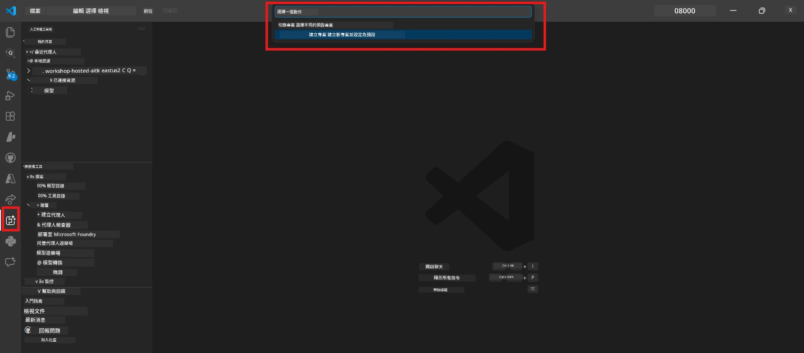
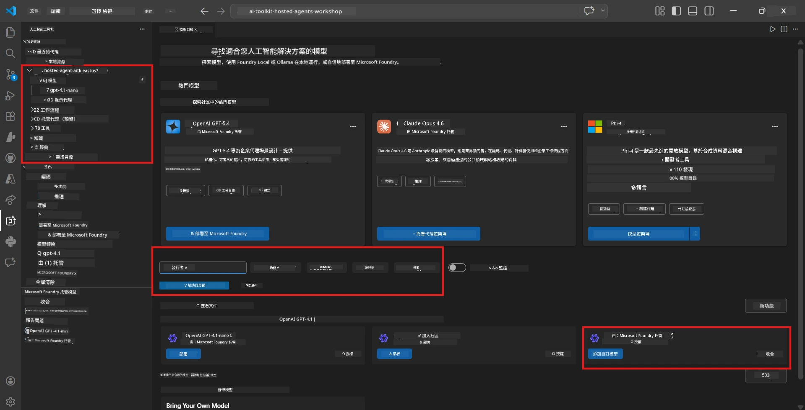
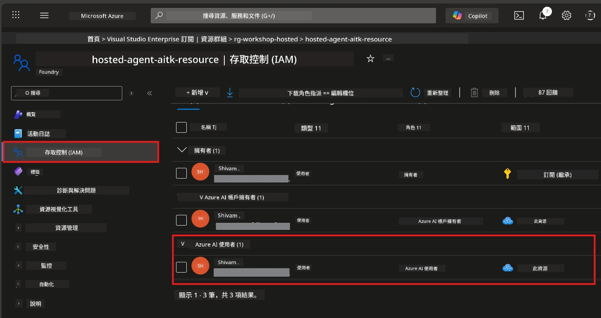

# Module 2 - 建立 Foundry 專案及部署模型

在本單元中，您將會建立（或選擇）一個 Microsoft Foundry 專案，並部署一個代理將會使用的模型。所有步驟均明確列出，請依序跟進。

> 如果您已經有部署模型的 Foundry 專案，請直接跳到 [Module 3](03-create-hosted-agent.md)。

---

## 步驟 1：從 VS Code 建立 Foundry 專案

您將使用 Microsoft Foundry 擴充功能在不離開 VS Code 的情況下建立專案。

1. 按下 `Ctrl+Shift+P` 以打開 <strong>指令面板</strong>。
2. 輸入：**Microsoft Foundry: Create Project** 並選取它。
3. 會出現下拉選單 - 從列表中選擇您的 **Azure 訂閱**。
4. 系統會要求您選擇或建立 <strong>資源群組</strong>：
   - 若要建立新的：輸入名稱（例如 `rg-hosted-agents-workshop`）並按 Enter。
   - 若要使用現有的：從下拉選單中選取。
5. 選擇一個 <strong>區域</strong>。**重要：** 選擇支持托管代理的區域。請查看 [區域可用性](https://learn.microsoft.com/azure/foundry/agents/concepts/hosted-agents#region-availability) - 常見選擇有 `East US`、`West US 2` 或 `Sweden Central`。
6. 輸入 Foundry 專案的 <strong>名稱</strong>（例如 `workshop-agents`）。
7. 按 Enter 並等待配置完成。

> **配置大約需要 2-5 分鐘。** 您會在 VS Code 右下角看到進度通知。配置期間請勿關閉 VS Code。

8. 完成後，**Microsoft Foundry** 側邊欄會在 **Resources** 下顯示您的新專案。
9. 點擊專案名稱展開，確認其中包含如 **Models + endpoints** 及 **Agents** 的區塊。



### 替代方案：透過 Foundry 門戶建立

如果您偏好使用瀏覽器：

1. 開啟 [https://ai.azure.com](https://ai.azure.com) 並登入。
2. 在首頁點擊 **Create project**。
3. 輸入專案名稱，選擇訂閱、資源群組和區域。
4. 點擊 **Create** 並等待配置完成。
5. 建立完成後，回到 VS Code - 專案應該會在 Foundry 側邊欄中出現，若無，請點擊重新整理圖示。

---

## 步驟 2：部署模型

您的 [托管代理](https://learn.microsoft.com/azure/foundry/agents/concepts/hosted-agents) 需要 Azure OpenAI 模型來生成回應。您將會[立刻部署一個](https://learn.microsoft.com/azure/ai-foundry/openai/how-to/create-resource#deploy-a-model)。

1. 按下 `Ctrl+Shift+P` 以開啟 <strong>指令面板</strong>。
2. 輸入：**Microsoft Foundry: Open [Model Catalog](https://learn.microsoft.com/azure/ai-foundry/openai/concepts/models)** 並選擇它。
3. Model Catalog 視圖將在 VS Code 中開啟。瀏覽或使用搜索欄搜尋 **gpt-4.1**。
4. 點擊 **gpt-4.1** 模型卡（或如果想省成本可選擇 `gpt-4.1-mini`）。
5. 點擊 **Deploy**。


6. 在部署配置中：
   - <strong>部署名稱</strong>：保留預設（例如 `gpt-4.1`）或輸入自訂名稱。<strong>記住此名稱</strong> — 您在 Module 4 會需要它。
   - <strong>目標</strong>：選擇 **Deploy to Microsoft Foundry**，並選擇您剛建立的專案。
7. 點擊 **Deploy** 並等待部署完成（1-3 分鐘）。

### 模型選擇

| 模型 | 適用場景 | 成本 | 備註 |
|-------|----------|------|-------|
| `gpt-4.1` | 高品質、細緻的回應 | 較高 | 最佳效果，建議用於最終測試 |
| `gpt-4.1-mini` | 快速迭代、成本較低 | 較低 | 適合工作坊開發與快速測試 |
| `gpt-4.1-nano` | 輕量任務 | 最低 | 成本最低，但回應較簡單 |

> **本次工作坊建議：** 開發與測試期間使用 `gpt-4.1-mini`。速度快、價格便宜，且產生良好成果。

### 驗證模型部署狀態

1. 在 **Microsoft Foundry** 側邊欄中，展開您的專案。
2. 查看 **Models + endpoints**（或類似區塊）。
3. 您應看到已部署的模型（例如 `gpt-4.1-mini`），狀態顯示為 **Succeeded** 或 **Active**。
4. 點擊模型部署可見其詳細資訊。
5. <strong>請記下</strong>以下兩個值 — 在 Module 4 會用到：

   | 設定 | 位置 | 範例值 |
   |---------|-----------------|---------------|
   | <strong>專案端點</strong> | 在 Foundry 側邊欄點選專案名稱後，在詳細視圖中顯示端點 URL。 | `https://<account>.services.ai.azure.com/api/projects/<project>` |
   | <strong>模型部署名稱</strong> | 顯示於已部署模型旁的名稱。 | `gpt-4.1-mini` |

---

## 步驟 3：指派必要的 RBAC 角色

這是<strong>最常遺漏的步驟</strong>。若沒有正確角色授權，Module 6 的部署將會因權限錯誤而失敗。

### 3.1 將 Azure AI User 角色指派給自己

1. 開啟瀏覽器並前往 [https://portal.azure.com](https://portal.azure.com)。
2. 在頂部搜尋欄輸入您的 **Foundry 專案** 名稱，並在結果中點擊它。
   - **重要：** 請確保您進入的是 <strong>專案資源</strong>（類型為 "Microsoft Foundry project"），不要進入父帳號/樞紐資源。
3. 在專案左側導覽中，點擊 **存取控制 (IAM)**。
4. 點擊頂部的 **+ 新增** 按鈕 → 選擇 <strong>新增角色指派</strong>。
5. 在 <strong>角色</strong> 標籤中搜尋 [**Azure AI User**](https://learn.microsoft.com/azure/foundry/concepts/rbac-foundry#built-in-roles) 並選擇。點擊 <strong>下一步</strong>。
6. 在 <strong>成員</strong> 標籤：
   - 選擇 **使用者、群組或服務主體**。
   - 點擊 **+ 選擇成員**。
   - 搜尋您的名字或電郵，選擇自己，然後點擊 <strong>選擇</strong>。
7. 點擊 **審查 + 指派** → 再點擊一次 **審查 + 指派** 以確認。



### 3.2（可選）指派 Azure AI Developer 角色

如果您需要在專案內建立其他資源或以程式化方式管理部署：

1. 重複上述步驟，但在第 5 步選擇 **Azure AI Developer**。
2. 請在 **Foundry 資源 (帳號)** 層級指派角色，不只侷限於專案層級。

### 3.3 驗證您的角色指派

1. 在專案的 **存取控制 (IAM)** 頁面，點選 <strong>角色指派</strong> 標籤。
2. 搜尋您的姓名。
3. 您應該至少能看到專案範圍內的 **Azure AI User** 角色。

> **為何重要：** [`Azure AI User`](https://learn.microsoft.com/azure/foundry/concepts/rbac-foundry#built-in-roles) 角色授予了 `Microsoft.CognitiveServices/accounts/AIServices/agents/write` 資料操作權限。沒有這個，部署時會出現錯誤：
>
> ```
> Error: lacks the required data action 
> Microsoft.CognitiveServices/accounts/AIServices/agents/write 
> to perform POST /api/projects/{projectName}/assistants operation.
> ```
>
> 詳情請參閱 [Module 8 - Troubleshooting](08-troubleshooting.md)。

---

### 檢查點

- [ ] Foundry 專案已存在且於 VS Code 的 Microsoft Foundry 側邊欄可見
- [ ] 至少部署了一個模型（例如 `gpt-4.1-mini`），狀態為 **Succeeded**
- [ ] 已記下 <strong>專案端點</strong> URL 與 <strong>模型部署名稱</strong>
- [ ] 已取得 **Azure AI User** 角色，且指派於專案層級（可於 Azure 入口網站 → IAM → 角色指派中確認）
- [ ] 專案位於支持托管代理的[區域](https://learn.microsoft.com/azure/foundry/agents/concepts/hosted-agents#region-availability)

---

**上一章節：** [01 - 安裝 Foundry 工具包](01-install-foundry-toolkit.md) · **下一章節：** [03 - 建立托管代理 →](03-create-hosted-agent.md)

---

<!-- CO-OP TRANSLATOR DISCLAIMER START -->
**免責聲明**：  
本文件係使用 AI 翻譯服務 [Co-op Translator](https://github.com/Azure/co-op-translator) 翻譯而成。雖然我們致力於追求準確性，但請注意，自動翻譯可能包含錯誤或不準確之處。原始文件的母語版本應視為權威來源。對於關鍵資訊，建議採用專業人工翻譯。我們對因使用本翻譯而產生的任何誤解或誤釋概不負責。
<!-- CO-OP TRANSLATOR DISCLAIMER END -->