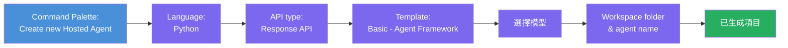
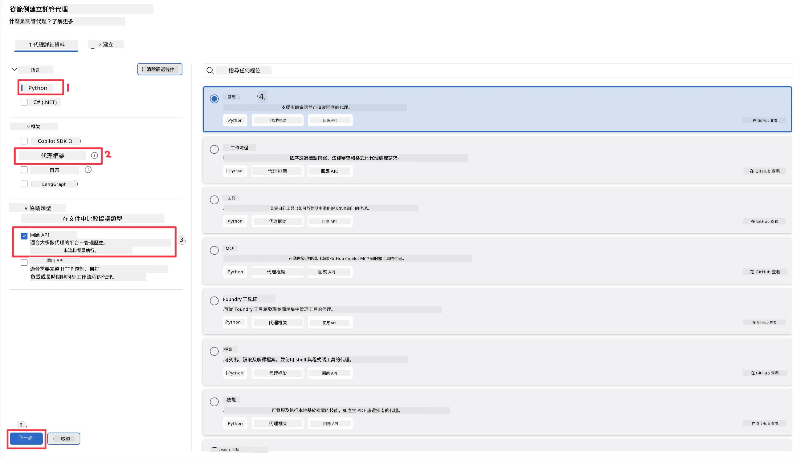
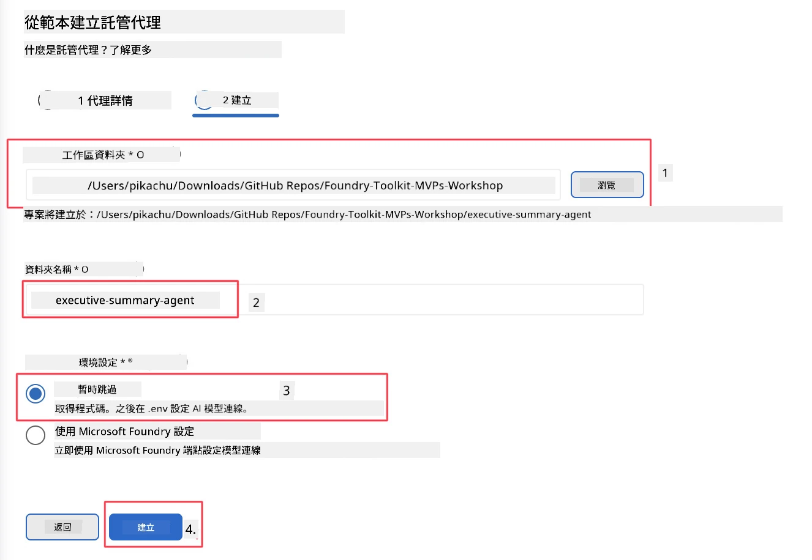

# 模組 2 - 建立新的託管代理程式

⏱️ 約 5 分鐘

在此模組中，您將使用 Foundry Toolkit <strong>建立託管代理程式專案的骨架</strong>。該骨架會生成完整的專案架構——`agent.yaml`、`main.py`、`Dockerfile`、`requirements.txt` 以及 VS Code 除錯設定——讓您能專注於自訂代理程式的行為。

> **關鍵概念：** 本實驗中的 `agent/` 資料夾是 Foundry Toolkit 所產生的範例，您不需要從零撰寫這些檔案。

### 骨架精靈流程



---

## 步驟 1：開啟建立託管代理程式精靈

1. 按下 `Ctrl+Shift+P` 以開啟 <strong>指令選擇器</strong>。
2. 輸入：**Foundry Toolkit: Create new Hosted Agent** 並選擇它。

> **替代方式：透過 Foundry 入口網站建立**
> 如果您偏好瀏覽器操作，可以在 [https://ai.azure.com](https://ai.azure.com) 創建專案。專案建立後，返回 VS Code 並使用 **Foundry Toolkit** 側邊欄連接該專案。

> **替代方案：** 點擊 Foundry Toolkit 側邊欄中 **Hosted Agents (Preview)** 旁的 **+** 圖示。

## 步驟 2：選擇設定



1. 在左側導覽/選項區選擇以下項目：

| 選單 | 選擇 | 備註 |
|--------|-----------|-------|
| <strong>語言</strong> | Python | 同時支援 C# |
| <strong>框架</strong> | Agent Framework | 使用 Agent Framework SDK 的簡易起點 |
| **API 類型** | Response API | `POST /responses` - 會話式，具平台管理的歷史紀錄 |
| <strong>範本</strong> | Basic | 使用 Agent Framework SDK 的簡單起點 |

2. 選擇完成後，點擊 <strong>下一步</strong>



3. 在下一個視窗中，選擇以下項目：

| 選單 | 選擇 | 備註 |
|--------|-----------|-------|
| <strong>工作區資料夾</strong> | 選擇目標資料夾 | 例如 `/workspace/Foundry_Toolkit_for_VSCode_Lab/` 或此倉庫中的子資料夾 |
| <strong>代理程式名稱</strong> | 輸入名稱 | 例如 `executive-summary-agent` |
| <strong>環境設定</strong> | 目前先跳過設定 |  |

點擊 <strong>建立</strong> 以建立代理程式。會產生一個以代理程式名稱命名的新資料夾。

## 步驟 3：檢查生成的專案

骨架生成完成後，請確認您在檔案總管（`Ctrl+Shift+E`）中看到以下檔案：

```
📂 my-agent/
├── .env                ← Environment variables (placeholders)
├── .vscode/
│   ├── launch.json     ← Debug config (F5 → run + Agent Inspector)
│   └── tasks.json      ← VS Code task definitions
├── agent.yaml          ← Agent definition (kind: hosted)
├── Dockerfile          ← Container config for deployment
├── main.py             ← Agent entry point (your main code)
└── requirements.txt    ← Python dependencies
```

### 重要檔案說明

| 檔案 | 功能 |
|------|---------|
| `agent.yaml` | 宣告代理程式為 `kind: hosted`，映射環境變數，定義 `/responses` 通訊協定 |
| `main.py` | 建立 `FoundryChatClient` → 用指令包裝成 `Agent` → 透過埠號 8088 的 `ResponsesHostServer` 提供服務 |
| `Dockerfile` | 使用 `python:3.12-slim`，安裝相依套件，開放 8088 埠，執行 `main.py` |
| `requirements.txt` | 包含 `agent-framework-foundry`、`agent-framework-foundry-hosting`、`mcp`、`debugpy` |

> **重要提示：** 請直接在 VS Code 中開啟骨架生成的代理程式資料夾（即 `agent/` 資料夾本身），以確保 `.vscode/launch.json` 與 `tasks.json` 能正確支援 F5 除錯。

---

### ✅ 檢查點

- [ ] 已建立骨架專案並包含所有預期檔案
- [ ] `agent.yaml` 顯示 `kind: hosted` 與 `protocol: responses`
- [ ] `main.py` 匯入了 `Agent`、`FoundryChatClient`、`ResponsesHostServer`
- [ ] 代理程式資料夾已在 VS Code 中開啟為工作區根目錄

---

**前一章：** [01 - 設定](01-setup.md) · **下一章：** [03 - 配置與程式碼 →](03-configure-and-code.md)

---

<!-- CO-OP TRANSLATOR DISCLAIMER START -->
**免責聲明**：
本文件使用 AI 翻譯服務 [Co-op Translator](https://github.com/Azure/co-op-translator) 進行翻譯。雖然我們力求準確，但請注意，自動翻譯可能包含錯誤或不準確之處。原始文件的母語版本應被視為權威來源。對於重要資訊，建議尋求專業人工翻譯。我們不對因使用本翻譯而引起的任何誤解或曲解承擔責任。
<!-- CO-OP TRANSLATOR DISCLAIMER END -->