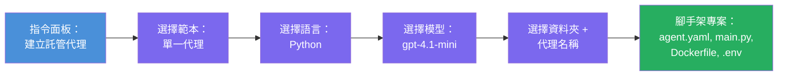

# Module 3 - 建立新的託管代理人 (由 Foundry 擴充套件自動搭建)

在本單元，您將使用 Microsoft Foundry 擴充套件來 **搭建新的[託管代理人](https://learn.microsoft.com/azure/foundry/agents/concepts/hosted-agents)專案**。該擴充套件會為您產生完整的專案結構——包含 `agent.yaml`、`main.py`、`Dockerfile`、`requirements.txt`、一個 `.env` 檔案，和 VS Code 除錯設定。搭建完成後，您會根據代理人的指示、工具和配置自訂這些檔案。

> **關鍵概念：** 本實驗室中的 `agent/` 資料夾，是 Foundry 擴充套件在您執行 scaffold 指令時生成的範例。您並非從零開始撰寫這些檔案——擴充套件會建立它們，然後您只需進行修改。

### scaffold 精靈流程


---

## 第 1 步：開啟「建立託管代理人」精靈

1. 按下 `Ctrl+Shift+P` 打開 <strong>指令面板</strong>。
2. 輸入：**Microsoft Foundry: Create a New Hosted Agent** 並選取它。
3. 會開啟託管代理人建立的精靈。

> **替代路徑：** 您也可以從 Microsoft Foundry 側邊欄 → 點選 **Agents** 旁的 **+** 圖示，或右鍵點選選單中的 **Create New Hosted Agent** 來開啟此精靈。

---

## 第 2 步：選擇範本

精靈會請您挑選一個範本。您會看到以下選項：

| 範本 | 說明 | 適用時機 |
|----------|-------------|-------------|
| <strong>單一代理人</strong> | 單一代理人擁有自己的模型、指示及可選工具 | 本工作坊 (Lab 01) |
| <strong>多代理工作流程</strong> | 多個代理人依序協作 | Lab 02 |

1. 選擇 <strong>單一代理人</strong>。
2. 點選 <strong>下一步</strong>（或選擇會自動進行）。

---

## 第 3 步：選擇程式語言

1. 選擇 **Python**（本工作坊推薦）。
2. 點選 <strong>下一步</strong>。

> **亦支援 C#**，若您習慣 .NET，scaffold 結構大致類似（用 `Program.cs` 替代 `main.py`）。

---

## 第 4 步：挑選模型

1. 精靈會顯示您在 Foundry 專案部署的模型（來自第二單元）。
2. 選擇您部署的模型，例如 **gpt-4.1-mini**。
3. 點選 <strong>下一步</strong>。

> 若沒有看到任何模型，請回到 [第二單元](02-create-foundry-project.md) 先完成部署。

---

## 第 5 步：選擇資料夾位置與代理人名稱

1. 會跳出檔案對話框 - 選擇要建立專案的 <strong>目標資料夾</strong>。在本工作坊：
   - 若從頭開始：選擇任何資料夾（例如 `C:\Projects\my-agent`）
   - 若在工作坊專案裡作業：於 `workshop/lab01-single-agent/agent/` 下建立子資料夾
2. 輸入託管代理人的 <strong>名稱</strong>（例如 `executive-summary-agent` 或 `my-first-agent`）。
3. 點選 <strong>建立</strong>（或按下 Enter）。

---

## 第 6 步：等待 scaffold 完成

1. VS Code 會開啟一個 <strong>新視窗</strong>，載入 scaffold 完成的專案。
2. 請稍等幾秒鐘，直到專案完整載入。
3. 您應該會在瀏覽器窗格中看到以下檔案 (`Ctrl+Shift+E`)：

```
📂 my-first-agent/
├── .env                ← Environment variables (auto-generated with placeholders)
├── .vscode/
│   └── launch.json     ← Debug configuration (F5 to run + Agent Inspector)
├── agent.yaml          ← Agent definition (kind: hosted)
├── Dockerfile          ← Container configuration for deployment
├── main.py             ← Agent entry point (your main code file)
└── requirements.txt    ← Python dependencies
```

> **這與本實驗室中 `agent/` 資料夾的結構相同**。Foundry 擴充套件會自動生成這些檔案——您不需要手動建立。

> **工作坊提醒：** 工作坊倉庫中的 `.vscode/` 資料夾放在 <strong>工作區根目錄</strong>（而非各專案內）。此資料夾含有共用的 `launch.json` 和 `tasks.json`，其中有兩種除錯設定——**"Lab01 - Single Agent"** 與 **"Lab02 - Multi-Agent"**，分別對應正確的工作目錄 (cwd)。按下 F5 時，請從下拉選單挑選對應您目前工作的實驗室設定。

---

## 第 7 步：了解每個產生檔案

花點時間瀏覽精靈建立的每個檔案。熟悉這些檔案對第四單元（客製化）相當重要。

### 7.1 `agent.yaml` - 代理人定義

開啟 `agent.yaml`。內容類似如下：

```yaml
# yaml-language-server: $schema=https://raw.githubusercontent.com/microsoft/AgentSchema/refs/heads/main/schemas/v1.0/ContainerAgent.yaml

kind: hosted
name: my-first-agent
description: >
  A hosted agent deployed to Microsoft Foundry Agent Service.
metadata:
  authors:
    - Microsoft
  tags:
    - Azure AI AgentServer
    - Microsoft Agent Framework
    - Hosted Agent
protocols:
  - protocol: responses
    version: v1
environment_variables:
  - name: AZURE_AI_PROJECT_ENDPOINT
    value: ${PROJECT_ENDPOINT}
  - name: AZURE_AI_MODEL_DEPLOYMENT_NAME
    value: ${MODEL_DEPLOYMENT_NAME}
dockerfile_path: Dockerfile
resources:
  cpu: '0.25'
  memory: 0.5Gi
```

**關鍵欄位：**

| 欄位 | 用途 |
|-------|---------|
| `kind: hosted` | 宣告這是一個託管代理人（容器化，部署於 [Foundry Agent Service](https://learn.microsoft.com/azure/foundry/agents/overview)） |
| `protocols: responses v1` | 代理人會開放與 OpenAI 相容的 `/responses` HTTP 端點 |
| `environment_variables` | 將 `.env` 檔中的變數對應映射至容器環境變數(部署時使用) |
| `dockerfile_path` | 指向用於建置容器映像檔的 Dockerfile |
| `resources` | 容器的 CPU 與記憶體配置（0.25 CPU，0.5Gi 記憶體） |

### 7.2 `main.py` - 代理人入口點

打開 `main.py`。這是 Python 主要程式碼檔，負責代理人邏輯。scaffold 包含：

```python
from agent_framework.azure import AzureAIAgentClient
from azure.ai.agentserver.agentframework import from_agent_framework
from azure.identity.aio import DefaultAzureCredential
```

**關鍵匯入：**

| 匯入 | 目的 |
|--------|--------|
| `AzureAIAgentClient` | 連接您的 Foundry 專案，並透過 `.as_agent()` 建立代理人 |
| [`DefaultAzureCredential`](https://learn.microsoft.com/azure/developer/python/sdk/authentication/credential-chains#defaultazurecredential-overview) | 處理驗證（透過 Azure CLI、VS Code 登入、託管身分識別或服務主體） |
| `from_agent_framework` | 將代理人包裝為 HTTP 伺服器，開放 `/responses` 端點 |

主要流程為：
1. 建立憑證 → 建立客戶端 → 呼叫 `.as_agent()` 取得代理人 (非同步上下文管理器) → 封裝為伺服器 → 運行

### 7.3 `Dockerfile` - 容器映像檔

```dockerfile
FROM python:3.14-slim

WORKDIR /app

COPY ./ .

RUN pip install --upgrade pip && \
    if [ -f requirements.txt ]; then \
        pip install -r requirements.txt; \
    else \
        echo "No requirements.txt found" >&2; exit 1; \
    fi

EXPOSE 8088

CMD ["python", "main.py"]
```

**主要細節：**
- 使用 `python:3.14-slim` 作為基底映像檔。
- 將所有專案檔案複製到 `/app`。
- 升級 `pip`，安裝來自 `requirements.txt` 的相依套件，若缺少該檔案會快速失敗。
- **開放 8088 連接埠**——此為託管代理人必須的通訊埠，請勿變更。
- 以 `python main.py` 啟動代理人。

### 7.4 `requirements.txt` - 相依套件

```
agent-framework-azure-ai==1.0.0rc3
agent-framework-core==1.0.0rc3
azure-ai-agentserver-agentframework==1.0.0b16
azure-ai-agentserver-core==1.0.0b16
debugpy
agent-dev-cli
```

| 套件 | 目的 |
|---------|---------|
| `agent-framework-azure-ai` | 微軟代理人框架的 Azure AI 整合 |
| `agent-framework-core` | 建構代理人的核心運行時（含 `python-dotenv`） |
| `azure-ai-agentserver-agentframework` | Foundry Agent Service 的託管代理人伺服器運行時 |
| `azure-ai-agentserver-core` | 核心代理人伺服器抽象 |
| `debugpy` | Python 除錯支援（允許 VS Code 按 F5 除錯） |
| `agent-dev-cli` | 用於在本地開發測試代理人的 CLI（由除錯/執行設定使用） |

---

## 理解代理人協定

託管代理人透過 **OpenAI Responses API** 協定通訊。執行中（本機或雲端），代理人會開放單一 HTTP 端點：

```
POST http://localhost:8088/responses
Content-Type: application/json

{
  "input": "Your prompt here",
  "stream": false
}
```

Foundry Agent Service 會呼叫此端點傳送用戶輸入提示，並接收代理人的回應。這與 OpenAI API 使用同一協定，因此您的代理人可以相容任何採用 OpenAI Responses 格式的客戶端。

---

### 檢查點

- [ ] scaffold 精靈已成功完成並開啟 **新的 VS Code 視窗**
- [ ] 您能看到所有 5 個檔案：`agent.yaml`、`main.py`、`Dockerfile`、`requirements.txt`、`.env`
- [ ] `.vscode/launch.json` 檔案存在（開啟 F5 除錯，在本工作坊中位於工作區根目錄並含有特定實驗室配置）
- [ ] 您已閱讀並了解每個檔案的用途
- [ ] 您了解埠號 `8088` 為必需，以及 `/responses` 端點即為通訊協定

---

**上一步：** [02 - 建立 Foundry 專案](02-create-foundry-project.md) · **下一步：** [04 - 配置與程式設計 →](04-configure-and-code.md)

---

<!-- CO-OP TRANSLATOR DISCLAIMER START -->
**免責聲明**：
本文件乃使用 AI 翻譯服務 [Co-op Translator](https://github.com/Azure/co-op-translator) 翻譯。雖然我們致力於準確性，但請注意，自動翻譯可能包含錯誤或不準確之處。原文文件的母語版本應視為權威來源。對於重要資訊，建議採用專業人工翻譯。對於因使用本翻譯而導致的任何誤解或錯誤詮釋，我們概不負責。
<!-- CO-OP TRANSLATOR DISCLAIMER END -->