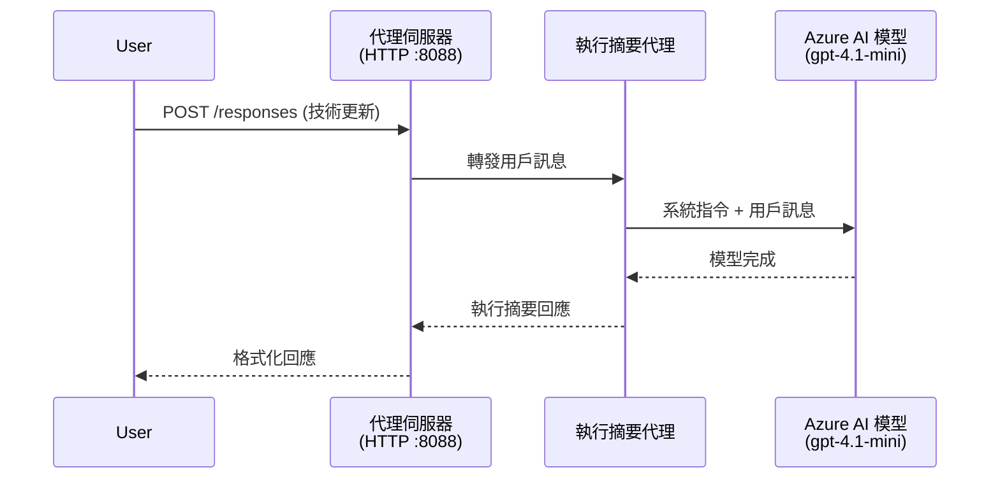
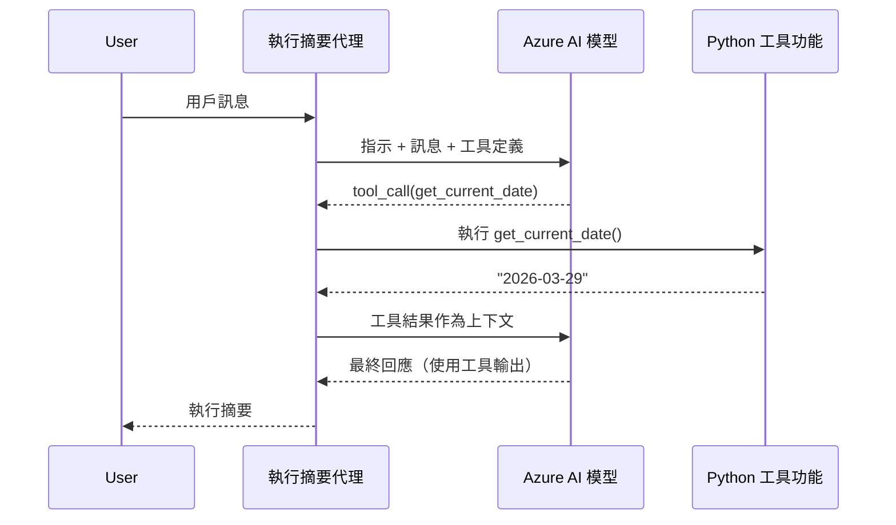

# 模組 4 - 配置指令、環境及安裝依賴項

在這個模組中，您將自訂模組 3 自動生成的代理檔案。這裡是您將通用的腳手架轉變成 <strong>您的</strong> 代理的地方——透過撰寫指令、設定環境變數、選擇性地添加工具以及安裝依賴項。

> **提醒：** Foundry 擴充功能會自動生成您的專案檔案。現在由您進行修改。請查看 [`agent/`](../../../../../workshop/lab01-single-agent/agent) 資料夾中自訂代理的完整工作範例。

---

## 元件如何組合

### 請求生命週期（單一代理）


> **使用工具時：** 如果代理已註冊工具，模型可能會回傳一個工具調用，而非直接完成。框架會在本地執行該工具，將結果回饋給模型，然後模型產生最終回應。


---

## 步驟 1：配置環境變數

腳手架建立了帶有佔位值的 `.env` 檔案。您需要填入模組 2 中的實際值。

1. 在您腳手架生成的專案中，打開 **`.env`** 檔案（它位於專案根目錄）。
2. 將佔位值替換為您的實際 Foundry 專案資料：

   ```env
   PROJECT_ENDPOINT=https://<your-account>.services.ai.azure.com/api/projects/<your-project>
   MODEL_DEPLOYMENT_NAME=gpt-4.1-mini
   ```

3. 儲存檔案。

### 這些值在哪裡找到

| 值 | 如何找到 |
|-----|----------|
| <strong>專案端點</strong> | 在 VS Code 中打開 **Microsoft Foundry** 側邊欄 → 點選您的專案 → 端點 URL 會顯示在詳細視圖中。它看起來像 `https://<account-name>.services.ai.azure.com/api/projects/<project-name>` |
| <strong>模型部署名稱</strong> | 在 Foundry 側邊欄，展開您的專案 → 查看 **Models + endpoints** 項目 → 部署的模型旁邊列有名稱（例如 `gpt-4.1-mini`） |

> **安全性：** 千萬不要將 `.env` 檔案提交到版本控制。預設已包含在 `.gitignore`。若沒有，請加入：
> ```
> .env
> ```

### 環境變數的傳遞流程

映射鏈如下： `.env` → `main.py`（透過 `os.getenv` 讀取）→ `agent.yaml`（在部署時映射到容器環境變數）。

在 `main.py` 中，腳手架會這樣讀取這些值：

```python
PROJECT_ENDPOINT = os.getenv("AZURE_AI_PROJECT_ENDPOINT") or os.getenv("PROJECT_ENDPOINT")
MODEL_DEPLOYMENT_NAME = os.getenv("AZURE_AI_MODEL_DEPLOYMENT_NAME", os.getenv("MODEL_DEPLOYMENT_NAME", "gpt-4.1-mini"))
```

`AZURE_AI_PROJECT_ENDPOINT` 和 `PROJECT_ENDPOINT` 都被接受（`agent.yaml` 使用 `AZURE_AI_*` 前綴）。

---

## 步驟 2：撰寫代理指令

這是最重要的自訂步驟。指令定義代理的個性、行為、輸出格式及安全限制。

1. 開啟專案中的 `main.py`。
2. 找到指令字串（腳手架包含一個預設／通用的）。
3. 用詳細且結構化的指令替換它。

### 優質指令包含哪些元素

| 元件 | 目的 | 範例 |
|-------|-------|-------|
| <strong>角色</strong> | 代理的身份與職責 | "您是一名執行摘要代理" |
| <strong>目標對象</strong> | 回應的對象是誰 | "技術背景有限的高階領導" |
| <strong>輸入定義</strong> | 可處理的提示類型 | "技術事故報告、營運更新" |
| <strong>輸出格式</strong> | 回應的具體結構 | "執行摘要: - 發生了什麼: ... - 商業影響: ... - 下一步: ..." |
| <strong>規則</strong> | 約束條件與拒絕情況 | "不得加入提供之外的資訊" |
| <strong>安全</strong> | 預防誤用與幻覺 | "若輸入不清楚，請求澄清" |
| <strong>範例</strong> | 輸入／輸出範例，指引行為 | 包含 2-3 個不同輸入輸出的範例 |

### 範例：執行摘要代理指令

這是工作坊 [`agent/main.py`](../../../../../workshop/lab01-single-agent/agent/main.py) 中使用的指令：

```python
AGENT_INSTRUCTIONS = """You are an "Explain Like I'm an Executive" agent.

Purpose:
Your job is to translate complex technical or operational information into
clear, concise, and outcome-focused summaries that can be easily understood
by non-technical executives.

Audience:
Senior leaders with limited technical background who care about impact,
risk, and what happens next.

What you must do:
- Rephrase the input so it is understandable to a non-technical audience
- Prioritize clarity, brevity, and outcomes over technical accuracy
- Remove technical jargon, logs, metrics, stack traces, and deep root-cause details
- Translate technical causes into simple cause-and-effect statements
- Explicitly call out business impact
- Always include a clear next step or action
- Maintain a neutral, factual, and calm executive tone
- Do NOT add new facts or speculate beyond the input

Standard Output Structure (always use this wording):

Executive Summary:
- What happened: <plain-language description>
- Business impact: <clear, non-technical impact>
- Next step: <clear action or mitigation>

Rules:
- Keep responses under 100 words
- Do NOT add facts beyond the input
- If input is unclear, ask for clarification
"""
```

4. 替換 `main.py` 中現有的指令字串為您的自訂指令。
5. 儲存檔案。

---

## 步驟 3：（選擇性）新增自訂工具

託管代理可以執行 **本地 Python 函式** 作為[工具](https://learn.microsoft.com/azure/foundry/agents/concepts/tool-catalog)。這是基於程式碼託管代理相較單純提示代理的一大優勢——您的代理可以執行任意伺服器端邏輯。

### 3.1 定義工具函式

在 `main.py` 新增工具函式：

```python
from agent_framework import tool

@tool
def get_current_date() -> str:
    """Returns the current date in YYYY-MM-DD format."""
    from datetime import date
    return str(date.today())
```

`@tool` 裝飾器會將標準 Python 函式轉為代理工具。函式說明文字會成為模型可見的工具描述。

### 3.2 向代理註冊工具

使用 `.as_agent()` 上下文管理器建立代理時，在 `tools` 參數中傳入工具：

```python
async with AzureAIAgentClient(
    project_endpoint=PROJECT_ENDPOINT,
    model_deployment_name=MODEL_DEPLOYMENT_NAME,
    credential=credential,
).as_agent(
    name="my-agent",
    instructions=AGENT_INSTRUCTIONS,
    tools=[get_current_date],
) as agent:
    server = from_agent_framework(agent)
    await server.run_async()
```

### 3.3 工具調用如何運作

1. 使用者送出提示。
2. 模型判斷是否需要工具（根據提示、指令和工具描述）。
3. 需要時，框架在本地容器內呼叫您的 Python 函式。
4. 工具的回傳值作為上下文送回模型。
5. 模型產生最終回應。

> <strong>工具在伺服器端執行</strong>——它們在您的容器內運行，不在使用者瀏覽器或模型端。這表示您可以存取資料庫、API、檔案系統或任何 Python 函式庫。

---

## 步驟 4：建立並啟動虛擬環境

在安裝依賴前，先建立獨立的 Python 環境。

### 4.1 建立虛擬環境

在 VS Code 開啟終端機（`` Ctrl+` ``）並執行：

```powershell
python -m venv .venv
```

這會在專案目錄中建立 `.venv` 資料夾。

### 4.2 啟動虛擬環境

**PowerShell (Windows):**

```powershell
.\.venv\Scripts\Activate.ps1
```

**命令提示字元 (Windows):**

```cmd
.venv\Scripts\activate.bat
```

**macOS/Linux (Bash):**

```bash
source .venv/bin/activate
```

您應該會看到終端機提示字元前面顯示 `(.venv)`，代表虛擬環境已啟動。

### 4.3 安裝依賴項

在虛擬環境啟動狀態下，安裝必要套件：

```powershell
pip install -r requirements.txt
```

安裝內容：

| 套件 | 用途 |
|-------|-------|
| `agent-framework-azure-ai==1.0.0rc3` | Azure AI 整合於 [Microsoft Agent Framework](https://learn.microsoft.com/agent-framework/overview/) |
| `agent-framework-core==1.0.0rc3` | 構建代理的核心執行時（包含 `python-dotenv`） |
| `azure-ai-agentserver-agentframework==1.0.0b16` | 託管代理伺服器執行時，用於 [Foundry Agent Service](https://learn.microsoft.com/azure/foundry/agents/overview) |
| `azure-ai-agentserver-core==1.0.0b16` | 核心代理伺服器抽象 |
| `debugpy` | Python 除錯工具（支援 VS Code F5 除錯） |
| `agent-dev-cli` | 本地開發用命令列工具，方便測試代理 |

### 4.4 驗證安裝

```powershell
pip list | Select-String "agent-framework|agentserver"
```

預期輸出：
```
agent-framework-azure-ai   1.0.0rc3
agent-framework-core       1.0.0rc3
azure-ai-agentserver-agentframework 1.0.0b16
azure-ai-agentserver-core  1.0.0b16
```

---

## 步驟 5：驗證認證

代理使用 [`DefaultAzureCredential`](https://learn.microsoft.com/azure/developer/python/sdk/authentication/credential-chains#defaultazurecredential-overview) 依序嘗試多種認證方法：

1. <strong>環境變數</strong> - `AZURE_CLIENT_ID`、`AZURE_TENANT_ID`、`AZURE_CLIENT_SECRET`（服務主體）
2. **Azure CLI** - 使用您 `az login` 的登入資料
3. **VS Code** - 使用您在 VS Code 登入的帳戶
4. <strong>管理身份識別</strong> - 部署時在 Azure 上運行時使用

### 5.1 本地開發驗證

下列任一方式應可成功：

**選項 A：Azure CLI（推薦）**

```powershell
az account show --query "{name:name, id:id}" --output table
```

預期：顯示您的訂閱名稱與 ID。

**選項 B：VS Code 登入**

1. 在 VS Code 左下方尋找 <strong>帳戶</strong> 圖示。
2. 若顯示您的帳戶名稱，即表示已認證。
3. 否則，點擊該圖示 → **登入以使用 Microsoft Foundry**。

**選項 C：服務主體（CI/CD 專用）**

```powershell
$env:AZURE_TENANT_ID = "<your-tenant-id>"
$env:AZURE_CLIENT_ID = "<your-client-id>"
$env:AZURE_CLIENT_SECRET = "<your-client-secret>"
```

### 5.2 常見認證問題

若您登入多個 Azure 帳戶，請確定已選擇正確的訂閱：

```powershell
az account set --subscription "<your-subscription-id>"
```

---

### 檢查點

- [ ] `.env` 檔案中有有效的 `PROJECT_ENDPOINT` 與 `MODEL_DEPLOYMENT_NAME`（非佔位符）
- [ ] 已在 `main.py` 自訂代理指令，定義角色、目標對象、輸出格式、規則和安全限制
- [ ] （選擇性）已定義並註冊自訂工具
- [ ] 已建立並啟動虛擬環境（終端機提示顯示 `(.venv)`）
- [ ] `pip install -r requirements.txt` 順利完成且無錯誤
- [ ] `pip list | Select-String "azure-ai-agentserver"` 顯示套件已安裝
- [ ] 驗證認證有效 — `az account show` 正確回傳訂閱，或已登入 VS Code

---

**上一篇：** [03 - 建立託管代理](03-create-hosted-agent.md) · **下一篇：** [05 - 本地測試 →](05-test-locally.md)

---

<!-- CO-OP TRANSLATOR DISCLAIMER START -->
**免責聲明**：
本文件已使用 AI 翻譯服務 [Co-op Translator](https://github.com/Azure/co-op-translator) 進行翻譯。儘管我們力求準確，但請注意自動翻譯可能包含錯誤或不準確之處。原始文件之本地語言版本應被視為權威來源。對於重要資訊，建議採用專業人工翻譯。因使用本翻譯而產生的任何誤解或誤釋，我們概不負責。
<!-- CO-OP TRANSLATOR DISCLAIMER END -->