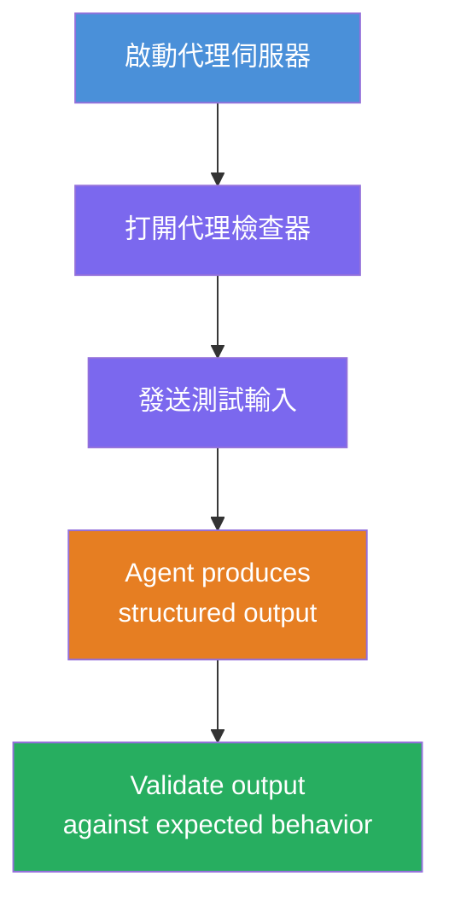
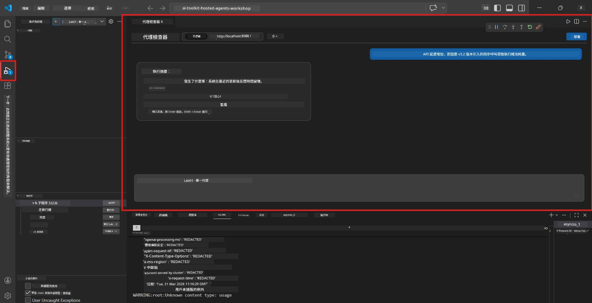
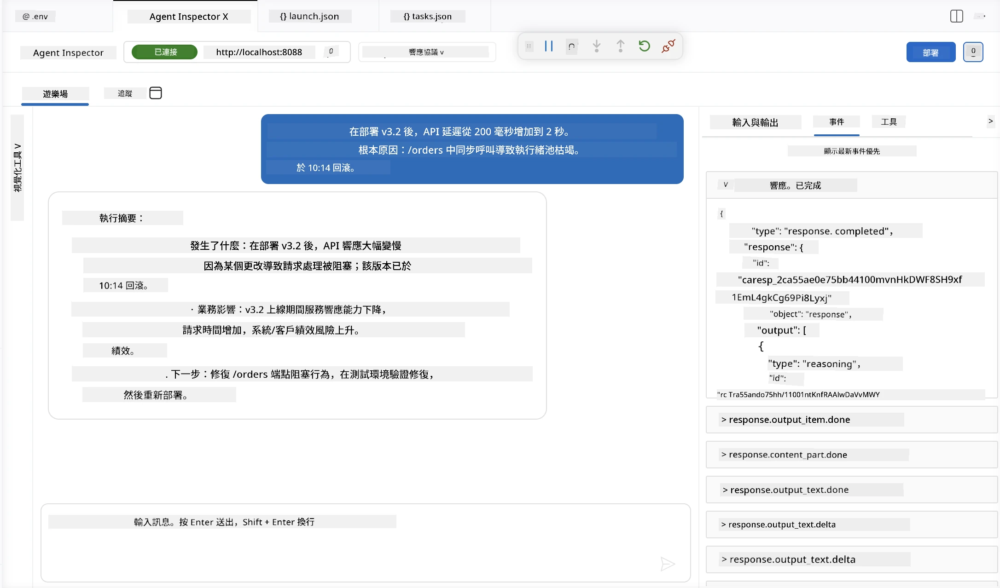

# 模組 4 - 本地測試

⏱️ 約 10 分鐘

在本模組中，您將於本地運行您的代理，並使用 <strong>順利路徑功能測試</strong> 驗證其運作正確。您可使用 Agent Inspector（視覺化介面）或直接 HTTP 請求，確認代理產生結構化且準確的回應。

### 本地測試流程



---

## 選項 1：按 F5 - 使用 Agent Inspector 除錯（建議）

### 啟動除錯器

1. 直接於 VS Code 開啟 **executive-summary-agent/** 資料夾（`檔案 → 開啟資料夾`）。
2. 開啟 <strong>執行與除錯</strong> 面板（`Ctrl+Shift+D`）。
3. 從下拉選單選擇 **Debug Local Agent Server**。
4. 按 **F5**（或點擊 ▶ 開始除錯）。

> ⚠️ **重要：選擇您的 Python 直譯器**
> 若出現 "ModuleNotFoundError" 或除錯器無法啟動，您必須告訴 VS Code 使用您的虛擬環境：
  > 1. 按 `Ctrl+Shift+P` $\rightarrow$ 輸入 **Python: Select Interpreter**。
  > 2. 選擇專案 `.venv` 資料夾中的直譯器（例如 Windows 下的 `.\.venv\Scripts\python.exe`）。
  > 3. 重新啟動除錯階段。
> 若仍發生錯誤，請手動更新您的 `tasks.json` 文件如下：
  > 1. 前往 `.vscode/tasks.json` 文件
  > 2. 找到命令標籤為：`Run Agent/Workflow HTTP Server`
  > 3. 更新命令值為：`"value": "${workspaceFolder}/.venv/bin/python",`

### 運作流程

1. HTTP 伺服器於 `http://localhost:8088/responses` 啟動。
2. **Agent Inspector** 面板自動開啟 - 這是一個用於測試的視覺化聊天介面。
3. 在 `main.py` 啟用斷點。

在終端機中注意觀察：
```
Starting executive summary hosted agent
Executive agent server running on http://localhost:8088
```

> **如果 Agent Inspector 未開啟：** 按 `Ctrl+Shift+P` → **Foundry Toolkit: Open Agent Inspector**。



> *截圖可能顯示舊版擴充功能的“AI TOOLKIT”品牌字樣。*

---

## 選項 2：透過終端機測試（替代方案）

在一個終端機啟動代理，從另一個終端機發送請求：

```bash
# 終端 1：啟動代理
cd executive-summary-agent/
source .venv/bin/activate
python main.py
```

```bash
# 終端 2：發送測試（curl）
curl -sS -X POST http://localhost:8088/responses \
  -H "Content-Type: application/json" \
  -d '{"input": "The API latency increased due to thread pool exhaustion caused by sync calls in v3.2.", "stream": false}'
```

---

## 情境測試：順利路徑功能驗證

執行以下 <strong>全部三個</strong> 情境。這些用來驗證您的代理是否對實際輸入產生正確且結構化的輸出。



### 情境 1：IT 事件 - API 延遲激增

**輸入：**
```
The API latency increased from 200ms to 2s after deploying v3.2.
Root cause: thread pool starvation from synchronous calls in /orders.
Rolled back at 10:14.
```

**預期行為：**
- ✅ 遵循「行政摘要」結構（發生了什麼／業務影響／下一步）
- ✅ 無技術術語（無「thread pool」、無「/orders」、無「v3.2」）
- ✅ 清楚描述業務影響（例如，使用者遭遇延遲）
- ✅ 包含下一步措施（例如，已部署修復，設置監控）

---

### 情境 2：資料管道 - ETL 失敗

**輸入：**
```
The nightly ETL job failed because the upstream schema changed. APAC dashboards show missing data.
```

**預期行為：**
- ✅ 使用通俗易懂語言摘要資料刷新失敗情況
- ✅ 提及 APAC 儀表板受到影響
- ✅ 包含矯正下一步措施
- ✅ 不出現「ETL」、「schema」或其他技術術語

---

### 情境 3：安全 - 憑證外洩

**輸入：**
```
Static analysis flagged a hardcoded secret in the repository.
The secret may have been exposed in commit history.
```

**預期行為：**
- ✅ 以行政友善語言描述憑證／安全問題
- ✅ 指出潛在風險（未授權存取）
- ✅ 說明矯正措施（憑證輪換、稽核）
- ✅ 不包含「static analysis」、「commit history」或「hardcoded」等詞彙

---

## 驗證標準

對每個情境，檢查：

| # | 標準 | 通過條件 |
|---|----------|---------------|
| 1 | <strong>結構</strong> | 回應使用「行政摘要」格式，含全部三個要點 |
| 2 | <strong>通俗語言</strong> | 無行政主管無法理解的技術術語 |
| 3 | <strong>準確性</strong> | 摘要符合輸入內容 - 無捏造細節 |
| 4 | <strong>簡潔</strong> | 回應不超過 100 字 |
| 5 | <strong>下一步</strong> | 明確陳述行動或緩解措施 |

---

## 除錯提示

| 問題 | 解決方法 |
|-------|-----|
| 代理無法啟動 | 檢查 `.env` 參數，確認虛擬環境已啟用，執行 `pip install -r requirements.txt` |
| 回應為空或通用 | 檢查 `main.py` 中指示 - 確保指定輸出格式 |
| 回應包含術語 | 強化指示中「移除技術術語」規則 |
| Agent Inspector 未開啟 | `Ctrl+Shift+P` → **Foundry Toolkit: Open Agent Inspector** |
| 終端機出現模型錯誤 | 確認 `AZURE_AI_MODEL_DEPLOYMENT_NAME` 完全匹配（大小寫敏感） |

---

### ✅ 檢查點

- [ ] 代理本地啟動無錯誤
- [ ] Agent Inspector 開啟並呈現聊天介面（F5 使用者）
- [ ] **情境 1**（IT 事件）- 結構化行政摘要，無術語
- [ ] **情境 2**（資料管線）- 具業務影響的相關摘要
- [ ] **情境 3**（安全警示）- 適切的風險通報
- [ ] 所有回應皆遵循既定輸出結構

> <strong>請保存您的回應</strong>（複製或截圖） - 您將於模組 06 的雲端結果中比對。

---

**上一節：** [03 - Configure & Code](03-configure-and-code.md) · **下一節：** [05 - Deploy to Foundry →](05-deploy-to-foundry.md)

---

<!-- CO-OP TRANSLATOR DISCLAIMER START -->
**免責聲明**：
本文件使用 AI 翻譯服務 [Co-op Translator](https://github.com/Azure/co-op-translator) 進行翻譯。雖然我們力求準確，但請注意，自動翻譯可能包含錯誤或不準確之處。原始文件的母語版本應被視為權威來源。對於重要資訊，建議尋求專業人工翻譯。我們不對因使用本翻譯而引起的任何誤解或曲解承擔責任。
<!-- CO-OP TRANSLATOR DISCLAIMER END -->