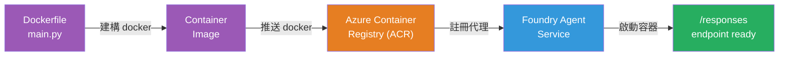
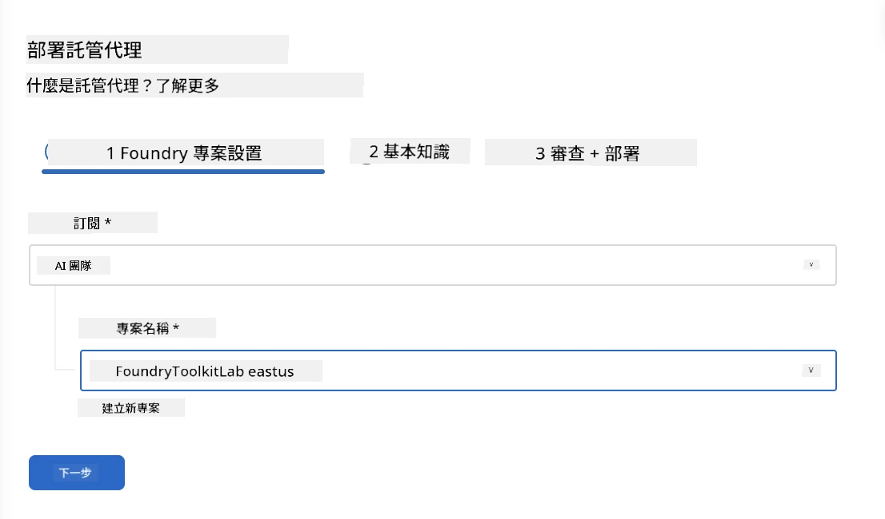
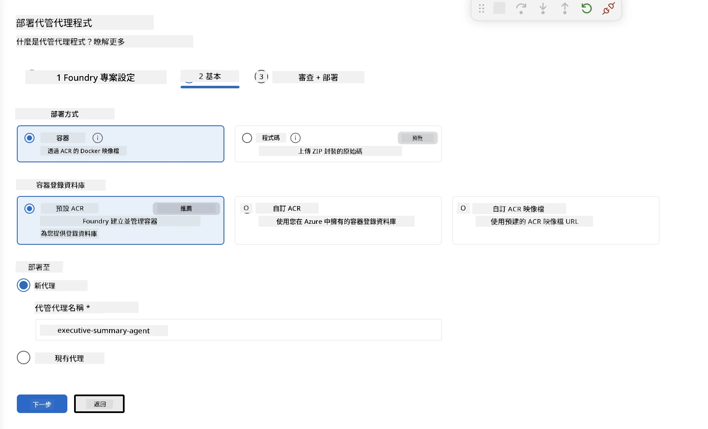
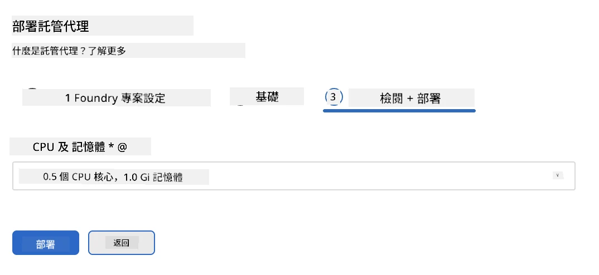
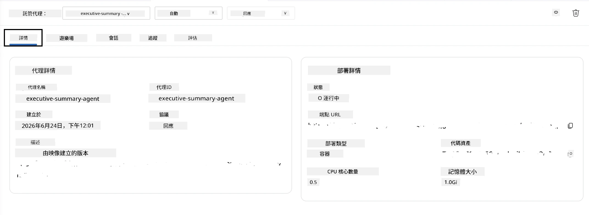

# 模組 5 - 部署到 Foundry Agent 服務

⏱️ 約 10 分鐘

> ⚠️ **路徑 B 使用者：** 本模組需要 Foundry 訂閱。如果您使用的是 Foundry Local，請跳至 [模組 07 - 摘要](07-summary.md)。您已成功完成本地開發工作流程！

在本模組中，您將在本地測試過的智能代理部署到 Microsoft Foundry 作為 <strong>託管代理</strong>。部署過程會構建容器映像，推送到 Azure Container Registry，並在 Foundry 的管理基礎設施中啟動代理。

### 部署流程

---

## 前置條件檢查

部署前請確認：

- [ ] 代理通過了來自 [模組 04](04-test-locally.md) 的所有 3 個本地場景測試
- [ ] 您在專案層級擁有 **Azure AI User** 角色 ([模組 01，設定 RBAC](01-setup.md#deploy-a-model--assign-rbac))
- [ ] 您已在 VS Code 內登入 Azure（帳戶圖示顯示您的名字）

---

## 步驟 1：開始部署

### 選項 A：從 Agent Inspector 部署（推薦）

如果 Agent Inspector 已開啟（來自主測試）：
1. 點擊右上角的 **Deploy** 按鈕（雲端圖示 ↑）。

### 選項 B：從命令面板部署

1. 按 `Ctrl+Shift+P` → **Foundry Toolkit: Deploy Hosted Agent**。

---

## 步驟 2：設定部署

精靈會提示您：

| 提示 | 選擇 |
|--------|-----------|
| <strong>訂閱</strong> | 您的 Azure 訂閱 |
| <strong>目標專案</strong> | 您的 Foundry 專案（例如 `workshop-agents`） |

點擊 **next** 以設定您的代理。

| 提示 | 選擇 |
|--------|-----------|
| <strong>部署方式</strong> | 容器 |
| <strong>容器註冊表</strong> | **預設 ACR**（Microsoft Foundry 為您建立並管理） |
| <strong>部署到</strong> | 新代理（名稱，`executive-summary-agent`） |

點擊 **next** 以檢視並部署您的代理。

| 提示 | 選擇 |
|--------|-----------|
| **CPU 與記憶體** | **0.25 CPU 核心，0.5 Gi 記憶體**（足夠用於工作坊） |

---

## 步驟 3：部署與監控

1. 點擊 **Deploy**。
2. 觀看 <strong>輸出</strong> 面板（從下拉選單中選擇 **Microsoft Foundry**）。
3. 部署流程包含以下階段：
   - **Docker build** - 從您的 Dockerfile 建構容器映像
   - **Docker push** - 推送映像到 ACR（首次部署需 1–3 分鐘）
   - **Agent 註冊** - 在 Foundry 中建立託管代理
   - <strong>容器啟動</strong> - 使用系統管理的身份啟動

4. 完成時，會出現通知：
   > **my-agent 已成功部署。** `查看日誌` `執行代理`

5. 點擊 <strong>執行代理</strong> 以打開 Agent Playground。

### 部署狀態說明

| 狀態 | 含義 |
|--------|---------|
| <strong>運行中</strong> | 容器已就緒，代理正在回應 |
| <strong>等待中</strong> | 容器啟動中 - 請等待 30–60 秒 |
| <strong>失敗</strong> | 請檢查日誌（參考下方故障排除） |

---

## 常見部署錯誤

| 錯誤 | 根本原因 | 解決方式 |
|-------|-----------|-----|
| `agents/write` 權限被拒絕 | 專案層級缺少 **Azure AI User** 角色 | [模組 01，設定 RBAC](01-setup.md#deploy-a-model--assign-rbac) |
| Docker 未運行 | Docker Desktop 未啟動 | 啟動 Docker Desktop → 驗證 `docker info` |
| ACR 授權問題 | 管理身份無法拉取映像 | 請參見 [模組 08 - 疑難排解](08-troubleshooting.md) |

---

### ✅ 檢查點

- [ ] 部署成功完成，無錯誤產生
- [ ] 代理顯示在 Foundry 側欄的 **Hosted Agents (預覽)** 下
- [ ] 容器狀態顯示為 <strong>運行中</strong>
- [ ] Agent Playground 分頁已打開，顯示代理詳情及端點 URL

---

**上一篇：** [04 - 本地測試](04-test-locally.md) · **下一篇：** [06 - 在 Playground 驗證 →](06-verify-in-playground.md)

---

<!-- CO-OP TRANSLATOR DISCLAIMER START -->
**免責聲明**：
本文件使用 AI 翻譯服務 [Co-op Translator](https://github.com/Azure/co-op-translator) 進行翻譯。雖然我們力求準確，但請注意，自動翻譯可能包含錯誤或不準確之處。原始文件的母語版本應被視為權威來源。對於重要資訊，建議尋求專業人工翻譯。我們不對因使用本翻譯而引起的任何誤解或曲解承擔責任。
<!-- CO-OP TRANSLATOR DISCLAIMER END -->