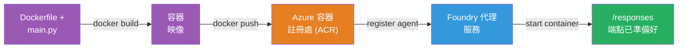
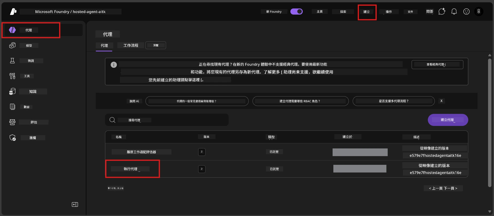

# Module 6 - 部署到 Foundry 代理服務

在本模組中，您將把本地測試過的代理部署到 Microsoft Foundry，作為 [<strong>託管代理</strong>](https://learn.microsoft.com/azure/foundry/agents/concepts/hosted-agents)。部署過程將從您的專案建立 Docker 容器映像，將其推送到 [Azure 容器登錄中心 (ACR)](https://learn.microsoft.com/azure/container-registry/container-registry-intro)，並在 [Foundry 代理服務](https://learn.microsoft.com/azure/foundry/agents/overview) 創建一個託管代理版本。

### 部署管線


---

## 前置條件檢查

部署前請確認以下各項。跳過這些檢查是導致部署失敗的最常見原因。

1. **代理通過本地冒煙測試：**
   - 您已完成 [Module 5](05-test-locally.md) 中的所有 4 項測試，且代理正常回應。

2. **您擁有 [Azure AI 使用者](https://learn.microsoft.com/azure/foundry/concepts/rbac-foundry#built-in-roles) 角色：**
   - 此角色在 [Module 2，步驟 3](02-create-foundry-project.md) 已分配。如不確定，請立即確認：
   - Azure 入口網站 → 您的 Foundry <strong>專案</strong> 資源 → **存取控制 (IAM)** → <strong>角色指派</strong> 索引標籤 → 搜尋您的姓名 → 確認列有 **Azure AI 使用者**。

3. **您已在 VS Code 登入 Azure：**
   - 檢查 VS Code 左下角的帳戶圖示，應能看到您的帳戶名稱。

4. **（可選）Docker Desktop 正在執行：**
   - 只有在 Foundry 延伸功能要求進行本地建置時才需要 Docker。大多數情況下，延伸功能會在部署期間自動處理容器建置。
   - 若您安裝了 Docker，請確認它正在執行：`docker info`

---

## 步驟 1：開始部署

您有兩種部署方式——兩者都會達成同樣結果。

### 選項 A：從代理檢查器部署（推薦）

若您正以偵錯模式（F5）執行代理且代理檢查器已開啟：

1. 查看代理檢查器面板的 <strong>右上角</strong>。
2. 點擊 <strong>部署</strong> 按鈕（雲端圖示，上箭頭 ↑）。
3. 部署精靈隨即開啟。

### 選項 B：從命令選單部署

1. 按 `Ctrl+Shift+P` 開啟 <strong>命令選單</strong>。
2. 輸入：**Microsoft Foundry: Deploy Hosted Agent** 並選取它。
3. 部署精靈隨即開啟。

---

## 步驟 2：設定部署

部署精靈會引導您完成設定。請依序填寫每個提示：

### 2.1 選擇目標專案

1. 下拉式選單會顯示您的 Foundry 專案。
2. 選取您在 Module 2 中建立的專案（例如 `workshop-agents`）。

### 2.2 選擇容器代理檔案

1. 您需要選擇代理的入口點檔案。
2. 選擇 **`main.py`**（Python）——精靈用此檔案識別您的代理專案。

### 2.3 設定資源

| 設定項 | 推薦值 | 備註 |
|---------|------------------|-------|
| **CPU** | `0.25` | 預設，用於研討會足夠。生產環境可增加 |
| <strong>內存</strong> | `0.5Gi` | 預設，用於研討會足夠 |

這些值與 `agent.yaml` 中相符，您可接受預設值。

---

## 步驟 3：確認並部署

1. 精靈會顯示部署摘要，包含：
   - 目標專案名稱
   - 代理名稱（來自 `agent.yaml`）
   - 容器檔案和資源配置
2. 檢查摘要後，點擊 <strong>確認並部署</strong>（或 <strong>部署</strong>）。
3. 在 VS Code 觀察進度。

### 部署過程（逐步）

部署過程包含多個步驟。請留意 VS Code <strong>輸出</strong> 面板（從下拉選單選擇 "Microsoft Foundry"）以追蹤：

1. **Docker 建置** - VS Code 依據您的 `Dockerfile` 建立 Docker 容器映像。您會看到 Docker 層的訊息：
   ```
   Step 1/6 : FROM python:<version>-slim
   Step 2/6 : WORKDIR /app
   ...
   Successfully built abc123def456
   ```

2. **Docker 推送** - 映像推送到與您的 Foundry 專案關聯的 **Azure 容器登錄中心 (ACR)**。首次部署可能花費 1-3 分鐘（基底映像超過100MB）。

3. <strong>代理註冊</strong> - Foundry 代理服務建立新的託管代理（或已有代理時更新版本）。使用來自 `agent.yaml` 的代理元資料。

4. <strong>容器啟動</strong> - 容器在 Foundry 管理的平台中啟動。平台會指派 [系統管理身分](https://learn.microsoft.com/azure/foundry/agents/concepts/agent-identity) 並開放 `/responses` 端點。

> <strong>首次部署較慢</strong>（Docker 需推送所有層）。後續部署較快，因 Docker 會快取未變更的層。

---

## 步驟 4：確認部署狀態

部署命令完成後：

1. 點擊活動列中的 Foundry 圖示，開啟 **Microsoft Foundry** 側邊欄。
2. 展開專案下的 **託管代理（預覽）** 區段。
3. 您應會看到您的代理名稱（例如 `ExecutiveAgent` 或來自 `agent.yaml` 的名稱）。
4. <strong>點擊代理名稱</strong> 以展開。
5. 您會看到一個或多個 <strong>版本</strong>（如 `v1`）。
6. 點選版本以檢視 <strong>容器詳細資訊</strong>。
7. 檢查 <strong>狀態</strong> 欄位：

   | 狀態 | 含意 |
   |--------|---------|
   | **Started** 或 **Running** | 容器正在執行中，代理已準備就緒 |
   | **Pending** | 容器正在啟動中（請等待 30-60 秒） |
   | **Failed** | 容器啟動失敗（請檢查日誌－下方故障排除說明） |



> **「Pending」狀態超過 2 分鐘：** 容器可能還在拉取基底映像。請稍等。如持續為 Pending，請檢查容器日誌。

---

## 常見部署錯誤與解決方法

### 錯誤 1：Permission denied - `agents/write`

```
Error: lacks the required data action 
Microsoft.CognitiveServices/accounts/AIServices/agents/write 
to perform POST /api/projects/{projectName}/assistants operation.
```

**根本原因：** 您沒有專案層級的 `Azure AI User` 角色。

**逐步解決：**

1. 開啟 [https://portal.azure.com](https://portal.azure.com)。
2. 在搜尋欄輸入您的 Foundry <strong>專案</strong> 名稱並點選。
   - **重要：** 請確保您瀏覽的是 <strong>專案</strong> 資源（類型為 "Microsoft Foundry project"），非上層帳戶或中樞資源。
3. 在左方導覽點擊 **存取控制 (IAM)**。
4. 點擊 **+ 新增** → <strong>新增角色指派</strong>。
5. 在 <strong>角色</strong> 索引標籤搜尋並選擇 [**Azure AI User**](https://learn.microsoft.com/azure/foundry/concepts/rbac-foundry#built-in-roles)。點擊 <strong>下一步</strong>。
6. 在 <strong>成員</strong> 索引標籤選擇 **使用者、群組或服務主體**。
7. 點擊 **+ 選擇成員**，搜尋您的名稱或電子郵件，選取您自己，點擊 <strong>選擇</strong>。
8. 點擊 **檢閱 + 指派** → 再按一次 **檢閱 + 指派**。
9. 等待 1-2 分鐘，讓角色指派生效。
10. **從步驟 1 重新嘗試部署**。

> 角色必須存在於 <strong>專案</strong> 範圍，非僅帳戶範圍。這是部署失敗的首要原因。

### 錯誤 2：Docker 未啟動

```
Error: Docker build failed / Cannot connect to Docker daemon
```

**解決方法：**
1. 啟動 Docker Desktop（在開始選單或系統列找）。
2. 等待狀態顯示「Docker Desktop is running」（需 30-60 秒）。
3. 在終端機執行 `docker info` 確認。
4. **針對 Windows：** 確認 Docker Desktop 設定中啟用了 WSL 2 後端 → <strong>一般</strong> → **使用基於 WSL 2 的引擎**。
5. 重試部署。

### 錯誤 3：ACR 授權失敗 - `AcrPullUnauthorized`

```
Error: AcrPullUnauthorized
```

**根本原因：** Foundry 專案的系統管理身分無法從容器登錄中心拉取映像。

**解決方法：**
1. 在 Azure 入口網站中，導覽至與您的 Foundry 專案同資源群組的 **[容器登錄中心](https://learn.microsoft.com/azure/container-registry/container-registry-intro)**。
2. 點選 **存取控制 (IAM)** → <strong>新增</strong> → <strong>新增角色指派</strong>。
3. 選擇 **[AcrPull](https://learn.microsoft.com/azure/container-registry/container-registry-roles)** 角色。
4. 在成員中選擇 <strong>系統管理身分</strong> → 找到 Foundry 專案的系統管理身分。
5. **檢閱 + 指派**。

> 通常此設定由 Foundry 延伸功能自動完成。如果出現此錯誤，表示自動設定可能失敗。

### 錯誤 4：容器平台不符（Apple Silicon）

若使用 Apple Silicon Mac (M1/M2/M3) 來部署，容器必須建置為 `linux/amd64`：

```bash
docker build --platform linux/amd64 -t myagent:v1 .
```

> Foundry 延伸功能對大部分使用者會自動處理此問題。

---

### 檢查點

- [ ] VS Code 中部署命令無錯誤完成
- [ ] 代理出現在 Foundry 側邊欄的 **託管代理（預覽）** 中
- [ ] 點擊代理→選擇版本→查看 <strong>容器詳細資訊</strong>
- [ ] 容器狀態顯示 **Started** 或 **Running**
- [ ] （如發生錯誤）已識別錯誤、套用修正、成功重新部署

---

**前一章節：** [05 - 本地測試](05-test-locally.md) · **下一章節：** [07 - Playground 驗證 →](07-verify-in-playground.md)

---

<!-- CO-OP TRANSLATOR DISCLAIMER START -->
**免責聲明**：  
本文件係使用 AI 翻譯服務 [Co-op Translator](https://github.com/Azure/co-op-translator) 所翻譯。雖然我們盡力確保準確性，但請注意自動翻譯可能包含錯誤或不準確之處。原始文件的母語版本應被視為權威來源。對於重要資訊，建議由專業翻譯人員進行翻譯。我們不對因使用本翻譯而引起的任何誤解或誤釋承擔責任。
<!-- CO-OP TRANSLATOR DISCLAIMER END -->