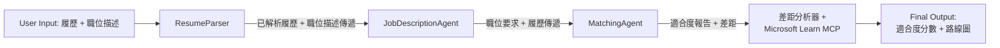

# PersonalCareerCopilot - 簡歷 → 工作適配評估器

一個工作流程優先的多代理應用，評估簡歷與職位描述的匹配度，然後生成個性化學習路線圖以彌補差距。

---

## 代理

| 代理 | 角色 | 工具 |
|-------|------|-------|
| **ResumeParser** | 從簡歷文本中提取結構化技能、經驗、認證 | - |
| **JobDescriptionAgent** | 從職位描述中提取必需/優先技能、經驗、認證 | - |
| **MatchingAgent** | 比較履歷與要求 → 適配分數 (0-100) + 匹配/缺少技能 | - |
| **GapAnalyzer** | 利用 Microsoft Learn 資源構建個性化學習路線圖 | `search_microsoft_learn_for_plan` (MCP) |

## 工作流程


```mermaid
flowchart LR
    UserInput["User Input: 履歷 + 職位描述"] --> ResumeParser
    ResumeParser -- "已解析履歷 + 職位描述傳遞" --> JobDescriptionAgent
    JobDescriptionAgent -- "職位要求 + 履歷傳遞" --> MatchingAgent
    MatchingAgent -- "適合度報告 + 差距" --> GapAnalyzerMCP["差距分析器 +\nMicrosoft Learn MCP"]
    GapAnalyzerMCP --> FinalOutput["Final Output:\n適合度分數 + 路線圖"]
```

---

## 快速開始

### 1. 設置環境

此文件夾是基於工作流程的 Lab 02 骨架的參考實現。其 `main.py` 使用現有提示塊加上 `WorkflowBuilder` 來連接四個代理。

```powershell
cd workshop\lab02-multi-agent\PersonalCareerCopilot
python -m venv .venv
.\.venv\Scripts\Activate.ps1          # Windows PowerShell
# source .venv/bin/activate            # macOS / Linux
pip install -r requirements.txt
```

### 2. 配置憑證

在此文件夾中創建 `.env` 文件：

```powershell
copy .env .env.bak 2>$null; echo $null > .env
```

編輯 `.env`：

```env
FOUNDRY_PROJECT_ENDPOINT=https://<your-account>.services.ai.azure.com/api/projects/<your-project>
AZURE_AI_MODEL_DEPLOYMENT_NAME=gpt-4.1-mini
```

| 值 | 取得位置 |
|-------|------------------|
| `FOUNDRY_PROJECT_ENDPOINT` | Foundry Toolkit 側邊欄 → 右鍵你的項目 → <strong>複製項目端點</strong> |
| `AZURE_AI_MODEL_DEPLOYMENT_NAME` | Foundry 側邊欄 → 展開項目 → **模型 + 端點** → 部署名稱 |

### 3. 在本地運行

```powershell
python -m debugpy --listen 127.0.0.1:5679 main.py --port 8088
```

或使用 VS Code 任務：`Ctrl+Shift+P` → **任務: 執行任務** → **運行代理 HTTP 服務器**。

調試使用 F5，選擇 **調試本地代理 HTTP 服務器**。

### 4. 使用代理檢查器測試

打開代理檢查器：`Ctrl+Shift+P` → **Foundry Toolkit: 打開代理檢查器**。

粘貼此測試提示：

```
Resume:
Jane Doe
Senior Software Engineer with 5 years of experience in Python, Django, and AWS.
Built microservices handling 10K+ requests/second. Led a team of 4 developers.
Certifications: AWS Solutions Architect Associate.
Education: B.S. Computer Science, State University.

Job Description:
Senior Cloud Engineer at Contoso Ltd.
Required: Python, Azure, Kubernetes, Terraform, CI/CD pipelines.
Preferred: Go, monitoring (Prometheus/Grafana), cost optimization.
Experience: 5+ years in cloud infrastructure.
Certifications: Azure Solutions Architect Expert preferred.
```

**預期結果：** 一個適配分數 (0-100)、匹配/缺少技能，以及含 Microsoft Learn 鏈接的個性化學習路線圖。

### 5. 部署到 Foundry

`Ctrl+Shift+P` → **Foundry Toolkit: 部署托管代理** → 選擇你的項目 → 確認。

---

## 項目結構

```
PersonalCareerCopilot/
├── .env                ← Your credentials (git-ignored)
├── agent.yaml          ← Hosted agent definition (name, resources, env vars)
├── Dockerfile          ← Container image for Foundry deployment
├── main.py             ← 4-agent workflow (instructions, MCP tool, WorkflowBuilder)
└── requirements.txt    ← Python dependencies
```

## 關鍵文件

### `agent.yaml`

定義了 Foundry 代理服務的托管代理：
- `kind: hosted` - 作為托管容器運行
- `protocols` - 使用 `responses` 協議版本 `1.0.0`，暴露 `/responses` HTTP 端點
- `environment_variables` - 這裡宣告了 `AZURE_AI_MODEL_DEPLOYMENT_NAME`；`FOUNDRY_PROJECT_ENDPOINT` 在部署時自動注入

### `main.py`

包含：
- <strong>代理指令</strong> - 四個 `*_INSTRUCTIONS` 常量，每個代理一個
- **MCP 工具** - `search_microsoft_learn_for_plan()` 使用 Streamable HTTP 調用 `https://learn.microsoft.com/api/mcp`
- <strong>代理創建</strong> - 四個 `Agent()` + `AgentExecutor()` 實例共用一個 `FoundryChatClient`
- <strong>工作流程圖</strong> - `WorkflowBuilder` 將代理串接為順序管線：ResumeParser → JD Agent → MatchingAgent → GapAnalyzer
- <strong>服務器啟動</strong> - `ResponsesHostServer` 運行於 8088 埠

### `requirements.txt`

| 套件 | 目的 |
|---------|----------|
| `agent-framework-foundry` | 核心運行時：`Agent`, `AgentExecutor`, `WorkflowBuilder`, `@tool`, `FoundryChatClient` |
| `agent-framework-foundry-hosting` | `ResponsesHostServer` + Foundry 托管集成 |
| `mcp<2,>=1.24.0` | GapAnalyzer 的 MCP 客戶端 (`streamable_http_client`) |
| `debugpy` | Python 調試工具 (VS Code F5) |

---

## 故障排除

| 問題 | 解決方法 |
|-------|-----|
| `KeyError: 'FOUNDRY_PROJECT_ENDPOINT'` 或 `KeyError: 'AZURE_AI_MODEL_DEPLOYMENT_NAME'` | 創建 `.env` 並設定 `FOUNDRY_PROJECT_ENDPOINT` 和 `AZURE_AI_MODEL_DEPLOYMENT_NAME` |
| `ModuleNotFoundError: No module named 'agent_framework'` | 啟動虛擬環境並執行 `pip install -r requirements.txt` |
| 輸出無 Microsoft Learn URL | 檢查是否能訪問 `https://learn.microsoft.com/api/mcp` 的網絡連接 |
| 只有 1 張 gap 卡片（被截斷） | 確認 `GAP_ANALYZER_INSTRUCTIONS` 包含 `CRITICAL:` 區塊 |
| 8088 埠被使用中 | 停止其他伺服器：`netstat -ano \| findstr :8088` |

詳細故障排除見 [Module 8 - Troubleshooting](../docs/08-troubleshooting.md)。

---

**完整演練：** [Lab 02 Docs](../docs/README.md) · **返回：** [Lab 02 README](../README.md) · [工作坊首頁](../../../README.md)

---

<!-- CO-OP TRANSLATOR DISCLAIMER START -->
**免責聲明**：
本文件使用 AI 翻譯服務 [Co-op Translator](https://github.com/Azure/co-op-translator) 進行翻譯。雖然我們力求準確，但請注意，自動翻譯可能包含錯誤或不準確之處。原始文件的母語版本應被視為權威來源。對於重要資訊，建議尋求專業人工翻譯。我們不對因使用本翻譯而引起的任何誤解或曲解承擔責任。
<!-- CO-OP TRANSLATOR DISCLAIMER END -->