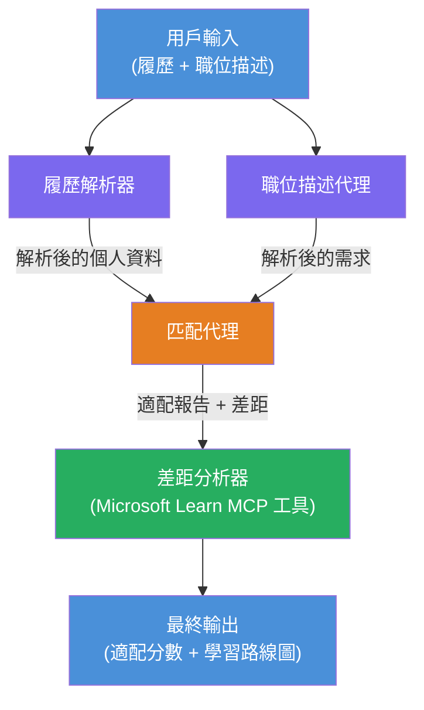

# Lab 02 - 多代理工作流程：履歷 → 職位匹配評估器

---

## 你將建構的內容

一個 **履歷 → 職位匹配評估器** — 多代理工作流程，四個專責代理合作評估候選人的履歷與職位描述的匹配度，然後生成個人化的學習路線圖以填補差距。

### 代理介紹

| 代理 | 角色 |
|-------|------|
| <strong>履歷解析器</strong> | 從履歷文本中擷取結構化技能、經驗、證書 |
| <strong>職位描述代理</strong> | 從職位描述中擷取必需/優先技能、經驗、證書 |
| <strong>匹配代理</strong> | 比較個人資料與要求 → 匹配度分數 (0-100) + 匹配/缺少技能 |
| <strong>差距分析器</strong> | 建立個人化學習路線圖，包含資源、時間表及快速成效專案 |

### 示範流程

上傳 **履歷 + 職位描述** → 獲取 **匹配度分數 + 缺少的技能** → 收到 <strong>個人化學習路線圖</strong>。

### 工作流程架構

> 紫色 = 並行代理 | 橙色 = 匯總點 | 綠色 = 使用工具的最終代理。詳見 [模組 1 - 了解架構](docs/01-understand-multi-agent.md) 與 [模組 4 - 編排模式](docs/04-orchestration-patterns.md) 的詳細圖示與資料流。

### 涵蓋主題

- 使用 **WorkflowBuilder** 建立多代理工作流程
- 定義代理角色與編排流程（並行 + 順序）
- 代理間通訊模式
- 使用 Agent Inspector 進行本地測試
- 部署多代理工作流程到 Foundry Agent Service

---

## 先決條件

請先完成 Lab 01：

- [Lab 01 - 單一代理](../lab01-single-agent/README.md)

---

## 開始使用

完整的設置說明、程式碼導覽及測試指令，請參閱：

- [Lab 2 文件 - 先決條件](docs/00-prerequisites.md)
- [Lab 2 文件 - 完整學習路線](docs/README.md)
- [PersonalCareerCopilot 運行指南](PersonalCareerCopilot/README.md)

## 編排模式（代理替代方案）

Lab 2 包含預設的 **並行 → 匯總器 → 規劃師** 流程，文件中
亦介紹其他替代模式以展現更強的代理行為：

- **扇出/扇入搭配加權共識**
- **最終路線圖前的審核者/評論者通過**
- <strong>條件路由器</strong>（根據匹配度分數和缺少技能選擇路徑）

詳見 [docs/04-orchestration-patterns.md](docs/04-orchestration-patterns.md)。

---

**上一章節：** [Lab 01 - 單一代理](../lab01-single-agent/README.md) · **回到：** [工作坊首頁](../../README.md)

---

<!-- CO-OP TRANSLATOR DISCLAIMER START -->
**免責聲明**：  
本文件係使用 AI 翻譯服務 [Co-op Translator](https://github.com/Azure/co-op-translator) 翻譯而成。雖然我們致力於準確性，但請注意自動翻譯可能包含錯誤或不準確之處。原始文件的母語版本應被視為權威來源。對於重要資訊，建議採用專業人工翻譯。本公司對因使用本翻譯而導致的任何誤解或誤譯概不負責。
<!-- CO-OP TRANSLATOR DISCLAIMER END -->