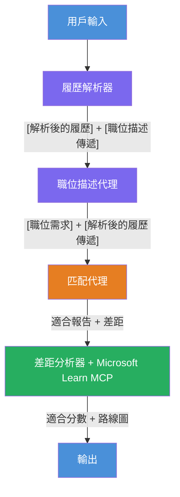

# 實驗 02 - 多代理工作流程：履歷 → 職位匹配評估器

## 概覽

在這個動手實驗中，您將使用 VS Code 的 Foundry Toolkit 建立一個 <strong>以工作流程為先的多代理應用程式</strong>，並將其部署到 Microsoft Foundry Agent Service。

**您將建立的內容：** 一個履歷 → 職位匹配評估器，能夠解析履歷和職位描述，評分匹配程度，並使用 Microsoft Learn 資源產生個人化學習路線圖。

---

## 架構

```mermaid
flowchart TD
    A["用戶輸入"] --> B["履歷解析器"]
    B -->|"[解析後的履歷] + [職位描述傳遞]"| C["職位描述代理"]
    C -->|"[職位需求] + [解析後的履歷傳遞]"| D["匹配代理"]
    D -->|適合報告 + 差距| E["差距分析器 + Microsoft Learn MCP"]
    E -->|適合分數 + 路線圖| F["輸出"]

    style A fill:#4A90D9,color:#fff
    style B fill:#7B68EE,color:#fff
    style C fill:#7B68EE,color:#fff
    style D fill:#E67E22,color:#fff
    style E fill:#27AE60,color:#fff
    style F fill:#4A90D9,color:#fff
```

**運作方式：**
1. 使用者貼上履歷和職位描述。
2. **ResumeParser** 解析履歷並將職位描述逐字複製到 `[JOB DESCRIPTION PASS-THROUGH]` 區段中。
3. **JD Agent** 從傳遞內容中擷取結構化需求，然後將 `[PARSED RESUME]` 以 `[PARSED RESUME PASS-THROUGH]` 形式轉發。
4. **MatchingAgent** 比較 `[PARSED RESUME PASS-THROUGH]` 與 `[JD REQUIREMENTS]` 並產生匹配分數。
5. **GapAnalyzer** 將差距轉換為實用的路線圖，並透過 MCP 抓取真實 Microsoft Learn 連結。

---

## 前置條件

請先完成實驗 01：

- [實驗 01 - 單一代理](../lab01-single-agent/README.md)

---

## 第一部分：依序閱讀模組

查看完整學習路徑於：

- [實驗 2 文件 - 前置條件](docs/00-prerequisites.md)
- [實驗 2 文件 - 完整學習路徑](docs/README.md)
- [PersonalCareerCopilot 運行指南](PersonalCareerCopilot/README.md)

---

## 第二部分：建立並測試工作流程

1. 使用 Foundry Toolkit 向導來生成基於工作流程的專案骨架。
2. 從 `PersonalCareerCopilot/main.py` 複製提示區塊和工作流程圖至您的工作區。
3. 使用 Agent Inspector 本地執行並驗證所有四個代理以及 MCP 工具。
4. 當本地測試通過後，部署此托管代理至 Foundry。

---

## 編排模式

實驗 02 包含預設的 **扇出 → 扇入 → 序列** 流程，且文件也描述了用於實驗的替代編排模式。

- **加權共識的扇出/扇入**
- **最終路線圖之前的審閱者/評論者通過**
- 基於匹配分數和缺乏技能的 <strong>條件路由器</strong>

請參閱 [docs/04-orchestration-patterns.md](docs/04-orchestration-patterns.md)。

---

**先前實驗：** [實驗 01 - 單一代理](../lab01-single-agent/README.md) · **返回：** [工作坊首頁](../../README.md)

---

<!-- CO-OP TRANSLATOR DISCLAIMER START -->
**免責聲明**：
本文件使用 AI 翻譯服務 [Co-op Translator](https://github.com/Azure/co-op-translator) 進行翻譯。雖然我們力求準確，但請注意，自動翻譯可能包含錯誤或不準確之處。原始文件的母語版本應被視為權威來源。對於重要資訊，建議尋求專業人工翻譯。我們不對因使用本翻譯而引起的任何誤解或曲解承擔責任。
<!-- CO-OP TRANSLATOR DISCLAIMER END -->